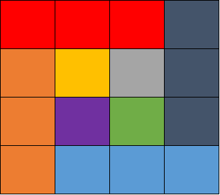

# leetcode 21/7/29

## 一、栈

### 1/20. 有效的括号


#### （1）题目

给定一个只包括 '('，')'，'{'，'}'，'['，']' 的字符串 s ，判断字符串是否有效。

有效字符串需满足：

左括号必须用相同类型的右括号闭合。
左括号必须以正确的顺序闭合。


#### （2）思路

* 利用hashMap存储括号对，右括号为key，左括号为value

* 遍历字符串，利用栈进行存储
* 遍历元素为左括号时，元素进栈；元素为右括号时，栈顶元素出栈（注意栈是否为空），比较栈顶元素与右括号所对应的value值是否相等；遍历结束后，注意判断栈是否为空


#### （3）实现

```java
class Solution {
    public boolean isValid(String s) {
        //1. 创建hashMap
        HashMap<Character, Character> map = new HashMap<>();
        map.put(')', '(');
        map.put(']', '[');
        map.put('}', '{');

        //2. 遍历字符串
        Stack<Character> stack = new Stack<>();
        for (int i = 0; i < s.length(); i++) {

            char c = s.charAt(i);
			
            //右括号
            if (map.containsKey(c)){
                if (stack.isEmpty() || stack.pop() != map.get(c)){
                    return false;
                }
            }else{//左括号
                stack.add(c);
            }
        }

        return stack.isEmpty();
    }
}
```


### 2/94. 二叉树的中序遍历


#### （1）题目

给定一个二叉树的根节点 `root` ，返回它的 **中序** 遍历。


#### （2）思路

* 二叉树的中序遍历顺序为**左根右**
* 手动维护一个栈和一个指向树节点的指针，**模仿递归的中序遍历**
* root指向当前遍历的节点，root非空时，root入栈，root指向左孩子节点（无需考虑左孩子节点是否为空）；root为空时，栈顶元素出栈，加入list，root指向其右孩子节点（无需考虑右孩子节点是否为空）


#### （3）实现

* 非递归

```java
/**
 * Definition for a binary tree node.
 * public class TreeNode {
 *     int val;
 *     TreeNode left;
 *     TreeNode right;
 *     TreeNode() {}
 *     TreeNode(int val) { this.val = val; }
 *     TreeNode(int val, TreeNode left, TreeNode right) {
 *         this.val = val;
 *         this.left = left;
 *         this.right = right;
 *     }
 * }
 */
class Solution {
    public List<Integer> inorderTraversal(TreeNode root) {
        ArrayList<Integer> list = new ArrayList<>();

        Stack<TreeNode> stack = new Stack<>();

        while(root != null || !stack.isEmpty()){
			
            if (root != null){
                stack.add(root);
                root = root.left;
            }else {
                root = stack.pop();
                list.add(root.val);
                root = root.right;
            }
        }
        return list;
    }
}
```


* 递归

```java
/**
 * Definition for a binary tree node.
 * public class TreeNode {
 *     int val;
 *     TreeNode left;
 *     TreeNode right;
 *     TreeNode() {}
 *     TreeNode(int val) { this.val = val; }
 *     TreeNode(int val, TreeNode left, TreeNode right) {
 *         this.val = val;
 *         this.left = left;
 *         this.right = right;
 *     }
 * }
 */
class Solution {
    public List<Integer> inorderTraversal(TreeNode root) {
        ArrayList<Integer> list = new ArrayList<>();

        inorder(list, root);
        return list;
    }
    
    public void inorder(List<Integer> list, TreeNode root){
        if (root != null){
            inorder(list, root.left);
            list.add(root.val);
            inorder(list, root.right);
        }
    }
}
```


### 3/114. 二叉树展开为链表


#### （1）题目

给你二叉树的根结点 root ，请你将它展开为一个单链表：

展开后的单链表应该同样使用 TreeNode ，其中 right 子指针指向链表中下一个结点，而左子指针始终为 null 。
展开后的单链表应该与二叉树 先序遍历 顺序相同。


#### （2）思路

* 手动维护一个栈和一个指针，模仿二叉树先序遍历，将节点存储于list中；遍历后，将list中节点以尾插法连接，左孩子节点置为null
* 指针不为空，节点加入list并入栈，指针指向左孩子节点；指针为空，栈顶节点出栈，指针指向其右孩子节点


#### （3）实现

* 非递归

```java
/**
 * Definition for a binary tree node.
 * public class TreeNode {
 *     int val;
 *     TreeNode left;
 *     TreeNode right;
 *     TreeNode() {}
 *     TreeNode(int val) { this.val = val; }
 *     TreeNode(int val, TreeNode left, TreeNode right) {
 *         this.val = val;
 *         this.left = left;
 *         this.right = right;
 *     }
 * }
 */
class Solution {
    public void flatten(TreeNode root) {
        if (root != null) {
            ArrayList<TreeNode> list = new ArrayList<>();
            Stack<TreeNode> stack = new Stack<>();
            while(root != null || !stack.isEmpty()){
                if (root != null) {
                    list.add(root);
                    stack.add(root);
                    root = root.left;
                }else{
                    root = stack.pop();
                    root = root.right;
                }
            }

            root = list.get(0);
            var tail = root;
            for (int i = 1; i < list.size(); i++) {
                tail.left = null;
                tail.right = list.get(i);
                tail = tail.right;
            }
        }
    }
}
```


* 递归

```java
class Solution{
    public void flatten(TreeNode root){
        ArrayList<TreeNode> list = new ArrayList<>();
        preorder(list, root);
        var tail = root;
        for (int i = 1; i < list.size(); i++) {
            tail.right = list.get(i);
            tail.left = null;
            tail = tail.right;
        }
    }

    private void preorder(ArrayList<TreeNode> list, TreeNode root){
        if (root != null) {
            list.add(root);
            preorder(list, root.left);
            preorder(list, root.right);
        }
    }
}
```


### 4/155. 最小栈


#### （1）题目

设计一个支持 push ，pop ，top 操作，并能在常数时间内检索到最小元素的栈。

push(x) —— 将元素 x 推入栈中。
pop() —— 删除栈顶的元素。
top() —— 获取栈顶元素。
getMin() —— 检索栈中的最小元素。


#### （2）思路

* 模拟一个栈并维护当前栈中的最小值
* 使用ArrayList模拟一个栈；同样使用ArrayList维护当前栈中的最小值，n位置上的元素为栈中0~n位置上的最小值
* push(x)时，比较x与前一个最小值，更新当前位置上的最小值


#### （3）实现

```java
package leetcode.editor.cn;

import java.util.ArrayList;

//leetcode submit region begin(Prohibit modification and deletion)
class MinStack {

    private ArrayList<Integer> list;
    private ArrayList<Integer> minList;
    /** initialize your data structure here. */
    public MinStack() {
        list = new ArrayList<>();
        minList = new ArrayList<>();//前 n 个元素的最小值
    }
    
    public void push(int val) {
        list.add(val);
        if (minList.size() == 0){
            minList.add(val);
        }else{
            int lastMin = minList.get(minList.size() - 1);
            int min = val < lastMin ? val : lastMin;
            minList.add(min);
        }
    }
    
    public void pop() {
        list.remove(list.size() - 1);
        minList.remove(minList.size() - 1);
    }
    
    public int top() {
        return list.get(list.size() - 1);
    }
    
    public int getMin() {
        return minList.get(minList.size() - 1);
    }
}

```


### 5/234. 回文链表


#### （1）题目

请判断一个链表是否为回文链表。

**进阶：**
你能否用 O(n) 时间复杂度和 O(1) 空间复杂度解决此题？


#### （2）思路

* O(n)空间复杂度和O(n)时间复杂度：遍历链表，将其value存于ArrayList中；遍历ArrayList，比较k和n-1-k位置元素是否相同


#### （3）实现

```java
package leetcode.editor.cn;

//leetcode submit region begin(Prohibit modification and deletion)

import java.util.ArrayList;

/**
 * Definition for singly-linked list.
 * public class ListNode {
 *     int val;
 *     ListNode next;
 *     ListNode() {}
 *     ListNode(int val) { this.val = val; }
 *     ListNode(int val, ListNode next) { this.val = val; this.next = next; }
 * }
 */
class Solution {
    public boolean isPalindrome(ListNode head) {
        ArrayList<Integer> list = new ArrayList<>();
        
        while (head != null){
            list.add(head.val);
            head = head.next;
        }
        
        for (int i = 0; i < list.size(); i++) {
            if (list.get(i) != list.get(list.size()-1-i)){
                return false;
            }
        }
        return true;
    }
}
```


### 6/394. 字符串解码


#### （1）题目

给定一个经过编码的字符串，返回它解码后的字符串。

编码规则为: k[encoded_string]，表示其中方括号内部的 encoded_string 正好重复 k 次。注意 k 保证为正整数。

你可以认为输入字符串总是有效的；输入字符串中没有额外的空格，且输入的方括号总是符合格式要求的。

此外，你可以认为原始数据不包含数字，所有的数字只表示重复的次数 k ，例如不会出现像 3a 或 2[4] 的输入


#### （2）思路

* 维护一个栈，遍历字符串
  * 非 ']' 元素入栈
  * 遇到 ']' 元素时，栈顶元素出栈拼接起来为temp，直至栈顶元素为 '[' 
  * '[' 出栈，栈顶元素为重复次数k（注意k>=10情况），str = k * temp
  * 再将拼接后的str压入栈
* 遍历后，再将栈内元素拼接起来，即为解码后的字符串


#### （3）实现

```java
package leetcode.editor.cn;

import java.util.Stack;

//leetcode submit region begin(Prohibit modification and deletion)
class Solution {
    public String decodeString(String s) {

        Stack<String> stack = new Stack<>();
        String str = "";
        //遍历字符串
        for (int i = 0; i < s.length(); i++) {
            String sub = s.substring(i, i+1);
            if (sub.equals("]")){
                String temp = "", temp0 ="";
                //拼接栈内字符串
                while (!stack.isEmpty() && !stack.peek().equals("[")){
                    temp = stack.pop() + temp;
                }
                stack.pop();//"["出栈
                String times ="";
                //拼接重复次数k
                while (!stack.isEmpty() && (stack.peek().charAt(0) >= '0' && stack.peek().charAt(0) <= '9')){
                    times = stack.pop() + times;
                }
                int time = Integer.parseInt(times);
                //字符串重复k次拼接
                for (int j = 0; j < time; j++) {
                    temp0 += temp;
                }
                //拼接后的字符串入栈
                stack.add(temp0);
            }else{
                stack.add(sub);
            }
        }
        //栈内字符串拼接
        for (int i = 0; i < stack.size(); i++) {
            str += stack.get(i);
        }

        return str;
    }
}
//leetcode submit region end(Prohibit modification and deletion)


```


### 7/581. 最短无序连续子数组


#### （1）题目

给你一个整数数组 nums ，你需要找出一个 连续子数组 ，如果对这个子数组进行升序排序，那么整个数组都会变为升序排序。

请你找出符合题意的 最短 子数组，并输出它的长度。


#### （2）思路

* O(n<sup>2</sup>)时间复杂度：

  * 使用Arrays.sort()对复制的数组进行排序
  * 比较原数组与排序后的数组，记录第一个不相同元素位置left和最后一个不相同元素位置right
  * right-left+1即为最短无序连续数组的长度

* O(n)时间复杂度：

  * 维护一个ArrayList，n位置记录nums数组中0~n上的最大值

  * 遍历数组，将nums[n]与ArrayList.get(n-1)比较

  * 遍历过程中，记录nums[n] < ArrayList.get(n-1)中最小的nums[n]，即为乱序子数组中的最小元素min；记录nums[n] < ArrayList.get(n-1)中最后一个元素位置n，即为乱序子数组中的最后一个元素位置lastIndex

  * 再次遍历数组，找出第一个比min大的元素，即为乱序子数组中的最小元素min应该在的位置minIndex

  * 最短乱序子数组长度即为lastIndex - minIndex + 1

    

#### （3）实现

* O(n<sup>2</sup>)时间复杂度

```java
package leetcode.editor.cn;

import java.util.Arrays;

//leetcode submit region begin(Prohibit modification and deletion)
class Solution {
    public int findUnsortedSubarray(int[] nums) {
        int[] clone = nums.clone();
        Arrays.sort(clone);
        
        int length = 0, left = -1, right = -2;
        for (int i = 0; i < nums.length; i++) {
            if (nums[i] != clone[i]){
                if (left == -1){
                    left = i;
                }else{
                    right = i;
                }
            }
        }

        return right - left + 1;
    }

  
}
//leetcode submit region end(Prohibit modification and deletion)
```


* O(n)时间复杂度

```java
package leetcode.editor.cn;

import java.util.ArrayList;
import java.util.Arrays;

//leetcode submit region begin(Prohibit modification and deletion)
class Solution {

    public int findUnsortedSubarray(int[] nums) {
        if (nums.length == 0){
            return 0;
        }else{
            int min = 100001, lastInd = -1, minInd = 0 ;
            ArrayList<Integer> preMax = new ArrayList<>();
            preMax.add(nums[0]);

            for (int i = 1; i < nums.length; i++) {
                int pre = preMax.get(i-1);
                if (nums[i] < pre){
                    lastInd = i;
                    if (nums[i] < min){
                        min = nums[i];
                    }
                    preMax.add(pre);
                }else{
                    preMax.add(nums[i]);
                }
            }

            for (int i = 0; i < nums.length; i++) {
                if (nums[i] > min){
                    minInd = i;
                    break;
                }
            }

            return lastInd - minInd + 1;
        }
    }
}
//leetcode submit region end(Prohibit modification and deletion)

```


### 8/739. 每日温度


#### （1）题目

请根据每日 `气温` 列表 `temperatures` ，请计算在每一天需要等几天才会有更高的温度。如果气温在这之后都不会升高，请在该位置用 `0` 来代替


#### （2）思路

* 维护两个个栈，遍历temperatures
* stack1中存放气温下标，stack2中存放每日气温
* 遍历到第i个元素时，与stack2栈顶元素比较
  * 若比栈顶元素大，stack1和stack2中栈顶元素出栈，则需要等stack1.pop()-i天；并继续与栈顶元素比较
  * 若比栈顶元素小，temperatures[n]压入栈stack2，i压入栈stack1
* 遍历结束后，stack1中剩余位置对应的天数为0
* **题解**：维护一个储存下标的栈，遍历数组，第i个温度：比栈顶元素所对应的温度高，出栈，等待天数为 i - stack.peek()，直至比栈顶元素对应的温度低，相等或栈为空，i入栈


#### （3）实现

* 双栈

```java
package leetcode.editor.cn;

import java.util.Stack;

//leetcode submit region begin(Prohibit modification and deletion)
class Solution {
    public int[] dailyTemperatures(int[] temperatures) {
        Stack<Integer> stack1 = new Stack<>();
        Stack<Integer> stack2 = new Stack<>();
        int[] wait = new int[temperatures.length];

        for (int i = 0; i < temperatures.length; i++) {
            if (i == 0){
                stack1.add(i);
                stack2.add(temperatures[i]);
            }else{
                int now = temperatures[i];
                while (!stack2.isEmpty() && stack2.peek() < now){
                    int day = i - stack1.peek();
                    wait[stack1.peek()] = day;
                    stack1.pop();
                    stack2.pop();
                }
                stack1.add(i);
                stack2.add(temperatures[i]);
            }
        }
        return wait;
    }
}
//leetcode submit region end(Prohibit modification and deletion)

```


* 题解：单栈

```java
	public int[] dailyTemperatures(int[] temperatures){
        Stack<Integer> indexStack = new Stack<>();
        int[] wait = new int[temperatures.length];
        for (int i = 0; i < temperatures.length; i++) {
            if (i != 0) {
                while (!indexStack.isEmpty() && temperatures[indexStack.peek()] < temperatures[i]){
                    wait[indexStack.peek()] = i - indexStack.peek();
                    indexStack.pop();
                }
            }
            indexStack.add(i);
        }

        return wait;
    }
```


### 9/32. 最长有小括号(hard)


#### （1）题目

给你一个只包含 `'('` 和 `')'` 的字符串，找出最长有效（格式正确且连续）括号子串的长度。


#### （2）思路

* 维护一个栈，遍历字符串，第一个元素需为'('，入栈，当前元素需为栈顶元素对应的value；违反时，清空栈内元素，有效括号为stack.size()/2；直至遍历完，记录最大的有效括号长度


#### （3）实现

```
package leetcode.editor.cn;

import java.util.HashMap;
import java.util.Stack;

//leetcode submit region begin(Prohibit modification and deletion)
class Solution {
    public int longestValidParentheses(String s) {
        int maxLength = 0;
        int length = 0;
        int num = 0;
        Stack<String> stack = new Stack<>();

        for (int i = 0; i < s.length(); i++) {
            String ch = s.substring(i, i+1);

            if (ch.equals("(")){
                stack.add(ch);
                num++;
            }else{
                if (num == 0){
                    length = 0;
                    while (!stack.isEmpty()){
                        length += Integer.parseInt(stack.pop());
                    }
                    stack.clear();
                    maxLength = length > maxLength ? length : maxLength;
                }else{
                    length = 2;
                    boolean flag = false;
                    while (!stack.isEmpty() && flag == false){
                        if (stack.peek().equals("(")){
                            stack.pop();
                            num--;
                            stack.add(String.valueOf(length));
                            flag = true;
                        }else{
                            length += Integer.parseInt(stack.pop());
                        }
                    }
                }
            }
        }
        System.out.println("stack = " + stack);
        length = 0;
        while (!stack.isEmpty()){
            if (stack.peek().equals("(")){
                maxLength = length > maxLength ? length : maxLength;
                length = 0;
                stack.pop();
            }else{
                length += Integer.parseInt(stack.pop());
            }
        }
        maxLength = length > maxLength ? length : maxLength;
        return maxLength;
    }
}
//leetcode submit region end(Prohibit modification and deletion)


```


### 10/42. 接雨水(hard未解决)


#### （1）题目

给定 *n* 个非负整数表示每个宽度为 1 的柱子的高度图，计算按此排列的柱子，下雨之后能接多少雨水。


#### （2）思路

* 维护一个栈，遍历数组height
* height[n] > stack.peek()：
  * 栈顶元素出栈，直至height[n] <= stack.peek()
* height[n] <= stack.peek()
  * 元素入栈


### 133/496. 下一个更大元素 I


#### （1）题目

给你两个 没有重复元素 的数组 nums1 和 nums2 ，其中nums1 是 nums2 的子集。

请你找出 nums1 中每个元素在 nums2 中的下一个比其大的值。

nums1 中数字 x 的下一个更大元素是指 x 在 nums2 中对应位置的右边的第一个比 x 大的元素。如果不存在，对应位置输出 -1 。


#### （2）思路

* nums1是nums2的子集，则**找出nums2中每个元素的下一个比其更大的值**，即可找出nums1中每个元素在nums2中的下一个比其大的值
* HashMap<Ingeter, Integer> map记录每个元素与其在nums2中下一个比其大的值
* 遍历nums2数组，对于当前元素nums2[i]，不断与stack栈顶元素top比较，直到比栈顶元素top小
  * nums2[i] > top：则nums2[i]即为top在nums2中下一个比其大的值，将<top, nums2[i]>记录在map中
  * nums2[i] < top：将nums2[i]压入栈中
* 遍历nums1数组，对于当前元素temp，map.get(temp)即为temp在nums2中的下一个比其大的值，若不存在，则记为-1


#### （3）实现

```java
import java.util.HashMap;
import java.util.Map;
import java.util.Stack;

//leetcode submit region begin(Prohibit modification and deletion)
class Solution {
    public int[] nextGreaterElement(int[] nums1, int[] nums2) {
        Map<Integer, Integer> map = new HashMap<>();

        Stack<Integer> stack = new Stack<>();

        int[] res = new int[nums1.length];

        for (int i = 0; i < nums2.length; i++) {
            while (!stack.isEmpty() && stack.peek() < nums2[i]){
                map.put(stack.pop(), nums2[i]);
            }
            stack.push(nums2[i]);
        }

        for (int i = 0; i < nums1.length; i++) {
            int temp = nums1[i];
            res[i] = map.getOrDefault(temp, -1);
        }
        return res;

    }
}
//leetcode submit region end(Prohibit modification and deletion)
```


## 二、贪心

### 11/11. 盛最多水的容器


#### （1）题目

给你 n 个非负整数 a1，a2，...，an，每个数代表坐标中的一个点 (i, ai) 。在坐标内画 n 条垂直线，垂直线 i 的两个端点分别为 (i, ai) 和 (i, 0) 。找出其中的两条线，使得它们与 x 轴共同构成的容器可以容纳最多的水。

说明：你不能倾斜容器。


#### （2）思路

* 贪心算法（双指针）：左指针left和右指针right分别指向数组的两端
* 移动两个指针中指向较小的height的指针，直至两指针相遇，并记录最大储水量
* 证明：
  * 令左右指针分别指向x,y，假设x<=y，同时x，y之间的距离为t，则组成容器容量为min(x,y) * t
  * 若不移动x，向左移动y，指向y<sub>1</sub>，同时x，y<sub>1</sub>之间的距离为t<sub>1</sub>，则组成容器容量为min(x, y<sub>1</sub>) * t<sub>1</sub>
  * y<sub>1</sub><=y时，min(x, y<sub>1</sub>)<=min(x, y)；y<sub>1</sub>>y时，y<sub>1</sub>>y>=x，min(x, y<sub>1</sub>) = x = min(x, y)；因此min(x, y<sub>1</sub>)<=min(x, y<sub>1</sub>)
  * 又t<sub>1</sub><t，则min(x, y<sub>1</sub>) * t<sub>1</sub><min(x,y) * t；即无论怎么向左移动y，得到的容器容量均小于移动前的容器容量
  * 即移动较小的指针时，可能得到容量更大的容器；移动较大的指针时，只能得到容量更小的容器


#### （3）实现

```java
package leetcode.editor.cn;

//leetcode submit region begin(Prohibit modification and deletion)
class Solution {
    public int maxArea(int[] height) {
        int max = 0;
        for (int i = 0, j = height.length-1; i != j; ){
            int temp = Math.min(height[i], height[j]) * (j - i);
            max = temp > max ? temp : max;
            if (height[i] < height[j]){
                i++;
            }else{
                j--;
            }
        }
        return max;
    }
}
//leetcode submit region end(Prohibit modification and deletion)
```


### 12/55. 跳跃游戏


#### （1）题目

给定一个非负整数数组 `nums` ，你最初位于数组的 **第一个下标** 。

数组中的每个元素代表你在该位置可以跳跃的最大长度。

判断你是否能够到达最后一个下标。


#### （2）思路

* 贪心算法：在每一位置上都跳到**可以跳到更远的位置**的位置上，即跳到拥有最大的nums[i] + i的位置i上 
* 遍历nums，在第n位上，选择可以达到的nums[i] + i的最大值的位置上；能达到最后一个下标，返回true，否则，返回false
* **题解**：
  * 遍历数组，并维护一个可到达的最远距离max
  * 遍历过程中，对于当前遍历位置i，如果其在可到达的最远距离范围内，使用i+nums[i]更新可到达的最远距离
  * 若遍历过程中可到达的最远距离大于数组的最后一个下标，返回true；反之，在遍历结束后，仍无法到达最后一个位置，返回false


#### （3）实现

```java

package leetcode.editor.cn;

//leetcode submit region begin(Prohibit modification and deletion)
class Solution {
    public boolean canJump(int[] nums) {
        int max = 0, now = 0;
        while (true){
            int maxi = 0;
            for (int i = now; i <= max && i < nums.length; i++) {
                maxi = i + nums[i];
                if (maxi >= max){
                    max = maxi;
                    now = i;
                }
            }
            if (max >= nums.length-1){
                return true;
            }
            
            if (nums[now] == 0){
                return false;
            }
        }
    }
}
//leetcode submit region end(Prohibit modification and deletion)

```


* 题解

```java

package leetcode.editor.cn;

//leetcode submit region begin(Prohibit modification and deletion)
class Solution {
    public boolean canJump(int[] nums) {
        int max = 0;
        for (int i = 0; i < nums.length; i++) {
            //在可到达的最远距离范围内
            if (i <= max){
                int tempMax = i + nums[i];
                max = tempMax > max ? tempMax : max;
                if (max >= nums.length - 1){
                    return true;
                }
            }
        }
        return false;
    }
}
//leetcode submit region end(Prohibit modification and deletion)

```


### 13/406. 根据身高重建队列


#### （1）题目

假设有打乱顺序的一群人站成一个队列，数组 people 表示队列中一些人的属性（不一定按顺序）。每个 people[i] = [hi, ki] 表示第 i 个人的身高为 hi ，前面 正好 有 ki 个身高大于或等于 hi 的人。

请你重新构造并返回输入数组 people 所表示的队列。返回的队列应该格式化为数组 queue ，其中 queue[j] = [hj, kj] 是队列中第 j 个人的属性（queue[0] 是排在队列前面的人）。


#### （2）思路

* 按照hi从高到低，ki从低到高的顺序排序
* 维护一个ArrayList，遍历people数组，people[i] = [hi, ki] ，其中ki即为people[i]在目前ArrayList中位置，使用ArrayList.add(ki, people[i])将people[i]插入ArrayList中
* 证明：
  * 令people[i] = [hi, ki]，而按照hi从高到低排序，即保证后续people[n]中不存在h<sub>n</sub>>h<sub>i</sub>
  * 又因按照k<sub>i</sub>从低到高排序，即当前people[i]比后续与h<sub>i</sub>相等的people[n]靠前
  * 综上，后续不在people[n]使h<sub>n</sub>>h<sub>i</sub>且后续与h<sub>i</sub>相等的people[n]在people[i]的后面；即后续的people[n]不影响当前people[i]在ArrayList中的位置


#### （3）实现

```java

package leetcode.editor.cn;

import java.util.ArrayList;
import java.util.Arrays;
import java.util.Comparator;

//leetcode submit region begin(Prohibit modification and deletion)
class Solution {
    public int[][] reconstructQueue(int[][] people) {
        Arrays.sort(people, new Comparator<int[]>() {
            @Override
            public int compare(int[] ints, int[] t1) {
                if (ints[0] != t1[0]){
                    return -Integer.compare(ints[0], t1[0]);
                }
                return Integer.compare(ints[1], t1[1]);
            }
        });

        ArrayList<int[]> ints = new ArrayList<>();
        for (int i = 0; i < people.length; i++) {
            ints.add(people[i][1], people[i]);
        }
        int[][] ints1 = new int[people.length][2];
        for (int i = 0; i < ints.size(); i++) {
            ints1[i] = ints.get(i);
        }
        return ints1;
    }
}
//leetcode submit region end(Prohibit modification and deletion)

```


### 14/621. 任务调度器（百度二面面试题）


#### （1）题目

给你一个用字符数组 tasks 表示的 CPU 需要执行的任务列表。其中每个字母表示一种不同种类的任务。任务可以以任意顺序执行，并且每个任务都可以在 1 个单位时间内执行完。在任何一个单位时间，CPU 可以完成一个任务，或者处于待命状态。

然而，两个 相同种类 的任务之间必须有长度为整数 n 的冷却时间，因此至少有连续 n 个单位时间内 CPU 在执行不同的任务，或者在待命状态。

你需要计算完成所有任务所需要的 最短时间 。


#### （2）思路


* 贪心策略：先安排出现次数最多的任务，让这个任务两次执行的时间间隔正好为n，在这个时间间隔内填充其他的任务
* maxTimes：出现次数最多的任务出现的次数；maxCount：出现maxTimes次的任务数量
* 所需时间为：**(maxTimes - 1) * (n + 1) + maxCount**


#### （3）实现

```java

package leetcode.editor.cn;

import java.util.Collections;
import java.util.HashMap;
import java.util.Set;

//leetcode submit region begin(Prohibit modification and deletion)
class Solution {
    public int leastInterval(char[] tasks, int n) {
        HashMap<Character, Integer> hashMap = new HashMap<>();
        for (int i = 0; i < tasks.length; i++) {
            if (hashMap.containsKey(tasks[i])){
                hashMap.replace(tasks[i], hashMap.get(tasks[i])+1);
            }else{
                hashMap.put(tasks[i], 1);
            }
        }

        int maxTime = 0;
        int maxCount = 0;
        Set<Character> keySet = hashMap.keySet();
        for(Character i : keySet){
            int times = hashMap.get(i);
            if (times == maxTime){
                maxCount++;
            }else if(times > maxTime){
                maxTime = times;
                maxCount = 1;
            }
        }

        int res = (n + 1) * (maxTime - 1) + maxCount;
        return res > tasks.length ? res : tasks.length;
    }
}
//leetcode submit region end(Prohibit modification and deletion)


```


## 三、位运算


#### 15/87. 子集


#### （1）题目

给你一个整数数组 `nums` ，数组中的元素 **互不相同** 。返回该数组所有可能的子集（幂集）。

解集 **不能** 包含重复的子集。你可以按 **任意顺序** 返回解集。


#### （2）思路

* n个元素，每一个元素都有两种状态，取或不取
* 不妨将每个元素的状态设为0或1，0代表不取，1代表取；即在n位的二进制表示式中，n位上每个位置上的0或1代表当前位的数取或不取
* 从0 ~ 2<sup>n</sup>-1，获取二进制中每一位的值（&1），将值为1的位置对应的数加入list中，值为0的位置对应的数不加入list中


#### （3）实现

```java
package leetcode.editor.cn;

import java.util.ArrayList;
import java.util.List;

//leetcode submit region begin(Prohibit modification and deletion)
class Solution {
    public List<List<Integer>> subsets(int[] nums) {
        List<List<Integer>> res = new ArrayList<>();

        for (int i = 0; i < (int) Math.pow(2, nums.length); i++) {
            int temp = i;
            ArrayList<Integer> list = new ArrayList<>();
            for (int j = 0; j < nums.length && temp != 0; j++) {
                int state = temp & 1;
                if (state == 1){
                    list.add(nums[j]);
                }
                temp >>= 1;
            }
            res.add(list);
        }

        return res;
    }
}
//leetcode submit region end(Prohibit modification and deletion)

```


### 16/136. 只出现一次的数


#### （1）题目

给定一个非空整数数组，除了某个元素只出现一次以外，其余每个元素均出现两次。找出那个只出现了一次的元素。

说明：

你的算法应该具有线性时间复杂度。 你可以不使用额外空间来实现吗？


#### （2）思路

* **x ^ x = 0**
* 将数组中数按位异或，出现两次的元素，按位异或结果为0；最后的结果即为只出现一次的元素


#### （3）实现

```java

package leetcode.editor.cn;

//leetcode submit region begin(Prohibit modification and deletion)
class Solution {
    public int singleNumber(int[] nums) {
        int res = 0;
        for (int i = 0; i < nums.length; i++) {
            res ^= nums[i];
        }
        return res;
    }
}
//leetcode submit region end(Prohibit modification and deletion)

```


### 17/287. 寻找重复数（未解决）


#### （1）题目

给定一个包含 n + 1 个整数的数组 nums ，其数字都在 1 到 n 之间（包括 1 和 n），可知至少存在一个重复的整数。

假设 nums 只有 一个重复的整数 ，找出 这个重复的数 。

你设计的解决方案必须不修改数组 nums 且只用常量级 O(1) 的额外空间。


#### （2）思路

* 我们先设置慢指针slow 和快指针fast ，慢指针每次走一步，快指针每次走两步，根据「Floyd 判圈算法」两个指针在有环的情况下一定会相遇，此时我们再将 slow 放置起点 00，两个指针每次同时移动一步，相遇的点就是答案


链表中的环
假设有这样一个样例：[1,2,3,4,5,6,7,8,9,5]。如果我们按照上面的循环下去就会得到这样一个路径: 1 2 3 4 5 [6 7 8 9] [6 7 8 9] [6 7 8 9] . . .这样就有了一个环，也就是6 7 8 9。point 会一直在环中循环的前进。
这时我们设置两个一快(fast)一慢(slow)两个指针，一个每次走两步，一个每次走一步，这样让他们一直走下去，直到他们在重复的序列中相遇，


```java
int fast = 0, slow = 0;
while(true){
    fast = nums[nums[fast]];
    slow = nums[slow];
    if(fast == slow)
        break;
}
```

如上图，slow和fast会在环中相遇，先假设一些量：起点到环的入口长度为m，环的周长为c，在fast和slow相遇时slow走了n步。则fast走了2n步，fast比slow多走了n步，而这n步全用在了在环里循环（n%c==0）。
当fast和last相遇之后，我们设置第三个指针finder，它从起点开始和slow(在fast和slow相遇处)同步前进，当finder和slow相遇时，就是在环的入口处相遇，也就是重复的那个数字相遇。

**为什么 finder 和 slow 相遇在入口**
fast 和 slow 相遇时，slow 在环中行进的距离是n-m，其中 n%c==0。这时我们再让 slow 前进 m 步——也就是在环中走了 n 步了。而 n%c==0 即 slow 在环里面走的距离是环的周长的整数倍，就回到了环的入口了，而入口就是重复的数字。
**我们不知道起点到入口的长度m，所以弄个 finder 和 slow 一起走，他们必定会在入口处相遇。**


#### （3）实现

```java

package leetcode.editor.cn;

//leetcode submit region begin(Prohibit modification and deletion)
class Solution {
    public int findDuplicate(int[] nums) {
        int fast = nums[nums[0]];
        int slow = nums[0];
        while (fast != slow){
            fast = nums[nums[fast]];
            slow = nums[slow];
        }

        slow = 0;
        while (fast != slow){
            fast = nums[fast];
            slow = nums[slow];
        }
        return slow;
    }
}
//leetcode submit region end(Prohibit modification and deletion)
```


### 18/338. 比特币计数


#### （1）题目

给定一个非负整数 **num**。对于 **0 ≤ i ≤ num** 范围中的每个数字 **i** ，计算其二进制数中的 1 的数目并将它们作为数组返回。


#### （2.1）思路

* 遍历0~num，对于每个数求取其二进制数中的1的数目


#### （3.1）实现

```java

package leetcode.editor.cn;

import java.util.ArrayList;

//leetcode submit region begin(Prohibit modification and deletion)
class Solution {
    public int[] countBits(int n){
        int[] res = new int[n+1];
        for (int i = 0; i <= n; i++) {
            int times = 0;
            int temp = i;
            while (temp != 0){
                times += temp & 1;
                temp >>= 1;
            }
            res[i] = times;
        }
        return res;
    }
}
//leetcode submit region end(Prohibit modification and deletion)

```


#### （2.2）思路

* 奇数：比前一个偶数多一个1
  * 因为前一个偶数的末位为0，该奇数的末位为1
* 偶数：1的个数和其1/2的那个数一样多
  * 因为其末位为0，右移1位不影响其1的个数


#### （3.2）实现

```java
class Solution{
    public int[] countBits(int n){
        int[] res = new int[n + 1];
        res[0] = 0;
        for (int i = 1; i <= n; i++) {
            if (i % 2 == 0){
                res[i] = res[i/2];
            }else{
                res[i] = res[i-1] + 1;
            }
        }
        return res;
    }
}
```


### 19/461. 汉明距离


#### （1）题目

两个整数之间的 [汉明距离](https://baike.baidu.com/item/汉明距离) 指的是这两个数字对应二进制位不同的位置的数目。

给你两个整数 `x` 和 `y`，计算并返回它们之间的汉明距离。


#### （2）思路

* 按位异或^：二进制中，相同取0，相异取1

* 求对应二进制中位不同的位置的数目
  * k = x^y
  * k&1即为k末位位置上的数，k >>= 1即为去掉末位位置


#### （3）实现

```java
package leetcode.editor.cn;

//leetcode submit region begin(Prohibit modification and deletion)
class Solution {
    public int hammingDistance(int x, int y) {
        int k = x ^ y;
        int times = 0;
        while (k != 0){
            times += k & 1;
            k >>= 1;
        }
        return times;
    }
}
//leetcode submit region end(Prohibit modification and deletion)
```


### 97/371. 两整数之和


#### （1）题目

给你两个整数 `a` 和 `b` ，**不使用** 运算符 `+` 和 `-` ，计算并返回两整数之和。


#### （2.1）思路

* 位运算实现加法
* 注意有符号整数用补码来表示和存储：正整数的补码和原码相同，负整数的补码为其原码除符号位外的所有位取反后加1


#### （3.1）实现

```java
//leetcode submit region begin(Prohibit modification and deletion)
class Solution {
    public int getSum(int a, int b) {
         if (a >= 0 && b >= 0 || a <= 0 && b <= 0){
             int sum = 0;

             int plus = 0;
             int A = Math.abs(a), B = Math.abs(b);
             for (int i = 0; i < 13; i++) {
                 int temp1 = A & (1 << i), temp2 = B & (1 << i);

                 if (temp1 == 0 &&  temp2 == 0 && plus == 0){

                 }else if (temp1 == 0 && temp2 == 0 && plus == 1){
                     sum = sum | (1<<i);
                     plus = 0;
                 }else if (temp1 != 0 && temp2 != 0 && plus == 0){
                     plus = 1;
                 }else if (temp1 != 0 && temp2 != 0 && plus == 1){
                     sum = sum | (1<<i);
                 }else if (plus == 0){
                     sum = sum | (1<<i);
                 }else if (plus == 1){
                     plus = 1;
                 }
             }
             if (a < 0 ||  b < 0){
                 sum *= -1;
             }

             return sum;
         }else {
             int sum = 0;

             int minus = 0;
             int max = Math.max(Math.abs(a), Math.abs(b)), min = Math.min(Math.abs(a), Math.abs(b));
             for (int i = 0; i < 13; i++) {
                 int temp1 = max & (1 << i), temp2 = min & (1 << i);

                 if (temp1 == temp2 && minus == 1){
                     sum = sum | (1<<i);
                 }else if (temp1 < temp2 && minus == 0){
                     sum = sum | (1<<i);
                     minus = 1;
                 }else if (temp1 < temp2 && minus == 1){
                     minus = 1;
                 }else if (temp1 > temp2 && minus == 0){
                     sum = sum | (1<<i);
                 }else if (temp1 > temp2 && minus == 1){
                     minus = 0;
                 }
             }
             if (max != Math.max(a, b)){
                 sum *= -1;
             }
             return sum;
         }
    }
}
//leetcode submit region end(Prohibit modification and deletion)
```


#### （2.2）思路

* 位运算中二进制的加法，有下面四种情况

````
0 + 0 = 0 
0 + 1 = 1
1 + 0 = 1
1 + 1 = 0(进位1)
````

* 如上，这与异或运算的结果相同


```
  0 1 0 1
^ 0 1 0 0
__________
  0 0 0 1
```

* 如上，a ^ b是一个**无进位加法**的结果；若需要计算 a + b ，则需要计算出**进位**的数，将无进位加法的结果和进位的数相加
* (a & b) << 1为加法的**进位的数**
* a ^ b + (a & b) << 1即为 a + b 的结果
* 算法：
  * a + b的计算可以拆分为（a + b的无进位结果） + （a + b的进位结果）
  * 无进位结果使用**异或运算**计算，a ^ b
  * 进位结果使用**与运算**和**左移运算**计算
  * 循环，直到进位为 0


#### （3.2）实现

```java
//leetcode submit region begin(Prohibit modification and deletion)
class Solution {
    public int getSum(int a, int b) {
         while (b != 0){
             int temp = a ^ b;
             b = (a & b) << 1;
             a = temp;
         }

         return a;
    }
}
//leetcode submit region end(Prohibit modification and deletion)
```


### 120/476. 数字的补数


#### （1）题目

给你一个 **正** 整数 `num` ，输出它的补数。补数是对该数的二进制表示取反。


#### （2）思路

* 要将num二进制表示的每一位取反，需要找到num二进制表示**最高位的1**，前导0不取反，将这个1和低位的数取反即可
* 遍历num二进制表示的每一位，每次将num左移1位，**直到num=0**
* 每次将num的最低位的数取反，拼接到结果中


#### （3）实现

```java
//leetcode submit region begin(Prohibit modification and deletion)
class Solution {
    public int findComplement(int num) {
        int res = 0, temp = 1;
        while (num != 0){
            if ((num & 1) == 0){
                res += temp;
            }
            num >>= 1;
            temp <<= 1;
        }
        return res;
    }
}
//leetcode submit region end(Prohibit modification and deletion)
```


### 138/89. 格雷编码


#### （1）题目

格雷编码是一个二进制数字系统，在该系统中，两个连续的数值仅有一个位数的差异。

给定一个代表编码总位数的非负整数 n，打印其格雷编码序列。即使有多个不同答案，你也只需要返回其中一种。

格雷编码序列必须以 0 开头。


#### （2.1）思路

* 令G(n)为n阶格雷码，则G(n+1)阶格雷码分为两部分
  * 给G(n)每个元素二进制形式前面添加0
  * 给G(n)**倒序**的每个元素二进制形式前面添加1


#### （3.1）实现

```cpp
//leetcode submit region begin(Prohibit modification and deletion)
class Solution {

    public List<Integer> grayCode(int n) {
        List<Integer> list = new ArrayList();
        list.add(0);

        for (int i = 0; i < n; i++) {
            Stack<Integer> stack = new Stack();
            for (int temp : list){//给i-1阶格雷码的每个元素前添加1
                stack.add(temp + (1<<i));
            }
            while (!stack.isEmpty()){//将新元素倒序拼接再i-1阶格雷码后面，组成i阶格雷码
                list.add(stack.pop());
            }
        }
        return list;
    }


}
//leetcode submit region end(Prohibit modification and deletion)
```


#### （2.2）思路

* 格雷码计算公式:
  * 第n个格雷码：g(n) = n xor (n>>1)


#### （3.2）实现

```cpp
//leetcode submit region begin(Prohibit modification and deletion)
class Solution {

    public List<Integer> grayCode(int n) {
        List<Integer> list = new ArrayList();
        for (int i = 0; i < (int) Math.pow(2, n); i++) {
            list.add(i ^ (i>>1));
        }
        return list;
    }


}
//leetcode submit region end(Prohibit modification and deletion)
```


### 142/260. 只出现一次的数字 III


#### （1）题目

给定一个整数数组 nums，其中恰好有两个元素只出现一次，其余所有元素均出现两次。 找出只出现一次的那两个元素。你可以按 任意顺序 返回答案。

 

进阶：你的算法应该具有线性时间复杂度。你能否仅使用常数空间复杂度来实现？


#### （2）思路

* **x ^ x = 0, 0 ^ x = x**
* 遍历数组，将所有元素全部异或起来，得到结果res = x<sub>1</sub> ^ x<sub>2</sub>（x<sub>1</sub>, x<sub>2</sub>为只出现一次的元素），此时需要将 x<sub>1</sub> 和 x<sub>2</sub> 区分开来
* 其中由于x<sub>1</sub>, x<sub>2</sub>不相等，故res != 0
* res的二进制表示中存在第 k 位为 1，**即x<sub>1</sub>, x<sub>2</sub>的二进制表达式中第 k 位不相同**
* 将数组内的元素根据**二进制表达式中第 k 位**分为两种
  * 第 k 位为 1（x<sub>1</sub>）
  * 第 k 位为 0（x<sub>2</sub>）
* 将数组内的第 k 位为 1 的元素全部异或，结果为num1 = x<sub>1</sub>
* 将数组内的第 k 位为 0 的元素全部异或，结果为num2 = x<sub>2</sub>


#### （3）实现

```java
//leetcode submit region begin(Prohibit modification and deletion)
class Solution {
    public int[] singleNumber(int[] nums) {
        int res = 0;
        for (int i = 0; i < nums.length; i++){
            res ^= nums[i];
        }
        int target = 1;
        while (true){
            if ((target & res) != 0){
                break;
            }
            target <<= 1;
        }

        int num1 = 0, num2 = 0;
        for (int i = 0; i < nums.length; i++) {
            if ((nums[i] & target) == 0){
                num1 ^= nums[i];
            }else{
                num2 ^= nums[i];
            }
        }

        int[] resNums = new int[2];
        resNums[0] = num1;
        resNums[1] = num2;
        return resNums;
    }
}
//leetcode submit region end(Prohibit modification and deletion)
```


### 198/318. 最大单词长度乘积


#### （1）题目

给定一个字符串数组 words，找到 length(word[i]) * length(word[j]) 的最大值，并且这两个单词不含有公共字母。你可以认为每个单词只包含小写字母。如果不存在这样的两个单词，返回 0。


#### （2）思路

* 用一个 int 来代替某个 word[i]：使用**低26位**来代指字母** a-z 是否出现过**
* 然后对每两个单词对应的两个 int 值**执行 & 操作**
  * **若两单词无重复字符，则结果为 0**
  * 若两单词有重复字符，则结果不为 0


#### （3）实现

```java
//leetcode submit region begin(Prohibit modification and deletion)
class Solution {
    public int maxProduct(String[] words) {
        int n = words.length, index = 0;
        int[] hash = new int[n];
        for (String word : words){
            int temp = 0;
            for (int i = 0; i < word.length(); i++) {
                temp |= 1<<(word.charAt(i)-'a');
            }
            hash[index++] = temp;
        }

        int res = 0;
        for (int i = 0; i < n; i++) {
            for (int j = i+1; j < n; j++) {
                if ((hash[i] & hash[j]) == 0){//不含公共字母
                    res = Math.max(res, words[i].length()*words[j].length());
                }
            }
        }
        return res;
    }
}
//leetcode submit region end(Prohibit modification and deletion)
```


## 四、树


### 20/94. 二叉树的中序遍历（同2）


### 21/96. 不同的二叉搜索树


#### （1）题目

给你一个整数 `n` ，求恰由 `n` 个节点组成且节点值从 `1` 到 `n` 互不相同的 **二叉搜索树** 有多少种？返回满足题意的二叉搜索树的种数。


#### （2）思路

* 动态规划
  * 令n个节点时，互不相同的二叉搜索树共有G(n)种
  * n个节点时，当x为根节点时，则左子树中共有x-1个节点（小于x），右子树中有n-x个节点（大于x）
  * 则以x为根节点的互不相同的二叉搜索树有G(x-1) * G(n-x)种
  * G(n) = G(0) * G(n-1)  + G(1) * G(n-2)  + ... + G(x-1) * G(n-x) + ... + G(n-1) * G(0)（其中G(0) = 1）


#### （3）实现

```java
package leetcode.editor.cn;

import java.util.ArrayList;

//leetcode submit region begin(Prohibit modification and deletion)
class Solution {
    public int numTrees(int n) {
        ArrayList<Integer> list = new ArrayList<>();
        list.add(1);
        int times;
        for (int i = 1; i <= n; i++) {
            times = 0;
            for (int j = 0; j < i; j++) {
                times += list.get(j) * list.get(i-j-1);
            }
            list.add(times);
        }
        return list.get(n);
    }
}
//leetcode submit region end(Prohibit modification and deletion)
```


### 22/98. 验证二叉搜索树


#### （1）题目

给定一个二叉树，判断其是否是一个有效的二叉搜索树。

假设一个二叉搜索树具有如下特征：

节点的左子树只包含小于当前节点的数。
节点的右子树只包含大于当前节点的数。
所有左子树和右子树自身必须也是二叉搜索树。


#### （2）思路

* 有效的二叉搜索树的**中序遍历**结果为顺序数组，左 < 根 < 右
* 中序遍历二叉树得中序遍历结果list
* 遍历list，查看是否为顺序数组
* **也可以定义全局变量preValue记录中序遍历中上一个节点的值，在中序遍历的过程中比较是否为顺序数组**


#### （3）实现

```java
package leetcode.editor.cn;

//leetcode submit region begin(Prohibit modification and deletion)

import java.util.ArrayList;

/**
 * Definition for a binary tree node.
 * public class TreeNode {
 *     int val;
 *     TreeNode left;
 *     TreeNode right;
 *     TreeNode() {}
 *     TreeNode(int val) { this.val = val; }
 *     TreeNode(int val, TreeNode left, TreeNode right) {
 *         this.val = val;
 *         this.left = left;
 *         this.right = right;
 *     }
 * }
 */
class Solution {
    public boolean isValidBST(TreeNode root) {
        ArrayList<Integer> list = new ArrayList<>();
        inorder(root, list);
        for (int i = 0; i < list.size() - 1; i++) {
            if (list.get(i) >= list.get(i + 1)){
                return false;
            }
        }
        return true;
    }
    public void inorder(TreeNode root, ArrayList<Integer> list){
        if (root != null){
            inorder(root.left, list);
            list.add(root.val);
            inorder(root.right, list);
        }
    }
}
//leetcode submit region end(Prohibit modification and deletion)
```


### 23/101. 对称二叉树


#### （1）题目

给定一个二叉树，检查它是否是镜像对称的。


#### （2）思路

* 根左右和根右左遍历二叉树，若遍历结果一致，则二叉树是镜像对称的


#### （3）实现

* 递归

```java

package leetcode.editor.cn;

//leetcode submit region begin(Prohibit modification and deletion)
/**
 * Definition for a binary tree node.
 * public class TreeNode {
 *     int val;
 *     TreeNode left;
 *     TreeNode right;
 *     TreeNode() {}
 *     TreeNode(int val) { this.val = val; }
 *     TreeNode(int val, TreeNode left, TreeNode right) {
 *         this.val = val;
 *         this.left = left;
 *         this.right = right;
 *     }
 * }
 */
class Solution {
    public boolean isSymmetric(TreeNode root) {
        return judge(root, root);
    }

    public boolean judge(TreeNode root1, TreeNode root2){
        if (root1 != null && root2 != null){
            if (root1.val == root2.val){
                return judge(root1.left, root2.right) && judge(root1.right, root2.left);
            }else{
                return false;
            }
        }else if (root1 == null && root2 == null){
            return true;
        }else{
            return false;
        }
    }
}
//leetcode submit region end(Prohibit modification and deletion)
```


* 迭代

```java
class Solution{
    public boolean isSymmetric(TreeNode root){
        Stack<TreeNode> stack1 = new Stack<TreeNode>();
        Stack<TreeNode> stack2 = new Stack<TreeNode>();
        TreeNode root1 = root, root2 = root;
        while (root1 != null || root2 != null || !stack1.isEmpty() || !stack2.isEmpty()){
            if (root1 != null && root2 != null){
                stack1.add(root1);
                stack2.add(root2);
                if (root1.val != root2.val){
                    return false;
                }
                root1 = root1.left;
                root2 = root2.right;
            }else if(root1 == null && root2 == null){
                root1 = stack1.pop();
                root2 = stack2.pop();
                root1 = root1.right;
                root2 = root2.left;
            }else{
                return false;
            }
        }
        return true;
    }
}
```


### 24/102. 二叉树的层序遍历


#### （1）题目


给你一个二叉树，请你返回其按 **层序遍历** 得到的节点值。 （即逐层地，从左到右访问所有节点）。

 

**示例：**
二叉树：`[3,9,20,null,null,15,7]`,

```
    3
   / \
  9  20
    /  \
   15   7
```

返回其层序遍历结果：

```
[
  [3],
  [9,20],
  [15,7]
]
```


#### （2）思路

* 层序遍历树：维护一个队列LinkedList，记录每一层的最后一个节点last，遍历到该层的最后一个节点时，队列中的最后一个元素即为下一层的最后一个节点；将每一层节点的val存于list中，遍历到每一层的最后一个节点时，将list压入res中，并清空list，队列非空时更新last
* **LinkedList作为Queue的实现**


#### （3）实现

```java

package leetcode.editor.cn;

//leetcode submit region begin(Prohibit modification and deletion)

import java.util.ArrayList;
import java.util.LinkedList;
import java.util.List;
import java.util.Queue;
import java.util.concurrent.ArrayBlockingQueue;

/**
 * Definition for a binary tree node.
 * public class TreeNode {
 *     int val;
 *     TreeNode left;
 *     TreeNode right;
 *     TreeNode() {}
 *     TreeNode(int val) { this.val = val; }
 *     TreeNode(int val, TreeNode left, TreeNode right) {
 *         this.val = val;
 *         this.left = left;
 *         this.right = right;
 *     }
 * }
 */
class Solution {
    public List<List<Integer>> levelOrder(TreeNode root) {
        ArrayList<List<Integer>> list = new ArrayList<>();
        ArrayList<Integer> list1 = new ArrayList<>();

        if (root == null){
            return list;
        }

        TreeNode last = root;//记录每一层的最后一个节点

        LinkedList<TreeNode> list2 = new LinkedList<TreeNode>();
        list2.add(root);

        while (!list2.isEmpty()){
            TreeNode  now = list2.poll();
            list1.add(now.val);

            if (now.left != null){
                list2.add(now.left);
            }
            if (now.right != null){
                list2.add(now.right);
            }

            if (now == last){
                ArrayList<Integer> tempList = new ArrayList<>(list1);
                list.add(tempList);
                list1.clear();
                if (!list2.isEmpty()){
                    last = list2.getLast();
                }
            }
        }
        return list;
    }
}
//leetcode submit region end(Prohibit modification and deletion)

```


### 25/104. 二叉树的最大深度


#### （1）题目

给定一个二叉树，找出其最大深度。

二叉树的深度为根节点到最远叶子节点的最长路径上的节点数。

说明: 叶子节点是指没有子节点的节点。

示例：
给定二叉树 [3,9,20,null,null,15,7]，

        3
       / \
      9  20
        /  \
       15   7

返回它的最大深度 3 。


#### （2）思路

* 深度优先搜索：维护一个全局变量maxDeepth，使用dfs(TreeNode root, int deepth)遍历树


#### （3）实现

```java

package leetcode.editor.cn;

//leetcode submit region begin(Prohibit modification and deletion)
/**
 * Definition for a binary tree node.
 * public class TreeNode {
 *     int val;
 *     TreeNode left;
 *     TreeNode right;
 *     TreeNode() {}
 *     TreeNode(int val) { this.val = val; }
 *     TreeNode(int val, TreeNode left, TreeNode right) {
 *         this.val = val;
 *         this.left = left;
 *         this.right = right;
 *     }
 * }
 */
class Solution {
    int maxDeepth = 0;
    public int maxDepth(TreeNode root) {
        maxDeepth = 0;
        dps(root, 1);
        return maxDeepth;
    }

    public void dps(TreeNode root, int deepth){
        if (root != null){
            if (deepth > maxDeepth){
                maxDeepth = deepth;
            }
            dps(root.left, deepth+1);
            dps(root.right, deepth+1);
        }
    }
}
//leetcode submit region end(Prohibit modification and deletion)
```


* 题解

```java
class Solution {
    public int maxDepth(TreeNode root){
        if (root == null){
            return 0;
        }else{
            return 1 + Math.max(maxDepth(root.left), maxDepth(root.right));
        }
    }
}
```


### 26/105. 从前序和中序遍历序列构造二叉树


#### （1）题目

给定一棵树的前序遍历 `preorder` 与中序遍历 `inorder`。请构造二叉树并返回其根节点。


#### （2）思路

* 递归通过前序和中序遍历序列构造二叉树
* 前序遍历序列的结果：[根节点，[左子树的前序遍历结果]，[右子树的前序遍历结果]]
* 中序遍历序列的结果：[[左子树的中序遍历结果]，根节点，[右子树的中序遍历结果]]
* 前序遍历序列中的第一个元素即为根节点，找到其在中序遍历序列中的位置，即可得到其左子树的节点数，从而得到左子树的中序遍历结果和前序遍历结果，右子树同理
* 递归构造其左右子树


#### （3）实现

```java

package leetcode.editor.cn;

//leetcode submit region begin(Prohibit modification and deletion)


import java.util.ArrayList;

/**
 * Definition for a binary tree node.
 * public class TreeNode {
 *     int val;
 *     TreeNode left;
 *     TreeNode right;
 *     TreeNode() {}
 *     TreeNode(int val) { this.val = val; }
 *     TreeNode(int val, TreeNode left, TreeNode right) {
 *         this.val = val;
 *         this.left = left;
 *         this.right = right;
 *     }
 * }
 */
class Solution {
    public TreeNode buildTree(int[] preorder, int[] inorder) {

        return build(preorder, inorder, 0, preorder.length-1, 0, inorder.length-1);
    }
    
	//left1,right1,left2,right2分别为当前子树在前序遍历序列和中序遍历序列中的起始和中止位置
    public TreeNode build(int[] preorder, int[] inorder, int left1, int right1, int left2, int right2){
        if (left1 > right1){
            return null;
        }
        TreeNode root = new TreeNode();
        
        //当前根节点在inorder序列中的位置
        int i = 0;
        for (; i <=  right2; i++){
            if (preorder[left1] == inorder[i]){
                break;
            }
        }
		
        //左子树节点的个数
        int nums = i - left2;
        
        root.val = preorder[left1];
        //递归构造左子树和右子树
        root.left = build(preorder, inorder, left1+1, left1+nums, left2, i-1);
        root.right = build(preorder, inorder, left1+nums+1, right1, i+1, right2);
        return root;
    }
}
//leetcode submit region end(Prohibit modification and deletion)
```


### 27/114. 二叉树展开为链表（同3）


### 28/124. 二叉树中最大的路径和


#### （1）题目

路径 被定义为一条从树中任意节点出发，沿父节点-子节点连接，达到任意节点的序列。同一个节点在一条路径序列中 至多出现一次 。该路径 至少包含一个 节点，且不一定经过根节点。

路径和 是路径中各节点值的总和。

给你一个二叉树的根节点 root ，返回其 最大路径和 。


#### （2）思路

* 所求最大路径中**除根节点外的节点**只能有左孩子结点和右孩子节点中的一个，**不能同时拥有左子树和右子树**
* 动态规划
  * 维护一个max，储存最大路径和
  * left储存以左孩子节点为根节点的最大单节点（均只有一个孩子节点）路径和
  * right储存以右孩子节点为根节点的最大单节点（均只有一个孩子节点）路径和
  * 则以当前节点为根节点的最大单节点（均只有一个孩子节点）路径和为max(0, left+root.val , right+root.val)
  * 以当前节点为根节点的最大路径和（当前节点可以拥有左右孩子节点）为max(left+root.val, right+root.val, left+right+root.val)


#### （3）实现

```java
package leetcode.editor.cn;

//leetcode submit region begin(Prohibit modification and deletion)
/**
 * Definition for a binary tree node.
 * public class TreeNode {
 *     int val;
 *     TreeNode left;
 *     TreeNode right;
 *     TreeNode() {}
 *     TreeNode(int val) { this.val = val; }
 *     TreeNode(int val, TreeNode left, TreeNode right) {
 *         this.val = val;
 *         this.left = left;
 *         this.right = right;
 *     }
 * }
 */
class Solution {
    //记录最大路径和
    int max = -10001;
    public int maxPathSum(TreeNode root) {
        max = -10001;
        getMax(root);
        return max;
    }

    public int getMax(TreeNode root){
        if (root == null){
            return 0;
        }
        //左右孩子节点为根节点的最大单路径和（均只有一个孩子节点）
        int left = getMax(root.left);
        int right = getMax(root.right);
        int tempMax = Math.max(left+root.val, right+root.val);
        
        //以当前节点为根节点的最大路劲和
        int tempMax1 = Math.max(tempMax, left+right+root.val);
        if (tempMax1 > max){
            max = tempMax1;
        }
        return Math.max(0, tempMax);
    }

}
//leetcode submit region end(Prohibit modification and deletion)
```


### 29/226. 翻转二叉树


#### （1）题目

翻转一棵二叉树。

示例：

输入：

     	 4
       /   \
      2     7
     / \   / \
    1   3 6   9

输出：

         4
       /   \
      7     2
     / \   / \
    9   6 3   1


#### （2）思路

* 先交换左右孩子节点，再递归翻转左右子树（所占内存小）

#### （3）实现

```java
package leetcode.editor.cn;

//leetcode submit region begin(Prohibit modification and deletion)
/**
 * Definition for a binary tree node.
 * public class TreeNode {
 *     int val;
 *     TreeNode left;
 *     TreeNode right;
 *     TreeNode() {}
 *     TreeNode(int val) { this.val = val; }
 *     TreeNode(int val, TreeNode left, TreeNode right) {
 *         this.val = val;
 *         this.left = left;
 *         this.right = right;
 *     }
 * }
 */
class Solution {
    public TreeNode invertTree(TreeNode root) {
        if (root == null){
            return root;
        }
        TreeNode temp = root.left;
        root.left = root.right;
        root.right = temp;
        invertTree(root.left);
        invertTree(root.right);

        return root;
    }
}
//leetcode submit region end(Prohibit modification and deletion)
```


### 30/236. 二叉树的最近公共祖先


#### （1）题目

给定一个二叉树, 找到该树中两个指定节点的最近公共祖先。

百度百科中最近公共祖先的定义为：“对于有根树 T 的两个节点 p、q，最近公共祖先表示为一个节点 x，满足 x 是 p、q 的祖先且 x 的深度尽可能大（一个节点也可以是它自己的祖先）。”

 

#### （2.1）思路

* 深度优先搜索DFS，记录根节点到目标节点路径上的节点，分别存储于list1，list2中
* 比较list1和list2，从root节点开始，最后一个公共节点即为最近公共祖先


#### （3.1）实现

```java

package leetcode.editor.cn;

//leetcode submit region begin(Prohibit modification and deletion)

import java.util.ArrayList;

/**
 * Definition for a binary tree node.
 * public class TreeNode {
 *     int val;
 *     TreeNode left;
 *     TreeNode right;
 *     TreeNode(int x) { val = x; }
 * }
 */
class Solution {

    ArrayList<TreeNode> list0 = new ArrayList<TreeNode>();
    public TreeNode lowestCommonAncestor(TreeNode root, TreeNode p, TreeNode q) {
        ArrayList<TreeNode> list1 = new ArrayList<>();
        ArrayList<TreeNode> list2 = new ArrayList<>();

        DFS(root, p, new ArrayList<TreeNode>());
        list1.addAll(list0);

        DFS(root, q, new ArrayList<TreeNode>());
        list2.addAll(list0);

        TreeNode res = new TreeNode();
        for (int i = 0; i < Math.min(list1.size(), list2.size()); i++) {
            res = list1.get(i);
            if (i == list1.size() - 1 || i == list2.size()-1 || list1.get(i+1) != list2.get(i+1)){
                break;
            }
        }
        return res;
    }

    public void DFS(TreeNode root, TreeNode target, ArrayList<TreeNode> list){
        if (root == null){
            return;
        }
        list.add(root);
        if (root == target){
            list0.clear();
            list0.addAll(list);
            return;
        }
        DFS(root.left, target, list);
        DFS(root.right, target, list);
        list.remove(list.size()-1);
    }
}
//leetcode submit region end(Prohibit modification and deletion)
```


#### （2.2）思路（ipt）

* 递归：递归遍历整棵二叉树，定义 f<sub>x</sub>表示x节点的子树中是否含有节点p或节点q，如果包含为 true，否则为 false。那么符合条件的最近公共祖先 xx 一定满足如下条件：**(f<sub>lson</sub>&&f<sub>rson</sub>)||((x = p || x = q) && (f<sub>lson</sub>||f<sub>rson</sub>))**
* 其中lson和rson表示x节点的左右孩子节点


#### （3.2）实现

```java

class Solution {
    TreeNode res = null;
    public TreeNode lowestCommonAncestor(TreeNode root, TreeNode p, TreeNode q) {
        res = null;
        DFS(root, p, q);
        return res;
    }

    //返回值为当前节点及其子树中是否含有p,q节点
    public boolean DFS(TreeNode root, TreeNode p, TreeNode q){
        if (root == null){
            return false;
        }

        //左右子树是否符合条件
        boolean lson = DFS(root.left, p, q);
        boolean rson = DFS(root.right, p, q);

        if ((lson && rson) || ((root.val == p.val || root.val == q.val) && (lson || rson))){
            res = root;
        }

        return lson || rson || (root.val == p.val || root.val == q.val);
    }
}
```


### 31/297. 二叉树的序列化与反序列化


#### （1）题目

序列化是将一个数据结构或者对象转换为连续的比特位的操作，进而可以将转换后的数据存储在一个文件或者内存中，同时也可以通过网络传输到另一个计算机环境，采取相反方式重构得到原数据。

请设计一个算法来实现二叉树的序列化与反序列化。这里不限定你的序列 / 反序列化算法执行逻辑，你只需要保证一个二叉树可以被序列化为一个字符串并且将这个字符串反序列化为原始的树结构。

提示: 输入输出格式与 LeetCode 目前使用的方式一致，详情请参阅 LeetCode 序列化二叉树的格式。你并非必须采取这种方式，你也可以采用其他的方法解决这个问题。


#### （2）思路

* 每一个节点转换为字符串，首位表示该节点是否为空，0为空，1为非空；次位表示val的正负，1为正，0为负；第三位表示val的位数；后面为Math.abs(val)
* 层序遍历二叉树，序列化该二叉树，空孩子节点也入队，将其序列化为0
* root=[1,2,3,null,null,4,5]序列化后为 1111 1112 0 0 1114 1115
* 反序列化时，继续层序遍历二叉树，先创建root节点并入队，依次补充队首节点的左右孩子节点；左右孩子节点均补齐后，队首元素出队；直至序列化的字符串为空
* **思路较麻烦，题解BFS中**
  * 序列化时，**空节点为"null"，非空节点为"node.val"，中间以","分隔**
  * 反序列化时，**以","分割字符串：**`String[] nodes = data.substring(1, data.length()-1).split(",");`

#### （3）实现

```java

package leetcode.editor.cn;

//leetcode submit region begin(Prohibit modification and deletion)


import java.util.LinkedList;

/**
 * Definition for a binary tree node.
 * public class TreeNode {
 *     int val;
 *     TreeNode left;
 *     TreeNode right;
 *     TreeNode(int x) { val = x; }
 * }
 */
public class Codec {

    // Encodes a tree to a single string.
    public String serialize(TreeNode root) {
        String str = "";
        LinkedList<TreeNode> list = new LinkedList<>();
        list.add(root);
        str += nodeToString(root);
        while (!list.isEmpty()){
            TreeNode first = list.pollFirst();
            if (first != null){
                list.add(first.left);
                str += nodeToString(first.left);
                list.add(first.right);
                str += nodeToString(first.right);
            }
        }
        return str;
    }

    // Decodes your encoded data to tree.
    public TreeNode deserialize(String data) {
        
        LinkedList<TreeNode> list = new LinkedList<>();
        
        //创建root节点
        TreeNode root = null;
        String state = data.substring(0, 1);
        data = data.substring(1);
        if ("0".equals(state)){
            root = null;
        }else{
            String temp = data.substring(0, 1);//正负
            data = data.substring(1);
            int digit = Integer.parseInt(data.substring(0, 1));//val的位数
            data = data.substring(1);
            int val = Integer.parseInt(data.substring(0, digit));//val
            data = data.substring(digit);
            if ("0".equals(temp)){
                val *= -1;
            }
            root = new TreeNode(val);
        }
        //root节点入队
        list.add(root);
        //标识队首节点的左右孩子节点是否填充
        boolean flag1 = false;
        boolean flag2 = false;

        TreeNode first = list.pollFirst();
        while (!data.isEmpty()){
			
            //反序列化data的第一个节点
            state = data.substring(0, 1);
            data = data.substring(1);
            TreeNode node = null;
            if ("0".equals(state)){
                node = null;
            }else{
                String temp = data.substring(0, 1);//正负
                data = data.substring(1);
                int digit = Integer.parseInt(data.substring(0, 1));
                data = data.substring(1);
                int val = Integer.parseInt(data.substring(0, digit));
                data = data.substring(digit);
                if ("0".equals(temp)){
                    val *= -1;
                }
                node = new TreeNode(val);
                //非空节点入队
                list.add(node);
            }
            //将节点连接到队首节点的左右孩子节点
            if (flag1 == false){
                first.left = node;
                flag1 = true;
            }else{
                first.right = node;
                flag2 = true;
            }
            if (flag1 == true && flag2 == true && !data.isEmpty()){
                //队首节点的左右孩子节点均补充后，更换队首节点并重置flag1，flag2
                first = list.pollFirst();
                flag1 = false;
                flag2 = false;
            }
        }
        return root;
    }

    //节点转换为字符串
    public String nodeToString(TreeNode root){
        var str = "";
        if (root == null){
            str += 0;
        }else{
            str += 1;
            int val = root.val;
            if (val < 0){
                str += 0;
            }else{
                str += 1;
            }
            val = Math.abs(val);
            int digit = 0;
            if (val == 0){
                digit++;
            }
            int temp = val;
            while (temp != 0){
                temp /= 10;
                digit++;
            }
            str += digit;
            str += val;
        }
        return str;
    }

}

// Your Codec object will be instantiated and called as such:
// Codec ser = new Codec();
// Codec deser = new Codec();
// TreeNode ans = deser.deserialize(ser.serialize(root));
//leetcode submit region end(Prohibit modification and deletion)
```


* 题解

```java
public class Codec {
    public String serialize(TreeNode root) {
        //tree: [v1,v2,null,...]
        StringBuilder res = new StringBuilder("[");
        Queue<TreeNode> queue = new LinkedList();
        queue.add(root);
        while(!queue.isEmpty()){
            TreeNode cur = queue.remove();
            if(cur == null){
                res.append("null,");
            }else{
                res.append(cur.val + ",");
                queue.add(cur.left);
                queue.add(cur.right);
            }
        }
        res.setLength(res.length() - 1);
        res.append("]");
        return res.toString();
    }

    public TreeNode deserialize(String data) {
        String[] nodes = data.substring(1, data.length()-1).split(",");
        TreeNode root = getNode(nodes[0]);
        Queue<TreeNode> parents = new LinkedList();
        TreeNode parent = root;
        boolean isLeft = true;
        for(int i = 1; i < nodes.length; i++){
            TreeNode cur = getNode(nodes[i]);
            if(isLeft){
                parent.left = cur;
            }else{
                parent.right = cur;
            }
            if(cur != null){
                parents.add(cur);
            }
            isLeft = !isLeft;
            if(isLeft){
                parent = parents.poll();
            }
        }
        return root;
    }

    private TreeNode getNode(String val){
        if(val.equals("null")){
            return null;
        }
        return new TreeNode(Integer.valueOf(val));
    }
}
```


### 32/437. 路径总和 III（ipt）


#### （1）题目

给定一个二叉树的根节点 root ，和一个整数 targetSum ，求该二叉树里节点值之和等于 targetSum 的 路径 的数目。

路径 不需要从根节点开始，也不需要在叶子节点结束，但是路径方向必须是向下的（只能从父节点到子节点）。


#### （2）思路

* root.val可能为负数
* 前缀和：到达前当前元素的路径上，所有元素的和；两节点间的路径和=两节点的前缀和之差
* 维护一个HashMap<Integer, Integer>，记录从根节点到当前节点的路径上所有节点的前缀和；key为前缀和，value为该前缀和出现次数
* tempSum记录当前节点的前缀和，若路径上存在前缀和为tempSum-targetSum的节点，则该节点到当前节点的路径和为targetSum；即res +=  map.get(tempSum - targetSum)
* 题目要求**路径方向必须是向下的（只能从父节点到子节点）**
  * 即讨论前缀和时，一个节点必须是另一个节点的祖先节点
  * **状态恢复：遍历完一个节点的所有子节点后，将其前缀和从map中移除**
* **细节**：考虑节点的前缀和 = targetSum的情况，**map.put(0, 1)**


#### （3）实现

```java

//leetcode submit region begin(Prohibit modification and deletion)

import java.util.HashMap;
import java.util.Map;

/**
 * Definition for a binary tree node.
 * public class TreeNode {
 *     int val;
 *     TreeNode left;
 *     TreeNode right;
 *     TreeNode() {}
 *     TreeNode(int val) { this.val = val; }
 *     TreeNode(int val, TreeNode left, TreeNode right) {
 *         this.val = val;
 *         this.left = left;
 *         this.right = right;
 *     }
 * }
 */
class Solution {
    int res = 0;
    public int pathSum(TreeNode root, int targetSum) {
        Map<Integer, Integer> map = new HashMap<>();
        map.put(0, 1);
        dfs(root, 0, map, targetSum);
        return res;
    }

    void dfs(TreeNode root, int sum, Map<Integer, Integer> map, int targetSum) {
        if (root == null){
            return;
        }

        sum += root.val;

        res += map.getOrDefault(sum-targetSum, 0);
        
        map.put(sum, map.getOrDefault(sum, 0)+1);
        if (root.left != null){
            dfs(root.left, sum, map, targetSum);
        }
        if (root.right != null){
            dfs(root.right, sum, map, targetSum);
        }

        map.put(sum,map.getOrDefault(sum, 0)-1);
    }

}
//leetcode submit region end(Prohibit modification and deletion)
```


### 33/337. 打家劫舍III


#### （1）题目

在上次打劫完一条街道之后和一圈房屋后，小偷又发现了一个新的可行窃的地区。这个地区只有一个入口，我们称之为“根”。 除了“根”之外，每栋房子有且只有一个“父“房子与之相连。一番侦察之后，聪明的小偷意识到“这个地方的所有房屋的排列类似于一棵二叉树”。 如果两个直接相连的房子在同一天晚上被打劫，房屋将自动报警。

计算在不触动警报的情况下，小偷一晚能够盗取的最高金额。


#### （2）思路

* 每一个节点有两种状态，打劫或不打劫
  * 打劫，则根据题目规则，不能打劫其子节点，**root.val + leftl + leftr + rightl + rightr**
  * 不打劫，可以打劫其子节点，**left + right**
  * 其中left，right为从其左右孩子节点开始，可以打劫到的最高金额；leftl，leftr，rightl，rightr为从其孩子节点的左右孩子节点开始，可以打劫到的最高金额
* 该方法需要**剪枝**
  * 维护一个map<TreeNode, Integer>，存储从该节点开始，能打劫到的最高金额
  * 遍历到某节点时，先查看是否map中是否含有该key，若有直接返回value


#### （3）实现

```java

//leetcode submit region begin(Prohibit modification and deletion)


import java.util.HashMap;


/**
 * Definition for a binary tree node.
 * public class TreeNode {
 *     int val;
 *     TreeNode left;
 *     TreeNode right;
 *     TreeNode() {}
 *     TreeNode(int val) { this.val = val; }
 *     TreeNode(int val, TreeNode left, TreeNode right) {
 *         this.val = val;
 *         this.left = left;
 *         this.right = right;
 *     }
 * }
 */
class Solution {
    HashMap<TreeNode, Integer> map = new HashMap<TreeNode, Integer>();
    public int rob(TreeNode root) {
        if (root == null){
            return 0;
        }
		//剪枝
        if (map.containsKey(root)){
            return map.get(root);
        }
		//不打劫该节点
        int notChoose = rob(root.left) + rob(root.right);

        //打劫该节点
        int lefl = 0, lefr = 0, rigl = 0, rigr = 0;
        if (root.left != null){
            lefl = rob(root.left.left);
            lefr = rob(root.left.right);
        }
        if (root.right != null){
            rigl = rob(root.right.left);
            rigr = rob(root.right.right);
        }

        int choose = root.val + lefl + lefr + rigl + rigr;


        int max = Math.max(notChoose, choose);
        map.put(root, max);
        return max;
    }
}
//leetcode submit region end(Prohibit modification and deletion)
```


#### （2.2）思路（ipt）

* 每个节点都存在两种状态：打劫rob或不打劫notRob
  * 打劫
    * 状态转移：不能打劫其子节点
    * **rob = L<sub>notRob</sub> + R<sub>notRob</sub> **
  * 不打劫
    * 状态转移：可以打劫其子节点，也可不打劫其子节点
    * 若要打劫到最高金额，则需**选择其中最大值**
    * **notRob = max( L<sub>notRob</sub>, L<sub>rob</sub>) + max(R<sub>notRob</sub>, R<sub>rob</sub> )**
  * 从此节点开始，能打劫到的最高金额 = max(rob, notRob)
* 因为每个节点都有**两种状态**，不妨将函数的返回值定义为长度为2的数组：**value[]**
  * value[0] = 打劫该节点能获取的最高金额
  * value[1] = 不打劫该节点能获取的最高金额


#### （3.2）实现

```java

class Solution {

    public int rob (TreeNode root){
        int[] results = get(root);
        return Math.max(results[0], results[1]);
    }

    public int[] get(TreeNode root){
        int[] value = new int[2];
        if (root == null){
            return ints;
        }

        int[] left = get(root.left);
        int[] right = get(root.right);

        //打劫，即不打劫其子节点
        int choose = root.val + left[1] + right[1];

        //不打劫，可打劫其子节点，也可不打劫其子节点，取最大值
        int leftMax = Math.max(left[0], left[1]);
        int rightMax = Math.max(right[0], right[1]);

        int notChoose = leftMax + rightMax;

        value[0] = choose;
        value[1] = notChoose;

        return value;
    }
}
```


### 34/538. 把二叉搜索树转换为累加树


#### （1）题目

给出二叉 搜索 树的根节点，该树的节点值各不相同，请你将其转换为累加树（Greater Sum Tree），使每个节点 node 的新值等于原树中大于或等于 node.val 的值之和。

提醒一下，二叉搜索树满足下列约束条件：

节点的左子树仅包含键 小于 节点键的节点。
节点的右子树仅包含键 大于 节点键的节点。
左右子树也必须是二叉搜索树。


#### （2）思路

* 由二叉搜索树的定义可知，大于节点node的值的节点为node的右子树
* 根据右根左的顺序遍历二叉树，**遍历序列中在node之前的节点的value >  node.value**
* **node.val = 遍历序列中上一个节点的value + node.val**，维护一个队列记录遍历序列，先递归遍历其右子树，更改节点值，节点值入队，再递归遍历其左子树，**注意不能状态恢复**


#### （3）实现

```java
import java.util.ArrayList;

/**
 * Definition for a binary tree node.
 * public class TreeNode {
 *     int val;
 *     TreeNode left;
 *     TreeNode right;
 *     TreeNode() {}
 *     TreeNode(int val) { this.val = val; }
 *     TreeNode(int val, TreeNode left, TreeNode right) {
 *         this.val = val;
 *         this.left = left;
 *         this.right = right;
 *     }
 * }
 */
class Solution {
    ArrayList<Integer> list = new ArrayList<>();
    public TreeNode convertBST(TreeNode root) {
        list.clear();
        convert(root);
        return root;
    }

    public void convert(TreeNode root){
        if (root == null){
            return ;
        }

        convert(root.right);
        
        if (!list.isEmpty()){
            root.val += list.get(list.size()-1);
        }
        
        list.add(root.val);
        
        convert(root.left);
    }

}
```


### 35/543. 二叉树的直径


#### （1）题目

 给定一棵二叉树，你需要计算它的直径长度。一棵二叉树的直径长度是任意两个结点路径长度中的最大值。这条路径可能穿过也可能不穿过根结点。


#### （2）思路

* 深度优先搜索二叉树，返回值为该节点的高度，left，right分别为其左右孩子节点的高度
  * 则以该节点为起点的路径的最大值 = left + right
  * 该节点高度 = max(left, right) + 1
* 维护一个全局变量max，记录二叉树中路径长度中的最大值；遍历每个节点，以每个节点为起点，计算其路径长度的最大值


#### （3）实现

```java
/**
 * Definition for a binary tree node.
 * public class TreeNode {
 *     int val;
 *     TreeNode left;
 *     TreeNode right;
 *     TreeNode() {}
 *     TreeNode(int val) { this.val = val; }
 *     TreeNode(int val, TreeNode left, TreeNode right) {
 *         this.val = val;
 *         this.left = left;
 *         this.right = right;
 *     }
 * }
 */
class Solution {
    int max = 0;
    public int diameterOfBinaryTree(TreeNode root) {
        max = 0;
        DFS(root);
        return max;
    }

    public int DFS(TreeNode root){

        if (root == null){
            return 0;
        }
        int left = DFS(root.left);
        int right = DFS(root.right);

        int length = left + right;
        if (length > max){
            max = length;
        }
        return Math.max(left, right) + 1;
    }

}
```


### 36/617. 合并二叉树


#### （1）题目

给定两个二叉树，想象当你将它们中的一个覆盖到另一个上时，两个二叉树的一些节点便会重叠。

你需要将他们合并为一个新的二叉树。合并的规则是如果两个节点重叠，那么将他们的值相加作为节点合并后的新值，否则不为 NULL 的节点将直接作为新二叉树的节点。


#### （2）思路

* **深度优先遍历树**，根据当前root1和root2的状态，决定新树的状态
  * root1 == null && root2 == null：root =  null
  * root1 == null && root2 != null：root = root2
  * root1 != null && root2 == null：root = root1
  * root1 != null && root2 != null：root.val = root1.val + root2.val，**并继续构造root的左右孩子节点**


#### （3）实现

```java
//leetcode submit region begin(Prohibit modification and deletion)
/**
 * Definition for a binary tree node.
 * public class TreeNode {
 *     int val;
 *     TreeNode left;
 *     TreeNode right;
 *     TreeNode() {}
 *     TreeNode(int val) { this.val = val; }
 *     TreeNode(int val, TreeNode left, TreeNode right) {
 *         this.val = val;
 *         this.left = left;
 *         this.right = right;
 *     }
 * }
 */
class Solution {
    
    public TreeNode mergeTrees(TreeNode root1, TreeNode root2) {
        
        TreeNode root = new TreeNode();
        
        if (root1 != null && root2 != null){
            
            root.val = root1.val + root2.val;
            root.left = mergeTrees(root1.left, root2.left);
            root.right = mergeTrees(root1.right, root2.right);
            
        }else if (root1 != null && root2 == null){
            root = root1;
        }else if (root1 == null && root2 != null){
            root = root2;
        }else if (root1 == null && root2 == null){
            root = null;
        }
        
        return root;
    }

}
//leetcode submit region end(Prohibit modification and deletion)
```


### 211/559. N叉树的最大深度


#### （1）题目

给定一个 N 叉树，找到其最大深度。

最大深度是指从根节点到最远叶子节点的最长路径上的节点总数。

N 叉树输入按层序遍历序列化表示，每组子节点由空值分隔（请参见示例）。


#### （2）思路

* dfs(Node root, int deepth)：
  * deepth记录当前节点的深度
  * 终止条件：root = null
  * 当前递归操作：更新N叉树的最大深度
  * 递归遍历root节点的子节点


#### （3）实现

```java
class Solution {
    int res = 0;
    public int maxDepth(Node root) {
        dfs(root, 1);
        return res;
    }
    public void dfs(Node root, int deepth){
        if (root == null){
            return;
        }
        res = Math.max(res, deepth);
        for (Node child : root.children){
            dfs(child, deepth+1);
        }
    }

}
//leetcode submit region end(Prohibit modification and deletion)
```


## 五、深度优先搜索


### 37/207. 课程表


#### （1）题目

你这个学期必须选修 numCourses 门课程，记为 0 到 numCourses - 1 。

在选修某些课程之前需要一些先修课程。 先修课程按数组 prerequisites 给出，其中 prerequisites[i] = [ai, bi] ，表示如果要学习课程 ai 则 必须 先学习课程  bi 。

例如，先修课程对 [0, 1] 表示：想要学习课程 0 ，你需要先完成课程 1 。
请你判断是否可能完成所有课程的学习？如果可以，返回 true ；否则，返回 false 。


#### （2）思路

* 拓扑排序
* 使用 **ArrayList<Integer>[ ] edge = new ArrayList[numCourses]**存储边，使用 int[ ] k = new int[numCourses]存储节点的入度
* 使用栈存储入度为0的节点，遍历数组k，将所有入度 = 0的节点压入栈
* 弹出栈顶元素pop，遍历以该节点为起点的边 edge[pop]，对应节点的入度 -  1；并将入度 = 0的节点压入栈
* 记录入栈节点数，栈空时比较入栈节点数和numCourses是否相等


#### （3）实现

```java
import java.util.*;

//leetcode submit region begin(Prohibit modification and deletion)
class Solution {
    public boolean canFinish(int numCourses, int[][] prerequisites) {

        //节点入度
        int[] k = new int[numCourses];

        //边
        ArrayList<Integer>[] edge = new ArrayList[numCourses];

        boolean[] flag = new boolean[numCourses];

        for (int i = 0; i < prerequisites.length; i++) {
            int[] temp = prerequisites[i];
            int left = temp[0];
            int right = temp[1];

            //更新入度
            k[left]++;

            //更新边
            if (flag[right] == false){
                ArrayList<Integer> e = new ArrayList<>();
                e.add(left);
                edge[right] = e;
                flag[right] = true;
            }else{
                edge[right].add(left);
            }
        }

        //记录入度为0的节点数
        int nums = 0;

        //存放入度为0的节点
        Stack<Integer> stack = new Stack<>();
        for (int i = 0; i < numCourses; i++) {
            if (k[i] == 0){
                stack.add(i);
                nums++;
            }
        }


        while (!stack.isEmpty()){
            Integer pop = stack.pop();
            if (flag[pop] == true){
                ArrayList<Integer> list = edge[pop];
                for (int temp : list){
                    k[temp]--;
                    if (k[temp] == 0){
                        stack.add(temp);
                        nums++;
                    }
                }
            }
        }
        
        return nums == numCourses;
    }
}
//leetcode submit region end(Prohibit modification and deletion)
```


### 38/399. 除法求值（未解决）


#### （1）题目

给你一个变量对数组 equations 和一个实数值数组 values 作为已知条件，其中 equations[i] = [Ai, Bi] 和 values[i] 共同表示等式 Ai / Bi = values[i] 。每个 Ai 或 Bi 是一个表示单个变量的字符串。

另有一些以数组 queries 表示的问题，其中 queries[j] = [Cj, Dj] 表示第 j 个问题，请你根据已知条件找出 Cj / Dj = ? 的结果作为答案。

返回 所有问题的答案 。如果存在某个无法确定的答案，则用 -1.0 替代这个答案。如果问题中出现了给定的已知条件中没有出现的字符串，也需要用 -1.0 替代这个答案。

注意：输入总是有效的。你可以假设除法运算中不会出现除数为 0 的情况，且不存在任何矛盾的结果。


#### （2）思路

* 将A<sub>i</sub> / B<sub>i</sub>看成 节点A<sub>i</sub>指向节点B<sub>i</sub>的有向边，值看为有向边的值，则其逆向边为值的倒数
* C<sub>j</sub> / D<sub>j</sub> = C<sub>j</sub> → D<sub>j</sub>的路径中边的乘积，若两节点不连通，即答案无法确定
* A<sub>i</sub> , B<sub>i</sub>由小写英文字母和数字组成，将a~z转化为0~25；edge [25] [25]存储有向边，同时将其逆向边也存储


## 六、广度优先搜索


### 39/279. 完全平方数（同65）


## 七、动态规划


### 53/62. 不同路径


#### （1）题目

一个机器人位于一个 m x n 网格的左上角 （起始点在下图中标记为 “Start” ）。

机器人每次只能向下或者向右移动一步。机器人试图达到网格的右下角（在下图中标记为 “Finish” ）。

问总共有多少条不同的路径？


#### （2）思路

* 动态规划；每个位置有两种选择，向下或向右走，若用简单递归，时间复杂度为O( 2<sup>m*n</sup> )
* path[n] [m]记录每个位置的路径数
  * path[0] [0] = 1
  * **状态转移方程：path[x] [y] = path[x-1] [y] + path[x] [y-1]**
  * x或y < 0 时，path[x] [y] = 0


#### （3）实现

```java
//leetcode submit region begin(Prohibit modification and deletion)
class Solution {

    public int uniquePaths(int m, int n) {
        int[][] path = new int[n][m];
        for (int i = 0; i < m; i++) {
            
            for (int j = 0; j < n; j++) {
                
                if (i == 0 && j == 0){
                    path[j][i] = 1;
                }else if (i == 0){
                    path[j][i] = path[j-1][i];
                }else if (j == 0){
                    path[j][i] = path[j][i-1];
                }else {
                    path[j][i] = path[j][i-1] + path[j-1][i];
                }
            }
        }

        return path[n-1][m-1];

    }

}
//leetcode submit region end(Prohibit modification and deletion)
```


### 54/64. 最小路径和


#### （1）题目

给定一个包含非负整数的 m x n 网格 grid ，请找出一条从左上角到右下角的路径，使得路径上的数字总和为最小。

说明：每次只能向下或者向右移动一步。


#### （2）思路

* 动态规划
* 由题可知，每一个点的最短路径和只与其上方和左方节点有关
* pathSum[n] 记录每一行节点的最短路径和，**不需要记录所有节点的最短路径和**
  * **状态转移方程**：第x层的第y个节点，**pathSum[y] = min(pathSum[y-1] , pathSum[y]) + grid[x] [y]**
  * 当计算到第y个节点时，pathSum[y-1]为**当前层的y-1节点**的最小路径和，pathSum[y]为**上一层的y节点**的最小路径和
  * 注意特殊情况，x=0时，无上一层节点，只有左节点；y=0时，只有上一层节点，无左节点；x=0&&y=0


#### （3）实现

```java
//leetcode submit region begin(Prohibit modification and deletion)
class Solution {
    public int minPathSum(int[][] grid) {
        int x = grid[0].length, y = grid.length;

        int[] pathSum = new int[x];

        for (int i = 0; i < y; i++) {
            for (int j = 0; j < x; j++) {

                if (i == 0 && j == 0){
                    pathSum[0] = grid[0][0];
                }else if (i == 0){
                    pathSum[j] = pathSum[j-1] + grid[i][j];
                }else if (j == 0){
                    pathSum[j] = pathSum[j] + grid[i][j];
                }else {
                    pathSum[j] = ( pathSum[j-1] < pathSum[j] ? pathSum[j-1] : pathSum[j] ) + grid[i][j];
                }
            }
        }

        return pathSum[x-1];
    }
}
//leetcode submit region end(Prohibit modification and deletion)
```


### 59/139. 单词拆分


#### （1）题目

给定一个非空字符串 s 和一个包含非空单词的列表 wordDict，判定 s 是否可以被空格拆分为一个或多个在字典中出现的单词。

说明：

拆分时可以重复使用字典中的单词。
你可以假设字典中没有重复的单词。


#### （2）思路

* 动态规划（若无好的策略，考虑动态规划）
* state[s.length() + 1]记录字符串s到当前下标，是否能成功拆分
  * state[x] ，true表示s中[0, x) 部分可成功拆分，false表示不能拆分
  * state[0] = true
* 遍历state[]，更新每个位置状态
* 遍历到state[x] 时，**遍历wordDict中的元素str，考虑str是否能和已经拆分成功的字符串组合成功**
  * 考虑state[x-str.length()]是否为true
  * 考虑s.subString(x - str.length(), x)是否和str相同
  * **状态转移方程：state[x] = state[x-str.length()] && s.subString(x-str.length(), x).equals(str)**


#### （3）实现

```java
import java.util.List;

//leetcode submit region begin(Prohibit modification and deletion)
class Solution {
    
    public boolean wordBreak(String s, List<String> wordDict) {
        
        boolean[] state = new boolean[s.length() + 1];
        state[0] = true;

        for (int i = 1; i < state.length; i++) {
            
            //遍历wordDict，查看是否能和已经拆分成功的字符串组合
            for (String str : wordDict){
                int fromIndex = i - str.length();
                
                //状态转移方程
                if (fromIndex >= 0 && state[fromIndex] == true && str.equals(s.substring(fromIndex, i))){
                    state[i] = true;
                    break;
                }
            }

        }

        return state[s.length()];

    }

}
//leetcode submit region end(Prohibit modification and deletion)
```


### 61/152. 乘积最大子数组


#### （1）题目

给你一个整数数组 `nums` ，请你找出数组中乘积最大的连续子数组（该子数组中至少包含一个数字），并返回该子数组所对应的乘积。


#### （2）思路

* 动态规划
* 考虑到元素可能为负数，则需要记录乘积的最大值和最小值
* dpMin[ ], dpMax[ ]记录以当前下标为终点的连续子数组的乘积的最大值和最小值
* 状态转移方程：
  * **dpMin[i] = min ( dpMin[i-1] * nums[i], dpMax[i-1] * nums[i], nums[i] )**
  * **dpMax[i] = max ( dpMin[i-1] * nums[i], dpMax[i-1] * nums[i], nums[i] )**


#### （3）实现

```java
//leetcode submit region begin(Prohibit modification and deletion)
class Solution {
    public int maxProduct(int[] nums) {

        int res = nums[0];

        int[] dpMax = new int[nums.length];

        int[] dpMin = new int[nums.length];

        //初始化
        dpMax[0] = nums[0];
        dpMin[0] = nums[0];

        for (int i = 1; i < nums.length; i++){
            //状态转移
            dpMax[i] = getMax(dpMax[i-1] * nums[i], dpMin[i-1] * nums[i], nums[i]);
            dpMin[i] = getMin(dpMax[i-1] * nums[i], dpMin[i-1] * nums[i], nums[i]);

            //记录最大乘积
            res = dpMax[i] > res ? dpMax[i] : res;
         }

        return res;
    }

    public int getMax(int a, int b, int c){
        int max = a > b ? a : b;
        max = max > c ? max : c;
        return max;
    }

    public int getMin(int a, int b, int c){
        int min = a < b ? a : b;
        min = min < c ? min : c;
        return min;
    }

}
//leetcode submit region end(Prohibit modification and deletion)
```


### 62/221. 最大正方形


#### （1）题目

在一个由 `'0'` 和 `'1'` 组成的二维矩阵内，找到只包含 `'1'` 的最大正方形，并返回其面积。


#### （2）思路

* 动态规划
* dp[x] [y] 记录以(x, y)为底角的矩阵内的最大正方形的边长
* 状态转移方程：
  * 若matrix[x] [y] = '0' ，dp[x] [y] = 0
  * 若matrix[x] [y] = '1'， 考虑dp[x-1] [y-1]（注意x=0，y=0的情况）
    * dp[x-1] [y-1] = len
    * 考虑  matrix[x] [y] ~ matrix[x-len] [y] 和 matrix[x] [y] ~ matrix[x] [y-len] 上连续为 '1' 的个数 plus
    * dp[x] [y] = plus
  * 记录最大边长res


#### （3）实现

```java
//leetcode submit region begin(Prohibit modification and deletion)
class Solution {
    public int maximalSquare(char[][] matrix) {

        int res = 0;

        int[][] dp = new int[matrix.length][matrix[0].length];

        for (int i = 0; i < matrix.length; i++) {
            
            for (int j = 0; j < matrix[0].length; j++) {
                
                if (matrix[i][j] == '1'){
                    
                    //边界位置
                    if (i == 0 || j == 0){
                        dp[i][j] = 1;
                    }else{
                        //左上位置的最大边长
                        int len = dp[i-1][j-1];

                        //记录行列同为'1'的个数
                        int plus = 0;
                        for (int k = i, l = j; k >= i-len && l >= j-len; k--, l--) {
                            if (matrix[k][j] == '0' || matrix[i][l] == '0'){
                                break;
                            }

                            plus++;
                        }

                        //更新以(i, j) 为底角的矩阵的最大正方形边长
                        dp[i][j] = plus;
                    }
                }
                
                //更新整个矩阵的最大正方形边长
                res = res > dp[i][j] ? res : dp[i][j];
            }
        }

        return res * res;
    }
}
//leetcode submit region end(Prohibit modification and deletion)
```


### 66/300. 最长递增子序列


#### （1）题目

给你一个整数数组 nums ，找到其中最长严格递增子序列的长度。

子序列是由数组派生而来的序列，删除（或不删除）数组中的元素而不改变其余元素的顺序。例如，[3,6,2,7] 是数组 [0,3,1,6,2,2,7] 的子序列。

 


#### （2）思路

* 动态规划
* **dp[index]记录以下标为index结尾的上升子序列的最大长度，dp[ ]初始化为1**
* 动态转移方程：
  * **dp[i] = max ( dp[i]，dp[j] + 1)，nums[i] > nums[j] && 0 <= j < i**


#### （3）实现

```java
//leetcode submit region begin(Prohibit modification and deletion)
class Solution {
    public int lengthOfLIS(int[] nums) {

        int res = 0;

        int[] dp = new int[nums.length];

        Arrays.fill(dp, 1);

        for (int i = 0; i < nums.length; i++) {

            for (int j = 0; j < i; j++) {

                if (nums[j] < nums[i]){
                    dp[i] = Math.max(dp[i], dp[j] + 1);
                }
            }

            res = Math.max(res, dp[i]);
        }

        return res;
    }
}
//leetcode submit region end(Prohibit modification and deletion)

```


### 68/309. 最佳买卖股票时机含冷冻期


#### （1）题目

给定一个整数数组，其中第 i 个元素代表了第 i 天的股票价格 。

设计一个算法计算出最大利润。在满足以下约束条件下，你可以尽可能地完成更多的交易（多次买卖一支股票）:

你不能同时参与多笔交易（你必须在再次购买前出售掉之前的股票）。
卖出股票后，你无法在第二天买入股票 (即冷冻期为 1 天)。


#### （2）思路

* 动态规划
* 由于冷冻期的存在，每天结束有三种状态
  * 持有股票：0
  * 不持有股票，非冷冻期（当天未卖出）：1
  * 不持有股票，冷冻期（当天卖出）：2
* dp[prices.length] [3] 记录**当天结束后的最大收益**
* 初始化：
  * dp[0] [0] = -prices[0]
  * dp[0] [1] = 0
  * dp[0] [2] = 0
* 状态转移方程：
  * 持有股票：可以是前一天就持有股票，当天不做操作；可以是前一天不持有股票，非冷冻期，当天买入股票
    * **dp[i] [0] = max( dp[i-1] [0]，dp[i-1] [1] - prices[i] )**
  * 不持有股票，非冷冻期：可以是前一天就不持有股票，非冷冻期，当天不操作；可以是前一天不持有股票，冷冻期，当天不操作
    * **dp[i] [1] = max( dp[i-1] [1]，dp[i-1] [2] )**
  *  不持有股票，冷冻期：前一天持有股票，当天卖出
    * **dp[i] [2] = dp[i-1] [0] + prices[i]**
* 最大收益只可能出现在不持有股票的情况中，记录下最大收益即可


#### （3）实现

```java
//leetcode submit region begin(Prohibit modification and deletion)
class Solution {
    public int maxProfit(int[] prices) {
        int[][] dp = new int[prices.length][3];

        int res = 0;

        dp[0][0] = -prices[0];
        dp[0][1] = 0;
        dp[0][2] = 0;


        for (int i = 1; i < prices.length; i++) {
            dp[i][0] = Math.max(dp[i-1][1]-prices[i], dp[i-1][0]);
            dp[i][1] = Math.max(dp[i-1][2], dp[i-1][1]);
            dp[i][2] = dp[i-1][0] + prices[i];

            int max = dp[i][1] > dp[i][2] ? dp[i][1] : dp[i][2];
            res = res > max ? res : max;
        }

        return res;
    }
}
//leetcode submit region end(Prohibit modification and deletion)
```


### 88/673. 最长递增子序列的个数


#### （1）题目

给定一个未排序的整数数组，找到最长递增子序列的个数。


#### （2）思路

* 动归
* dp[i] 记录以nums[i] 结尾的最长递增子序列的**长度**，num[i] 记录以nums[i]结尾的最长递增子序列的**个数**
* 从小到大计算dp[i]，动态转移方程：dp[i] = max (dp[j] + 1, dp[i])（j < i && nums[j] < nums[i]）
* 更新num[i]，动态转移方程：
  * num[i] = num[j] （j < i && nums[j] < nums[i] && dp[i]  < dp[j] + 1）
  * num[i] += num[j]（j < i && nums[j] < nums[i] && dp[i] == dp[j] + 1）
* 记录最长递增子序列的长度 maxLen，遍历dp[i]，res += num[i] （dp[i] == maxLen）


#### （3）实现

```java
import java.util.Arrays;

//leetcode submit region begin(Prohibit modification and deletion)
class Solution {
    public int findNumberOfLIS(int[] nums) {

        int[] dp = new int[nums.length];

        int[] num = new int[nums.length];

      //初始化
        Arrays.fill(dp, 1);

        Arrays.fill(num, 1);

        int maxLen = 0, res = 0;

        for (int i = 0; i < nums.length; i++) {
            for (int j = 0; j < i; j++) {
                if (nums[i] > nums[j]){
                    int temp = dp[j] + 1;
                    if (temp == dp[i]){//更新num[i]
                        num[i] += num[j];
                    }else if (temp > dp[i]){//更新num[i],dp[i]
                        num[i] = num[j];
                        dp[i] = temp;
                    }
                }
            }
            if (dp[i] > maxLen){//更新maxLen
                maxLen = dp[i];
            }
        }

        for (int i = 0; i < dp.length; i++) {
            if (dp[i] == maxLen){
                res += num[i];
            }
        }


        for (int i = 0; i < dp.length; i++) {
            System.out.println("dp[i] = " + dp[i]);
        }

        for (int i = 0; i < num.length; i++) {
            System.out.println("num[i] = " + num[i]);
        }

        return res;
    }
}
//leetcode submit region end(Prohibit modification and deletion)

```


### 90/63. 不同路径 II


#### （1）题目

一个机器人位于一个 m x n 网格的左上角 （起始点在下图中标记为“Start” ）。

机器人每次只能向下或者向右移动一步。机器人试图达到网格的右下角（在下图中标记为“Finish”）。

现在考虑网格中有障碍物。那么从左上角到右下角将会有多少条不同的路径？


网格中的障碍物和空位置分别用 1 和 0 来表示。


#### （2）思路

* 动态规划
* dp[i] [j] 记录从左上角到obstacleGrid[i] [j] 的路径数量，初始化dp[0] [0] = 1
* 从上到下，从左到右，依次计算dp[i] [j]，**若此位置为障碍物，dp[i] [j] = 0**；若是空位置，由于每次只能向右向下移动，动态转移方程：
  * **dp[i] [j] = dp[i-1] [j] + dp[i] [j-1] （i-1 >= 0 && j-1 >= 0）**
  * 此时不需要判断（i-1, j）和（i, j-1）是否为空位置，因为若为障碍物，dp[i-1] [j] = 0, dp[i] [j-1] = 0
* **注意起点位置可能为障碍物，需要特判**


#### （3）实现

```java
//leetcode submit region begin(Prohibit modification and deletion)
class Solution {
    public int uniquePathsWithObstacles(int[][] obstacleGrid) {

        int[][] dp = new int[obstacleGrid.length][obstacleGrid[0].length];

        if (obstacleGrid[0][0] == 1){
            return 0;
        }
        
        dp[0][0] = 1;

        for (int i = 0; i < dp.length; i++) {
            for (int j = 0; j < dp[0].length; j++) {
                if (obstacleGrid[i][j] == 0){
                    int up = 0, left = 0;
                    if (i-1 >= 0){
                        up = dp[i-1][j];
                    }

                    if (j-1 >= 0){
                        left = dp[i][j-1];
                    }

                    dp[i][j] += up + left;
                }
            }
        }
        
        return dp[dp.length-1][dp[0].length-1];
    }
}
//leetcode submit region end(Prohibit modification and deletion)

```


### 100/120. 三角形最小路径和


#### （1）题目

给定一个三角形 `triangle` ，找出自顶向下的最小路径和。

每一步只能移动到下一行中相邻的结点上。相邻的结点 在这里指的是 下标 与 上一层结点下标 相同或者等于 上一层结点下标 + 1 的两个结点。也就是说，如果正位于当前行的下标 i ，那么下一步可以移动到下一行的下标 i 或 i + 1 。


#### （2）思路

* 动态规划
* 当前index位置节点的最小路径和只与**上一层index和index-1位置**节点的最小路径和有关
* res[n] 记录每一层节点的最小路径和，n为三角形行数；temp为当前层元素集合
  * index = 0，只存在正上方节点，res[index] += temp.get(index)
  * index = temp.size()-1，只存在左上方节点，res[index] = res[index-1] + temp.get(index)
  * 其他情况，正上方和左上方节点均存在，res[index] = min(res[index-1], res[index]) + temp.get(index)
  * **注意：**由于res数组会改变，应该**从后向前遍历**，否则获取的左上方节点的路径和可能已经改变
* 遍历res，记录最小路径和min
* 也可在原数组上直接修改


#### （3）实现

```java
import java.util.List;

//leetcode submit region begin(Prohibit modification and deletion)
class Solution {
    public int minimumTotal(List<List<Integer>> triangle) {
        int n = triangle.size();

        int[] res = new int[n];

        res[0] = triangle.get(0).get(0);

        for (int i = 1; i < n; i++) {

            List<Integer> temp = triangle.get(i);

            for (int j = temp.size()-1; j >= 0; j--) {
                if (j == temp.size()-1){
                    res[j] = res[j-1] + temp.get(j);
                }else if (j == 0){
                    res[j] += temp.get(j);
                }else {
                    res[j] = Math.min(res[j], res[j-1]) + temp.get(j);
                }
            }
        }

        int min = 1 << 31 - 1;
        for (int i = 0; i < n; i++) {
            min = Math.min(min, res[i]);
        }

        return min;

    }
}
//leetcode submit region end(Prohibit modification and deletion)

```


### 106/213. 打家劫舍 II


#### （1）题目

你是一个专业的小偷，计划偷窃沿街的房屋，每间房内都藏有一定的现金。这个地方所有的房屋都 围成一圈 ，这意味着第一个房屋和最后一个房屋是紧挨着的。同时，相邻的房屋装有相互连通的防盗系统，如果两间相邻的房屋在同一晚上被小偷闯入，系统会自动报警 。

给定一个代表每个房屋存放金额的非负整数数组，计算你 在不触动警报装置的情况下 ，今晚能够偷窃到的最高金额


#### （2）思路

* 动态规划
* dp[index]记录**打劫到下标为index的房屋，所能偷窃的最高金额**，由于第一个房屋和最后一个房屋相邻，需分情况考虑，dp1记录**不偷窃第一个房屋**的情况，dp2记录**偷窃第一个房屋**的情况，初始化dp1[0] = 0，dp2[0] = nums[0]
* 状态转移方程：**dp[i] = max(dp[i-1]，dp[i-2] + nums[i])**
  * 根据规则，有两种情况
    * 可以选择**偷窃下标为 i** 的房屋，则**不能偷窃下标为 i-1** 的房屋，**只需考虑偷窃到 i-2 **房屋的情况：dp[i-2] + nums[i]
    * 也可以选择**不偷窃下标为 i** 的房屋，则可以**偷窃下标为 i-1** 的房屋，需要**考虑偷窃到 i-1** 房屋的情况：dp[i-1]
* 遍历dp数组，更新dp1，dp2，注意 i = 1 的情况，此时 i-2 房屋不存在
* 能偷窃的最高金额即为不偷窃第一个房屋时，偷窃到最后一个房屋能偷窃的最高金额和偷窃第一个房屋时，偷窃到倒数第二个房屋能偷窃的最高金额中的最大值，即**max( dp1[n-1]，dp2[n-2] )**


#### （3）实现

```java
//leetcode submit region begin(Prohibit modification and deletion)
class Solution {
    public int rob(int[] nums) {
        int[] dp1 = new int[nums.length];

        int[] dp2 = new int[nums.length];

        //初始化
        dp1[0] = 0;
        dp2[0] = nums[0];

        for (int i = 1; i < nums.length; i++) {
            if (i == 1){
                dp1[i] = nums[1];
                dp2[i] = Math.max(nums[0], nums[1]);
            }else{
                dp1[i] = Math.max(dp1[i-1], dp1[i-2] + nums[i]);
                dp2[i] = Math.max(dp2[i-1], dp2[i-2] + nums[i]);
            }
        }

        if (nums.length == 1){
            return nums[0];
        }

        return Math.max(dp1[nums.length-1], dp2[nums.length-2]);
    }
}
//leetcode submit region end(Prohibit modification and deletion)
```


### 115/91. 解码方法


#### （1）题目

一条包含字母 A-Z 的消息通过以下映射进行了 编码 ：

'A' -> 1
'B' -> 2
...
'Z' -> 26
要 解码 已编码的消息，所有数字必须基于上述映射的方法，反向映射回字母（可能有多种方法）。例如，"11106" 可以映射为：

"AAJF" ，将消息分组为 (1 1 10 6)
"KJF" ，将消息分组为 (11 10 6)
注意，消息不能分组为  (1 11 06) ，因为 "06" 不能映射为 "F" ，这是由于 "6" 和 "06" 在映射中并不等价。

给你一个只含数字的 非空 字符串 s ，请计算并返回 解码 方法的 总数 。

题目数据保证答案肯定是一个 32 位 的整数。


#### （2）思路

* 动规
* 对于任意位置 i 上的字符，有两种解码方式
  * 单独解码 “1” ~ “9”
  * 与前一位置一同解码 “10” ~ “26”
* dp[ ] 记录字符串中以当前位置为终点的子字符串的解码方法总数，即dp[i] 为 s.substring(0, i+1)子串的解码方法总数
* 状态转移方程
  * dp[i] = dp[i-1] + dp[i-2] （可单独解码，也可与前一位置一同解码）
  * dp[i] = dp[i-1] （只能单独解码成功，无法一同解码）
  * dp[i] = dp[i-2] （只能一同解码成功，无法单独解码）
  * dp[i] = 0（无法单独解码或一同解码）


#### （3）实现

```java
//leetcode submit region begin(Prohibit modification and deletion)
class Solution {
    public int numDecodings(String s) {
        if (s.charAt(0) == '0') {
            return 0;
        }

        int[] dp = new int[s.length()];
        dp[0] = 1;
        for (int i = 1; i < dp.length ; i++) {
            int pre = 0, prere = 0;

            if (s.charAt(i) != '0') {//i位置的元素可单独成功解码
                pre = dp[i-1];
            }

            int temp = Integer.parseInt(s.substring(i-1, i+1));
            if (temp >= 10 && temp <= 26) {//(i-1, i)位置的元素可一起成功解码
                if (i == 1) {
                    prere = 1;
                }else {
                    prere = dp[i-2];
                }
            }

            dp[i] = pre + prere;
        }

        return dp[s.length()-1];
    }
}
//leetcode submit region end(Prohibit modification and deletion)
```


### 163/1218. 最长定差子序列


#### （1）题目

给你一个整数数组 arr 和一个整数 difference，请你找出并返回 arr 中最长等差子序列的长度，该子序列中相邻元素之间的差等于 difference 。

子序列 是指在不改变其余元素顺序的情况下，通过删除一些元素或不删除任何元素而从 arr 派生出来的序列。


#### （2）思路

* 动态规划
* 使用hashmap记录以元素num为终点的最长等差子序列的长度，key为num，value为以num为终点的最长等差子序列的长度；res记录最长等差子序列的长度
* dp[num]代表数组中以元素num为终点的最长等差子序列的长度，动态转移方程
  * dp[num] = dp[num-difference] + 1
  * 若dp[num-difference]不存在，dp[num] = 1


#### （3）实现

```java
import java.util.HashMap;
import java.util.Map;

//leetcode submit region begin(Prohibit modification and deletion)
class Solution {
    public int longestSubsequence(int[] arr, int difference) {
        int res = 0;
        Map<Integer, Integer> map = new HashMap<>();
        for (int i = 0; i < arr.length; i++) {
            int temp = arr[i];
            int pre = map.getOrDefault(temp-difference, 0);
            res = Math.max(res, pre+1);
            map.put(temp, pre+1);
        }
        return res;
    }
}
//leetcode submit region end(Prohibit modification and deletion)
```


### 八、背包问题


### 65/279. 完全平方数


#### （1）题目

给定正整数 n，找到若干个完全平方数（比如 1, 4, 9, 16, ...）使得它们的和等于 n。你需要让组成和的完全平方数的个数最少。

给你一个整数 n ，返回和为 n 的完全平方数的 最少数量 。

完全平方数 是一个整数，其值等于另一个整数的平方；换句话说，其值等于一个整数自乘的积。例如，1、4、9 和 16 都是完全平方数，而 3 和 11 不是。


#### （2）思路

* 将1~100的平方数压入HashSet中，全局变量res记录当前的组成和的完全平方数的最少个数
* BFS：num为已经组合的元素个数，target为n剩余的和，从大到小，将1~100的平方数的当作组成元素；更新num，target
  * num >= res || target < 0，跳出
  * num < res && target > 0 
    * set.contains(target)：res = num + 1
    * ! set.contains(target)：进入下一层递归


#### （3）实现

```java
import java.util.HashSet;

//leetcode submit region begin(Prohibit modification and deletion)
class Solution {
    int res = 10000;
    public int numSquares(int n) {
        HashSet<Integer> set = new HashSet<>();

        for (int i = 1; i < 101; i++) {
            set.add(i*i);
        }

        if (set.contains(n)){
            return 1;
        }

        find(0, set, n);

        return res;
    }

    public void find(int num, HashSet<Integer> set, int target) {
        if (num >= res || target < 0){
            return;
        }


        for (int i = 100; i >= 1; i--) {
            int newTarget = target - i*i;
            int newNum  = num + 1;
            if (newNum < res && newTarget > 0){
                if (set.contains(newTarget)){
                    res = newNum + 1;
                }else {
                    find(newNum, set, newTarget);
                }
            }
        }
    }

}
//leetcode submit region end(Prohibit modification and deletion)
```


#### （2.2）思路

* 完全背包（元素可以选无限个）（朴素解法）
  * f[i] [j]为考虑前 i 个数字，凑出数字总和 j 所需用到的最少数字数量
  * 状态转移方程：f[i] [j] = min ( f [i - 1] [j - k * t] + k ) ，0 <= k * t <= j
  * 超时风险
* 完全背包（进阶）
  * f[i] [j]为考虑前 i 个数字，凑出数字总和 j 所需用到的最少数字数量
  * t为第 i 个数字大小
  * f [i] [j] = min ( f [i-1] [j] + 0, **f [ i-1 ] [ j-t ] + 1，f [ i-1 ] [ j-2t ] + 2，...... ，f [ i-1 ] [ j-kt ] + k )** ，0 <= k*t <= j
  * f [i] [ j-t ] =                   **min ( f [ i-1 ] [ j-t ] + 0，f [ i-1 ] [ j-2t ] + 1，f [i - 1] [j - 3t] + 2，...... ，f [ i-1 ] [ j-kt ] + (k - 1) )** ，0 <= k*t <=j
  * 由上 **f [i] [j] = min ( f [ i-1 ] [j]，f [i] [ j-t ] + 1 ) **
  * i 的维度消除：f [j] = min ( f [j], f[ j-t ] + 1 )


#### （3.2）实现

```java
//leetcode submit region begin(Prohibit modification and deletion)
class Solution {

    public int numSquares(int n) {
        int[] dp = new int[n+1];

        Arrays.fill(dp, 0x3f3f3f3f);
        dp[0] = 0;

        for (int t = 1; t * t <= n; t++){
            int x  = t * t;
            for (int j = x; j <= n; j++){
                //状态转移方程
                dp[j] = Math.min(dp[j], dp[j-x] + 1);
            }
        }

        return dp[n];
    }

}
//leetcode submit region end(Prohibit modification and deletion)
```


### 67/322. 零钱兑换


#### （1）题目

给你一个整数数组 `coins` ，表示不同面额的硬币；以及一个整数 `amount` ，表示总金额。

计算并返回可以凑成总金额所需的 **最少的硬币个数** 。如果没有任何一种硬币组合能组成总金额，返回 `-1` 。

你可以认为每种硬币的数量是无限的。


#### （2）思路

* 完全背包问题
* dp[index] 记录凑成总金额index的所需的最少硬币个数；依次将所有的coins放入，更新dp[index]
* 状态转移方程：
  * dp[ j ] = min ( dp[ j-t ]+1，dp[ j ])


#### （3）实现

```java
import java.util.Arrays;

//leetcode submit region begin(Prohibit modification and deletion)
class Solution {
    public int coinChange(int[] coins, int amount) {

        int[] dp = new int[amount+1];

        Arrays.fill(dp, 0x3f3f3f3f);
        
        dp[0] = 0;

        for (int i = 0; i < coins.length; i++){
            int t = coins[i];

            for (int j = t; j <= amount; j++) {
                dp[j] = Math.min(dp[j-t]+1, dp[j]);
            }
        }

        return dp[amount] == 0x3f3f3f3f ? -1 : dp[amount];
    }
}
//leetcode submit region end(Prohibit modification and deletion)
```


### 70/416. 分割等和子集


#### （1）题目

给你一个 **只包含正整数** 的 **非空** 数组 `nums` 。请你判断是否可以将这个数组分割成两个子集，使得两个子集的元素和相等。


#### （2）思路

* 01背包问题

* sum为数组nums的元素和
* 该题即为求数组nums中是否存在子集，使其元素和为sum/2（01背包问题）
* sum为奇数直接返回false，sum为偶数转换为01背包问题
* dp[i] [j]记录前i个元素是否能凑齐和为j的子集合，nums[i] = t
* 初始化：
  * dp[i] [0] = 1
  * dp[0] [nums[0]] = 1，nums[0] <= sum/2
* 状态转移方程：
  * dp[i] [j] = dp[i-1] [j]，j < t
  * dp[i] [j] = max ( dp[i-1] [j]，dp[i-1] [j-t])，t <= j <= sum/2
  * 判断 dp[i] [sum/2] == 1


#### （3）实现

```java
//leetcode submit region begin(Prohibit modification and deletion)
class Solution {
    public boolean canPartition(int[] nums) {
        int sum = 0;

        for (int temp : nums){
            sum += temp;
        }

        if (sum % 2 != 0){
            return false;
        }

        int target = sum / 2;

        int[][] dp = new int[nums.length][target+1];

        for (int i = 0; i < nums.length; i++) {
            dp[i][0] = 1;
        }

        if (nums[0] <= target){
            dp[0][nums[0]] = 1;
            if (nums[0] == target){
                return true;
            }
        }

        for (int i = 1; i < nums.length; i++) {
            int t = nums[i];

            if (t <= target){
                dp[i][t] = 1;
                for (int j = 0; j < t; j++) {
                    dp[i][j] = dp[i-1][j];
                }
                for (int j = t; j <= target; j++) {
                    dp[i][j] = Math.max(dp[i-1][j], dp[i-1][j-t]);
                }
            }

            if (dp[i][target] == 1){
                return true;
            }
        }

        return false;
    }
}
//leetcode submit region end(Prohibit modification and deletion)
```


###   72/494. 目标和


#### （1）题目

给你一个整数数组 nums 和一个整数 target 。

向数组中的每个整数前添加 '+' 或 '-' ，然后串联起所有整数，可以构造一个 表达式 ：

例如，nums = [2, 1] ，可以在 2 之前添加 '+' ，在 1 之前添加 '-' ，然后串联起来得到表达式 "+2-1" 。
返回可以通过上述方法构造的、运算结果等于 target 的不同 表达式 的数目。


#### （2）思路

* 动态规划，背包问题
* 数组中每一个元素都有两个状态，加或减；若使用回溯算法，则会超时，需使用动规
* **由于表达式的结果可能为负数，所以需要做一个s的右偏移，使负值也能被合理计算存储，这里s取2001**
* 使用dp[nums.length] [4003]记录截止到该元素为止，可能的表达式的和个数；即dp[i] [j] 为截止到nums[i] 为止，表达式为 **j-2001 **的个数
* 动态转移方程：
  * dp[i] [j] = dp[i-1] [j -nums[i]] + dp[i-1] [j+nums[i]]
  * 需判断 j-nums[i] < 0 和 j+nums[i] >= 4003的情况
  * 初始化:
    * dp[0] [nums[0] + 2001] ++;
    * dp[0] [-nums[0] + 2001] ++;
    * **注意nums[0] = 0 的情况，若不使用 ++，则会出错**


#### （3）实现

```java
//leetcode submit region begin(Prohibit modification and deletion)
class Solution {
    public int findTargetSumWays(int[] nums, int target) {

        int[] sum = new int[nums.length];

        for (int i = 0; i < nums.length; i++) {
            if (i == 0){
                sum[i] = nums[i];
            }else{
                sum[i] = sum[i-1] + nums[i];
            }
        }

        int[][] dp = new int[nums.length][4003];

        for (int i = 0; i < nums.length; i++) {
            if (i == 0){
                dp[0][nums[i]+2001]++;
                dp[0][-nums[i]+2001]++;
            }else{
                for (int j = 0; j < 4003; j++) {
                    //考虑 +- nums[i]的情况
                    int left = j - nums[i], right = j + nums[i];

                    //注意边界
                    int dpl = (left < 0) ? 0 : dp[i-1][left];
                    int dpr = (right >= 4003) ? 0 : dp[i-1][right];

                    dp[i][j] = dpl + dpr;
                }
            }
        }

        return dp[nums.length-1][target + 2001];

    }
}
//leetcode submit region end(Prohibit modification and deletion)
```


## 九、unknown


### 40/2. 两数相加


#### （1）题目

给你两个 非空 的链表，表示两个非负的整数。它们每位数字都是按照 逆序 的方式存储的，并且每个节点只能存储 一位 数字。

请你将两个数相加，并以相同形式返回一个表示和的链表。

你可以假设除了数字 0 之外，这两个数都不会以 0 开头。


#### （2）思路

* 链表节点数过大，不能转换为整数做简单的加法
* 同时从链表头开始，将两个链表节点的val相加，满10进1
  * **用k记录进位**，node.value = ( x + y + k) % 10，k = ( x + y + k) / 10
  * L<sub>1</sub>.val = x，L<sub>2</sub>.val = y；**注意L<sub>1</sub>, L<sub>2</sub> = null的情况，此时对应的x=0, y = 0**
  * 递归构建新链表的后续节点，L<sub>1</sub>，L<sub>2</sub> = null时，其后续节点继续置为null
  * **当 L<sub>1</sub> == null && L<sub>2</sub> == null时，终止递归**


#### （3）实现

```java

//leetcode submit region begin(Prohibit modification and deletion)
/**
 * Definition for singly-linked list.
 * public class ListNode {
 *     int val;
 *     ListNode next;
 *     ListNode() {}
 *     ListNode(int val) { this.val = val; }
 *     ListNode(int val, ListNode next) { this.val = val; this.next = next; }
 * }
 */
class Solution {
    public ListNode addTwoNumbers(ListNode l1, ListNode l2) {

        ListNode root = build(l1, l2, 0);
        return root;
    }

    public ListNode build (ListNode l1, ListNode l2, int k){
        //递归终止条件
        if (l1 == null && l2 == null && k == 0){
            return null;
        }

        ListNode node = new ListNode();

        int x = (l1 != null) ? l1.val : 0;
        int y = (l2 != null) ? l2.val : 0;

        node.val = (x + y + k) % 10;
        k = (x + y + k) / 10;

        l1 = (l1 != null) ? l1.next : null;
        l2 = (l2 != null) ? l2.next : null;

        node.next = build(l1, l2, k);
        return node;
    }
}
//leetcode submit region end(Prohibit modification and deletion)
```


### 41/3. 无重复字符的最长子串


#### （1）题目

给定一个字符串 `s` ，请你找出其中不含有重复字符的 **最长子串** 的长度。


#### （2）思路

* **双指针遍历字符串**，分别指向截取字符串的两端；**HashMap<Character, Integer>记录截取字符串里的字符**
* 右指针right指向的字符c
  * map.getOrDefault ( c, 0 ) = 0，不重复，更新字符串的长度
  * map.getOrDefault ( c, 0 ) = 1，重复，移动左指针指向重复元素的右边（并非right的右边），即找到新的无重复的最长子串


#### （3）实现

```java
//leetcode submit region begin(Prohibit modification and deletion)
class Solution {
    public int lengthOfLongestSubstring(String s) {
        //记录无重复字符的最长字符串长度
        int length = 0;
        //记录截取字符串里的字符
        HashMap<Character, Integer> map = new HashMap<>();
        
        for (int i = 0, j = 0; j < s.length(); j++){
            
            char c = s.charAt(j);
            //判断右指针j指向的字符是否重复
            int time = map.getOrDefault(c, 0);
            if (time == 0){//非重复
                map.put(c, 1);
                //更新length
                int tempLength = j + 1 - i;
                length = (tempLength > length) ? tempLength : length;
            }else {//重复
                //找到截取字符串中与c重复的元素
                while (s.charAt(i) != s.charAt(j)){
                    map.put(s.charAt(i), 0);
                    i++;
                }
                //更新左指针
                i++;
            }
        }
        return length;
    }
}
//leetcode submit region end(Prohibit modification and deletion)
```


### 42/5. 最长回文子串


#### （1）题目

给你一个字符串 `s`，找到 `s` 中最长的回文子串。


#### （2）思路

* 判断字符串是否为回文串：
  * 首尾指针
  * 从中间位置开始，左右指针
* 遍历字符串，以当前字符为回文串的中间字符，向两边发散，找到以当前字符为中间字符的最长回文串
  * 回文串长度为奇数，当前字符为中间字符
  * 回文串长度为偶数，当前字符为中间字符之一


#### （3）实现

```java

//leetcode submit region begin(Prohibit modification and deletion)
class Solution {
    public String longestPalindrome(String s) {

        String res = "";
        for (int i = 0; i < s.length(); i++) {
            int left = i, right = i;
            for (; left >= 0 && right < s.length(); left--, right++){
                if (s.charAt(left) == s.charAt(right)){
                    String temp = s.substring(left, right+1);
                    if (temp.length() > res.length()){
                        res = temp;
                    }
                }else{
                    break;
                }
            }


            for (left = i, right = i + 1; left >= 0 && right < s.length(); left--, right++){
                if (s.charAt(left) == s.charAt(right)){
                    String temp = s.substring(left, right+1);
                    if (temp.length() > res.length()){
                        res = temp;
                    }
                }else{
                    break;
                }
            }
        }
        return res;
    }
}
//leetcode submit region end(Prohibit modification and deletion)

```


### 43/17. 电话号码的字母组合


#### （1）题目

给定一个仅包含数字 2-9 的字符串，返回所有它能表示的字母组合。答案可以按 任意顺序 返回。

给出数字到字母的映射如下（与电话按键相同）。注意 1 不对应任何字母。


#### （2）思路

* 模拟


#### （3）实现

```java
import java.util.ArrayList;
import java.util.Arrays;

//leetcode submit region begin(Prohibit modification and deletion)
class Solution {
    public List<String> letterCombinations(String digits) {

        List<String> res = new ArrayList<String>();

        ArrayList<ArrayList<String>> list = new ArrayList<>();

        String[] str1 = {"a", "b", "c"};
        list.add(new ArrayList<String>(Arrays.asList(str1)));

        String[] str2 = {"d", "e", "f"};
        list.add(new ArrayList<String>(Arrays.asList(str2)));

        String[] str3 = {"g", "h", "i"};
        list.add(new ArrayList<String>(Arrays.asList(str3)));

        String[] str4 = {"j", "k", "l"};
        list.add(new ArrayList<String>(Arrays.asList(str4)));

        String[] str5 = {"m", "n", "o"};
        list.add(new ArrayList<String>(Arrays.asList(str5)));

        String[] str6 = {"p", "q", "r", "s"};
        list.add(new ArrayList<String>(Arrays.asList(str6)));

        String[] str7 = {"t", "u", "v"};
        list.add(new ArrayList<String>(Arrays.asList(str7)));

        String[] str8 = {"w", "x", "y", "z"};
        list.add(new ArrayList<String>(Arrays.asList(str8)));

        for (int i = 0; i < digits.length(); i++) {
            int number = Integer.parseInt(digits.substring(i, i+1));
            //当前数字对应的字母
            ArrayList<String> strings = list.get(number - 2);

            //暂时储存组合后的字符串
            ArrayList<String> temp = new ArrayList<>();
			
            //第一位的情况
            if (res.isEmpty()){
                temp.addAll(strings);
            }
			
            //将前面组合的字符串与当前数字对应的字母一一组合
            while (!res.isEmpty()){
                String str0 = res.get(res.size()-1);
                res.remove(res.size()-1);
                for (int j = 0; j < strings.size(); j++) {
                    temp.add(str0 + strings.get(j));
                }
            }
			
            //更新结果
            res.addAll(temp);
        }

        return res;
    }
}
//leetcode submit region end(Prohibit modification and deletion)

```


### 44/19. 删除链表的倒数第n个节点


#### （1）题目

给你一个链表，删除链表的倒数第 `n` 个结点，并且返回链表的头结点。

**进阶：**你能尝试使用一趟扫描实现吗？


#### （2）思路

* 删除某个节点，需要找到其**前序节点**
  * pre.next = pre.next.next
* 一次遍历，使用**快慢指针**，quick指针**先走n次**，slow指针再出发，当quick指针指向尾节点时，slow指针指向倒数第n个节点
  * 需考虑slow指针一步未走的情况，即删除head节点


#### （3）实现

```java

//leetcode submit region begin(Prohibit modification and deletion)
/**
 * Definition for singly-linked list.
 * public class ListNode {
 *     int val;
 *     ListNode next;
 *     ListNode() {}
 *     ListNode(int val) { this.val = val; }
 *     ListNode(int val, ListNode next) { this.val = val; this.next = next; }
 * }
 */
class Solution {
    public ListNode removeNthFromEnd(ListNode head, int n) {
        ListNode quick = head, slow = head;

        for (int i = 0; i < n; i++) {
            quick = quick.next;
        }

        //删除表头head的情况
        if (quick == null){
            head = head.next;
        }else{
            while (quick.next != null){
                quick = quick.next;
                slow = slow.next;
            }

            slow.next = slow.next.next;
        }

        return head;
    }
}
//leetcode submit region end(Prohibit modification and deletion)
```


### 45/15. 三数之和


#### （1）题目

给你一个包含 n 个整数的数组 nums，判断 nums 中是否存在三个元素 a，b，c ，使得 a + b + c = 0 ？请你找出所有和为 0 且不重复的三元组。

注意：答案中不可以包含重复的三元组。


#### （2）思路

* 三重循环的时间复杂度为O(n<sup>3</sup>)，会超时；需要优化
* 使用times[200002]储存number出现的次数，**number = 数组下标 - 100000**
* Arrays.sort(nums)给nums排序，两重循环遍历nums，要保证没有重复的三元组，需要i,j指向的number与上一次的不相同
* a = nums[i], b = nums[j]，则 c = - (a+ b)，通过times数组判断是否存在这样的c，注意a，b，c相等的情况


#### （3）思路

```java
import java.util.ArrayList;
import java.util.Arrays;

//leetcode submit region begin(Prohibit modification and deletion)
class Solution {
    public List<List<Integer>> threeSum(int[] nums) {

        List<List<Integer>> res = new ArrayList<List<Integer>>();

        Arrays.sort(nums);

        //记录number出现的次数
        int[] times = new int[200002];

        for (int i = 0; i < nums.length; i++) {
            times[nums[i] + 100000]++;
        }

        for (int i = 0; i < nums.length; i++) {
            if (nums[i] > 0){
                break;
            }

            if (i != 0 && nums[i] == nums[i-1]){
                continue;
            }

            for (int j = i + 1; j < nums.length; j++) {

                if (j != i + 1 && nums[j] == nums[j-1]){
                    continue;
                }
				//add = a+b
                int add = nums[i] + nums[j];
				
                int index = -add + 100000;

                if (add > 0 || -add < nums[j] || index < 0){
                    break;
                }

                if (index > 200001){
                    continue;
                }

                int time = times[index];

                if (-add == nums[i]){
                    time--;
                }
                if (-add == nums[j]){
                    time--;
                }

                if (time > 0){
                    ArrayList<Integer> list = new ArrayList<>();

                    list.add(nums[i]);
                    list.add(nums[j]);
                    list.add(-add);
                    res.add(list);
                }
            }
        }

        return res;
    }
}
//leetcode submit region end(Prohibit modification and deletion)
```


#### （2.2）思路（ipt）

* **在有序的序列中，找a+b=0，可使用双指针法**
  * left，right指向序列的首尾
  * nums[left] + nums[right] > 0，right--
  * nums[left] + nums[right] < 0，left++
  * nums[left] + nums[right] = 0，left++, right--
* 此题中，需要**不包含重复的三元组**，则在选择a, b, c 的过程中，需要去重，不选择与上一轮相同的数


#### （3.2）实现

```java
class Solution {
    public List<List<Integer>> threeSum(int[] nums) {
        ArrayList<List<Integer>> res = new ArrayList<>();

        Arrays.sort(nums);

        for (int i = 0; i < nums.length; i++) {

            //去重，不选择重复的a
            if (i != 0 && nums[i] == nums[i-1]){
                continue;
            }

            //第二轮和第三轮选择同时进行
            int j = i + 1, k = nums.length - 1;
            while (j < k){
                if (nums[i] + nums[j] + nums[k] == 0){
                    ArrayList<Integer> list = new ArrayList<>();
                    list.add(nums[i]);
                    list.add(nums[j]);
                    list.add(nums[k]);
                    res.add(list);
                    j++;
                    k--;

                    //去重，不选择重复的b,c
                    while (j < k && nums[j] == nums[j-1]){
                        j++;
                    }

                    while (j < k && nums[k] == nums[k+1]){
                        k--;
                    }
                }else if (nums[i] + nums[j] + nums[k] > 0){
                    k--;
                }else if (nums[i] + nums[j] + nums[k] < 0){
                    j++;
                }
            }
        }

        return res;
    }
}
```


### 47/22. 括号的生成


#### （1）题目

数字 `n` 代表生成括号的对数，请你设计一个函数，用于能够生成所有可能的并且 **有效的** 括号组合。

有效括号组合需满足：左括号必须以正确的顺序闭合。


#### （2）思路

* 以left，right分别表示剩余的左右括号数
* 每个位置有两种可能，左括号或右括号
  * left > 0时，可以为左括号
  * **right > 0 && left > right时，可以为右括号**；即已放置的左括号数大于右括号数
* 递归添加每个位置上的括号，递归边界为left == 0 && right == 0


#### （3）实现

```java
import java.util.ArrayList;
import java.util.List;

//leetcode submit region begin(Prohibit modification and deletion)
class Solution {
    List<String> res = new ArrayList<>();
    public List<String> generateParenthesis(int n) {
        res.clear();
        generate(n, n, "");
        return res;
    }

    public void generate(int left, int right, String str){
        if (left == 0 && right == 0){
            res.add(str);
            return;
        }

        if (left > 0){
            generate(left-1, right, str + "(");
        }
        if (right > 0 && right > left){
            generate(left, right-1, str + ")");
        }
    }
}
//leetcode submit region end(Prohibit modification and deletion)
```


### 48/31. 下一个排列


#### （1）题目

实现获取 下一个排列 的函数，算法需要将给定数字序列重新排列成字典序中下一个更大的排列（即，组合出下一个更大的整数）。

如果不存在下一个更大的排列，则将数字重新排列成最小的排列（即升序排列）。

必须 原地 修改，只允许使用额外常数空间。

 

#### （2）思路

* 若当前排列为**降序排列**，即不存在下一个更大的排列，要将序列重新排列为最小的排列，首位指针交换
* 若当前排序**不是降序排列**，则存在下一个更大的排列
  * target记录序列中**最后一个非降序排列的元素位置**；即nums[target + 1] > nums[target]
  * **minIndex记录在target后且大于nums[target]的最小的元素的位置**
  * **交换minIndex 和 target元素，并对target后的元素排序，Arrays.sort(nums, target+1, nums.length)**


#### （3）实现

```java
import java.util.Arrays;

//leetcode submit region begin(Prohibit modification and deletion)
class Solution {
    public void nextPermutation(int[] nums) {
        int target = -1;
        for (int i = 0; i < nums.length-1; i++) {
            if (i+1 < nums.length && nums[i] < nums[i+1]){
                target = i;
            }
        }

        if (target != -1){
            int min = 110, minIndex = -1;
            for (int i = target + 1; i < nums.length; i++) {
               if (nums[i] < min && nums[i] > nums[target]){
                   min = nums[i];
                   minIndex = i;
               }
            }

            nums[minIndex] = nums[target];
            nums[target] = min;
            Arrays.sort(nums, target+1, nums.length);
        }else{
            for (int i = 0; i < nums.length / 2; i++) {
                int temp = nums[i];
                int index = nums.length - 1 - i;
                nums[i] = nums[index];
                nums[index] = temp;
            }
        }
    }
}
//leetcode submit region end(Prohibit modification and deletion)
```


### 49/33. 搜索旋转排序数组


#### （1）题目

整数数组 nums 按升序排列，数组中的值 互不相同 。

在传递给函数之前，nums 在预先未知的某个下标 k（0 <= k < nums.length）上进行了 旋转，使数组变为 [nums[k], nums[k+1], ..., nums[n-1], nums[0], nums[1], ..., nums[k-1]]（下标 从 0 开始 计数）。例如， [0,1,2,4,5,6,7] 在下标 3 处经旋转后可能变为 [4,5,6,7,0,1,2] 。

给你 旋转后 的数组 nums 和一个整数 target ，如果 nums 中存在这个目标值 target ，则返回它的下标，否则返回 -1 。

 

#### （2）思路

* 旋转排序数组也是部分有序的
* left, right分别表示当前的搜索数组的最左边和最右边的数，mid = (left + right) / 2
  * 若nums[mid] = target，返回mid
  * 若**nums[left] <= nums[mid]**
    * **left~mid为有序数组，mid+1~right为无序数组**
    * 判断nums[left], nums[mid], target的大小关系，可以知道target在左半还是在右半数组
  * 若**nums[left] > nums[mid]**
    * **left~mid-1为无序数组，mid~right为有序数组 **
    * 判断nums[mid], nums[right], target的大小关系，可以知道target在左半还是右半数组
  * left > right时，跳出循环


#### （3）实现

```java
//leetcode submit region begin(Prohibit modification and deletion)
class Solution {
    public int search(int[] nums, int target) {
        int left = 0, right = nums.length-1;
        while (left <= right){
            int mid = (left + right)/2;

            if (nums[mid] == target){
                return mid;
            }

            //左半有序
            if (nums[mid] >= nums[left]){
                if (nums[left] <= target && target < nums[mid]){
                    right = mid-1;
                }else{
                    left = mid + 1;
                }
            }else {
                if (nums[mid] < target && target <= nums[right]){
                    left = mid + 1;
                }else{
                    right = mid - 1;
                }
            }
        }
        return -1;
    }
}
//leetcode submit region end(Prohibit modification and deletion)
```


### 50/34. 在排序数组中查找元素的第一个和最后一个位置


#### （1）题目

给定一个按照升序排列的整数数组 nums，和一个目标值 target。找出给定目标值在数组中的开始位置和结束位置。

如果数组中不存在目标值 target，返回 [-1, -1]。

进阶：

你可以设计并实现时间复杂度为 O(log n) 的算法解决此问题吗？


#### （2）思路

* nums为一个非递减数组，可以使用二分查找
* left, right表示当前查找数组的左右边界，mid = (left + right) / 2；leftIndex，rightIndex记录元素的第一个和最后一个位置
  * nums[mid] > target，继续在左半区间查找，right = mid - 1
  * nums[mid] < target，继续在右半区间查找，left = mid + 1
  * nums[mid] = target
    * 更新leftIndex，并在其左半区间继续查找，right = mid - 1
    * 更新rightIndex，并在其右半区间继续查找，left = mid + 1


#### （3）实现

```java

//leetcode submit region begin(Prohibit modification and deletion)
class Solution {
    public int[] searchRange(int[] nums, int target) {
        int left = 0, right = nums.length-1;
        int leftIndex = -1, rightIndex = -1;

        //确定leftIndex
        while (left <= right &&  right >= 0){
            int mid = (left + right)/2;
            if (nums[mid] < target){
                left = mid + 1;
            }else if (nums[mid] > target){
                right = mid - 1;
            }else{
                //更新leftIndex，并在左半区间继续查找
                leftIndex = mid;
                right = mid - 1;
            }
        }

        left = 0;
        right = nums.length - 1;

        //确定rightIndex
        while (left <= right && left < nums.length){
            int mid = (left + right)/2;
            if (nums[mid] < target){
                left = mid + 1;
            }else if (nums[mid] > target){
                right = mid - 1;
            }else{
                //更新rightIndex，并在右半区间继续查找
                rightIndex = mid;
                left = mid + 1;
            }
        }

        int[] res = {leftIndex, rightIndex};

        return res;
    }
}
//leetcode submit region end(Prohibit modification and deletion)
```


### 51/46. 全排列


#### （1）题目

给定一个不含重复数字的数组 `nums` ，返回其 **所有可能的全排列** 。你可以 **按任意顺序** 返回答案。


#### （2）思路

* 模拟，回溯
* ArrayList<ArrayList<Integer>> res记录结果；ArrayList<Integer> list记录当前遍历序列；boolean[] flag 记录已经遍历的元素，false为未遍历，true为已经遍历；count记录已经遍历的元素个数
* count = nums.length时，表示已经遍历完全部元素，将list加入res中
  * `res.add(new ArrayList<Integer>(list));`
  * **需新建list，否则因为传入为地址值，后续修改list时，会修改res中的值**
* 每一轮中选取nums中未遍历的元素（flag = false），加入list，更新flag，count后，进入下一轮遍历
* **遍历结束后，需要回溯，更新flag，list**


#### （3）实现

```java
import java.util.ArrayList;
import java.util.List;

//leetcode submit region begin(Prohibit modification and deletion)
class Solution {
    List<List<Integer>> res = new ArrayList<List<Integer>>();
    public List<List<Integer>> permute(int[] nums) {
        boolean[]   flag = new boolean[nums.length];
        generate(nums, flag, 0, new ArrayList<>());

        return res;
    }

    void generate(int[] nums, boolean[] flag, int count, ArrayList<Integer> list){
        
        if (count == nums.length){
            res.add(new ArrayList<>(list));
            return;
        }
        
        for (int i = 0; i < flag.length; i++) {
            if (flag[i] == false){
                list.add(nums[i]);
                flag[i] = true;
                generate(nums, flag, count+1, list);
                
                //回溯
                list.remove(count);
                flag[i] = false;
            }
        }
    }

}
//leetcode submit region end(Prohibit modification and deletion)
```


### 52/39. 组合总和


#### （1）题目

给定一个无重复元素的正整数数组 candidates 和一个正整数 target ，找出 candidates 中所有可以使数字和为目标数 target 的唯一组合。

candidates 中的数字可以无限制重复被选取。如果至少一个所选数字数量不同，则两种组合是唯一的。 

对于给定的输入，保证和为 target 的唯一组合数少于 150 个。


#### （2）思路

* 模拟
* ArrayList<ArrayList<Integer>> res记录答案，ArrayLIst<Integer> list记录当前遍历序列，index记录遍历当前遍历元素的下标，sum记录遍历序列元素和
* **当前轮次，sum = target，将list加入res**
* 每一轮遍历中，**依次将从当前index开始的元素试图加入list中**， tempSum = sum + candidate[i]
  * **tempSum <= target，更新sum，list，并递归进入下一轮遍历；递归结束，回溯，更新sum，list**
  * tempSum > target，跳出循环
* 剪枝：对candidate排序


#### （3）实现

```java
import java.util.ArrayList;
import java.util.Arrays;
import java.util.List;

//leetcode submit region begin(Prohibit modification and deletion)
class Solution {

    List<List<Integer>> res = new ArrayList<>();

    public List<List<Integer>> combinationSum(int[] candidates, int target) {

        Arrays.sort(candidates);

        generate(candidates, target, 0, 0, new ArrayList<>());

        return res;
    }

    void generate(int[] candidates, int target, int index, int sum, ArrayList<Integer> list){
        if (sum == target){
            res.add(new ArrayList<>(list));
            return;
        }

        for (int i = index; i < candidates.length; i++) {
            int tempSum = sum + candidates[i];

            if (tempSum <= target){
                list.add(candidates[i]);
                generate(candidates, target, i, tempSum, list);
                list.remove(list.size()-1);
            }else{
                break;
            }
        }
    }
}
//leetcode submit region end(Prohibit modification and deletion)
```


### 55/49. 字母异位词分组


#### （1）题目

给你一个字符串数组，请你将 字母异位词 组合在一起。可以按任意顺序返回结果列表。

字母异位词 是由重新排列源单词的字母得到的一个新单词，所有源单词中的字母都恰好只用一次。


#### （2）思路

* **字母异位词按字典序升序排序后相同**
* HashMap<String, List<String>>，**将排序之后的字符串作为key**，互为字母异位词的字符串组成的List作为value
* `map.getOrDefault(temp, new ArrayList<String>())`，获取排序后的字符串为key的字母异位词组成的List，没有返回空的List


#### （3）实现

```java
import java.util.*;

//leetcode submit region begin(Prohibit modification and deletion)
class Solution {
    public List<List<String>> groupAnagrams(String[] strs) {


        HashMap<String, List<String>> map = new HashMap<>();

        for (int i = 0; i < strs.length; i++) {
			
            //转换为字典序升序的字符串
            String key = strs[i];

            char[] chars = key.toCharArray();
            Arrays.sort(chars);

            key = new String(chars);

            List<String> list = map.getOrDefault(key, new ArrayList<String>());
            list.add(strs[i]);

            map.put(key, list);
        }
        return new ArrayList<List<String>>(map.values());
    }
}
//leetcode submit region end(Prohibit modification and deletion)
```


### 56/79. 单词搜索


#### （1）题目

给定一个 m x n 二维字符网格 board 和一个字符串单词 word 。如果 word 存在于网格中，返回 true ；否则，返回 false 。

单词必须按照字母顺序，通过相邻的单元格内的字母构成，其中“相邻”单元格是那些水平相邻或垂直相邻的单元格。同一个单元格内的字母不允许被重复使用。

 

#### （2）思路

* 回溯
* choose[] []记录当前轮次中board中哪些字母被选择； count记录当前在寻找word中的字符下标；i，j记录当前遍历字符在board中下标；全局变量flag记录是否找到该word
* 以board中**每个符合要求的字符为起点**进行搜索，即与word[0]相同的字符
* 当前搜索字符为board[x] [y]，对应word中count下标的字符，将choose[x] [y] = true；下次搜索可以搜索其上下左右的字符且满足要求的未搜索过的字符，即**choose[x1] [y1] = false && board[x1] [y1] = word.charAt(count+1)**；搜索结束回溯，将**choose[x] [y] = false**;
* 剪枝：flag == true时，说明已经搜索到word，直接返回


#### （3）实现

```java

//leetcode submit region begin(Prohibit modification and deletion)
class Solution {

    boolean flag = false;
    //上下左右
    int[][] plus = {{-1,1,0,0}, {0,0,-1,1}};
    
    public boolean exist(char[][] board, String word) {
        boolean[][] choose;
        flag = false;
        Label: for (int i = 0; i < board.length; i++) {
            for (int j = 0; j < board[0].length; j++) {
                //在之前轮次中已经搜索到word，直接跳出
                if (flag == true){
                    break Label;
                }
                //从与word[0]相等的字母开始搜索
                if (board[i][j] == word.charAt(0)){
                    choose = new boolean[board.length][board[0].length];
                    judge(board, word, 0, i, j, choose);
                }

            }
        }
        return flag;
    }

    void judge(char[][] board, String word, int count, int x, int y, boolean[][] choose){

        if (flag == true){
            return;
        }
        //修改当前位置的搜索状态
        choose[x][y] = true;

        if (count == word.length() - 1){
            flag = true;
            return;
        }else if (count < word.length()-1){
            //上下左右位置
            for (int i = 0; i < 4; i++) {
                int x1 = x + plus[0][i];
                int y1 = y + plus[1][i];
                
                //满足要求：未搜索过且和word中下一个字符相等
                if (x1 >= 0 && x1 < board.length && y1 >= 0 && y1 < board[0].length && choose[x1][y1] == false && board[x1][y1] == word.charAt(count+1)){
                    judge(board, word, count+1, x1, y1, choose);
                }

            }
        }

        //回溯
        choose[x][y] = false;
    }
}
//leetcode submit region end(Prohibit modification and deletion)
```


### 57/128. 最长连续序列（ipt）


#### （1）题目

给定一个未排序的整数数组 nums ，找出数字连续的最长序列（不要求序列元素在原数组中连续）的长度。

请你设计并实现时间复杂度为 O(n) 的算法解决此问题。


#### （2）思路

* 对数组排序
* 时间复杂度：O(nlog<sub>n</sub>)
* 遍历数组，temp记录以当前元素结尾的最长连续序列长度
  * i == 0 || nums[i] == nums[i-1] + 1时，temp++
  * nums[i] == nums[i-1]时，temp = temp
  * 其他情况，temp = 1
  * 记录最大的temp


#### （3）实现

```java
import java.util.Arrays;

//leetcode submit region begin(Prohibit modification and deletion)
class Solution {
    public int longestConsecutive(int[] nums) {

        //temp记录以上一个元素结尾的最长序列长度
        int res = 0, temp  = 0;
        Arrays.sort(nums);

        for (int i = 0; i < nums.length; i++) {
            //更新当前以当前元素结尾的最长序列长度
            if (i == 0 || nums[i] == nums[i-1]+1){
                temp++;
                res = res > temp ? res : temp;
            }else if (nums[i] == nums[i-1]){
                temp = temp;
            }else {
                temp = 1;
            }
        }

        return res;
    }
}
//leetcode submit region end(Prohibit modification and deletion)
```


#### （2.2）思路（ipt）

* 集合去重，利用**O(1)**的时间复杂度取查询是否有下一个
* 遍历集合，**若存在比当前元素小的连续元素，则让小的元素取搜索**
* 时间复杂度：O(n)， 空间复杂度：O(n)


#### （3.2）实现

```java

import java.util.HashSet;

//leetcode submit region begin(Prohibit modification and deletion)
class Solution {
    public int longestConsecutive(int[] nums) {

        int res = 0;
        HashSet<Integer> set = new HashSet<>();

        //HashSet去重
        for (int i = 0; i < nums.length; i++) {
            set.add(nums[i]);
        }

        //
        for (int num : set){

            //优化搜索，只对没有更小的连续数的值搜索
            if (!set.contains(num-1)){
                int length = 1, number = num + 1;
                while (set.contains(number)){
                    length++;
                    number++;
                }

                res = res > length ? res : length;
            }
        }

        return res;
    }
}
//leetcode submit region end(Prohibit modification and deletion)
```


#### （2.3）思路

* 并查集


#### （3.3）实现

```java
import java.util.HashMap;
import java.util.Map;

//leetcode submit region begin(Prohibit modification and deletion)
class Solution {
    public int longestConsecutive(int[] nums) {

        if (nums.length == 0){
            return 0;
        }

        //初始化并查集，各自为战
        UnionFind uf = new UnionFind(nums);

        for (int v : nums){
            uf.union(v, v+1);//结盟
        }

        //二次遍历，记录领队距离
        int max = 1;
        for (int v : nums){
            max = max > uf.find(v) - v + 1 ? max : (uf.find(v) - v +1);
        }

        return max;
    }

}

class UnionFind {
    private int count;
    private Map<Integer, Integer> parent;

    UnionFind(int[] arr){
        parent = new HashMap<Integer, Integer>();

        for (int v : arr){
            parent.put(v, v);//各自为战
        }

        count = parent.size();//无用
    }

    //合并
    void union(int p, int q){
        Integer rootP = find(p), rootQ = find(q);
        if (rootP == rootQ){
            return;
        }
        if (rootP == null || rootQ == null){
            return;
        }

        parent.put(rootP, rootQ);

        count--;
    }

    Integer find(int p){
        if (!parent.containsKey(p)){
            return null;
        }

        int root = p;
        while (root != parent.get(root)){
            root = parent.get(root);
        }

        //路径压缩
        while (p != parent.get(p)){
            int curr = p;
            p = parent.get(p);
            parent.put(curr, root);
        }

        return root;
    }
}
//leetcode submit region end(Prohibit modification and deletion)
```


### 58/142. 环形链表II


#### （1）题目

给定一个链表，返回链表开始入环的第一个节点。 如果链表无环，则返回 null。

为了表示给定链表中的环，我们使用整数 pos 来表示链表尾连接到链表中的位置（索引从 0 开始）。 如果 pos 是 -1，则在该链表中没有环。注意，pos 仅仅是用于标识环的情况，并不会作为参数传递到函数中。

说明：不允许修改给定的链表。

进阶：

你是否可以使用 O(1) 空间解决此题？


#### （2）思路

* 快慢指针
* 快慢指针均指向头节点head，快指针fast每次走两步，慢指针slow每次走一步
  * 若是环形链表，则fast，slow将在某一节点相遇
  * 若不是环形链表，fast将指向空节点
* 当快慢指针相遇后，将快指针指向头节点head，与慢指针一样每次走一步，快慢指针相遇的节点即为环的起点
* 数学分析：
  * 第一次相遇：f，s分别为第一次相遇时快慢指针走的路程，a为头节点到环入口的距离，b为环的长度
    * f = 2s（快指针每次两步，慢指针每次一步）
    * f - s = nb（快指针追上慢指针，比慢指针多走几个环）
    * 由上 s = nb
  * 第二次相遇：快指针指向头节点head，每次走一步，当快指针走到环的起点时
    * f = a，s = nb + a
    * 慢指针也将走到环的起点


#### （3）实现

```java

//leetcode submit region begin(Prohibit modification and deletion)
/**
 * Definition for singly-linked list.
 * class ListNode {
 *     int val;
 *     ListNode next;
 *     ListNode(int x) {
 *         val = x;
 *         next = null;
 *     }
 * }
 */
public class Solution {
    public ListNode detectCycle(ListNode head) {

        //快慢指针
        ListNode fast = head, slow = head;
        
        //第一次相遇
        while (fast != null && fast.next != null){
            fast = fast.next.next;
            slow = slow.next;
            if (fast == slow){
                break;
            }
        }


        if (fast == null || fast.next == null){
            return null;
        }
	
        //第二次相遇
        fast = head;
        while (fast != slow){
            fast = fast.next;
            slow = slow.next;
        }

        return slow;
    }
}
//leetcode submit region end(Prohibit modification and deletion)
```


### 60/146. LRU缓存机制（未解决）


#### （1）题目

运用你所掌握的数据结构，设计和实现一个  LRU (最近最少使用) 缓存机制 。
实现 LRUCache 类：

LRUCache(int capacity) 以正整数作为容量 capacity 初始化 LRU 缓存
int get(int key) 如果关键字 key 存在于缓存中，则返回关键字的值，否则返回 -1 。
void put(int key, int value) 如果关键字已经存在，则变更其数据值；如果关键字不存在，则插入该组「关键字-值」。当缓存容量达到上限时，它应该在写入新数据之前删除最久未使用的数据值，从而为新的数据值留出空间。


进阶：你是否可以在 O(1) 时间复杂度内完成这两种操作？


#### （2）思路

* 使用双向链表和哈希表实现


#### （3）实现

```java
import java.util.HashMap;
import java.util.Map;

//leetcode submit region begin(Prohibit modification and deletion)
class LRUCache {


    class DLinkedNode{
        int key;
        int value;
        DLinkedNode prev;
        DLinkedNode next;
        public DLinkedNode(){}
        public DLinkedNode(int key, int value){
            this.key = key;
            this.value = value;
        }
    }

    private Map<Integer, DLinkedNode> cache = new HashMap<>();
    private int size;
    private int capacity;
    private DLinkedNode head, tail;
    public LRUCache(int capacity) {
        this.size = 0;
        this.capacity = capacity;

        head = new DLinkedNode();
        tail = new DLinkedNode();
        head.next = tail;
        tail.prev = head;
    }
    
    public int get(int key) {
        DLinkedNode node = cache.get(key);
        if (node == null){
            return -1;
        }

        moveToHead(node);
        return node.value;
    }
    
    public void put(int key, int value) {
        DLinkedNode node = cache.get(key);
        if (node == null){

            DLinkedNode newNode = new DLinkedNode(key, value);

            cache.put(key, newNode);

            addToHead(newNode);

            size++;
            if (size > capacity){
                DLinkedNode tail = removeTail();

                cache.remove(tail.key);
                size--;
            }
        }else{
            node.value = value;
            moveToHead(node);
        }
    }

    private void addToHead(DLinkedNode node) {
        node.prev = head;
        node.next = head.next;
        head.next.prev = node;
        head.next = node;
    }

    private void removeNode(DLinkedNode node) {
        node.prev.next = node.next;
        node.next.prev = node.prev;
    }

    private void moveToHead(DLinkedNode node){
        removeNode(node);
        addToHead(node);
    }

    private DLinkedNode removeTail(){
        DLinkedNode res = tail.prev;
        removeNode(res);
        return res;
    }
}

/**
 * Your LRUCache object will be instantiated and called as such:
 * LRUCache obj = new LRUCache(capacity);
 * int param_1 = obj.get(key);
 * obj.put(key,value);
 */
//leetcode submit region end(Prohibit modification and deletion)
```


### 63/208. 实现Trie（前缀树）（ipt）


#### （1）题目

Trie（发音类似 "try"）或者说 前缀树 是一种树形数据结构，用于高效地存储和检索字符串数据集中的键。这一数据结构有相当多的应用情景，例如自动补完和拼写检查。

请你实现 Trie 类：

Trie() 初始化前缀树对象。
void insert(String word) 向前缀树中插入字符串 word 。
boolean search(String word) 如果字符串 word 在前缀树中，返回 true（即，在检索之前已经插入）；否则，返回 false 。
boolean startsWith(String prefix) 如果之前已经插入的字符串 word 的前缀之一为 prefix ，返回 true ；否则，返回 false 


#### （2）思路


#### （3）实现

```java

//leetcode submit region begin(Prohibit modification and deletion)
class Trie {

    private Trie[] children;
    private boolean isEnd;

    /** Initialize your data structure here. */
    public Trie() {
        children = new Trie[26];
        isEnd = false;
    }
    
    /** Inserts a word into the trie. */
    public void insert(String word) {
        Trie node = this;
        for (int i = 0; i < word.length(); i++) {
            char ch = word.charAt(i);
            int index = ch - 'a';
            if (node.children[index] == null){
                node.children[index] = new Trie();
            }
            node = node.children[index];
        }

        node.isEnd = true;
    }
    
    /** Returns if the word is in the trie. */
    public boolean search(String word) {
        Trie node = searchPrefix(word);
        return node != null && node.isEnd;
    }
    
    /** Returns if there is any word in the trie that starts with the given prefix. */
    public boolean startsWith(String prefix) {
        return searchPrefix(prefix) != null;
    }

    private Trie searchPrefix(String prefix){
        Trie node = this;
        for (int i = 0; i < prefix.length(); i++) {
            char ch = prefix.charAt(i);
            int index = ch - 'a';
            if (node.children[index] == null){
                return null;
            }
            node = node.children[index];
        }
        return node;
    }
}

/**
 * Your Trie object will be instantiated and called as such:
 * Trie obj = new Trie();
 * obj.insert(word);
 * boolean param_2 = obj.search(word);
 * boolean param_3 = obj.startsWith(prefix);
 */
//leetcode submit region end(Prohibit modification and deletion)
```


### 64/238. 除自身以外数组的乘积


#### （1）题目

给你一个长度为 n 的整数数组 nums，其中 n > 1，返回输出数组 output ，其中 output[i] 等于 nums 中除 nums[i] 之外其余各元素的乘积。


#### （2）思路

* prefix[ ], suffix[ ]记录数组的前缀乘积和后缀乘积
* 返回数组res[i] = prefix[i] * suffix[i]
* 时间复杂度：O(n)，空间复杂度：O(n)


#### （3）实现

```java
//leetcode submit region begin(Prohibit modification and deletion)
class Solution {
    public int[] productExceptSelf(int[] nums) {
        int[] prefix = new int[nums.length];

        int[] suffix = new int[nums.length];

        prefix[0] = 1;
        int temp = 1;

        for (int i = 1; i < nums.length; i++) {
            temp *= nums[i-1];
            prefix[i] = temp;
        }

        suffix[nums.length-1] = 1;
        temp = 1;
        for (int i = nums.length-2; i >= 0 ; i--) {
            temp *= nums[i+1];
            suffix[i] = temp;
        }

        int[] res = new int[nums.length];
        for (int i = 0; i < nums.length; i++) {

            res[i] = prefix[i] * suffix[i];
        }

        return res;
    }
}
```


#### （2.2）思路（改进）

* 使用prefix[ ]记录nums数组的前缀乘积，不使用suffix[ ]记录nums数组的后缀乘积，并将prefix[ ]作为最后的输出数组
* 第一次遍历填充prefix[ ]，第二次遍历记录当前位置的后缀乘积temp，同时修改prefix[ ]
  * prefix[i] *= temp

* 时间复杂度：O(n)，空间复杂度：O(1)


#### （3.2）实现

```java
class Solution {
    public int[] productExceptSelf(int[] nums) {
        int[] prefix = new int[nums.length];

        prefix[0] = 1;
        int temp = 1;

        for (int i = 1; i < nums.length; i++) {

            temp *= nums[i-1];

            prefix[i] = temp;
        }

        temp = 1;

        for (int i = nums.length-1; i >= 0 ; i--) {

            prefix[i] = prefix[i] * temp;

            temp *= nums[i];

        }

        return prefix;
    }
}
```


### 69/347. 前k个高频出现元素


#### （1）题目

给你一个整数数组 `nums` 和一个整数 `k` ，请你返回其中出现频率前 `k` 高的元素。你可以按 **任意顺序** 返回答案。


#### （2）思路

* HashMap<Integer, Integer> map 记录每个整数的出现频率
* 将每个整数的出现频率time记录在ArrayList<Integer> times中，并**对times从大到小排序**
* **找出第k多的出现频率times[k-1]**
* 遍历map，value >= times[k-1]时，记录该key


#### （3）实现

```java
import java.util.*;

//leetcode submit region begin(Prohibit modification and deletion)
class Solution {
    public int[] topKFrequent(int[] nums, int k) {
        HashMap<Integer, Integer> map = new HashMap<>();


        for (int i = 0; i < nums.length; i++) {
            int num = map.getOrDefault(nums[i], 0);
            num++;
            map.put(nums[i], num);
        }

        Set<Integer> keySet = map.keySet();

        ArrayList<Integer> times = new ArrayList<>();
        for (Integer key : keySet){
            times.add(map.get(key));
        }

        Collections.sort(times, new Comparator<Integer>() {
            @Override
            public int compare(Integer integer, Integer t1) {
                return Integer.compare(t1, integer);
            }
        });

        //第k多的出现次数
        int ktime = times.get(k-1);

        int[] res = new int[k];

        int i = 0;

        for (Integer key : keySet) {
            int value = map.get(key);

            if (value >= ktime){
                res[i++] = key;
            }
        }

        return res;
    }
}
//leetcode submit region end(Prohibit modification and deletion)
```


### 71/448. 找到所有数组中消失的数字


#### （1）题目

给你一个含 n 个整数的数组 nums ，其中 nums[i] 在区间 [1, n] 内。请你找出所有在 [1, n] 范围内但没有出现在 nums 中的数字，并以数组的形式返回结果。


#### （2）思路

* 排序后依次比较


#### （3）实现

```java
import java.util.ArrayList;
import java.util.Arrays;
import java.util.List;

//leetcode submit region begin(Prohibit modification and deletion)
class Solution {
    public List<Integer> findDisappearedNumbers(int[] nums) {
        Arrays.sort(nums);

        List<Integer> res =  new ArrayList<>();

        for (int i = 0; i < nums.length; i++) {
            if (i == 0){
                for (int j = 1; j < nums[i]; j++) {
                    res.add(j);
                }
            }else if (nums[i] != nums[i-1] + 1 || nums[i] != nums[i-1]){
                for (int j = nums[i-1] + 1; j < nums[i]; j++) {
                    res.add(j);
                }
            }
        }

        for (int i = nums[nums.length-1] + 1; i <= nums.length; i++) {
            res.add(i);
        }

        return res;
    }
}
//leetcode submit region end(Prohibit modification and deletion)
```


### 72/647. 回文子串


#### （1）题目

给你一个字符串 s ，请你统计并返回这个字符串中 回文子串 的数目。

回文字符串 是正着读和倒过来读一样的字符串。

子字符串 是字符串中的由连续字符组成的一个序列。

具有不同开始位置或结束位置的子串，即使是由相同的字符组成，也会被视作不同的子串。


#### （2）实现

* 遍历字符串
* 以当前字符作为奇数回文串的中间字符或为偶数回文串的中间偏左字符，计算回文串个数


#### （3）实现

```java

//leetcode submit region begin(Prohibit modification and deletion)
class Solution {
    public int countSubstrings(String s) {
        int res = 0;

        for (int i = 0; i < s.length(); i++) {
            res++;//单个字符的回文串

            for (int j = i, k = i+1; j >= 0 && k < s.length(); j--, k++) {//偶数回文串
                if (s.charAt(j) == s.charAt(k)){
                    res++;
                }else{
                    break;
                }
            }

            for (int j = i-1, k = i+1; j >= 0 && k < s.length() ; j--, k++) {//奇数回文串
                if (s.charAt(j) == s.charAt(k)){
                    res++;
                }else{
                    break;
                }
            }
        }

        return res;
    }
}
//leetcode submit region end(Prohibit modification and deletion)
```


### 74/560. 和为k的子数组


#### （1）题目

给你一个整数数组 `nums` 和一个整数 `k` ，请你统计并返回该数组中和为 `k` 的连续子数组的个数。


#### （2）思路

* 前缀和，**子数组元素和问题使用前缀和**
* 使用HashMap<Integer, Integer>记录数组的前缀和及个数
* 遍历数组，计算当前元素的**前缀和**为sum[i]，则若存在前缀和为 **sum[i] - k** ，即可构成和为k的子数组 ；**更新HashMap中前缀和为sum[i]的数量**


#### （3）实现

```java
import java.util.HashMap;
import java.util.Map;

//leetcode submit region begin(Prohibit modification and deletion)
class Solution {
    public int subarraySum(int[] nums, int k) {
        int res = 0;
        int sum = 0;

        Map<Integer, Integer> map = new HashMap<>();
        map.put(0, 1);

        for (int i = 0; i < nums.length; i++) {
            sum += nums[i];

            int key = sum - k;
            res += map.getOrDefault(key, 0);

            int value = map.getOrDefault(sum, 0);
            map.put(sum, value+1);
        }

        return res;
    }
}
//leetcode submit region end(Prohibit modification and deletion)
```


### 75/438. 找到字符串中所有字母异位词


#### （1）题目

给定两个字符串 `s` 和 `p`，找到 `s` 中所有 `p` 的 **异位词** 的子串，返回这些子串的起始索引。不考虑答案输出的顺序。

**异位词** 指字母相同，但排列不同的字符串


#### （2）思路

* 使用ArrayList<Integer> res记录字母异位词的起始索引

* 从下标index起始的字母异位词与**上一个字母异位词**相关，即res中的最后一个元素
  * 若不存在上一个字母异位词，则直接判断从index起始的子串是否为字母异位词，将结果加入res
  * 若存在，令left为其起始索引，right为其终止索引
    * 若index >= right，直接判断从index起始的子串是否为字母异位词，将结果加入res
    * 若**index < right**，则存在公共部分，判断**s.subString(left，index)**和**s.subString(right，index + p.length())**是否为字母异位词，将结果加入res


#### （3）实现

```java

import java.util.ArrayList;
import java.util.Arrays;
import java.util.List;

//leetcode submit region begin(Prohibit modification and deletion)
class Solution {
    public List<Integer> findAnagrams(String s, String p) {

        List<Integer> res = new ArrayList<>();

        for (int i = 0; i <= s.length() - p.length(); i++) {
            //不存在上一个字母异位词
            if (res.size() == 0){
                String temp = s.substring(i, i+p.length());
                if (Judge(temp, p)){
                    res.add(i);
                }
            }else{//存在上一个字母异位词
                int left = res.get(res.size()-1);
                int right = left + p.length();

                //不存在公共部分
                if (i >= right){
                    String temp = s.substring(i, i+p.length());
                    if (Judge(temp, p)){
                        res.add(i);
                    }
                }else{//存在公共部分
                    String temp1 = s.substring(left, i);
                    String temp2 = s.substring(right, i + p.length());

                    if (Judge(temp1, temp2)){
                        res.add(i);
                    }
                }
            }
        }

        return res;
    }


    //判断是否为字母异位词
    public boolean Judge(String str1, String str2){
        char[] char1 = str1.toCharArray();

        Arrays.sort(char1);

        str1 = new String(char1);

        char[] char2 = str2.toCharArray();

        Arrays.sort(char2);

        str2 = new String(char2);

        return str1.equals(str2);
    }
}
//leetcode submit region end(Prohibit modification and deletion)
```


### 76/48. 旋转图像


#### （1）题目

给定一个 n × n 的二维矩阵 matrix 表示一个图像。请你将图像顺时针旋转 90 度。

你必须在 原地 旋转图像，这意味着你需要直接修改输入的二维矩阵。请不要 使用另一个矩阵来旋转图像。


#### （2.1）思路

* 使用额外的矩阵来旋转图像
* （i，j）位置的元素最终的旋转位置是（j，n-1-i）


#### （3.1）实现

```java
//leetcode submit region begin(Prohibit modification and deletion)
class Solution {
    public void rotate(int[][] matrix) {
        int n = matrix.length;

        int[][] res = new int[n][n];

        for (int i = 0; i < n; i++) {
            for (int j = 0; j < n; j++) {
                res[j][n-1-i] = matrix[i][j];
            }
        }

        for (int i = 0; i < n; i++) {
            for (int j = 0; j < n; j++) {
                matrix[i][j] = res[i][j];
            }
        }
    }

}
//leetcode submit region end(Prohibit modification and deletion)
```


#### （2.2）思路

* 不使用额外的矩阵来旋转图像

* 如图所示，只需要将第0行中[0，n-1-0)中元素即图中红色的元素，旋转90度，并将被覆盖的元素也旋转90度，重复4次，即将4条边的元素均旋转一次；同理将第1行中[1，n-1-1)中的元素即图中黄色的元素，旋转90度，并将覆盖的元素也旋转90度，重复4次；即可得到旋转后的图像




#### （3.2）实现

```java

//leetcode submit region begin(Prohibit modification and deletion)
class Solution {
    public void rotate(int[][] matrix) {
        int n = matrix.length;

        for (int i = 0; i < n / 2; i++) {
        
            //第i行中[i, n-1-i)元素
            for (int j = i; j < n-i-1; j++) {
            
                int x = i, y = j, x1 = j, y1 = n-1-i;
                
                int temp = matrix[x1][y1];
                
                matrix[x1][y1] = matrix[x][y];
                
                //旋转4次
                for (int k = 0; k < 4; k++){
                    int x2 = y1 , y2 = n - 1 - x1;
                    int temp1 = matrix[x2][y2];
                    matrix[x2][y2] = temp;
                    temp =  temp1;
                    x1 = x2;
                    y1 = y2;
                }
                
            }
        }
    }

}
//leetcode submit region end(Prohibit modification and deletion)
```


### 77/240. 搜索二维矩阵II


#### （1）题目

编写一个高效的算法来搜索 m x n 矩阵 matrix 中的一个目标值 target 。该矩阵具有以下特性：

每行的元素从左到右升序排列。
每列的元素从上到下升序排列


#### （2）思路

* 该二维矩阵的特性：**每一行的元素均小于最后一个元素，每一列元素均大于第一个元素**
* 选取特定的起始点进行搜索，以达到剪枝的目的
  * 选左上角，向右向下均增大，不能选
  * 选右下角，向左向上均减小，不能选
  * 选左下角，向上减小，向右增大，可选
  * 选右上角，向下增大，向左减小，可选
* 选取右上角作为起始点
  * matrix[x] [y] == target，返回
  * matrix[x] [y] < target，去除第x行，因为第x行元素均小于target
  * matrix[x] [y] > target，去除第y列，因为第y列元素均大于target


#### （3）实现

```java
//leetcode submit region begin(Prohibit modification and deletion)
class Solution {
    public boolean searchMatrix(int[][] matrix, int target) {

        int m = matrix.length, n = matrix[0].length;

        //选择右上角作为起始点
        int x = 0, y = n-1;

        while (x < m && y >= 0){
            if (matrix[x][y] == target){
                return true;
            }else if (matrix[x][y] < target){//去除第x行
                x++;
            }else if (matrix[x][y] > target){//去除第y列
                y--;
            }
        }

        return false;
    }
}
//leetcode submit region end(Prohibit modification and deletion)
```


### 82/292. Nim游戏


#### （1）题目

你和你的朋友，两个人一起玩 Nim 游戏：

桌子上有一堆石头。
你们轮流进行自己的回合，你作为先手。
每一回合，轮到的人拿掉 1 - 3 块石头。
拿掉最后一块石头的人就是获胜者。
假设你们每一步都是最优解。请编写一个函数，来判断你是否可以在给定石头数量为 n 的情况下赢得游戏。如果可以赢，返回 true；否则，返回 false 。


#### （2）思路

* **当堆中有4块石头，后手的人将会赢得游戏**；无论先手的人拿走1，2，3块石头，最后一块都会被后手的人拿走
* 考虑每一步都是最优解
  * n % 4 == 0时，无论先手的人拿走1，2，3块石头，后手的人对应拿走3，2，1块石头；**使得剩余石头数量n % 4 == 0**，后手将会赢得游戏
  * n % 4 == x (x != 0)时，**先手拿走x块石头**，则可看作朋友作为n % 4 == 0情况下的先手开始游戏


#### （3）实现

```java
//leetcode submit region begin(Prohibit modification and deletion)
class Solution {
    public boolean canWinNim(int n) {
        return (n % 4) != 0;
    }
}
//leetcode submit region end(Prohibit modification and deletion)
```


### 87/650. 只有两个键的键盘


#### （1）题目

最初记事本上只有一个字符 'A' 。你每次可以对这个记事本进行两种操作：

Copy All（复制全部）：复制这个记事本中的所有字符（不允许仅复制部分字符）。
Paste（粘贴）：粘贴 上一次 复制的字符。
给你一个数字 n ，你需要使用最少的操作次数，在记事本上输出 恰好 n 个 'A' 。返回能够打印出 n 个 'A' 的最少操作次数。


#### （2）思路

* 最终的字符数为n，则**最后一次复制的字符数量为 n / k（k = 2，3，4 ...n）**；**需要的操作次数为k**（1次复制，n-1次粘贴）
* **复制的字符数量越多**，需要的操作次数越少
* 不断寻找最大的上一次复制的字符数量，直到其为1


#### （3）实现

```java
//leetcode submit region begin(Prohibit modification and deletion)
class Solution {
    public int minSteps(int n) {

        int res = 0;
      //跳出循环条件，当前字符数=1
        while (n != 1){
          //寻找可得到当前字符数n的最大的复制字符数
            for (int i = 2; i <= n; i++) {
                if (n % i == 0){
                  
                  //更新总操作次数，1次复制，i-1次粘贴
                    res += i;
                  
                  //更新当前字符数
                    n /= i;
                    break;
                }
            }
        }

        return res;
    }
}
//leetcode submit region end(Prohibit modification and deletion)

```


### 90/58. 最后一个单词的长度


#### （1）题目

给你一个字符串 `s`，由若干单词组成，单词前后用一些空格字符隔开。返回字符串中最后一个单词的长度。

**单词** 是指仅由字母组成、不包含任何空格字符的最大子字符串。


#### （2）思路

* 单词不包含任何空格字符，因此非空格字符才会影响单词长度
* 遍历字符串，res记录最后一个单词的长度，ch = s.charAt(i)，只考虑ch != ' '的情况
  * 若该字符是一个单词的起始字符（i == 0 或前一个字符为空格），则res = 1
  * 若该字符不是起始字符，则res++
  * 最终的res即为最后一个单词的长度


#### （3）实现

```java
//leetcode submit region begin(Prohibit modification and deletion)
class Solution {
    public int lengthOfLastWord(String s) {
        int res = 0;
        for (int i = 0; i < s.length(); i++) {
            char ch = s.charAt(i);

            if (ch != ' '){
                if (i == 0 || s.charAt(i-1) == ' '){
                    res = 1;
                }else {
                    res++;
                }
            }
        }

        return res;
    }
}
//leetcode submit region end(Prohibit modification and deletion)
```


### 95/326. 3的幂


#### （1）题目

给定一个整数，写一个函数来判断它是否是 3 的幂次方。如果是，返回 true ；否则，返回 false 。

整数 n 是 3 的幂次方需满足：存在整数 x 使得 n == 3<sup>x</sup>


#### （2）思路

* 32位有符号整数范围内，最大的3的幂是3<sup>19</sup> = 1162611467，只需判断n是不是3<sup>19</sup>的约数即可
* 需注意n为0或负数的情况


#### （3）实现

```java
//leetcode submit region begin(Prohibit modification and deletion)
class Solution {
    public boolean isPowerOfThree(int n) {
        if (n <= 0){
            return false;
        }

        return (Math.round(Math.pow(3, 19)) % n) == 0;
    }
}
//leetcode submit region end(Prohibit modification and deletion)
```


### 102/187. 重复的DNA序列


#### （1）题目

所有 DNA 都由一系列缩写为 'A'，'C'，'G' 和 'T' 的核苷酸组成，例如："ACGAATTCCG"。在研究 DNA 时，识别 DNA 中的重复序列有时会对研究非常有帮助。

编写一个函数来找出所有目标子串，目标子串的长度为 10，且在 DNA 字符串 s 中出现次数超过一次。


#### （2）思路

* 需要找出出现次数超过一次的长度为10的字符串，则需要记录所有子串
* ‘使用HashSet或HashMap<String, Integer>记录子串即可，此处使用HashSet<String> set记录所有的子串，ArrayList<String> res记录结果
* 遍历字符串，截取长度为10的子串temp
  * 若temp**在set中且不在res中**，则记录temp
  * 将temp加入set中


#### （3）实现

```java
import java.util.ArrayList;
import java.util.HashSet;
import java.util.List;
import java.util.Set;

//leetcode submit region begin(Prohibit modification and deletion)
class Solution {
    public List<String> findRepeatedDnaSequences(String s) {
        List<String> res = new ArrayList<>();

        Set<String> set = new HashSet<>();

        for (int i = 0; i < s.length()-9; i++) {
            String temp = s.substring(i, i + 10);

            if (set.contains(temp) && !res.contains(temp)){
                res.add(temp);
            }

            set.add(temp);

        }

        return res;
    }
}
//leetcode submit region end(Prohibit modification and deletion)

```


### 123/211. 添加与搜索单词-数据结构设计


#### （1）题目

请你设计一个数据结构，支持 添加新单词 和 查找字符串是否与任何先前添加的字符串匹配 。

实现词典类 WordDictionary ：

WordDictionary() 初始化词典对象
void addWord(word) 将 word 添加到数据结构中，之后可以对它进行匹配
bool search(word) 如果数据结构中存在字符串与 word 匹配，则返回 true ；否则，返回  false 。word 中可能包含一些 '.' ，每个 . 都可以表示任何一个字母。


#### （2）思路

* 底层存储结构使用HashMap<Integer, HashSet<String>>；Integer为单词长度，HashSet<String>为该长度的单词集合
* 添加单词时添加到对应长度的HashSet中，搜索时注意"."的情况


#### （3）实现

```java
import java.util.HashMap;
import java.util.HashSet;
import java.util.Map;
import java.util.Set;

//leetcode submit region begin(Prohibit modification and deletion)
class WordDictionary {
    Map<Integer, Set<String>> map;
    public WordDictionary() {
        map = new HashMap<>();
    }
    
    public void addWord(String word) {
        int len = word.length();
        Set<String> set = map.getOrDefault(len, new HashSet<String>());
        set.add(word);
        map.put(len, set);
    }
    
    public boolean search(String word) {
        int len = word.length();
        if (!map.containsKey(len)) {
            return false;
        }

        Set<String> set = map.get(len);
        for (String str : set){
            for (int i = 0; i < len; i++) {
                if (str.charAt(i) == word.charAt(i) || str.charAt(i) == '.' || word.charAt(i) == '.'){
                    if (i == len - 1){
                        return true;
                    }
                    continue;
                }
                break;
            }
        }
        return false;
    }
}

/**
 * Your WordDictionary object will be instantiated and called as such:
 * WordDictionary obj = new WordDictionary();
 * obj.addWord(word);
 * boolean param_2 = obj.search(word);
 */
//leetcode submit region end(Prohibit modification and deletion)
```


### 126/453. 最小操作次数使数组元素相等


#### （1）题目

给你一个长度为 `n` 的整数数组，每次操作将会使 `n - 1` 个元素增加 `1` 。返回让数组所有元素相等的最小操作次数。


#### （2）思路

* 数学问题，先将数组nums从小到大排序
* 因为每次操作会使n-1个元素增加1，即会存在一个元素不增加的情况
* 第一轮中，考虑第二个元素不增加的情况，共操作nums[1] - nums[0]次，使得nums[0] = nums[1]；此时数组为nums[1], nums[1], nums[2] + nums[1] -nums[0] ... nums[n-1] + nums[1] - nums[0]
* 第二轮中，考虑第三个元素不增加的情况，共操作nums[2]-nums[0]次，使得第三个元素和第一第二元素相等
* 依次操作n-1次，第 i 轮操作使得第 i+1 个元素与前 i 个元素相等
* 操作总数即为每个元素与第一个元素差值之和


#### （3）实现

```java
import java.util.Arrays;

//leetcode submit region begin(Prohibit modification and deletion)
class Solution {
    public int minMoves(int[] nums) {
        int res = 0;
        Arrays.sort(nums);
        for (int i = 1; i < nums.length; i++) {
            res += nums[i] - nums[0];
        }
        return res;
    }
}
//leetcode submit region end(Prohibit modification and deletion)
```


### 128/66. 加一


#### （1）题目

给定一个由 整数 组成的 非空 数组所表示的非负整数，在该数的基础上加一。

最高位数字存放在数组的首位， 数组中每个元素只存储单个数字。

你可以假设除了整数 0 之外，这个整数不会以零开头。


#### （2）思路

* 加法，记录进位


#### （3）实现

```java
//leetcode submit region begin(Prohibit modification and deletion)
class Solution {
    public int[] plusOne(int[] digits) {
        int add = 1;
        for (int i = digits.length-1; i >= 0; i--) {
            digits[i] += add;
            add = digits[i] / 10;
            digits[i] %= 10;
        }

        if (add == 0){
            return digits;
        }

        int[] res = new int[digits.length+1];
        res[0] = 1;
        for (int i = 1; i < res.length; i++) {
            res[i] = digits[i-1];
        }
        return res;
    }
}
//leetcode submit region end(Prohibit modification and deletion)
```


### 220/423. 从英文中重建数字


#### （1）题目

给你一个字符串 `s` ，其中包含字母顺序打乱的用英文单词表示的若干数字（`0-9`）。按 **升序** 返回原始的数字。


#### （2）思路

* 统计0~9 英文中的字母个数，从而统计 0~9 出现的此树


#### （3）实现

```java
import java.util.HashMap;

//leetcode submit region begin(Prohibit modification and deletion)
class Solution {
    public String originalDigits(String s) {
        HashMap<Character, Integer> map = new HashMap<>();
        for (int i = 0; i < s.length(); i++) {
            char ch = s.charAt(i);
            map.put(ch, map.getOrDefault(ch, 0)+1);
        }
        int zero = map.getOrDefault('z', 0);
        if (zero > 0){
            map.put('o', map.get('o')-zero);
        }
        int four = map.getOrDefault('u', 0);
        if (four > 0){
            map.put('f', map.get('f')-four);
            map.put('o', map.get('o')-four);
        }
        int two = map.getOrDefault('w', 0);
        if (two > 0){
            map.put('t', map.get('t')-two);
            map.put('o', map.get('o')-two);
        }
        int eight = map.getOrDefault('g', 0);
        if (eight > 0){
            map.put('i', map.get('i')-eight);
            map.put('t', map.get('t')-eight);
        }
        int six = map.getOrDefault('x', 0);
        if (six > 0){
            map.put('i', map.get('i')-six);
            map.put('s', map.get('s')-six);
        }
        int five = map.getOrDefault('f', 0);
        if (five > 0){
            map.put('i', map.get('i')-five);
        }
        int nine = map.getOrDefault('i', 0);
        int three = map.getOrDefault('t', 0);
        int one = map.getOrDefault('o', 0);
        int seven = map.getOrDefault('s', 0);
        String res = "";
        for (int i = 0; i < zero; i++) {
            res += "0";
        }
        for (int i = 0; i < one; i++) {
            res += "1";
        }
        for (int i = 0; i < two; i++) {
            res += "2";
        }
        for (int i = 0; i < three; i++) {
            res += "3";
        }
        for (int i = 0; i < four; i++) {
            res += "4";
        }
        for (int i = 0; i < five; i++) {
            res += "5";
        }
        for (int i = 0; i < six; i++) {
            res += "6";
        }
        for (int i = 0; i < seven; i++) {
            res += "7";
        }
        for (int i = 0; i < eight; i++) {
            res += "8";
        }
        for (int i = 0; i < nine; i++) {
            res += "9";
        }
        return res;
    }
}
//leetcode submit region end(Prohibit modification and deletion)
```


## 十、数组


### 78/16. 最接近的三数之和


#### （1）题目

给定一个包括 n 个整数的数组 nums 和 一个目标值 target。找出 nums 中的三个整数，使得它们的和与 target 最接近。返回这三个数的和。假定每组输入只存在唯一答案。


#### （2）思路

* res记录最接近的三数之和
* 对数组排序后，遍历数组选取第一个元素，在内层选取另外两个元素时使用双指针法
  * temp = nums[i] + nums[j] + nums[k]
  * temp == target时，直接返回target；否则更新res，若temp更接近target，则更新res
  * temp < target时，左指针 j 右移
  * temp > target时，右指针 k 左移
  * 左右指针相遇时跳出循环
* 时间复杂度 O(n<sup>2</sup>)


#### （3）实现

```java
import java.util.Arrays;
//leetcode submit region begin(Prohibit modification and deletion)
class Solution {
    public int threeSumClosest(int[] nums, int target) {
        Arrays.sort(nums);

        int res = 0x3f3f3f3f;

        for (int i = 0; i < nums.length - 2; i++) {
            for (int j = i + 1, k = nums.length-1; j != k;){
                int temp = nums[i] + nums[j] + nums[k];
                int min1 = Math.abs(temp - target), min2 = Math.abs(res - target);
                if (min1 == 0){
                    return target;
                }
				
                //更新res
                if (min1 < min2){
                    res = temp;
                }

                //更新左右指针
                if (temp < target){
                    j++;
                }else if (temp > target){
                    k--;
                }
            }
        }

        return res;
    }
}
//leetcode submit region end(Prohibit modification and deletion)
```


### 79/18. 四数之和


#### （1）题目

给你一个由 n 个整数组成的数组 nums ，和一个目标值 target 。请你找出并返回满足下述全部条件且不重复的四元组 [nums[a], nums[b], nums[c], nums[d]] ：

0 <= a, b, c, d < n
a、b、c 和 d 互不相同
nums[a] + nums[b] + nums[c] + nums[d] == target
你可以按 任意顺序 返回答案 


#### （2）思路

* 数组nums排序后，遍历数组选择第一个和第二个元素，另外两个元素使用双指针法选取，即左右指针指向剩余数组的首尾；注意需找到不重复的四元组
* temp = nums[i] + nums[j] + nums[k] + nums[l]
* temp == target，记录该四元组；同时任意移动左右指针（左指针 k 右移），**注意要与上一次指向的元素不相同**
* temp < target，**左指针 k 右移**，**注意要与上一次指向的元素不相同**
* temp > target，**右指针 l 左移**，**注意要与上一次指向的元素不相同**


#### （3）实现

```java
import java.util.ArrayList;
import java.util.Arrays;
import java.util.List;

//leetcode submit region begin(Prohibit modification and deletion)
class Solution {
    public List<List<Integer>> fourSum(int[] nums, int target) {
        List<List<Integer>> res = new ArrayList<>();

        Arrays.sort(nums);

        //选取第一个元素
        for (int i = 0; i < nums.length-3; i++) {
            //去重
            if (i != 0 && nums[i] == nums[i-1]){
                continue;
            }
            
            //选取第二个元素
            for (int j = i+1; j < nums.length-2; j++) {
                //去重
                if (j != i + 1 && nums[j] == nums[j-1]){
                    continue;
                }
                
                //左右指针，左右指针相遇，结束循环
                int k = j + 1, l = nums.length - 1;
                while (k < l){
                    int temp = nums[i] + nums[j] + nums[k] + nums[l];
                    if (temp == target){
                        List<Integer> list = new ArrayList<>();
                        list.add(nums[i]);
                        list.add(nums[j]);
                        list.add(nums[k]);
                        list.add(nums[l]);
                        res.add(list);
                        k++;
                    }else if (temp < target){
                        k++;
                    }else {
                        l--;
                    }
                    
                    //去重
                    while (k < l && k != j + 1 && nums[k] == nums[k-1]){
                        k++;
                    }
                    while (k < l && l != nums.length-1 && nums[l] == nums[l+1]){
                        l--;
                    }
                }
            }
        }
        
        return res;
    }
}
//leetcode submit region end(Prohibit modification and deletion)
```


### 80/36. 有效的数独


#### （1）题目

请你判断一个 9x9 的数独是否有效。只需要 根据以下规则 ，验证已经填入的数字是否有效即可。

数字 1-9 在每一行只能出现一次。
数字 1-9 在每一列只能出现一次。
数字 1-9 在每一个以粗实线分隔的 3x3 宫内只能出现一次。（请参考示例图）
数独部分空格内已填入了数字，空白格用 '.' 表示。

注意：

一个有效的数独（部分已被填充）不一定是可解的。
只需要根据以上规则，验证已经填入的数字是否有效即可。


#### （2）思路

* isVisit[3] [10] 每一行记录1-9是否出现过
* 按照有效数独的规则进行判断
  * 先判断每一行每一列是否满足有效数独的规则，isVisit[0] 记录每一行中1-9是否出现，isVisit[1] 记录每一列中1-9是否出现
  * 判断每一个3X3宫是否满足有效数独的规则，isVisit[0]，isVisit[1]，isVisit[2]分别记录同水平线上的宫中1-9是否出现过


#### （3）实现

```java
import java.util.Arrays;

//leetcode submit region begin(Prohibit modification and deletion)
class Solution {
    public boolean isValidSudoku(char[][] board) {
        boolean[][] isVisit = new boolean[3][10];

        //判断每一行每一列
        for (int i = 0; i < 9; i++) {
            Arrays.fill(isVisit[0], false);
            Arrays.fill(isVisit[1], false);
            for (int j = 0; j < 9; j++) {
                
                //每一行
                if (board[i][j] != '.'){
                    int temp = Integer.parseInt(String.valueOf(board[i][j]));
                    if (isVisit[0][temp] == true){
                        return false;
                    }
                    isVisit[0][temp] = true;
                }

                //每一列
                if (board[j][i] != '.'){
                    int temp = Integer.parseInt(String.valueOf(board[j][i]));
                    if (isVisit[1][temp] == true){
                        return false;
                    }
                    isVisit[1][temp] = true;
                }
            }
        }

        
        //判断每一个3X3宫
        for (int i = 0; i < 9; i++) {
            //初始化
            if (i % 3 == 0){
                for (int j = 0; j < 3; j++) {
                    Arrays.fill(isVisit[j],false);
                }
            }
            for (int j = 0; j < 9; j++) {
                if (board[i][j] != '.'){
                    int temp = Integer.parseInt(String.valueOf(board[i][j]));

                    //k为board[i][j]所属宫的编号，分别为0,1,2
                    int k = j / 3;

                    if (isVisit[k][temp] == true){
                        return false;
                    }

                    isVisit[k][temp] = true;
                }
            }
        }

        return true;

    }
}
//leetcode submit region end(Prohibit modification and deletion)

```


### 81/40. 组合总和II


#### （1）题目

给定一个数组 candidates 和一个目标数 target ，找出 candidates 中所有可以使数字和为 target 的组合。

candidates 中的每个数字在每个组合中只能使用一次。

注意：解集不能包含重复的组合


#### （2）思路

* 回溯
* 先对candidates数组排序，使用**find(int[] candidates, int target, int num, List<Integer> temp, int sum)**查找不重复的集合，num为当前递归的数组元素下标，List<Integer> temp存储当前递归中的选取的元素组合，sum为当前递归选取的元素组合之和
* temp == target 时，记录该元素组合temp，并结束此次递归（元素均为正数）
* temp > target时，结束此次递归
* temp < target时，递归将后续元素加入集合，**注意去重（每一次选取的元素不能相同）**


#### （3）实现

```java
import java.util.ArrayList;
import java.util.Arrays;
import java.util.List;

//leetcode submit region begin(Prohibit modification and deletion)
class Solution {
    List<List<Integer>> res = new ArrayList<>();
    public List<List<Integer>> combinationSum2(int[] candidates, int target) {


        Arrays.sort(candidates);

        find(candidates, target,  0, new ArrayList<>(), 0);

        return res;
    }

    public void find(int[] candidates, int target, int num, List<Integer> temp, int sum){
        //记录该组合并结束递归
        if (sum == target){
            res.add(new ArrayList<>(temp));
        }
        
        //结束递归
        if (sum >= target){
            return;
        }

        //递归将后续元素加入组合
        for (int i = num; i < candidates.length; i++) {

            //去除重复组合
            if ((i == num) || (i != num && candidates[i] != candidates[i-1])){
                
                temp.add(candidates[i]);
                
                find(candidates, target, i+1, temp, sum + candidates[i]);
                
                //回溯
                temp.remove(temp.size()-1);
            }

        }
    }
}
//leetcode submit region end(Prohibit modification and deletion)
```


### 83/45. 跳跃游戏 II


#### （1）题目

给你一个非负整数数组 nums ，你最初位于数组的第一个位置。

数组中的每个元素代表你在该位置可以跳跃的最大长度。

你的目标是使用最少的跳跃次数到达数组的最后一个位置。

假设你总是可以到达数组的最后一个位置。


#### （2）思路

* 贪心，每次跳跃都选取可以到达的最远距离

* index记录当前位置，maxIndex记录当前跳跃能到达的最远距离，count记录当前跳跃次数
  * maxIndex = Math.max(maxIndex, nums[i] + i)


#### （3）实现

```java
//leetcode submit region begin(Prohibit modification and deletion)
class Solution {
    public int jump(int[] nums) {
        //index记录遍历下标，count记录跳跃次数，maxIndex记录当前跳跃能到达的最远距离
        int index = 0, count = 0, maxIndex = 0;

        while (maxIndex < nums.length-1){

            int tempMax = maxIndex;

            //记录当前跳跃能到达的最远距离
            while(index <= tempMax){
                maxIndex = Math.max(maxIndex, index + nums[index]);
                index++;
            }

            count++;

        }

        return count;
    }
}
//leetcode submit region end(Prohibit modification and deletion)

```


### 84/47. 全排列 II


#### （1）题目

给定一个可包含重复数字的序列 `nums` ，**按任意顺序** 返回所有不重复的全排列。


#### （2）思路

* 回溯
* boolean[] isChoosen记录当前元素是否选择，List<Integer> temp记录当前已选择的元素，List<List<Integer>> res记录最终结果
* 对nums进行排序，使相同元素相邻
* 每次递归中，遍历nums，选取合适的元素加入temp中
  * 不选择已选取的元素，**isChoosen[i] == true**
  * 一次递归中，**不能选择两个相同的元素**，**i != 0 && nums[i] == nums[i-1] && isChoosen[i] == false && isChoosen[i-1] == false**
  * 选取元素，加入temp中，并修改isChoosen状态，isChoosen[i] = true
  * 若已经选取了全部元素，**temp.size() == nums.length**，则在res中记录temp；否则进入下一层递归
  * 回溯，将元素从temp中删除，并修改isChoosen状态，isChoosen[i] = false


#### （3）实现

```java
import java.util.ArrayList;
import java.util.Arrays;
import java.util.List;

//leetcode submit region begin(Prohibit modification and deletion)
class Solution {

    List<List<Integer>> res = new ArrayList<>();

    List<Integer> temp = new ArrayList<>();

    public List<List<Integer>> permuteUnique(int[] nums) {
        Arrays.sort(nums);
        find(new boolean[nums.length], nums);
        return res;
    }

    public void find(boolean[] isChoosen, int[] nums) {
        for (int i = 0; i < nums.length; i++) {
            if (isChoosen[i] == true || (i != 0 && nums[i] == nums[i-1] && isChoosen[i] == false && isChoosen[i-1] == false)){
            }else{
                isChoosen[i] = true;
                temp.add(nums[i]);
                if (temp.size() == nums.length){
                    res.add(new ArrayList<>(temp));
                }else{
                    find(isChoosen, nums);
                }
                isChoosen[i] = false;
                temp.remove(temp.size()-1);
            }
        }
    }

}
//leetcode submit region end(Prohibit modification and deletion)
```


### 85/54. 螺旋矩阵


#### （1）题目

给你一个 `m` 行 `n` 列的矩阵 `matrix` ，请按照 **顺时针螺旋顺序** ，返回矩阵中的所有元素。


#### （2）思路

* 模拟
* 模拟顺时针螺旋遍历矩阵，left，right，up，down分别为当前遍历的左右上下界，num为遍历元素个数
  * 先遍历**up行的[left, right]**元素
  * 再遍历**right列的[up+1, down]**元素
  * **判断是否遍历了全部元素，num==n*m时，跳出循环**（由于是n * m的矩阵，可能出现最内层的元素为一行或一列，若不判断会出现重复遍历）
  * 再遍历**down行的[right-1, left]**元素
  * 再遍历**left列的[down-1, up+1]**元素
  * 遍历过程中不断更新num
* 外层元素遍历完后，更新left，right，up，down；left++，right--，up++，down--


#### （3）实现

```java
import java.util.ArrayList;
import java.util.List;

//leetcode submit region begin(Prohibit modification and deletion)
class Solution {
    public List<Integer> spiralOrder(int[][] matrix) {
        List<Integer> res = new ArrayList<>();

        int m = matrix.length, n = matrix[0].length;

        int left = 0, right = n-1, up = 0, down = m-1;

        int num = 0;

        while (num < n * m){
            for (int i = left; i <= right; i++) {
                res.add(matrix[up][i]);
                num++;
            }

            for (int i = up + 1; i <= down; i++) {
                res.add(matrix[i][right]);
                num++;
            }

            if (num == n*m){
                break;
            }

            for (int i = right-1; i >= left; i--) {
                res.add(matrix[down][i]);
                num++;
            }

            for (int i = down-1; i > up; i--) {
                res.add(matrix[i][left]);
                num++;
            }

            left++;
            right--;
            up++;
            down--;
        }

        return res;
    }
}
//leetcode submit region end(Prohibit modification and deletion)

```


### 86/57. 插入区间


#### （1）题目

给你一个 **无重叠的** *，*按照区间起始端点排序的区间列表。

在列表中插入一个新的区间，你需要确保列表中的区间仍然有序且不重叠（如果有必要的话，可以合并区间）。


#### （2）思路

* 模拟
* 模拟插入区间的过程，遍历区间列表，查看当前区间与目标区间是否有交集，flag记录目标区间是否已经插入
* left为当前遍历区间的左边界，right为当前遍历区间的右边界
* flag == flase，目标区间未插入：
  * newInterval[0] < left：
    * newInterval[1]  < left，两个区间没有交集，将两个区间压入新的区间列表，将flag置为true
    * newInterval[1] >= left，两个区间有交集，**合并区间为 [newInterval[0]，Math.max(newInterval[1]，right)]**，**并将该区间作为新的需要插入的目标区间**
  * left <= newInterval[0] <= right：
    * 两个区间有交集，**合并区间为 [left，Math.max(newInterval[1]，right)]**，并将该区间作为新的需要插入的目标区间
  * newInterval[0] > right：
    * 两个区间没有交集，将两个区间压入新的区间列表，将flag置为true
* flag == true，目标区间已经插入，将当前遍历的区间压入新的区间列表
* 遍历完所有区间后，判断目标区间是否已经插入，未插入将其压入新的区间列表


#### （3）实现

```java
import java.util.ArrayList;
import java.util.List;

//leetcode submit region begin(Prohibit modification and deletion)
class Solution {
    public int[][] insert(int[][] intervals, int[] newInterval) {
        List<int[]> list = new ArrayList<>();

        boolean flag = false;

        for (int i = 0; i < intervals.length; i++) {
            int left = intervals[i][0], right = intervals[i][1];

            if (flag == false){//目标区间未插入
                if (newInterval[0] < left){
                    if (newInterval[1] < left){//无交集
                        list.add(new int[]{newInterval[0], newInterval[1]});

                        list.add(new int[]{left, right});

                        flag = true;
                    }else if (newInterval[1] >= left){//有交集
                        //合并区间
                        left = newInterval[0];
                        right = Math.max(right, newInterval[1]);

                        //更新需要插入的目标区间
                        newInterval[0] = left;
                        newInterval[1] = right;
                    }
                }else if (left <= newInterval[0] && right >= newInterval[0]){//必有交集
                    //合并区间
                    right = Math.max(newInterval[1], right);
                    
                    //更新需插入的目标区间
                    newInterval[0] = left;
                    newInterval[1] = right;
                }else {//无交集
                    list.add(new int[]{left, right});
                }
            }else {
                list.add(new int[]{left, right});
            }

        }

        if (flag == false){
            list.add(new int[]{newInterval[0], newInterval[1]});
        }

        int[][] res = new int[list.size()][2];

        for (int i = 0; i < res.length; i++) {
            res[i][0] = list.get(i)[0];
            res[i][1] = list.get(i)[1];
        }

        return res;
    }
}
//leetcode submit region end(Prohibit modification and deletion)
```


### 89/59. 螺旋矩阵 II


#### （1）题目

给你一个正整数 `n` ，生成一个包含 `1` 到 `n2` 所有元素，且元素按顺时针顺序螺旋排列的 `n x n` 正方形矩阵 `matrix` 。


#### （2）思路

* 同85/54. 螺旋矩阵
* left, right, up, down记录当前遍历层的左右上下边界，**注意第四步的判断**
* * 先遍历**up行的[left, right]**元素
  * 再遍历**right列的[up+1, down]**元素
  * **判断是否遍历了全部元素，num==n*m时，跳出循环**（由于是n * m的矩阵，可能出现最内层的元素为一行或一列，若不判断会出现重复遍历）
  * 再遍历**down行的[right-1, left]**元素
  * 再遍历**left列的[down-1, up+1]**元素
  * 遍历过程中不断更新num
* 外层元素遍历完后，更新left，right，up，down；left++，right--，up++，down--


#### （3）实现

```java
//leetcode submit region begin(Prohibit modification and deletion)
class Solution {
    public int[][] generateMatrix(int n) {

        int[][] res = new int[n][n];

        int num = 1;

        int left = 0, right = n-1, up = 0, down = n-1;

        while (num <= n * n){
            for (int i = left; i <= right; i++) {
                res[up][i] = num;
                num++;
            }

            for (int i = up+1; i <= down; i++) {
                res[i][right] = num;
                num++;
            }

            if (num > n*n){
                break;
            }

            for (int i = right-1; i > left; i--) {
                res[down][i] = num;
                num++;
            }

            for (int i = down; i > up; i--) {
                res[i][left] = num;
                num++;
            }

            left++;
            right--;
            up++;
            down--;
        }

        return res;
    }
}
//leetcode submit region end(Prohibit modification and deletion)

```


### 91/74. 搜索二维矩阵


#### （1）题目

编写一个高效的算法来判断 m x n 矩阵中，是否存在一个目标值。该矩阵具有如下特性：

每行中的整数从左到右按升序排列。
每行的第一个整数大于前一行的最后一个整数。


#### （2）思路

* 根据二维矩阵的性质，可先确定target所在行数，再使用二分法确定target所在列数
* 使用midi，midj记录target的下标
* 先使用二分法确定midi
  * mīdi = (left + right) / 2，min表示midi行的第一个元素（最小值），max表示midi行的最后一个元素（最大值）
  * min <= target <= max：target在第midi行，跳出循环
  * target < min：right = mid - 1
  * target > max：left = mid + 1
* 若未找到合适的midi，则直接返回false
* 在第midi行，使用二分法查找target


#### （3）实现

```
//leetcode submit region begin(Prohibit modification and deletion)
class Solution {
    public boolean searchMatrix(int[][] matrix, int target) {
    
        int m = matrix.length, n = matrix[0].length;
        
        int i1 = 0, j1 = 0, i2 = m-1, j2 = n-1;
        
        int midi = 0, midj = 0;
        
        //查找target所在行
        while (i1 <= i2){
            midi = (i1 + i2) / 2;
            if (matrix[midi][0] <= target && matrix[midi][n-1] >= target){
                break;
            }else if (matrix[midi][0] > target){
                i2 = midi - 1;
            }else if (matrix[midi][n-1] < target){
                i1 = midi + 1;
            }
        }
        
        if (i1 > i2){
            return false;
        }

				//查找target所在列
        while (j1 <= j2){
            midj = (j1 + j2) / 2;

            if (matrix[midi][midj] == target){
                return true;
            }else if (matrix[midi][midj] < target){
                j1 = midj + 1;
            }else if (matrix[midi][midj] > target){
                j2 = midj - 1;
            }
        }

        return false;

    }
}
//leetcode submit region end(Prohibit modification and deletion)

```


### 93/77. 组合


#### （1）题目

给定两个整数 `n` 和 `k`，返回范围 `[1, n]` 中所有可能的 `k` 个数的组合。

你可以按 **任何顺序** 返回答案。


#### （2）思路

* 回溯
* 使用int [] num记录1~n，List<List<Integer>> res 记录返回结果，List<Integer> temp记录当前递归的组合，index记录上一次递归加入组合的数的下标
* 从下标index+1开始遍历数组
  * 将当前元素加入temp
    * temp中元素个数 = k，满足条件，用res记录temp
    * temp中元素个数 < k，还需要继续加入元素，将index更新为当前元素在num中下标，进入下一层递归
  * 回溯，将元素从temp中删除


#### （3）实现

```java
import java.util.ArrayList;
import java.util.List;

//leetcode submit region begin(Prohibit modification and deletion)
class Solution {

    List<List<Integer>> res = new ArrayList<>();

    public List<List<Integer>> combine(int n, int k) {

        int[] num = new int[n];
        for (int i = 0; i < n; i++) {
            num[i] = i + 1;
        }

        find(num, k, new ArrayList<>(), -1);

        return res;
    }

    public void find(int[] num, int k, List<Integer> temp, int index){
        
        for (int i = index + 1; i < num.length; i++) {
            temp.add(num[i]);
            
            if (temp.size() == k){//满足条件
                res.add(new ArrayList<>(temp));
            }else{//进入下一层递归，更新index
                find(num, k, temp, i);
            }
            
            temp.remove(temp.size()-1);//状态恢复
        }
    }
}
//leetcode submit region end(Prohibit modification and deletion)
```


### 94/73. 矩阵置零


#### （1）题目

给定一个 m x n 的矩阵，如果一个元素为 0 ，则将其所在行和列的所有元素都设为 0 。请使用 原地 算法。

进阶：

一个直观的解决方案是使用  O(mn) 的额外空间，但这并不是一个好的解决方案。
一个简单的改进方案是使用 O(m + n) 的额外空间，但这仍然不是最好的解决方案。
你能想出一个仅使用常量空间的解决方案吗


#### （2）思路

* 只需要将**包含0的列和行**的所有元素置为0
* 原地算法：空间复杂度为常数
* **使用矩阵的第一行元素，记录该列是否包含0，使用矩阵的第一列元素，记录改行是否包含0**
* 此时无法判断第一行或第一列中是否包含0，**故使用flag1和flag2记录第一行和第一列中是否包含0**
* 遍历第一行和第一列元素，flag1，flag2记录是否包含0
* 遍历剩余元素，若matrix[i] [j] = 0，则将**matrix[i] [0] 和matrix[0] [j]置为0**，表示第i行和第j列中包含0
* 遍历第一行和第一列**除第一个以外的元素**
  * matrix[0] [j] = 0，则将第 j 列的元素置为0
  * matrix[i] [0] = 0，则将第 i 行的元素置为0
  * **此时不能计算matrix[0] [0]，若matrix[0] [0] = 0，则会影响第一行和第一列的元素**
* 根据flag1和flag2将第一行和第一列的元素置为0


#### （3）实现

```java
//leetcode submit region begin(Prohibit modification and deletion)
class Solution {
    public void setZeroes(int[][] matrix) {

        int m = matrix.length, n = matrix[0].length;

        //记录第一行和第一列中是否有0
        boolean flag1 = false, flag2 = false;

        //判断第一行是否有0
        for (int i = 0; i < n; i++) {
            if (matrix[0][i] == 0){
                flag1 = true;
                break;
            }
        }

        //判断第一列是否有0
        for (int i = 0; i < m; i++){
            if (matrix[i][0] == 0){
                flag2 = true;
                break;
            }
        }


        //判断(i, j)是否为0，并将对应的第一行和第一列的对应元素置为0
        for (int i = 1; i < m; i++) {
            for (int j = 1; j < n; j++) {

                if (matrix[i][j] == 0){
                    matrix[0][j] = 0;
                    matrix[i][0] = 0;
                }
            }
        }

        //将第一行中为0的元素的所在列置为0
        for (int i = 1; i < n; i++) {
            if (matrix[0][i] == 0){
                for (int j = 0; j < m; j++) {
                    matrix[j][i] = 0;
                }
            }
        }

        //将第一列中为0的元素的所在行置为0
        for (int i = 1; i < m; i++) {
            if (matrix[i][0] == 0){
                for (int j = 0; j < n; j++) {
                    matrix[i][j] = 0;
                }
            }
        }

        //若第一行第一列中有0，则将第一行第一列置为0
        if (flag1 == true){
            for (int i = 0; i < n; i++) {
                matrix[0][i] = 0;
            }
        }

        if (flag2 == true){
            for (int i = 0; i < m; i++) {
                matrix[i][0] = 0;
            }
        }
    }
}
//leetcode submit region end(Prohibit modification and deletion)


```


### 96/80. 删除有序数组中的重复项 II


#### （1）题目

给你一个有序数组 nums ，请你 原地 删除重复出现的元素，使每个元素 最多出现两次 ，返回删除后数组的新长度。

不要使用额外的数组空间，你必须在 原地 修改输入数组 并在使用 O(1) 额外空间的条件下完成。


#### （2）思路

* 由于nums是有序数组，相同元素必然是连续的，判断下标为i的元素在位置 i 及其后出现次数是否超过两次，只需判断nums[i] == nums[i+2]
* 使用n记录数组的实时长度
* 遍历nums数组[0, n-2)位置，若**nums[i] == nums[i+2]**，则位置 i 的元素出现次数超过两次：
  * **删除该位置元素，将[i+1，n)位置元素向前移动**
  * 更新数组长度n，**n--**
  * 注意下一轮循环时，**仍需要从当前位置开始**，因为当前位置是新的元素


#### （3）实现

```java
//leetcode submit region begin(Prohibit modification and deletion)
class Solution {
    public int removeDuplicates(int[] nums) {
        int n = nums.length;

        for (int i = 0; i < n - 2; i++) {
            if (nums[i] == nums[i+2]){//下标i的元素出现次数超过两次
                for (int j = i+1; j < n; j++) {
                    nums[j-1] = nums[j];
                }
                n--;//更新数组长度n
                i--;//更新遍历指针，当前位置为新元素
            }
        }

        return n;
    }
}
//leetcode submit region end(Prohibit modification and deletion)
```


### 98/81. 搜索旋转排序数组II


#### （1）题目

已知存在一个按非降序排列的整数数组 nums ，数组中的值不必互不相同。

在传递给函数之前，nums 在预先未知的某个下标 k（0 <= k < nums.length）上进行了 旋转 ，使数组变为 [nums[k], nums[k+1], ..., nums[n-1], nums[0], nums[1], ..., nums[k-1]]（下标 从 0 开始 计数）。例如， [0,1,2,4,4,4,5,6,6,7] 在下标 5 处经旋转后可能变为 [4,5,6,6,7,0,1,2,4,4] 。

给你 旋转后 的数组 nums 和一个整数 target ，请你编写一个函数来判断给定的目标值是否存在于数组中。如果 nums 中存在这个目标值 target ，则返回 true ，否则返回 false 。


#### （2）思路

* 旋转排序数组也是部分有序的，使用二分法搜索时，需要先判断**当前mid在哪一部分有序序列中**
* left，right分别记录二分法的左右边界
* mid = (left + right) / 2 （left <= right）
  * nums[mid] == target，跳出循环
  * nums[mid] < target：
    * mid在**前半部分**有序序列中，大于nums[mid]的元素在mid之后，则应该在mid后寻找target，**left = mid + 1**
    * mid在**后半部分**有序列中，前后均有可能，判断最后一个元素nums[n-1]和target的关系
      * nums[n-1] == target，跳出循环
      * nums[n-1] < target，大于nums[n-1]的数在mid之前，在mid前寻找target，**right = mid - 1**
      * nums[n-1] > target，小于nums[n-1]，大于nums[mid]的数在(mid，n-1)之间，left = mid + 1
  * nums[mid] > target：
    * mid在**前半部分**有序序列中，前后均有可能，判断第一个元素nums[0]和target的关系
      * nums[0] == target，跳出循环
      * nums[0] < target，大于nums[0]，小于nums[mid]的元素，在(0, mid)之间，**right = mid -1**
      * nums[0] > target，小于nums[0]的元素在(mid, n-1)之间，**left = mid + 1**
    * mid在**后半部分**有序序列中，小于nums[mid]的元素在(0, mid)之间，**right = mid - 1**
* 判断元素在前半有序序列还是后半有序序列，从当前位置向前查找，若不是降序，则在后半序列，反之在前半序列


#### （3）实现

```java

//leetcode submit region begin(Prohibit modification and deletion)
class Solution {
    public boolean search(int[] nums, int target) {

        int n = nums.length, left = 0, right = n - 1;
        while (left <= right){

            int mid = (left + right) / 2;
            if (nums[mid] == target){
                return true;
            }else if (nums[mid] < target){
                //System.out.println("nums[" + mid + "]:" + nums[mid] );
                if (nums[mid] > nums[0] || (nums[mid] == nums[0] && judge(nums, mid)) == true){
                    left = mid + 1;
                }else {
                    if (nums[n-1] > target){
                        left = mid + 1;
                    }else if (nums[n-1] == target){
                        return true;
                    }else{
                        right = mid - 1;
                    }
                }
            }else{
              //  System.out.println("nums[" + mid + "]:" + nums[mid] );
                if (nums[mid] > nums[0] || (nums[mid] == nums[0] && judge(nums, mid)) == true){//在前半有序序列
                    if (nums[0] < target){
                        right = mid -1;
                    }else if (nums[0] == target){
                        return true;
                    }else{
                        left = mid + 1;
                    }
                }else {
                    right = mid - 1;
                }
            }
        }

        return false;
    }

    boolean judge(int[] nums, int index){
        for (int i = index; i > 0; i--) {
            if (nums[i-1] > nums[i]){
                return false;
            }
        }

        return true;
    }
}
//leetcode submit region end(Prohibit modification and deletion)

```


#### （2.2）思路（ipt）

* 二分法
* 对于任意位置index，**必存在[0, inde]或[index, n)是有序序列**
* 每次二分查找是，**判断mid左侧还是右侧是有序序列**，并**判断target是否在在有序序列中**，再根据结果决定下一次查找区间；可能存在无法判断的情况：nums[left] == nums[mid] == nums[right]，此时，在[left+1, right-1]中查找
* nums[mid] == target，跳出循环
* nums[mid] != target，判断左右侧有序序列
  * nums[left] == nums[mid] == nums[right]（无法判断）：left++，right--，进入下一次循环
  * nums[left] <= nums[mid]（此时，**nums[right] < nums[left] <= nums[mid]**，**左有序**）
    * nums[left] <= target && target < nums[mid] （target在左有序 区间）：right = mid - 1，进入下一次循环
    * 反之，target在右无序区间：left = mid + 1，进入下一次循环
  * 反之，右有序
    * nums[mid] < target && target <= nums[right]（target在右有序区间）：left = mid + 1，进入下一次循环
    * 反之，target在左无序区间：right = mid - 1，进入下一次循环


#### （3.2）实现

```java

//leetcode submit region begin(Prohibit modification and deletion)
class Solution {
    public boolean search(int[] nums, int target) {

        int left = 0, right = nums.length - 1;
        while (left <= right){
            int mid = (left + right) / 2;
            if (nums[mid] == target){
                return true;
            }
            if (nums[left] == nums[mid] && nums[mid] == nums[right]){//无法判断
                left++;
                right--;
            }else if (nums[left] <= nums[mid]){//左有序
                if (nums[left] <= target && target < nums[mid]){//target在左有序序列
                    right = mid - 1;
                }else{
                    left = mid + 1;
                }
            }else{//右有序
                if (nums[mid] < target && target <= nums[right]){//target在右有序序列
                    left = mid + 1;
                }else{
                    right = mid - 1;
                }
            }
        }

        return false;
    }

}
//leetcode submit region end(Prohibit modification and deletion)
```


### 99/90. 子集 II


#### （1）题目

给你一个整数数组 nums ，其中可能包含重复元素，请你返回该数组所有可能的子集（幂集）。

解集 不能 包含重复的子集。返回的解集中，子集可以按 任意顺序 排列。


#### （2）思路

* 回溯
* 可将问题分解为查找不重复的**元素个数为0~n的子集集合**，n为数组nums的长度
* index记录当前递归的起始数组下标位置，temp记录子集，target记录目标子集元素个数
  * 先对num**排序**，使相同元素相邻
  * 遍历[index, n）数组，选出**不重复的元素**nums[i]加入子集temp
  * 子集个数 = target，则记录temp
  * 子集个数 != target，进入下一层递归，起始数组下标为i+1
  * **状态回溯，将加入的元素移除**


#### （3）实现

````java
import java.util.ArrayList;
import java.util.Arrays;
import java.util.List;

//leetcode submit region begin(Prohibit modification and deletion)
class Solution {
    List<List<Integer>> res = new ArrayList<>();
    public List<List<Integer>> subsetsWithDup(int[] nums) {

        res.add(new ArrayList<>());

        Arrays.sort(nums);

        for (int i = 0; i < nums.length; i++) {
            find(nums, 0,new ArrayList<Integer>(), i+1);
        }

        return res;
    }

    public void find(int[] nums, int index, List<Integer> temp, int target){


        for (int i = index; i < nums.length; i++) {
            if (i == index || nums[i] != nums[i-1]){//当前位置不重复
                temp.add(nums[i]);

                if (target == temp.size()){
                    res.add(new ArrayList<Integer>(temp));
                }else{
                    find(nums, i+1, temp, target);
                }

                temp.remove(temp.size()-1);
            }
        }
    }
}
//leetcode submit region end(Prohibit modification and deletion)
````


### 101/153. 寻找旋转排序数组中的最小值（思路表达有问题）


#### （1）题目

已知一个长度为 n 的数组，预先按照升序排列，经由 1 到 n 次 旋转 后，得到输入数组。例如，原数组 nums = [0,1,2,4,5,6,7] 在变化后可能得到：
若旋转 4 次，则可以得到 [4,5,6,7,0,1,2]
若旋转 7 次，则可以得到 [0,1,2,4,5,6,7]
注意，数组 [a[0], a[1], a[2], ..., a[n-1]] 旋转一次 的结果为数组 [a[n-1], a[0], a[1], a[2], ..., a[n-2]] 。

给你一个元素值 互不相同 的数组 nums ，它原来是一个升序排列的数组，并按上述情形进行了多次旋转。请你找出并返回数组中的 最小元素 。


#### （2）思路

* 经过旋转后的数组，必然存在一部分有序序列，另一部分为无序序列；**最小值存在与无序序列中**
* min记录数组的最小值，初始化为min = 1 << 31 - 1；使用**二分法查询**，left = 0，right = nums.length - 1，mid = (left + right) / 2
  * nums[left] < nums[mid] ：左边为有序序列，**记录其最小值nums[left]，left  = mid + 1**
  * 其他情况：右边为有序序列，**记录其可能的最小值nums[right]，right = mid - 1**


#### （3）实现

```java

//leetcode submit region begin(Prohibit modification and deletion)
class Solution {
    public int findMin(int[] nums) {
        int min = 1 << 31 - 1;

        int left = 0, right = nums.length-1;

        while (left <= right){
            int mid = (left + right) / 2;
            min = Math.min(min, nums[mid]);
            if (nums[left] < nums[mid]){
                min = Math.min(min, nums[left]);
                left = mid + 1;
            }else {
                min = Math.min(min, nums[right]);
                right = mid - 1;
            }
        }

        return min;
    }
}
//leetcode submit region end(Prohibit modification and deletion)
```


### 103/186. 旋转数组


#### （1）题目

给定一个数组，将数组中的元素向右移动 k 个位置，其中 k 是非负数。

 

进阶：

尽可能想出更多的解决方案，至少有三种不同的方法可以解决这个问题。
你可以使用空间复杂度为 O(1) 的 原地 算法解决这个问题吗？


#### （2）思路

* 将数组元素向右移动k次（k < nums.length），即**数组尾部的k个元素会移动到数组头部，其余元素向后移动k次**
* 将a<sub>1</sub>, a<sub>2</sub> ... a<sub>m</sub>, a<sub>m+1</sub> ... a<sub>n</sub> **整体翻转**为 a<sub>n</sub> ... a<sub>m+1</sub>, a<sub>m</sub> ... a<sub>2</sub>, a<sub>1</sub> （m+1 ~ n共k个元素）
* 将**前k个元素即[0, k-1]翻转一次**，剩余的元素**[k, n]翻转一次**，即可得到a<sub>m+1</sub> ... a<sub>n</sub>, a<sub>1</sub>, a<sub>2</sub> ... a<sub>m</sub>


#### （3）实现

```java
//leetcode submit region begin(Prohibit modification and deletion)
class Solution {
    public void rotate(int[] nums, int k) {
        k %= nums.length;

        if (k == 0){
            return;
        }

        reverse(nums, 0, nums.length-1);

        reverse(nums, 0, k-1);

        reverse(nums, k, nums.length-1);
    }


    public void reverse(int[] nums, int left, int right){
        for (int i = left; i <= (left + right) / 2; i++) {
            int temp = nums[left + right - i];

            nums[left + right - i] = nums[i];

            nums[i] = temp;
        }
    }
}
//leetcode submit region end(Prohibit modification and deletion)
```


### 104/162. 寻找峰值


#### （1）题目

峰值元素是指其值严格大于左右相邻值的元素。

给你一个整数数组 nums，找到峰值元素并返回其索引。数组可能包含多个峰值，在这种情况下，返回 任何一个峰值 所在位置即可。

你可以假设 nums[-1] = nums[n] = -∞ 。

你必须实现时间复杂度为 O(log n) 的算法来解决此问题。


#### （2）思路

* **nums[-1] = nums[n] = -∞**，即**边界为负无穷**，所以数组必定存在峰值，**沿着递增的方向寻找必定能找到峰值**
* 对于任意位置 i 的元素
  * nums[i] > nums[i+1]，则在左半区间[-1, i+1]中，存在**nums[i] > nums[i+1] && nums[i] > nums[-1]**，**[0, i]中必定存在峰值**
  * 反之，在右半区间[i, n]中，存在**nums[i+1] > nums[i] && nums[i+1] > nums[n]**，**[i+1, n-1]中必定存在峰值**


#### （3）实现

```java
//leetcode submit region begin(Prohibit modification and deletion)
class Solution {
    public int findPeakElement(int[] nums) {
        int left = 0, right = nums.length - 1;

        while (left < right){
            int mid = (left + right) / 2;

            if(nums[mid] > nums[mid+1]) {//左侧存在峰值
                right = mid;
            }else{//右侧存在峰值
                left = mid + 1;
            }
        }

        return right;
    }
}
//leetcode submit region end(Prohibit modification and deletion)
```


### 105/209. 长度最小的子数组


#### （1）题目

给定一个含有 n 个正整数的数组和一个正整数 target 。

找出该数组中满足其和 ≥ target 的长度最小的 连续子数组 [numsl, numsl+1, ..., numsr-1, numsr] ，并返回其长度。如果不存在符合条件的子数组，返回 0 。


#### （2）思路

* 滑动窗口
* 计算出nums数组的前缀和prefix，定义两个指针start, end分别表示子数组的开始位置和结束位置
* 更新end位置，每层迭代，若start右移后的子数组满足要求即>=target，则将start指针右移；直到start右移后不满足要求；记录满足要求子数组的最小长度


#### （3）实现

```java
//leetcode submit region begin(Prohibit modification and deletion)
class Solution {
    public int minSubArrayLen(int target, int[] nums) {
        int[] prefix = new int[nums.length+1];

        prefix[0] = 0;

        for (int i = 0; i < nums.length; i++) {
            prefix[i+1] = prefix[i] + nums[i];
        }

        if (prefix[nums.length] < target){
            return 0 ;
        }

        int start = -1, res = nums.length;
        for (int end = 0; end < nums.length; end++) {

            while (start <= end){
                if (prefix[end+1] - prefix[start+1] >= target){
                    start++;
                    res = res < (end+1-start) ? res : (end+1-start);
                }else{
                    break;
                }
            }
        }

        return res;
    }
}
//leetcode submit region end(Prohibit modification and deletion)
```


### 107/216. 组合总和 III


#### （1）题目

找出所有相加之和为 n 的 k 个数的组合。组合中只允许含有 1 - 9 的正整数，并且每种组合中不存在重复的数字。

说明：

所有数字都是正整数。
解集不能包含重复的组合。 


#### （2）思路

* 回溯，枚举
* 在k个位置上，枚举放入1~9，且后续放入的数比前面的数大（去重）


#### （3）实现

```java
import java.util.ArrayList;
import java.util.List;

//leetcode submit region begin(Prohibit modification and deletion)
class Solution {
    List<List<Integer>> res = new ArrayList<>();

    List<Integer> temp = new ArrayList<>();

    public List<List<Integer>> combinationSum3(int k, int n) {
        find(1, k, 0, n, 1);

        return res;
    }

    public void find(int round, int k, int sum, int n, int index){
        if (round > k){
            return;
        }

        for (int i = index; i < 10; i++) {
           sum += i;
           temp.add(i);

           if (sum == n && round == k){
               res.add(new ArrayList<Integer>(temp));
           }else if (sum < n && round < k){
               find(round+1, k, sum, n, i+1);
           }

           sum -= i;
           temp.remove(temp.size()-1);
        }
    }
}
//leetcode submit region end(Prohibit modification and deletion)
```


### 108/229. 求众数 III


#### （1）题目

给定一个大小为 n 的整数数组，找出其中所有出现超过 ⌊ n/3 ⌋ 次的元素。

进阶：尝试设计时间复杂度为 O(n)、空间复杂度为 O(1)的算法解决此问题


#### （2）思路

* **摩尔投票法**
* 投票阶段选出两个可能的候选者cand1和cand2，验证阶段，验证两个候选者是否满足要求，出现超过n/3次


#### （3）实现

```java
import java.util.ArrayList;
import java.util.List;

//leetcode submit region begin(Prohibit modification and deletion)
class Solution {
    public List<Integer> majorityElement(int[] nums) {
        List<Integer> res = new ArrayList<>();

        int cand1 = nums[0], cand2 = nums[0];
        int count1 = 0, count2 = 0;

        for (int temp : nums){
            if (temp == cand1) {
                count1++;
                continue;
            }

            if (temp == cand2) {
                count2++;
                continue;
            }

            if (count1 == 0) {
                count1 = 1;
                cand1 = temp;
                continue;
            }

            if (count2 == 0){
                count2 = 1;
                cand2 = temp;
                continue;
            }

            count1--;
            count2--;
        }

        //验证
        count1 = 0;
        count2 = 0;

        for (int temp : nums){
            if (temp == cand1) {
                count1++;
            }else if (temp == cand2){
                count2++;
            }
        }

        if (count1 > nums.length/3) {
            res.add(cand1);
        }

        if (count2 > nums.length/3) {
            res.add(cand2);
        }

        return res;
    }
}
//leetcode submit region end(Prohibit modification and deletion)
```


### 109/29. 两数相除


#### （1）题目

给定两个整数，被除数 dividend 和除数 divisor。将两数相除，要求不使用乘法、除法和 mod 运算符。

返回被除数 dividend 除以除数 divisor 得到的商。

整数除法的结果应当截去（truncate）其小数部分，例如：truncate(8.345) = 8 以及 truncate(-2.7335) = -2


#### （2）思路

* 位运算
* 可将除法转换为减法，temp记录当前递归的减数，tempSum为减数temp是除数divisor的倍数即temp/divisor
  * 若dividend > temp，则将temp左移一位，tempSum左移一位，进入下一层递归
  * 下层递归结束后，若dividend >= temp，则将dividend -= temp，res += tempSum


#### （3）实现

```java
//leetcode submit region begin(Prohibit modification and deletion)
class Solution {
    int res = 0;
    long target = 0;
    public int divide(int dividend, int divisor) {
        if (dividend == (-1) << 31 && divisor == -1){
            return (1 << 31) - 1;
        }

        if (divisor == 1){
            return dividend;
        }

        if (divisor == -1){
            return -dividend;
        }

        boolean flag = false;
        if ((dividend < 0 && divisor > 0) || (dividend > 0 && divisor < 0)){
            flag = true;
        }
        target = Math.abs((long)dividend);
        dfs(Math.abs((long) divisor), 1);
        if (flag == true){
            res = -res;
        }

        return res;
    }

    public void dfs(long temp, int tempSum){
        if (target > temp) {
            dfs(temp << 1, tempSum << 1);
        }

        if (target >= temp){
            res += tempSum;
            target -= temp;
        }
    }
}
//leetcode submit region end(Prohibit modification and deletion)
```


### 110/275. H指数 II


#### （1）题目

给你一个整数数组 citations ，其中 citations[i] 表示研究者的第 i 篇论文被引用的次数，citations 已经按照 升序排列 。计算并返回该研究者的 h 指数。

h 指数的定义：h 代表“高引用次数”（high citations），一名科研人员的 h 指数是指他（她）的 （n 篇论文中）总共有 h 篇论文分别被引用了至少 h 次。且其余的 n - h 篇论文每篇被引用次数 不超过 h 次。

提示：如果 h 有多种可能的值，h 指数 是其中最大的那个。

请你设计并实现对数时间复杂度的算法解决此问题。


#### （2）思路

* 二分查找
* 若查找过程中citations[mid] >= n - mid，则移动有边界right，否则移动左边界left


#### （3）实现

```java

//leetcode submit region begin(Prohibit modification and deletion)
class Solution {
    public int hIndex(int[] citations) {

        int res = 0;
        int left = 0, right = citations.length - 1;

        while (left <= right){
            int mid = (left + right) / 2;
            int h = citations.length - mid;
            if (citations[mid] >= h){
                if (res < h){
                    res = h;
                }
                right = mid - 1;
            }else {
                left = mid + 1;
            }
        }

        return res;
    }
}
//leetcode submit region end(Prohibit modification and deletion)
```


### 114/剑指Offer II 069. 山峰数组的顶部


#### （1）题目


符合下列属性的数组 arr 称为 山峰数组（山脉数组） ：

arr.length >= 3
存在 i（0 < i < arr.length - 1）使得：
arr[0] < arr[1] < ... arr[i-1] < arr[i]
arr[i] > arr[i+1] > ... > arr[arr.length - 1]
给定由整数组成的山峰数组 arr ，返回任何满足 arr[0] < arr[1] < ... arr[i - 1] < arr[i] > arr[i + 1] > ... > arr[arr.length - 1] 的下标 i ，即山峰顶部。


#### （2）思路

* arr数组元素各不相同，因此峰顶元素右侧必然满足严格递减，左侧必然不满足

* 峰顶左侧元素满足 arr[i-1] < arr[i]

* 峰顶右侧元素满足 arr[i+1] < arr[i]

  

#### （3）实现

```java
//leetcode submit region begin(Prohibit modification and deletion)
class Solution {
    public int peakIndexInMountainArray(int[] arr) {
        int left = 0, right = arr.length - 1, res = 0;

        while (left <= right) {
            int mid = (left + right) / 2;

            if (arr[mid] > arr[mid+1]) {
                res = mid;
                right = mid - 1;
            }else {
                left = mid + 1;
            }
        }

        return res;
    }
}
//leetcode submit region end(Prohibit modification and deletion)
```


### 174/598. 范围求和 II


#### （1）题目

给定一个初始元素全部为 0，大小为 m*n 的矩阵 M 以及在 M 上的一系列更新操作。

操作用二维数组表示，其中的每个操作用一个含有两个正整数 a 和 b 的数组表示，含义是将所有符合 0 <= i < a 以及 0 <= j < b 的元素 M[i][j] 的值都增加 1。

在执行给定的一系列操作后，你需要返回矩阵中含有最大整数的元素个数。


#### （2）思路

* 求矩阵中含有最大整数的元素个数，即需要找到被操作次数最多的元素个数，即求**最小的非0的a和b**，含有最大整数的元素个数为a*b


#### （3）实现

```java
//leetcode submit region begin(Prohibit modification and deletion)
class Solution {
    public int maxCount(int m, int n, int[][] ops) {
        for (int i = 0; i < ops.length; i++) {
            int x = ops[i][0], y = ops[i][1];
            if (x == 0 || y == 0){
                continue;
            }else{
                m = Math.min(x, m);
                n = Math.min(y, n);
            }
        }
        return m*n;
    }
}
//leetcode submit region end(Prohibit modification and deletion)
```


### 181/495. 提莫攻击


#### （1）题目

在《英雄联盟》的世界中，有一个叫 “提莫” 的英雄。他的攻击可以让敌方英雄艾希（编者注：寒冰射手）进入中毒状态。

当提莫攻击艾希，艾希的中毒状态正好持续 duration 秒。

正式地讲，提莫在 t 发起发起攻击意味着艾希在时间区间 [t, t + duration - 1]（含 t 和 t + duration - 1）处于中毒状态。如果提莫在中毒影响结束 前 再次攻击，中毒状态计时器将会 重置 ，在新的攻击之后，中毒影响将会在 duration 秒后结束。

给你一个 非递减 的整数数组 timeSeries ，其中 timeSeries[i] 表示提莫在 timeSeries[i] 秒时对艾希发起攻击，以及一个表示中毒持续时间的整数 duration 。

返回艾希处于中毒状态的 总 秒数。


#### （2）思路

* 遍历数组，计算每一次中毒的持续时间
* res记录处于中毒状态的总秒数，start记录此次中毒的起始时间，end记录此次中毒的结束时间，即**end = start + duration**，此时**没有中毒**
* 初始化：start = timeSeries[0], end = start + duration
* 从下标1开始，遍历数组，对于新的攻击时间 timeSeries[i] 共有两种情况
  * 发动新攻击时，艾希**未处于中毒状态**，即 timeSeries[i] >= end，则上一轮攻击中毒状态持续duration秒
    * res += duration
  * 发动新攻击时，艾希**处于中毒状态**，即timesSeries[i] < end，则上一轮攻击中毒状态持续 **timeSeries[i] - start** 秒
    * res += timeSeries[i] - start
* 遍历结束时，艾希受到最后一轮攻击，中毒状态持续duration秒
  * res += duration


#### （3）实现

```java
//leetcode submit region begin(Prohibit modification and deletion)
class Solution {
    public int findPoisonedDuration(int[] timeSeries, int duration) {
        if (duration == 0){
            return 0;
        }
        int res = 0, start = timeSeries[0], end = start+duration;

        for (int i = 1; i < timeSeries.length; i++) {
            if (end <= timeSeries[i]){
                res += duration;
            }else{
                res += timeSeries[i]-start;
            }

            start = timeSeries[i];
            end = start + duration;
        }
        res += duration;
        return res;
    }
}
//leetcode submit region end(Prohibit modification and deletion)
```


### 208/594. 最长和谐子序列


#### （1）题目

和谐数组是指一个数组里元素的最大值和最小值之间的差别 正好是 1 。

现在，给你一个整数数组 nums ，请你在所有可能的子序列中找到最长的和谐子序列的长度。

数组的子序列是一个由数组派生出来的序列，它可以通过删除一些元素或不删除元素、且不改变其余元素的顺序而得到。


#### （2）思路

* 使用HashMap存储数组中**每个元素和其出现的次数**，res记录最长和谐子序列的长度
* 遍历map中的元素，对于任意元素temp，其出现的次数是num1
  * 若 temp+1 存在于map中，出现次数为num2；res = max(res, num1+num2)


#### （3）实现

```java

import java.util.HashMap;

//leetcode submit region begin(Prohibit modification and deletion)
class Solution {
    public int findLHS(int[] nums) {
        HashMap<Integer, Integer> map = new HashMap<>();
        for (int num : nums){
            map.put(num, map.getOrDefault(num, 0)+1);
        }
        int res = 0;
        for (int temp : map.keySet()){
            if (map.containsKey(temp+1)){
                res = Math.max(res, map.get(temp)+map.get(temp+1));
            }
        }
        return res;
    }
}
//leetcode submit region end(Prohibit modification and deletion)
```


## 十一、链表


### 92/725. 分隔链表


#### （1）题目

给你一个头结点为 head 的单链表和一个整数 k ，请你设计一个算法将链表分隔为 k 个连续的部分。

每部分的长度应该尽可能的相等：任意两部分的长度差距不能超过 1 。这可能会导致有些部分为 null 。

这 k 个部分应该按照在链表中出现的顺序排列，并且排在前面的部分的长度应该大于或等于排在后面的长度。

返回一个由上述 k 部分组成的数组。


#### （2）思路

* 记录链表的总结点数为nums，先将链表分割为k等份，**每一份为 num = nums/k个节点**，**则剩余surplus = nums % k个节点**
* 将剩余的surplus个节点依次分给前surplus个部分；**即前surplus个部分包含 num+1个节点，其余包含num个节点**
* 使用pre记录每个部分的最后一个节点，temp遍历链表
* 前surplus个部分包含num+1个节点，其余部分包含num个节点，并将最后一个节点pre.next = null，若节点不足，则用null补足


#### （3）实现

```java
//leetcode submit region begin(Prohibit modification and deletion)
/**
 * Definition for singly-linked list.
 * public class ListNode {
 *     int val;
 *     ListNode next;
 *     ListNode() {}
 *     ListNode(int val) { this.val = val; }
 *     ListNode(int val, ListNode next) { this.val = val; this.next = next; }
 * }
 */
class Solution {
    public ListNode[] splitListToParts(ListNode head, int k) {

        ListNode[]  res = new ListNode[k];
        int nums = 0;//记录节点总数
        ListNode temp = head;
        
        while (temp != null){
            nums++;
            temp = temp.next;
        }

        int num = nums / k, surplus = nums % k;

        temp = head;
        ListNode pre = head;
        
        for (int i = 0; i < k; i++) {
            //记录每个部分的首个节点
            res[i] = temp;
            //每个部分包含num个节点
            for (int j = 0; j < num; j++) {
                pre = temp;
                //节点不足，用null补足
                if (temp != null){
                    temp = temp.next;
                }else{
                    temp = null;
                }
            }
            
            //前surplus部分包含num+1个节点
            if (surplus != 0){
                pre = temp;
                if (temp != null){
                    temp = temp.next;
                }else{
                    temp = null;
                }
                surplus--;
            }

            //分割，将最后一个节点pre.next = null
            if (pre != null){
                pre.next = null;
            }
        }

        return res;
    }
}
//leetcode submit region end(Prohibit modification and deletion)
```


### 131/24. 两两交换链表中的节点


#### （1）题目

给定一个链表，两两交换其中相邻的节点，并返回交换后的链表。

**你不能只是单纯的改变节点内部的值**，而是需要实际的进行节点交换。


#### （2）思路

* 使用pre记录前一个节点，i表示当前需要交换的第一个节点，j表示当前需要交换的第二个节点
* 每次交换 i 和 j ，并将pre.next置为 j ，同时修改 i.next = j.next
* **跳出循环的条件为 i == null || j == null**
* 交换完后，i 指向 j 后面的节点，j 指向此时 i 后面的节点；注意 i == null的情况
* 当第一次交换时，注意记录头节点


#### （3）实现

```java
//leetcode submit region begin(Prohibit modification and deletion)
/**
 * Definition for singly-linked list.
 * public class ListNode {
 *     int val;
 *     ListNode next;
 *     ListNode() {}
 *     ListNode(int val) { this.val = val; }
 *     ListNode(int val, ListNode next) { this.val = val; this.next = next; }
 * }
 */
class Solution {
    public ListNode swapPairs(ListNode head) {
        if (head == null || head.next == null){
            return head;
        }

        ListNode res = null;
        ListNode pre = head;
        ListNode i = head, j = head.next;
        while (i != null && j != null){
            if (i == head){//第一次交换，记录头节点
                i.next = j.next;
                j.next = i;
                res = j;
            }else{
                i.next = j.next;
                j.next = i;
                pre.next = j;
            }
            pre = i;
            i = i.next;
            if (i != null) j = i.next;
        }
        return res;
    }
}
//leetcode submit region end(Prohibit modification and deletion)
```


### 132/61. 旋转链表


#### （1）题目

给你一个链表的头节点 `head` ，旋转链表，将链表每个节点向右移动 `k` 个位置。


#### （2）思路

* k %= length（k > length的情况）
* 将每个节点向右移动k个位置，就是将链表的最后k个节点拼接到链表的头部
* 找到倒数第k+1个节点，并记录倒数第k个节点和尾节点
* 将倒数第k+1个节点的next置为null，称为新的尾节点；将尾节点的next置为head，拼接到头部；新的头节点即为所记录的倒数第k个节点


#### （3）实现

```java
//leetcode submit region begin(Prohibit modification and deletion)
/**
 * Definition for singly-linked list.
 * public class ListNode {
 *     int val;
 *     ListNode next;
 *     ListNode() {}
 *     ListNode(int val) { this.val = val; }
 *     ListNode(int val, ListNode next) { this.val = val; this.next = next; }
 * }
 */
class Solution {
    public ListNode rotateRight(ListNode head, int k) {
        if (head == null || head.next == null){//空链表，或只有一个节点的情况
            return head;
        }
        int length = 0;//记录链表的长度
        ListNode temp = head;
        while (temp != null){
            length++;
            temp = temp.next;
        }
        k %= length;
        if (k == 0){
            return head;
        }

        temp = head;
        for (int i = 0; i < length-k-1; i++) {//找到倒数第k+1个节点
            temp = temp.next;
        }

        ListNode tail = head;
        while (tail.next != null){//记录尾节点
            tail = tail.next;
        }

        //将链表的最后k个节点拼接到链表的头部，并将链表的尾节点的next置为null
        ListNode res = temp.next;
        temp.next = null;
        tail.next = head;
        return res;
    }
}
//leetcode submit region end(Prohibit modification and deletion)
```


### 134/82. 删除排序链表中的重复元素 II


#### （1）题目

存在一个按升序排列的链表，给你这个链表的头节点 head ，请你删除链表中所有存在数字重复情况的节点，只保留原始链表中 没有重复出现 的数字。

返回同样按升序排列的结果链表。


#### （2）思路

* 为了方便处理，创建空表头，pre记录当前遍历节点的前一个节点，now为当前遍历节点
* now.val = now.next.val：当前节点为重复节点
  * 找到下一个不重复的节点temp：pre.next = temp（删除重复节点）, now = temp（temp为下一个遍历的节点）
* now.val != now.next.val：当前节点不是重复节点
  * pre = pre.next, now = now.next


#### （3）实现

```java
//leetcode submit region begin(Prohibit modification and deletion)
/**
 * Definition for singly-linked list.
 * public class ListNode {
 *     int val;
 *     ListNode next;
 *     ListNode() {}
 *     ListNode(int val) { this.val = val; }
 *     ListNode(int val, ListNode next) { this.val = val; this.next = next; }
 * }
 */
class Solution {
    public ListNode deleteDuplicates(ListNode head) {
        ListNode pre = new ListNode(-1, head), now = head;
        head = pre;//新头节点
        while (now != null){
            if (now.next != null){
                if (now.val == now.next.val){//当前节点与下一个节点重复
                    ListNode temp = now;
                    while (temp != null && now.val == temp.val){//找到下一个val不重复的节点
                        temp = temp.next;
                    }
                    pre.next = temp;//删除val重复的节点
                    now = temp;
                }else{//不重复，遍历下一个节点
                    pre = pre.next;
                    now = now.next;
                }
            }else{//尾节点
                now = now.next;
            }
        }
        return head.next;
    }
}
//leetcode submit region end(Prohibit modification and deletion)
```


### 135/92. 反转链表 II


#### （1）题目

给你单链表的头指针 head 和两个整数 left 和 right ，其中 left <= right 。请你反转从位置 left 到位置 right 的链表节点，返回 反转后的链表 。


#### （2）思路

* 将 [left+1, right]的节点依次用头插法，插入left-1和left节点之间，再将left节点和right+1节点连接
* 新建虚拟头节点vhead，对应left = 1的时候，可以找到其前序节点
* 遍历[0, left]节点，记录left节点 lnode 和其前一个节点 pre
* 继续遍历[left+1, right]节点，将每个节点使用**头插法**，插在**pre节点之后**
* 将 lnode 节点的next置为 right+1 节点


#### （3）实现

```java
//leetcode submit region begin(Prohibit modification and deletion)
/**
 * Definition for singly-linked list.
 * public class ListNode {
 *     int val;
 *     ListNode next;
 *     ListNode() {}
 *     ListNode(int val) { this.val = val; }
 *     ListNode(int val, ListNode next) { this.val = val; this.next = next; }
 * }
 */
class Solution {
    public ListNode reverseBetween(ListNode head, int left, int right) {
        if (left == right){
            return head;
        }
        ListNode vhead = new ListNode();//虚拟头节点，解决left = 1的情况
        vhead.next = head;

        ListNode lnode = head, pre = vhead;//lnode记录left位置上的节点，pre记录left-1位置的节点
        for (int i = 1; i < left; i++) {
            pre = pre.next;
            lnode = lnode.next;
        }

        ListNode now = lnode.next;
        for (int i = left; i < right; i++) {
            ListNode temp = now;//记录当前遍历节点
            now = now.next;
            temp.next = pre.next;//头插法
            pre.next = temp;
        }
        lnode.next = now;
        return vhead.next;
    }
}
//leetcode submit region end(Prohibit modification and deletion)
```


### 136/86. 分隔链表


#### （1）题目

给你一个链表的头节点 head 和一个特定值 x ，请你对链表进行分隔，使得所有 小于 x 的节点都出现在 大于或等于 x 的节点之前。

你应当 保留 两个分区中每个节点的初始相对位置。


#### （2）思路

* 给链表添加虚拟头节点vhead（无需特殊处理头节点）
* tail记录当前链表的尾节点
* 遍历链表，now记录当前节点，pre记录其前置节点
  * now.val < x：不做操作
  * now.val >= x：将当前节点移除，放在尾节点 tail 后面，并更新尾节点
* 遍历结束后将尾节点的next置为null


#### （3）实现

```java
//leetcode submit region begin(Prohibit modification and deletion)
/**
 * Definition for singly-linked list.
 * public class ListNode {
 *     int val;
 *     ListNode next;
 *     ListNode() {}
 *     ListNode(int val) { this.val = val; }
 *     ListNode(int val, ListNode next) { this.val = val; this.next = next; }
 * }
 */
class Solution {
    public ListNode partition(ListNode head, int x) {
        if (head == null){
            return head;
        }
        
        //虚拟头节点
        ListNode vhead = new ListNode();
        vhead.next = head;

        ListNode pre = vhead, now = head, tail = head;
        int num = 1;//记录节点数，方便遍历
        while (tail.next != null){
            tail = tail.next;
            num++;
        }

        for (int i = 0; i < num; i++) {
            if (now.val >= x){
                tail.next = now;
                tail = tail.next;
                pre.next = now.next;
                now = pre.next;
            }else{
                now = now.next;
                pre = pre.next;
            }
        }

        tail.next = null;
        return vhead.next;
    }
}
//leetcode submit region end(Prohibit modification and deletion)
```


### 139/143. 重排链表


#### （1）题目

给定一个单链表 L 的头节点 head ，单链表 L 表示为：

 L0 → L1 → … → Ln-1 → Ln 
请将其重新排列后变为：

L0 → Ln → L1 → Ln-1 → L2 → Ln-2 → …

不能只是单纯的改变节点内部的值，而是需要实际的进行节点交换。


#### （2）思路

* 截取链表的后半节点并翻转，组成新的链表
* 将新链表插入前半节点中
* 找到链表的中间节点，截取后半链表，再使用头插法翻转后半链表；再将翻转后的链表插入前半链表中


#### （3）实现

```java
//leetcode submit region begin(Prohibit modification and deletion)
/**
 * Definition for singly-linked list.
 * public class ListNode {
 *     int val;
 *     ListNode next;
 *     ListNode() {}
 *     ListNode(int val) { this.val = val; }
 *     ListNode(int val, ListNode next) { this.val = val; this.next = next; }
 * }
 */
class Solution {
    public void reorderList(ListNode head) {
        if (head == null || head.next == null){
            return;
        }

        //记录链表长度
        int length = 0;
        ListNode now = head;
        while (now != null){
            now = now.next;
            length++;
        }

        //记录链表的中间节点
        ListNode tail = head;
        for (int i = 0; i < (length-1)/2; i++) {
            tail = tail.next;
        }

        //将链表的后半节点翻转并组成新链表
        ListNode head2 = new ListNode();
        head2.next = null;//虚拟头节点
        now = tail.next;
        tail.next = null;//链表中间节点next置为null
        while (now != null){//头插法翻转链表
            ListNode temp = now;
            now = now.next;
            temp.next = head2.next;
            head2.next = temp;
        }

        //将翻转后的新链表插入前半节点中
        head2 = head2.next;
        now = head;
        while (head2 != null){
            ListNode temp1 = now, temp2 = head2;
            now = now.next;
            head2 = head2.next;
            temp2.next = temp1.next;
            temp1.next = temp2;
        }
    }
}
//leetcode submit region end(Prohibit modification and deletion)
```


### 140/138. 复制带随即指针的链表


#### （1）题目

给你一个长度为 n 的链表，每个节点包含一个额外增加的随机指针 random ，该指针可以指向链表中的任何节点或空节点。

构造这个链表的 深拷贝。 深拷贝应该正好由 n 个 全新 节点组成，其中每个新节点的值都设为其对应的原节点的值。新节点的 next 指针和 random 指针也都应指向复制链表中的新节点，并使原链表和复制链表中的这些指针能够表示相同的链表状态。复制链表中的指针都不应指向原链表中的节点 。

例如，如果原链表中有 X 和 Y 两个节点，其中 X.random --> Y 。那么在复制链表中对应的两个节点 x 和 y ，同样有 x.random --> y 。

返回复制链表的头节点。

用一个由 n 个节点组成的链表来表示输入/输出中的链表。每个节点用一个 [val, random_index] 表示：

val：一个表示 Node.val 的整数。
random_index：随机指针指向的节点索引（范围从 0 到 n-1）；如果不指向任何节点，则为  null 。
你的代码 只 接受原链表的头节点 head 作为传入参数。


#### （2）思路

* 第一次遍历链表，创建新节点，并利用HashMap<Node, Node> map存储新节点和旧节点的映射、
* 第二次遍历链表，给新节点的next和random赋值
* 注意head = null的情况


#### （3）实现

```java
//leetcode submit region begin(Prohibit modification and deletion)
/*
// Definition for a Node.
class Node {
    int val;
    Node next;
    Node random;

    public Node(int val) {
        this.val = val;
        this.next = null;
        this.random = null;
    }
}
*/

import java.util.HashMap;

class Solution {
    public Node copyRandomList(Node head) {
        if (head == null){
            return null;
        }

        HashMap<Node, Node> map = new HashMap();
        Node now = head;
        while (now != null){
            Node newNode = new Node(now.val);
            map.put(now, newNode);
            now = now.next;
        }

        now = head;
        while (now != null){
            Node newNode = map.get(now);
            newNode.next = map.getOrDefault(now.next, null);
            newNode.random = map.getOrDefault(now.random, null);
            now = now.next;
        }
        return map.get(head);
    }
}
//leetcode submit region end(Prohibit modification and deletion)
```


### 141/99. 恢复二叉搜索树


#### （1）题目

给你二叉搜索树的根节点 root ，该树中的两个节点被错误地交换。请在不改变其结构的情况下，恢复这棵树。

进阶：使用 O(n) 空间复杂度的解法很容易实现。你能想出一个只使用常数空间的解决方案吗？


#### （2）思路

* 二叉搜索树的中序遍历结果是升序的，即需要找出两个错误节点，并交换其值
* 可能出现两种情况
  * 一处降序排列：13245（交换32），找到32乱序节点对即可
  * 两处降序排列：14325（交换42），需要找到43，32乱序节点对
* 使用pre记录当前遍历节点的前序节点，比较pre节点和当前节点的val，node1，node2记录两个错误节点；使用中序遍历该二叉树
  * pre. val < node.val：升序，正常节点
  * pre.val > node.val：降序，错误节点
    * node1 = null：找到的第一对错误节点，使用node1，node2记录pre和node
    * node1 != null：找到的第二对错误节点，使用node2记录node
* 注意：**root节点没有先序节点即pre=null，不需要判断**
* 遍历结束后，交换node1和node2节点的val


#### （3）实现

```java
//leetcode submit region begin(Prohibit modification and deletion)
/**
 * Definition for a binary tree node.
 * public class TreeNode {
 *     int val;
 *     TreeNode left;
 *     TreeNode right;
 *     TreeNode() {}
 *     TreeNode(int val) { this.val = val; }
 *     TreeNode(int val, TreeNode left, TreeNode right) {
 *         this.val = val;
 *         this.left = left;
 *         this.right = right;
 *     }
 * }
 */
class Solution {

    TreeNode node1 = null, node2 = null, pre = null;
    public void recoverTree(TreeNode root) {
        dfs(root);
        int temp = node1.val;
        node1.val = node2.val;
        node2.val = temp;

    }
    public void dfs(TreeNode node){
        if (node == null){
            return;
        }

        dfs(node.left);

        if ( pre != null && pre.val > node.val){//当前节点乱序
            if (node1 == null){//第一组乱序对
                node1 = pre;
                node2 = node;
            }else{//可能的第二组乱序对
                node2 = node;
            }
        }
        pre = node;
        dfs(node.right);

    }
}
//leetcode submit region end(Prohibit modification and deletion)
```


## 十二、字符串


### 112/6. Z字形变换


#### （1）题目

将一个给定字符串 s 根据给定的行数 numRows ，以从上往下、从左到右进行 Z 字形排列。

比如输入字符串为 "PAYPALISHIRING" 行数为 3 时，排列如下：

```
P   A   H   N
A P L S I I G
Y   I   R
```

之后，你的输出需要从左往右逐行读取，产生出一个新的字符串，比如：`"PAHNAPLSIIGYIR"`。

请你实现这个将字符串进行指定行数变换的函数：

```
string convert(string s, int numRows);
```


#### （2）思路

* 模拟，在遍历s时，将每个字符填到正确的行
* 按照 行从[0, numRows-1]，[numRows-2, 1]的顺序将每个字符填到正确的行，若遍历结束，直接跳出循环


#### （3）实现

```java
//leetcode submit region begin(Prohibit modification and deletion)
class Solution {
    public String convert(String s, int numRows) {
        String[] temp = new String[numRows];
        for (int i = 0; i < numRows; i++) {
            temp[i] = "";
        }

        int index = 0;
        lable: while (true) {
            for (int i = 0; i < numRows; i++) {
                if (index != s.length()) {
                    temp[i] += s.substring(index, index+1);
                    index++;
                }else{
                    break lable;
                }
            }

            for (int i = numRows-2; i > 0; i--) {
                if (index != s.length()){
                    temp[i] += s.charAt(index);
                    index++;
                }else{
                    break lable;
                }
            }
        }

        String res = "";
        for (int i = 0; i < numRows; i++) {
            res += temp[i];
        }

        return res;
    }
}
//leetcode submit region end(Prohibit modification and deletion)
```


### 113/8. 字符串转换整数（atoi）


#### （1）题目

请你来实现一个 myAtoi(string s) 函数，使其能将字符串转换成一个 32 位有符号整数（类似 C/C++ 中的 atoi 函数）。

函数 myAtoi(string s) 的算法如下：

读入字符串并丢弃无用的前导空格
检查下一个字符（假设还未到字符末尾）为正还是负号，读取该字符（如果有）。 确定最终结果是负数还是正数。 如果两者都不存在，则假定结果为正。
读入下一个字符，直到到达下一个非数字字符或到达输入的结尾。字符串的其余部分将被忽略。
将前面步骤读入的这些数字转换为整数（即，"123" -> 123， "0032" -> 32）。如果没有读入数字，则整数为 0 。必要时更改符号（从步骤 2 开始）。
如果整数数超过 32 位有符号整数范围 [−231,  231 − 1] ，需要截断这个整数，使其保持在这个范围内。具体来说，小于 −231 的整数应该被固定为 −231 ，大于 231 − 1 的整数应该被固定为 231 − 1 。
返回整数作为最终结果。
注意：

本题中的空白字符只包括空格字符 ' ' 。
除前导空格或数字后的其余字符串外，请勿忽略 任何其他字符。


#### （2）思路

* 模拟


#### （3）实现

```java
//leetcode submit region begin(Prohibit modification and deletion)
class Solution {
    public int myAtoi(String s) {
        long res = 0, index = 0;
        //跳过前导空格
        while (true) {
            if (s.length() != 0 && s.charAt(0) == ' '){
                s = s.substring(1);
            }else {
                break;
            }
        }


        //正负
        boolean flag = true;
        if (s.length() != 0 && s.charAt(0) == '-'){
            flag = false;
            s = s.substring(1);
        }else if (s.length() != 0 && s.charAt(0) == '+'){
            s = s.substring(1);
        }


        //读取数字
        while (s.length() != 0 && s.charAt(0) >= '0' && s.charAt(0) <= '9'){
            res *= 10;
            res += Integer.parseInt(String.valueOf(s.charAt(0)));
            if (flag == true && res >= (1<<31) - 1) {//越界
                break;
            }
            if (flag == false && res >= (long)1 << 31){//越界
                break;
            }
            s = s.substring(1);

        }

        //正负赋值
        if (flag == false){
            res = -res;
        }

        if (res >= (1<<31) - 1) {
            return (1<<31) - 1;
        }
        if (res <= (-1) << 31){
            return (-1) << 31;
        }
        return (int)res;
    }
}
//leetcode submit region end(Prohibit modification and deletion)
```


### 116/43. 字符串相乘


#### （1）题目

给定两个以字符串形式表示的非负整数 `num1` 和 `num2`，返回 `num1` 和 `num2` 的乘积，它们的乘积也表示为字符串形式。


#### （2）思路

* 模拟


#### （3）实现

```java
//leetcode submit region begin(Prohibit modification and deletion)
class Solution {
    public String multiply(String num1, String num2) {
        if (num1.charAt(0) == '0' || num2.charAt(0) == '0') {
            return "0";
        }

        int[] res = new int[num1.length() + num2.length()];

        for (int i = num1.length()-1; i >= 0; i--) {
            int value1 = num1.charAt(i) - '0';
            for (int j = num2.length()-1; j >= 0; j--) {
                int value2 = num2.charAt(j) - '0';
                int value = res[i+j+1] + value1 * value2;
                res[i+j+1] = value % 10;
                res[i+j] += value / 10;
            }
        }

        StringBuilder stringBuilder = new StringBuilder();
        for (int i = 0; i < res.length; i++) {
            if (i == 0 && res[i] == 0){
                continue;
            }
            stringBuilder.append(res[i]);
        }
        return stringBuilder.toString();

    }
}
//leetcode submit region end(Prohibit modification and deletion)
```


### 117/38. 外观数列


#### （1）题目

给定一个正整数 n ，输出外观数列的第 n 项。

「外观数列」是一个整数序列，从数字 1 开始，序列中的每一项都是对前一项的描述。

你可以将其视作是由递归公式定义的数字字符串序列：

countAndSay(1) = "1"
countAndSay(n) 是对 countAndSay(n-1) 的描述，然后转换成另一个数字字符串。

前五项如下：

```java
1.     1
2.     11
3.     21
4.     1211
5.     111221
第一项是数字 1 
描述前一项，这个数是 1 即 “ 一 个 1 ”，记作 "11"
描述前一项，这个数是 11 即 “ 二 个 1 ” ，记作 "21"
描述前一项，这个数是 21 即 “ 一 个 2 + 一 个 1 ” ，记作 "1211"
描述前一项，这个数是 1211 即 “ 一 个 1 + 一 个 2 + 二 个 1 ” ，记作 "111221"
```


#### （2）思路

* 模拟
* str记录当前的数字字符串序列，初始化str = "1"，进行 n-1 次循环，遍历str
  * ch记录当前重复的字符，num记录ch连续出现的次数，temp记录新的数字字符串；初始化ch = str.charAt(0)，num = 1
  * 若当前遍历的字符与ch相同，num++
  * 若当前遍历的字符与ch不相同，更新ch，num = 1；将ch，num拼接到temp中
  * 结束遍历后，将ch，num拼接到temp后；将temp赋值给str


#### （3）实现

```java
//leetcode submit region begin(Prohibit modification and deletion)
class Solution {
    public String countAndSay(int n) {
        String str = "1";
        for (int i = 2; i <= n; i++) {
            String temp = "";
            char ch = str.charAt(0);
            int num = 1;
            for (int j = 1; j < str.length(); j++) {
                if (ch == str.charAt(j)) {
                    num++;
                }else {
                    temp += num;
                    temp += ch;
                    ch = str.charAt(j);
                    num = 1;
                }
            }
            temp += num;
            temp += ch;
            str = temp;
        }

        return str;
    }
}
//leetcode submit region end(Prohibit modification and deletion)
```


### 118/93. 复原IP地址


#### （1）题目

给定一个只包含数字的字符串，用以表示一个 IP 地址，返回所有可能从 s 获得的 有效 IP 地址 。你可以按任何顺序返回答案。

有效 IP 地址 正好由四个整数（每个整数位于 0 到 255 之间组成，且不能含有前导 0），整数之间用 '.' 分隔。

例如："0.1.2.201" 和 "192.168.1.1" 是 有效 IP 地址，但是 "0.011.255.245"、"192.168.1.312" 和 "192.168@1.1" 是 无效 IP 地址。


#### （2）思路

* 回溯
* 对所有可能的字符串分隔方式进行搜索，并筛选出满足要求的作为答案
* s记录当前未分隔的字符串，index记录当前搜索的是IP地址的第index段，temp记录当前的IP地址
  * index > 4 || s.length() == 0时，结束本次递归
  * 考虑到不能含有前导0，先判断 s.charAt(0) == '0'的情况
    * index == 4 ，temp += "0"
      * s.length() == 1，符合要求，将temp加入res中，结束本次递归
      * s.length() != 1，不符合，结束本次递归
    * index != 4，temp += "0."
      * 进入下一层递归，s = s.substring(1)，index++，temp
  * s.charAt(0) != '0'
    * index == 4
      * 将s转换为num，判断num是否满足要求[0, 255]，若满足，将s拼接到temp，temp加入res
    * index != 4
      * 考虑将s的前1~3位转换为num，判断num是否满足要求，若满足，temp += num + "."，进入下一层递归


#### （3）实现

```java
//leetcode submit region begin(Prohibit modification and deletion)
class Solution {
    List<String> res = new ArrayList<>();
    public List<String> restoreIpAddresses(String s) {
        find(s, 1, "");
        return res;
    }

    public void find(String s, int index, String temp){
        if (index > 4 || s.length() == 0){
            return;
        }

        if (s.charAt(0) == '0'){
            if (index == 4){
                if (s.length() == 1){
                    res.add(new String(temp+"0"));
                }else{
                    return;
                }
            }else {
                find(s.substring(1), index+1, temp + "0.");
            }
        }else {
            if (index == 4){
                if (s.length() > 3){
                    return;
                }
                int num = Integer.parseInt(s);
                if (num >= 0 && num <= 255){
                    res.add(temp + num);
                }
            }else{
                for (int i = 1; i <= 3 && i <= s.length() ; i++) {
                    int num = Integer.parseInt(s.substring(0, i));
                    if (num >= 0 && num <= 255){
                        find(s.substring(i), index+1, temp + num + ".");
                    }
                }
            }
        }

    }
}
//leetcode submit region end(Prohibit modification and deletion)
```


### 119/97. 交错字符串


#### （1）题目

给定三个字符串 s1、s2、s3，请你帮忙验证 s3 是否是由 s1 和 s2 交错 组成的。

两个字符串 s 和 t 交错 的定义与过程如下，其中每个字符串都会被分割成若干 非空 子字符串：

s = s1 + s2 + ... + sn
t = t1 + t2 + ... + tm
|n - m| <= 1
交错 是 s1 + t1 + s2 + t2 + s3 + t3 + ... 或者 t1 + s1 + t2 + s2 + t3 + s3 + ...
提示：a + b 意味着字符串 a 和 b 连接。


#### （2）思路

* 动规
* dp[i] [j]记录字符串s3的前（i+j）字符能否由s1的前 i 个字符和s2的前 j 个字符交错组成
  * 判断dp[i] [j]时，需要查看dp[i-1] [j] 和 dp[i] [j-1]的状态
  * 第 (i+j) 个字符可以由s1提供，则s1的第 i 个字符要与s3的第 i+j 个字符相等，并dp[i-1] [j] == true
    * dp[i] [j] = dp[i-1] [j] && s1.charAt(i-1) == s3.charAt(i+j-1)
  * 第 (i+j) 个字符可以由s2提供，则s2的第 j 个字符要与s3的第 i+j 个字符相等，并dp[i] [j-1] == true
    * dp[i] [j] = dp[i] [j-1] && s2.charAt(j-1) == s3.charAt(i+j-1)
  * 注意 i == 0 ，j == 0的情况
  * 初始化dp[0] [0] = true


#### （3）实现

```java

//leetcode submit region begin(Prohibit modification and deletion)
class Solution {
    public boolean isInterleave(String s1, String s2, String s3) {
        if (s1.length() + s2.length() != s3.length()){
            return false;
        }

        boolean[][] dp = new boolean[s1.length()+1][s2.length()+1];

        dp[0][0] = true;

        for (int i = 0; i <= s1.length(); i++) {
            for (int j = 0; j <= s2.length(); j++) {
                if (i == 0 && j == 0){
                    continue;
                }

                if (i == 0){
                    dp[i][j] = dp[i][j-1] && (s2.charAt(j-1) == s3.charAt(i+j-1));
                }else if (j == 0){
                    dp[i][j] = dp[i-1][j] && (s1.charAt(i-1) == s3.charAt(i+j-1));
                }else {
                    dp[i][j] = (dp[i][j-1] && (s2.charAt(j-1) == s3.charAt(i+j-1))) || (dp[i-1][j] && (s1.charAt(i-1) == s3.charAt(i+j-1)));
                }
            }
        }

        return dp[s1.length()][s2.length()];
    }

}
//leetcode submit region end(Prohibit modification and deletion)
```


### 121/151. 翻转字符串里的单词


#### （1）题目

给你一个字符串 s ，逐个翻转字符串中的所有 单词 。

单词 是由非空格字符组成的字符串。s 中使用至少一个空格将字符串中的 单词 分隔开。

请你返回一个翻转 s 中单词顺序并用单个空格相连的字符串。

说明：

输入字符串 s 可以在前面、后面或者单词间包含多余的空格。
翻转后单词间应当仅用一个空格分隔。
翻转后的字符串中不应包含额外的空格。


#### （2）思路

* 遍历字符串，i指向字符串中的字符，res记录最终返回结果
  * 若 i 指向的字符为 " "，i++，继续循环
  * 若 i 指向的字符不为" "：
    * 找到在 i 之后，**第一个为 " "字符的下标 j**
    * 截取子串temp = s.substring(i, j)
    * 将temp拼接到结果res前部，注意单词之间的空格
    * 将 j 赋值给 i，继续循环


#### （3）实现

```java
//leetcode submit region begin(Prohibit modification and deletion)
class Solution {
    public String reverseWords(String s) {

        String res = "";
        for (int i = 0; i < s.length();) {
            if (s.charAt(i) == ' '){
                i++;
                continue;
            }

            int j = i;
            for (; j < s.length(); j++) {
                if (s.charAt(j) == ' '){
                    break;
                }
            }

            String temp = s.substring(i, j);
            if ("".equals(res)){
                res = temp + res;
            }else {
                res = temp + " " + res;
            }

            i = j;
        }
        return res;
    }
}
//leetcode submit region end(Prohibit modification and deletion)
```


### 122/165. 比较版本号


#### （1）题目

给你两个版本号 version1 和 version2 ，请你比较它们。

版本号由一个或多个修订号组成，各修订号由一个 '.' 连接。每个修订号由 多位数字 组成，可能包含 前导零 。每个版本号至少包含一个字符。修订号从左到右编号，下标从 0 开始，最左边的修订号下标为 0 ，下一个修订号下标为 1 ，以此类推。例如，2.5.33 和 0.1 都是有效的版本号。

比较版本号时，请按从左到右的顺序依次比较它们的修订号。比较修订号时，只需比较 忽略任何前导零后的整数值 。也就是说，修订号 1 和修订号 001 相等 。如果版本号没有指定某个下标处的修订号，则该修订号视为 0 。例如，版本 1.0 小于版本 1.1 ，因为它们下标为 0 的修订号相同，而下标为 1 的修订号分别为 0 和 1 ，0 < 1 。

返回规则如下：

如果 version1 > version2 返回 1，
如果 version1 < version2 返回 -1，
除此之外返回 0


#### （2）思路

* 双指针法遍历字符串
* 遍历字符串version1和version2，i 指向当前version1中不是"."的字符，k指向version1中在 i 之后第一个"."的 位置；j, l同理指向version2
* 当前version1修订号字符串为version1.substring(i, k)，version2中为version2.substring(j, l)；将其转换为整数进行比较


#### （3）实现

```java
//leetcode submit region begin(Prohibit modification and deletion)
class Solution {
    public int compareVersion(String version1, String version2) {
        for (int i = 0, j = 0; i < version1.length() || j < version2.length();) {

            while (i < version1.length() && version1.charAt(i) == '.' ) {// i指向version1中不是"."的字符
                i++;
            }

            while (j < version2.length() && version2.charAt(j) == '.' ) {// j指向version2中不是"."的字符
                j++;
            }

            int k = i;
            for (; k < version1.length(); k++) {// k指向i之后的第一个"."位置
                if (version1.charAt(k) == '.'){
                    break;
                }
            }

            int l = j;
            for (; l < version2.length(); l++) {// l指向j之后的第一个"."的位置
                if (version2.charAt(l) == '.') {
                    break;
                }
            }

            int num1 = 0;
            if (i != version1.length()){//若字符串已经遍历结束，则当前修订号置为0
                num1 = Integer.parseInt(version1.substring(i, k));// 修订号字符串转换为整数
            }

            int num2 = 0;
            if (j != version2.length()){
                num2 = Integer.parseInt(version2.substring(j, l));// 修订号字符串转换为整数
            }

            if (num1 > num2){
                return 1;
            }else if (num1 < num2){
                return -1;
            }

            i = k;
            j = l;
        }

        return 0;
    }
}
//leetcode submit region end(Prohibit modification and deletion)
```


### 124/166. 分数到小数


#### （1）题目

给定两个整数，分别表示分数的分子 numerator 和分母 denominator，以 字符串形式返回小数 。

如果小数部分为循环小数，则将循环的部分括在括号内。

如果存在多个答案，只需返回 任意一个 。

对于所有给定的输入，保证 答案字符串的长度小于 104 。


#### （2）思路

* 模拟除法运算中，最终结果要么是**出现相同余数，循环小数**，要么**余数为0.运算结束**
* 模拟除法运算，先计算除法中整数部分，将余数赋值给a，除数赋值给b
  * 在HashMap<Long, Integer>  map中记录余数和其所在答案字符串的位置
  * a = a * 10, 将 (a/b)拼接到结果字符串中
  * 新的余数 a = a % b，将a和当前答案字符串的长度记录在map中
  * 跳出循环条件：
    * 若a = 0，则可以除尽，跳出循环
    * 若出现重复的余数a，即a已被记录在map中，则出现循环小数（出现位置~当前位置为循环小数部分）


#### （3）实现

```java
//leetcode submit region begin(Prohibit modification and deletion)
class Solution {
    public String fractionToDecimal(int numerator, int denominator) {
        long a = numerator, b = denominator;
        if (a % b == 0){
            return String.valueOf(a/b);
        }
        StringBuilder sb = new StringBuilder();
        if (a*b < 0){
            sb.append("-");
        }
        a = Math.abs(a);
        b = Math.abs(b);
        sb.append(String.valueOf(a/b) + ".");
        a %= b;
        Map<Long, Integer> map = new HashMap<>();
        while (a != 0) {//辗转相除法
            map.put(a, sb.length());
            a *= 10;
            sb.append(a/b);
            a %= b;
            if (map.containsKey(a)) {
                int index = map.get(a);
                return String.format("%s(%s)", sb.substring(0, index), sb.substring(index));
            }
        }

        return sb.toString();
    }
}
//leetcode submit region end(Prohibit modification and deletion)
```


### 125/227. 基本计算器 II


#### （1）题目

给你一个字符串表达式 `s` ，请你实现一个基本计算器来计算并返回它的值。

整数除法仅保留整数部分。


#### （2）思路

* 栈


#### （3）实现

```java
import java.util.Stack;

//leetcode submit region begin(Prohibit modification and deletion)
class Solution {
    public int calculate(String s) {
        Stack<Integer> stack = new Stack<>();
        Stack<Character> stack1 = new Stack<>();
        s = s.trim();
        for (int i = 0; i < s.length();) {
            while (i < s.length() && s.charAt(i) == ' ') {
                i++;
            }

            if (i == s.length()){
                break;
            }

            if (s.charAt(i) >= '0' && s.charAt(i) <= '9') {
                int j = i;
                while (j < s.length() && s.charAt(j) >= '0' && s.charAt(j) <= '9') {
                    j++;
                }
                int temp = Integer.parseInt(s.substring(i, j));
                stack.add(temp);
                i = j;
            }

            while (i < s.length() && s.charAt(i) == ' ') {
                i++;
            }

            if (i == s.length()){
                break;
            }

            char ch = s.charAt(i);
            i++;

            while (s.charAt(i) == ' ') {
                i++;
            }

            int temp = 0;
            if (i < s.length() && s.charAt(i) >= '0' && s.charAt(i) <= '9') {
                int j = i;
                while (j < s.length() && s.charAt(j) >= '0' && s.charAt(j) <= '9') {
                    j++;
                }
                temp = Integer.parseInt(s.substring(i, j));

                i = j;
            }

            if (ch == '-' || ch == '+') {
                stack1.add(ch);
                stack.add(temp);
            } else if (ch == '*') {
                int pop = stack.pop();
                stack.add(pop * temp);
            } else {
                int pop = stack.pop();
                stack.add(pop / temp);
            }
        }


        int res = stack.get(0);
        for (int i = 0; i < stack1.size(); i++) {
            if (stack1.get(i) == '+'){
                res = res + stack.get(i+1);
            }else {
                res = res - stack.get(i+1);
            }
        }

        return res;
    }
}
//leetcode submit region end(Prohibit modification and deletion)
```


### 127/299. 猜数字游戏


#### （1）题目

你在和朋友一起玩 猜数字（Bulls and Cows）游戏，该游戏规则如下：

你写出一个秘密数字，并请朋友猜这个数字是多少。
朋友每猜测一次，你就会给他一个提示，告诉他的猜测数字中有多少位属于数字和确切位置都猜对了（称为“Bulls”, 公牛），有多少位属于数字猜对了但是位置不对（称为“Cows”, 奶牛）。
朋友根据提示继续猜，直到猜出秘密数字。
请写出一个根据秘密数字和朋友的猜测数返回提示的函数，返回字符串的格式为 xAyB ，x 和 y 都是数字，A 表示公牛，用 B 表示奶牛。

xA 表示有 x 位数字出现在秘密数字中，且位置都与秘密数字一致。
yB 表示有 y 位数字出现在秘密数字中，但位置与秘密数字不一致。
请注意秘密数字和朋友的猜测数都可能含有重复数字，每位数字只能统计一次。


#### （2）思路

* 遍历秘密字符串和猜测字符串，记录下字符与位置均与秘密数字一致的字符数量bull；将秘密数字中**不一致的字符**记录在HashMap<Character, Integer> map中，key为字符，value为字符出现次数
* 再次遍历字符串，记录**字符相同，位置不同**的字符数cow；每次出现这样的字符ch，则将ch对应的value值-1


#### （3）实现

```java
import java.util.HashMap;

//leetcode submit region begin(Prohibit modification and deletion)
class Solution {
    public String getHint(String secret, String guess) {
        HashMap<Character, Integer> map = new HashMap<>();
        int bull = 0, cow = 0;

        for (int i = 0; i < secret.length(); i++) {
            char ch1 = secret.charAt(i), ch2 = guess.charAt(i);
            if (ch1 != ch2){
                int times = map.getOrDefault(ch1, 0);
                map.put(ch1, times+1);
            }else{
                bull++;
            }
        }

        for (int i = 0; i < secret.length(); i++) {
            char ch1 = secret.charAt(i), ch2 = guess.charAt(i);
            if (ch1 != ch2){
                int times = map.getOrDefault(ch2, 0);
                if (times != 0){
                    cow++;
                    map.put(ch2, times-1);
                }
            }
        }

        return bull + "A" + cow + "B";
    }
}
//leetcode submit region end(Prohibit modification and deletion)
```


### 129/306. 累加数


#### （1）题目

累加数是一个字符串，组成它的数字可以形成累加序列。

一个有效的累加序列必须至少包含 3 个数。除了最开始的两个数以外，字符串中的其他数都等于它之前两个数相加的和。

给定一个只包含数字 '0'-'9' 的字符串，编写一个算法来判断给定输入是否是累加数。

说明: 累加序列里的数不会以 0 开头，所以不会出现 1, 2, 03 或者 1, 02, 3 的情况。


#### （2）思路

* 回溯
* 递归函数find(int index, String nums, long prepre, long pre)中，index为当前数的编号，nums为剩余字符串，prepre为前两个数，pre为前一个数
* 除了第一个和第二个数外，sum = prepre + pre；判断sum是否出现在nums的前端
  * 若没有出现，直接返回
  * 若出现，进入下一层递归，更新index，nums，prepre，pre
* 第一个数：选取[0, length/3]（保证序列能转换为3个数）作为第一个数；更新index，nums，pre进入下一层
* 第二个数：选取[0, length/2]（保证还能转换为1个数）作为第二个数；进入下一层
* 注意nums字符串第一个字符为'0'的情况，此时，只能转换为0
* 当nums的length为0且index >= 3时，转换为累加序列成功，将flag置为true


#### （3）实现

```java
//leetcode submit region begin(Prohibit modification and deletion)
class Solution {
    boolean flag = false;
    public boolean isAdditiveNumber(String num) {
        find(0, num, 0, 0);
        return flag;
    }
    public void find(int index, String num, long prepre, long pre){
        if ((flag == true || num.length() == 0) && index >= 3){
            flag = true;
            return;
        }
        if (num.length() == 0){
            return;
        }

        if (num.charAt(0) == '0'){
            if (index == 0 || index == 1 || prepre+pre == 0){
                find(index+1, num.substring(1), pre, 0);
            }
        }else{
            if (index == 0){
                for (int i = 0; i <= num.length()/3 && i < 17; i++) {
                    find(index+1, num.substring(i+1), pre, Long.parseLong(num.substring(0, i+1)));
                }
            }else if (index == 1){
                for (int i = 0; i <= num.length()/2 && i < 17; i++) {
                    find(index+1, num.substring(i+1), pre, Long.parseLong(num.substring(0, i+1)));
                }
            }else {
                String sum = String.valueOf(prepre+pre);
                if (num.indexOf(sum) == 0) {
                    find(index+1, num.substring(sum.length()), pre, prepre+pre);
                }else{
                    return;
                }
            }
        }

    }
}
//leetcode submit region end(Prohibit modification and deletion)
```


### 137/869. 重新排序得到2的幂


#### （1）题目

给定正整数 N ，我们按任何顺序（包括原始顺序）将数字重新排序，注意其前导数字不能为零。

如果我们可以通过上述方式得到 2 的幂，返回 true；否则，返回 false。


#### （2）思路

* 题意即是求正整数N和2的幂的元素组成是否相同
* 求取2<sup>0</sup> ~ 2<sup>31</sup>的值，转换为string后，按字符升序排列，将排序后的字符串存入list中
* 将正整数N同样做上述操作，转换为string后按字符升序排列，查看该字符串是否存在于list中


#### （3）实现

```java
import java.util.ArrayList;
import java.util.Arrays;
import java.util.List;

//leetcode submit region begin(Prohibit modification and deletion)
class Solution {
    public boolean reorderedPowerOf2(int n) {
        List<String> list = new ArrayList<>();
        int x = 1;
        for (int i = 0; i < 32; i++) {
            String str = String.valueOf(x);
            char[] chars = str.toCharArray();
            Arrays.sort(chars);
            str = new String(chars);
            list.add(str);
            x *= 2;
        }

        String str = String.valueOf(n);
        char[] chars = str.toCharArray();
        Arrays.sort(chars);
        str = new String(chars);
        return list.contains(str);
    }
}
//leetcode submit region end(Prohibit modification and deletion)
```


### 148/500. 键盘行


#### （1）题目

给你一个字符串数组 words ，只返回可以使用在 美式键盘 同一行的字母打印出来的单词。键盘如下图所示。

美式键盘 中：

* 第一行由字符 "qwertyuiop" 组成。
* 第二行由字符 "asdfghjkl" 组成。
* 第三行由字符 "zxcvbnm" 组成。


#### （2）思路

* 将三行字符串记录在字符串数组keyboards中
* 遍历字符串数组words，对于每个单词word
  * num记录word中第一个字符出现在哪一行
  * 遍历word中的每个字符，查看是否也出现在num行字符串中
  * 若均出现在同一行，记录该单词word


#### （3）实现

```java
import java.util.ArrayList;
import java.util.List;

//leetcode submit region begin(Prohibit modification and deletion)
class Solution {
    public String[] findWords(String[] words) {
        String[] keyboards = new String[3];
        keyboards[0] = "qwertyuiop";
        keyboards[1] = "asdfghjkl";
        keyboards[2] = "zxcvbnm";
        List<String> list = new ArrayList<>();

        for (String temp : words){
            String ltemp = temp.toLowerCase();
            String str = ltemp.substring(0, 1);
            int num = 0;
            for (; num < 3; num++) {
                if (keyboards[num].contains(str)){
                    break;
                }
            }
            boolean flag = true;
            for (int i = 0; i < ltemp.length(); i++) {
                String str1 = ltemp.substring(i, i+1);
                if (!keyboards[num].contains(str1)) {
                    flag = false;
                    break;
                }
            }
            if (flag){
                list.add(temp);
            }

        }
        String[] res = new String[list.size()];
        for (int i = 0; i < res.length; i++) {
            res[i] = list.get(i);
        }
        return res;
    }
}
//leetcode submit region end(Prohibit modification and deletion)
```


### 217/859. 亲密字符串


#### （1）题目

给你两个字符串 s 和 goal ，只要我们可以通过交换 s 中的两个字母得到与 goal 相等的结果，就返回 true ；否则返回 false 。

交换字母的定义是：取两个下标 i 和 j （下标从 0 开始）且满足 i != j ，接着交换 s[i] 和 s[j] 处的字符。

例如，在 "abcd" 中交换下标 0 和下标 2 的元素可以生成 "cbad" 。


#### （2）思路

* s.length() != goal.length()：长度不相等，直接返回false

* 遍历字符串，比较每个字符，ch1,ch2记录字符串 s 和 goal中第一对不相等的字符，num记录不相等的字符对数，并使用set记录字符串s中的字符
  * 两字符不相等：num++
    * num = 1：第一对不相等字符，分别使用ch1和ch2记录
    * num = 2：第二对不相等字符，比较当前字符是否与ch1，ch2相等
      * 不相等：返回false
    * num = 3：第三对不相等字符，不满足要求，返回false
* 遍历结束后
  * num = 1：只有一对不相等字符，不满足要求，返回false
  * num = 0
    * set.size() == s.length()：字符串 s 中无重复字符，无法交换，返回false
    * set.size() != s.length()：字符串 s 中有重复字符，可交换重复字符，返回true
  * 其他情况，返回true


#### （3）实现

```java
import java.util.HashSet;

//leetcode submit region begin(Prohibit modification and deletion)
class Solution {
    public boolean buddyStrings(String s, String goal) {
        if (s.length() != goal.length()){
            return false;
        }
        int num = 0;
        char ch1 = ' ', ch2 = ' ';
        boolean flag = false;
        HashSet<Character> set = new HashSet<>();
        for (int i = 0; i < s.length(); i++) {
            set.add(s.charAt(i));
            if (s.charAt(i) != goal.charAt(i)){
                num++;
                if (num == 1){
                    ch1 = s.charAt(i);
                    ch2 = goal.charAt(i);
                }else if (num == 2){
                    if (s.charAt(i) != ch2 || goal.charAt(i) != ch1){
                        return false;
                    }
                }else if (num == 3){
                    return false;
                }
            }
        }

        if (num == 0 && set.size() == s.length()){
            return false;
        }
        if (num == 1){
            return false;
        }
        return true;

    }
}
//leetcode submit region end(Prohibit modification and deletion)
```


## 十三、数学


### 130/50. Pow(x, n)


#### （1）题目

实现 [pow(*x*, *n*)](https://www.cplusplus.com/reference/valarray/pow/) ，即计算 x 的 n 次幂函数（即，xn）。


#### （2）思路

* 快速幂法
* 若n = 2<sup>i1</sup> + 2<sup>i2</sup> + ... + 2<sup>in</sup>
* 则x<sup>n</sup> = x<sup>2<sup>i1</sup></sup> * x<sup>2<sup>i2</sup></sup> * ... * x<sup>2<sup>in</sup></sup>
* 从x开始不断平方，得到x<sup>2</sup>，x<sup>4</sup>, x<sup>8</sup>...，如果n的第k个二进制位为1（从右向左），就将x<sup>2<sup>k</sup></sup>计入答案
* 注意处理负数的问题，及负数转换为正数越界


#### （3）实现

```java
//leetcode submit region begin(Prohibit modification and deletion)
class Solution {


    public double myPow(double x, int n) {
        double res = 1.0;
        long m = n;
        boolean flag = false;
        if (m < 0){
            flag = true;
        }
        m = Math.abs(m);
        while(m != 0){
            if((m&1) == 1) res = res * x;
            x = x * x;
            m >>= 1;
        }
        if (flag ==true) res = 1/ res;
        return res;
    }
}
//leetcode submit region end(Prohibit modification and deletion)
```


### 145/223. 矩形面积


#### （1）题目

给你 二维 平面上两个 由直线构成且边与坐标轴平行/垂直 的矩形，请你计算并返回两个矩形覆盖的总面积。

每个矩形由其 左下 顶点和 右上 顶点坐标表示：

第一个矩形由其左下顶点 (ax1, ay1) 和右上顶点 (ax2, ay2) 定义。
第二个矩形由其左下顶点 (bx1, by1) 和右上顶点 (bx2, by2) 定义。


#### （2）思路

* 先求出两个矩形S1, S2的面积area1， area2
* 若两个矩形有重叠，则求出重叠面积area3
* 两矩形不重叠
  * S1在S2的左方：bx1 >= ax2
  * S1在S2的右方：ax1 >= bx2
  * S1在S2的上方：ay1 >= by2
  * S1在S2的下方：by1 >= ay2
* 两矩形重叠：
  * 求出ax1, ax2, bx1, bx2中的**中间值 x1, x2**
  * 求出ay1, ay2, by1, by2中的**中间值y1, y2**
  * 重叠矩形面积 area3 = (x2 - x1) * (y2 - y1)
* 总面积 = area1 + area2 - area3


####  （3）实现

```
import java.util.Arrays;

//leetcode submit region begin(Prohibit modification and deletion)
class Solution {
    public int computeArea(int ax1, int ay1, int ax2, int ay2, int bx1, int by1, int bx2, int by2) {
        int area1 = (ax2-ax1) * (ay2-ay1), area2 = (bx2-bx1) * (by2-by1);//分别为两个矩形的面积
        if (bx1 >= ax2 || ax1 >= bx2 || ay1 >= by2 || by1 >= ay2){
            return area1 + area2;
        }

        int[] x = new int[]{ax1, ax2, bx1, bx2}, y = new int[]{ay1, ay2, by1, by2};
        Arrays.sort(x);
        Arrays.sort(y);

        int area3 = (x[2]-x[1]) * (y[2]-y[1]);

        return area1 + area2 - area3;
    }
}
//leetcode submit region end(Prohibit modification and deletion)
```


### 149/575. 分糖果


#### （1）题目

给定一个偶数长度的数组，其中不同的数字代表着不同种类的糖果，每一个数字代表一个糖果。你需要把这些糖果平均分给一个弟弟和一个妹妹。返回妹妹可以获得的最大糖果的种类数。


#### （2）思路

* 糖果需要平均分给两人
  * 糖果种类 < 糖果总数/2：可以将每种糖果都分给妹妹一个
  * 糖果种类 >= 糖果总数/2：只能将 糖果总数/2 分给妹妹


#### （3）实现

```java
import java.util.HashSet;
import java.util.Set;

//leetcode submit region begin(Prohibit modification and deletion)
class Solution {
    public int distributeCandies(int[] candyType) {
        Set<Integer> set = new HashSet<>();

        for (int temp : candyType) {
            set.add(temp);
        }

        return Math.min(set.size(), candyType.length/2);
    }
}
//leetcode submit region end(Prohibit modification and deletion)
```


### 155/237. 删除链表中的节点


#### （1）题目

请编写一个函数，用于 删除单链表中某个特定节点 。在设计函数时需要注意，你无法访问链表的头节点 head ，只能直接访问 要被删除的节点 。

题目数据保证需要删除的节点 不是末尾节点 。


#### （2）思路

* 由于只能直接访问要被删除的节点，无法访问其前序节点，故无法简单删除当前节点
* 将下一个节点的值赋值给当前节点，删除下一个节点


#### （3）实现

```java
//leetcode submit region begin(Prohibit modification and deletion)
/**
 * Definition for singly-linked list.
 * public class ListNode {
 *     int val;
 *     ListNode next;
 *     ListNode(int x) { val = x; }
 * }
 */
class Solution {
    public void deleteNode(ListNode node) {
        node.val = node.next.val;
        node.next = node.next.next;
    }
}
//leetcode submit region end(Prohibit modification and deletion)
```


### 159/367. 有效的完全平方数


#### （1）题目

给定一个 正整数 num ，编写一个函数，如果 num 是一个完全平方数，则返回 true ，否则返回 false 。

进阶：不要 使用任何内置的库函数，如  sqrt 。

 

#### （2）思路

* 二分法查找其平方根


#### （3）实现

```java
//leetcode submit region begin(Prohibit modification and deletion)
class Solution {
    public boolean isPerfectSquare(int num) {
        long left = 0, right = num;
        while (left <= right){
            long mid = (left + right)/2;
            if (mid*mid == num){
                return true;
            }
            if (mid*mid < num){
                left = mid + 1;
            }else if (mid*mid > num){
                right = mid - 1;
            }
        }
        return false;
    }
}
//leetcode submit region end(Prohibit modification and deletion)
```


### 170/268. 丢失的数字


#### （1）题目

给定一个包含 `[0, n]` 中 `n` 个数的数组 `nums` ，找出 `[0, n]` 这个范围内没有出现在数组中的那个数。


#### （2）思路

* 求和，对0~n求和，再减去nums中的元素，结果即为未出现的元素
* 异或，对0~n异或，再对nums中的元素异或，结果即为只异或了一次的nums中未出现的元素
* hash表


#### （3）实现

```java
//leetcode submit region begin(Prohibit modification and deletion)
class Solution {
    public int missingNumber(int[] nums) {
        int sum = nums.length * (nums.length+1) / 2;
        for (int i = 0; i < nums.length; i++) {
            sum -= nums[i];
        }
        return sum;
    }
}
//leetcode submit region end(Prohibit modification and deletion)
```


### 205/397. 整数替换


#### （1）题目

给定一个正整数 n ，你可以做如下操作：

如果 n 是偶数，则用 n / 2替换 n 。
如果 n 是奇数，则可以用 n + 1或n - 1替换 n 。
n 变为 1 所需的最小替换次数是多少


#### （2）思路

* 利用递归枚举所有将n变为1的替换序列
  * n为偶数时，将 n 替换为 n/2
  * n为奇数时，可以选择将 n 增加 1 或减少 1。这两种方法都会将 n 变为偶数，那么下一步操作就是除以 2，因此我们可以将其**看成两次操作**，先增加 1 或减少 1，然后除以 2，将 n 变为 **(n+1)/2 或 (n-1)/2**


#### （3）实现

```
//leetcode submit region begin(Prohibit modification and deletion)
class Solution {
    public int integerReplacement(int n) {
        if (n == 1){
            return 0;
        }
        if ((n & 1) == 0){
            return 1+integerReplacement(n/2);
        }
        return 2+Math.min(integerReplacement(n/2+1), integerReplacement(n/2));
    }
}
//leetcode submit region end(Prohibit modification and deletion)
```


### 213/384. 打乱数组


#### （1）题目

给你一个整数数组 nums ，设计算法来打乱一个没有重复元素的数组。

实现 Solution class:

Solution(int[] nums) 使用整数数组 nums 初始化对象
int[] reset() 重设数组到它的初始状态并返回
int[] shuffle() 返回数组随机打乱后的结果


#### （2）思路

* **Knuth洗牌算法**
* 公平的洗牌算法：对于 n 个元素，生成所有的 n! 个排列，然后，随机抽一个
* Knuth洗牌算法：，i 从后向前，每次随机一个 [0...i] 之间的下标，然后将 arr[i] 和这个随机的下标元素，也就是 arr[rand() % (i + 1)] 交换位置

```
for(int i = n-1; i >= 0; i--){
	swap(arr[i], arr[rand()%(i+1)]);
}
```


#### （3）实现

```java
import java.util.Random;

//leetcode submit region begin(Prohibit modification and deletion)
class Solution {
    int[] nums;
    int n;
    Random random = new Random();

    public Solution(int[] nums) {
        this.nums = nums;
        n = nums.length;
    }
    
    public int[] reset() {
        return nums;
    }
    
    public int[] shuffle() {
        int[] temp = nums.clone();
        for (int i = 0; i < n; i++) {
            swap(temp, i, i+random.nextInt(n-i));
        }
        return temp;
    }

    private void swap(int[] temp, int i, int j){
        int c = temp[i];
        temp[i] = temp[j];
        temp[j] = c;
    }
}

/**
 * Your Solution object will be instantiated and called as such:
 * Solution obj = new Solution(nums);
 * int[] param_1 = obj.reset();
 * int[] param_2 = obj.shuffle();
 */
//leetcode submit region end(Prohibit modification and deletion)
```


### 227/519. 随机翻转矩阵

#### （1）题目

给你一个 m x n 的二元矩阵 matrix ，且所有值被初始化为 0 。请你设计一个算法，随机选取一个满足 matrix[i][j] == 0 的下标 (i, j) ，并将它的值变为 1 。所有满足 matrix[i][j] == 0 的下标 (i, j) 被选取的概率应当均等。

尽量最少调用内置的随机函数，并且优化时间和空间复杂度。

实现 Solution 类：

Solution(int m, int n) 使用二元矩阵的大小 m 和 n 初始化该对象
int[] flip() 返回一个满足 matrix[i][j] == 0 的随机下标 [i, j] ，并将其对应格子中的值变为 1
void reset() 将矩阵中所有的值重置为 0


#### （3）实现

```java
import java.util.HashMap;
import java.util.Random;

//leetcode submit region begin(Prohibit modification and deletion)
class Solution {
    Random random = new Random();
    int m = 0, n = 0, total = 0;
    HashMap<Integer, Integer> map = new HashMap<>();
    public Solution(int m, int n) {
        this.m = m;
        this.n = n;
        total = m * n;
    }
    
    public int[] flip() {
        int x = random.nextInt(total);
        total--;
        // 查找位置 x 对应的映射
        int idx = map.getOrDefault(x, x);
        // 将位置 x 对应的映射设置为位置 total 对应的映射
        map.put(x, map.getOrDefault(total, total));
        return new int[]{idx / n, idx % n};

    }
    
    public void reset() {
        total = m*n;
        map.clear();
    }
}

/**
 * Your Solution object will be instantiated and called as such:
 * Solution obj = new Solution(m, n);
 * int[] param_1 = obj.flip();
 * obj.reset();
 */
//leetcode submit region end(Prohibit modification and deletion)

```


## 十四、数据库


### 143/176. 第二高的薪水


#### （1）题目

编写一个 SQL 查询，获取 `Employee` 表中第二高的薪水（Salary） 。

```
+----+--------+
| Id | Salary |
+----+--------+
| 1  | 100    |
| 2  | 200    |
| 3  | 300    |
+----+--------+
```

例如上述 `Employee` 表，SQL查询应该返回 `200` 作为第二高的薪水。如果不存在第二高的薪水，那么查询应返回 `null`。

```
+---------------------+
| SecondHighestSalary |
+---------------------+
| 200                 |
+---------------------+
```


#### （2）思路

* 筛选出最高薪水的员工 Id
* 选出不在此 Id集合的员工的 MAX(Salary)


#### （3）实现

```mysql
SELECT MAX(Salary) "SecondHighestSalary"
FROM Employee
WHERE Id NOT IN (
	SELECT Id FROM Employee
	WHERE Salary = (SELECT MAX(Salary) 
	FROM Employee)
	);
```


### 144/175. 组合两个表


#### （1）题目

表1: `Person`

```
+-------------+---------+
| 列名         | 类型     |
+-------------+---------+
| PersonId    | int     |
| FirstName   | varchar |
| LastName    | varchar |
+-------------+---------+
PersonId 是上表主键
```

表2: `Address`

```
+-------------+---------+
| 列名         | 类型    |
+-------------+---------+
| AddressId   | int     |
| PersonId    | int     |
| City        | varchar |
| State       | varchar |
+-------------+---------+
AddressId 是上表主键
```

编写一个 SQL 查询，满足条件：无论 person 是否有地址信息，都需要基于上述两表提供 person 的以下信息：

```
FirstName, LastName, City, State
```


#### （2）思路

* 内连查询


#### （3）实现

```mysql
SELECT p.FirstName, p.LastName, A.City, A.State
FROM Person p LEFT JOIN Address a
ON p.PersonId = a.PersonId;
```


# 二、剑指Offer


## 一、栈与队列


### 146/09. 用两个栈实现队列


#### （1）题目

用两个栈实现一个队列。队列的声明如下，请实现它的两个函数 appendTail 和 deleteHead ，分别完成在队列尾部插入整数和在队列头部删除整数的功能。(若队列中没有元素，deleteHead 操作返回 -1 )


#### （2）思路

* 使用两个栈stack1, stack2实现队列；根据栈先进后出的特点，栈底元素就是下一个待删除的元素
* 引入第二个栈，用第二个栈维护待删除的元素，栈顶元素即为下一个待删除的元素，执行删除操作时，首先看第二个栈是否为空。如果为空，将第一个栈里的元素弹出插入第二个栈
* 队尾插入元素：元素push入stack1中
* 队列头删除元素
  * **stack1和stack2为空**，即队列中没有元素，返回-1
  * **stack2为空，则将stack1中的元素push到stack2中**
  * stack2的栈顶元素即为队列头元素，返回stack2的栈顶元素


#### （3）实现

```java
import java.util.Stack;

//leetcode submit region begin(Prohibit modification and deletion)
class CQueue {
    Stack<Integer> stack1, stack2;
    public CQueue() {
        stack1 = new Stack<>();
        stack2 = new Stack<>();
    }
    
    public void appendTail(int value) {
        stack1.add(value);
    }
    
    public int deleteHead() {
        if (stack1.isEmpty() && stack2.isEmpty()) {
            return -1;
        }

        if (stack2.isEmpty()) {
            while (!stack1.isEmpty()) {
                stack2.push(stack1.pop());
            }
        }

        return stack2.pop();
    }
}

/**
 * Your CQueue object will be instantiated and called as such:
 * CQueue obj = new CQueue();
 * obj.appendTail(value);
 * int param_2 = obj.deleteHead();
 */
//leetcode submit region end(Prohibit modification and deletion)
```


### 147/30. 包含min函数的栈


#### （1）题目

定义栈的数据结构，请在该类型中实现一个能够得到栈的最小元素的 min 函数在该栈中，调用 min、push 及 pop 的时间复杂度都是 O(1)。


#### （2）思路

* 使用辅助栈stack2储存栈内的最小元素
* stack2的栈顶元素即为stack1栈内的最小元素
* 元素x入栈时，更新stack2，将min(x, stack2.peek())压入stack2中
* 元素出栈时，同时将stack2中的栈顶元素弹出


#### （3）实现

```java
import java.util.Stack;

//leetcode submit region begin(Prohibit modification and deletion)
class MinStack {
    Stack<Integer> stack1, stack2;

    /** initialize your data structure here. */
    public MinStack() {
        stack1 = new Stack<>();
        stack2 = new Stack<>();
    }
    
    public void push(int x) {
        stack1.push(x);
        if (stack2.isEmpty()) {
            stack2.push(x);
        }else{
            stack2.push(Math.min(x, stack2.peek()));
        }
    }
    
    public void pop() {
       if (!stack1.isEmpty()){
           stack1.pop();
           stack2.pop();
       }
    }
    
    public int top() {
        return stack1.peek();
    }
    
    public int min() {
        return stack2.peek();
    }
}

/**
 * Your MinStack object will be instantiated and called as such:
 * MinStack obj = new MinStack();
 * obj.push(x);
 * obj.pop();
 * int param_3 = obj.top();
 * int param_4 = obj.min();
 */
//leetcode submit region end(Prohibit modification and deletion)
```


## 二、链表


### 150/06. 从尾到头打印链表


#### （1）题目

输入一个链表的头节点，从尾到头反过来返回每个节点的值（用数组返回）。


#### （2）思路

* 遍历链表，将每个节点的值压入栈中，栈顶元素即为链尾元素
* 将栈顶元素弹出，依次赋值给数组


#### （3）实现

```java
//leetcode submit region begin(Prohibit modification and deletion)

import java.util.Stack;

/**
 * Definition for singly-linked list.
 * public class ListNode {
 *     int val;
 *     ListNode next;
 *     ListNode(int x) { val = x; }
 * }
 */
class Solution {
    public int[] reversePrint(ListNode head) {
        Stack<Integer> stack = new Stack<>();

        while (head != null) {
            stack.push(head.val);
            head = head.next;
        }

        int[] res = new int[stack.size()];
        for (int i = 0; i < res.length; i++) {
            res[i] = stack.pop();
        }
        return res;
    }
}
//leetcode submit region end(Prohibit modification and deletion)
```


### 151/24. 反转链表


#### （1）题目

定义一个函数，输入一个链表的头节点，反转该链表并输出反转后链表的头节点。


#### （2）思路

* 使用虚拟头节点方便处理
* 遍历链表，使用头插法将每个节点插入虚拟头节点的后方


#### （3）实现

```java
//leetcode submit region begin(Prohibit modification and deletion)
/**
 * Definition for singly-linked list.
 * public class ListNode {
 *     int val;
 *     ListNode next;
 *     ListNode(int x) { val = x; }
 * }
 */
class Solution {
    public ListNode reverseList(ListNode head) {
        ListNode vhead = new ListNode();
        vhead.next = null;

        while (head != null) {
            ListNode temp = head;
            head = head.next;

            temp.next = vhead.next;
            vhead.next = temp;
        }

        return vhead.next;
    }
}
//leetcode submit region end(Prohibit modification and deletion)
```


### 152/35. 复杂链表的复制


#### （1）题目

请实现 copyRandomList 函数，复制一个复杂链表。在复杂链表中，每个节点除了有一个 next 指针指向下一个节点，还有一个 random 指针指向链表中的任意节点或者 null。


#### （2）思路

* 遍历链表，复制每个节点，next和random不赋值，在map储存原节点和复制节点的映射
* 遍历链表，给每个复制节点的next和random赋值
  * 复制节点的next = 原节点的next在map中的映射
  * 复制节点的random = 原节点的random在map中的映射


#### （3）实现

```java
import java.util.HashMap;
import java.util.Map;

//leetcode submit region begin(Prohibit modification and deletion)
/*
// Definition for a Node.
class Node {
    int val;
    Node next;
    Node random;

    public Node(int val) {
        this.val = val;
        this.next = null;
        this.random = null;
    }
}
*/
class Solution {
    public Node copyRandomList(Node head) {
        if (head == null) {
            return head;
        }
        Map<Node, Node> map = new HashMap();

        Node now = head;
        while (now != null) {
            Node temp = new Node(now.val);
            map.put(now, temp);
            now = now.next;
        }

        now = head;
        while (now != null) {
            Node temp = map.get(now);
            temp.next = map.get(now.next);
            temp.random = map.get(now.random);
            now = now.next;
        }

        return map.get(head);
    }
}
//leetcode submit region end(Prohibit modification and deletion)
```


## 三、字符串


### 153/05. 替换空格


#### （1）题目

请实现一个函数，把字符串 `s` 中的每个空格替换成"%20"。


#### （2）思路

* 不使用string.replace()
* 字符数组，创建长度为 s 的3倍的字符数组bts，确保可以容纳替换后的字符，index记录当前字符数组的长度，遍历字符串s
  * 当前字符ch是空格，替换为“%20”，bts[index++] = '%'，bts[index++] = '2'，bts[index++] = '0'
  * 当前字符ch不是空格，bts[index++] = ch
* 替换后的字符串为**new String(bts, 0, index)**
* 或者使用StringBuilder，底层原理类似


#### （3）实现

```java
//leetcode submit region begin(Prohibit modification and deletion)
class Solution {
    public String replaceSpace(String s) {
//        StringBuilder stringBuilder = new StringBuilder();
//        for (int i = 0; i < s.length(); i++) {
//            char ch = s.charAt(i);
//            if (ch == ' '){
//                stringBuilder.append("%20");
//            }else{
//                stringBuilder.append(ch);
//            }
//        }
//        return stringBuilder.toString();

        char[] bts = new char[s.length()*3];
        int index = 0;
        for (int i = 0; i < s.length(); i++){
            char ch = s.charAt(i);
            if (ch == ' '){
                bts[index++] = '%';
                bts[index++] = '2';
                bts[index++] = '0';
            }else{
                bts[index++] = ch;
            }
        }
        String res = new String(bts, 0, index);
        return res;
    }
}
//leetcode submit region end(Prohibit modification and deletion)
```


### 154/58-II. 左旋转字符串


#### （1）题目

字符串的左旋转操作是把字符串前面的若干个字符转移到字符串的尾部。请定义一个函数实现字符串左旋转操作的功能。比如，输入字符串"abcdefg"和数字2，该函数将返回左旋转两位得到的结果"cdefgab"。

 

#### （2）思路

* 创建字符数组char[] chs，长度为s.length()
* 遍历字符串s的 [n, s.length()]，并给chs赋值；再遍历[0, n)，给chs赋值
* 旋转字符串即为new String(chs)


#### （3）实现

```java
//leetcode submit region begin(Prohibit modification and deletion)
class Solution {
    public String reverseLeftWords(String s, int n) {
        char[] chars = new char[s.length()];
        int num = 0;
        for (int i = n; i < s.length(); i++) {
            chars[num++] = s.charAt(i);
        }
        for (int i = 0; i < n; i++) {
            chars[num++] = s.charAt(i);
        }
        return new String(chars);
    }
}
//leetcode submit region end(Prohibit modification and deletion)
```


## 四、查找算法

### 156/53-I. 在排序数组中查找数字 I


#### （1）题目

统计一个数字在排序数组中出现的次数。


#### （2）思路

* 二分查找，查找target在nums数组中出现位置的下标index
* 从index位置分别向左向右查找，查询target出现的次数


#### （3）实现

```java
//leetcode submit region begin(Prohibit modification and deletion)
class Solution {
    public int search(int[] nums, int target) {
        int res = 0;
        int left = 0, right = nums.length-1;
        while (left <= right){
            int mid = (left + right)/2;
            if (nums[mid] == target) {
                left = mid;
                while (left >= 0){
                    if (nums[left--] == target){
                        res++;
                    }else{
                        break;
                    }
                }
                right = mid + 1;
                while (right < nums.length){
                    if (nums[right++] == target){
                        res++;
                    }else{
                        break;
                    }
                }
                break;
            }
            if (nums[mid] < target){
                left = mid + 1;
            }else{
                right = mid - 1;
            }
        }
        return res;
    }
}
//leetcode submit region end(Prohibit modification and deletion)
```


### 157/03. 数组中重复的数字（优化）


#### （1）题目

找出数组中重复的数字。


在一个长度为 n 的数组 nums 里的所有数字都在 0～n-1 的范围内。数组中某些数字是重复的，但不知道有几个数字重复了，也不知道每个数字重复了几次。请找出数组中任意一个重复的数字。


#### （2）思路

* 使用HashMap，HashSet，排序均可


#### （3）实现

```java
import java.util.HashSet;
import java.util.Set;

//leetcode submit region begin(Prohibit modification and deletion)
class Solution {
    public int findRepeatNumber(int[] nums) {
        Set<Integer> set = new HashSet<>();
        int temp = -1;
        for (int i = 0; i < nums.length; i++) {
            temp = nums[i];
            if (set.contains(temp)){
                break;
            }
            set.add(temp);
        }
        return temp;
    }
}
//leetcode submit region end(Prohibit modification and deletion)
```


### 158/53-II. 0~n-1中缺失的数字


#### （1）题目

一个长度为n-1的递增排序数组中的所有数字都是唯一的，并且每个数字都在范围0～n-1之内。在范围0～n-1内的n个数字中有且只有一个数字不在该数组中，请找出这个数字。


#### （2）思路

* 递增排序数组，使用二分法搜索
* 数组中存在两种元素：在原位置上的元素（元素等于下标），不在原位置上的元素（元素比下标大）
* 二分法搜索
  * 元素等于下标：缺失元素在其右边，left = mid + 1
  * 元素大于下标：缺失元素在其左边，right = mid - 1
* 循环条件：**left <= right**
* 跳出时，**left指向在缺失元素下标，right指向在原位置上的最后一个元素**


#### （3）实现

```java
//leetcode submit region begin(Prohibit modification and deletion)
class Solution {
    public int missingNumber(int[] nums) {
        int left = 0, right = nums.length-1;

        while (left <= right){
            int mid = (left + right) / 2;
            if (nums[mid] == mid){
                left = mid + 1;
            }else if (nums[mid] > mid){
                right = mid - 1;

            }
        }
        return left;
    }
}
//leetcode submit region end(Prohibit modification and deletion)
```


### 160/04. 二维数组中的查找


#### （1）题目

在一个 n * m 的二维数组中，每一行都按照从左到右递增的顺序排序，每一列都按照从上到下递增的顺序排序。请完成一个高效的函数，输入这样的一个二维数组和一个整数，判断数组中是否含有该整数。


#### （2）思路

* 二分查找

* 从二维数组的右上角开始查找
  * matrix[i] [j] = target时：返回true
  * matrix[i] [j] < target时：i++，消去第 i 行元素，即比target小的元素
  * matrix[i] [j] > target时：j--，消去第 j 列元素，即比target大的元素
* 比该元素小的元素在该元素的左侧，比该元素大的元素在该元素的下侧


#### （3）实现

```java
//leetcode submit region begin(Prohibit modification and deletion)
class Solution {
    public boolean findNumberIn2DArray(int[][] matrix, int target) {
        int n = matrix.length;
        if (n == 0){
            return false;
        }
        int m = matrix[0].length;

        int x = 0, y = m-1;
        while (x >= 0 && x < n && y >= 0 && y < m){
            if (matrix[x][y] == target){
                return true;
            }
            if (matrix[x][y] > target){
                y--;
            }else if (matrix[x][y] < target){
                x++;
            }
        }

        return false;
    }
}
//leetcode submit region end(Prohibit modification and deletion)
```


### 161/50. 第一个只出现一次的字符


#### （1）题目

在字符串 s 中找出第一个只出现一次的字符。如果没有，返回一个单空格。 s 只包含小写字母。


#### （2）思路

* 哈希表记录字符串中每个字符的出现次数
* 第二次遍历，查询第一个只出现一次的字符


#### （3）实现

```java
import java.util.HashMap;
import java.util.Map;

//leetcode submit region begin(Prohibit modification and deletion)
class Solution {
    public char firstUniqChar(String s) {
        Map<Character, Integer> map = new HashMap<>();
        for (int i = 0; i < s.length(); i++) {
            char ch = s.charAt(i);
            map.put(ch, map.getOrDefault(ch, 0) + 1);
        }
        for (int i = 0; i < s.length(); i++) {
            char ch = s.charAt(i);
            if (map.get(ch) == 1){
                return ch;
            }
        }
        return ' ';
    }
}
//leetcode submit region end(Prohibit modification and deletion)
```


### 162/11. 旋转数组的最小数字（imp）


#### （1）题目

把一个数组最开始的若干个元素搬到数组的末尾，我们称之为数组的旋转。输入一个递增排序的数组的一个旋转，输出旋转数组的最小元素。例如，数组 [3,4,5,1,2] 为 [1,2,3,4,5] 的一个旋转，该数组的最小值为1。


#### （2）思路

* 二分法
* 左右指针left，right分别指向nums数组左右两端，mid = left + (right-left) / 2
* 其中left <= mid < right
  * nums[mid] > nums[right]：mid在左排序数组中，旋转点在[mid+1, right]中；left = mid + 1
  * nums[mid] < nums[right]：mid在右排序数组中，旋转点在[left, mid]中；right = mid
  * **nums[mid] = nums[right]：无法判断mid在哪个排序数组中；right--**
* 当left = right时跳出循环，left即为旋转点下标


#### （3）实现

```java
//leetcode submit region begin(Prohibit modification and deletion)
class Solution {
    public int minArray(int[] numbers) {
        int min = 0x3f3f3f3f;
        int left = 0, right = numbers.length-1;
        while (left < right){
            int mid = left + (right-left)/2;
            if (numbers[mid] == numbers[right]){
                right--;
            }else if (numbers[mid] < numbers[right]){
                right = mid;
            }else{
                left = mid + 1;
            }

        }
        return numbers[left];
    }
}
//leetcode submit region end(Prohibit modification and deletion)
```


## 五、搜索与回溯算法


### 164/32-I. 从上到下打印二叉树


#### （1）题目

从上到下打印出二叉树的每个节点，同一层的节点按照从左到右的顺序打印。


#### （2）思路

* 层序遍历二叉树
* 将根节点root入队，当队列非空时，队头节点出队，再将其非空的左右孩子节点入队


#### （3）实现

```java
//leetcode submit region begin(Prohibit modification and deletion)

import java.util.ArrayList;
import java.util.LinkedList;
import java.util.List;

/**
 * Definition for a binary tree node.
 * public class TreeNode {
 *     int val;
 *     TreeNode left;
 *     TreeNode right;
 *     TreeNode(int x) { val = x; }
 * }
 */
class Solution {
    public int[] levelOrder(TreeNode root) {
        if (root == null){
            return new int[0];
        }
        List<Integer> list = new ArrayList<>();
        LinkedList<TreeNode> linkedList = new LinkedList<TreeNode>();
        linkedList.add(root);
        while (!linkedList.isEmpty()) {
            TreeNode first = linkedList.pollFirst();
            list.add(first.val);
            if (first.left != null){
                linkedList.add(first.left);
            }
            if (first.right != null) {
                linkedList.add(first.right);
            }
        }
        int[] res = new int[list.size()];
        for (int i = 0; i < list.size(); i++) {
            res[i] = list.get(i);
        }
        return res;
    }
}
//leetcode submit region end(Prohibit modification and deletion)
```


### 165/32-II. 从上到下打印二叉树 II


#### （1）题目

从上到下按层打印二叉树，同一层的节点按从左到右的顺序打印，每一层打印到一行。


#### （2）思路

* 层序遍历二叉树
* 记录**每一层中最右节点tail**，tempTail记录**队列中下一层的最右节点**， ArrayList<Integer> temp记录每一层节点的val
* LinkedList<TreeNode>  list模拟队列
  * 初始化：list.add(root)
  * BFS循环：list为空时跳出
    * 队首节点出列，记为head
    * 将head.val添加到temp中
    * 添加子节点：若head的左右孩子节点不为空，将其左右孩子节点加入队列list中，并**更新tempTail**
    * 若head为该层的最右节点tail：将temp添加到答案res中，并更新tail为tempTail


#### （3）实现

```java
//leetcode submit region begin(Prohibit modification and deletion)

import java.util.ArrayList;
import java.util.LinkedList;
import java.util.List;

/**
 * Definition for a binary tree node.
 * public class TreeNode {
 *     int val;
 *     TreeNode left;
 *     TreeNode right;
 *     TreeNode(int x) { val = x; }
 * }
 */
class Solution {
    public List<List<Integer>> levelOrder(TreeNode root) {
        List<List<Integer>> res = new ArrayList<>();
        if (root == null){
            return res;
        }
        LinkedList<TreeNode> list = new LinkedList<TreeNode>();
        list.add(root);
        TreeNode tail = root, tempTail = root;
        List<Integer> temp = new ArrayList<>();
        while (!list.isEmpty()) {
            TreeNode first = list.poll();
            temp.add(first.val);
            if (first.left != null) {
                list.add(first.left);
                tempTail = first.left;
            }
            if (first.right != null) {
                list.add(first.right);
                tempTail = first.right;
            }
            if (first == tail) {//当前节点为该层的最右节点
                tail = tempTail;
                res.add(new ArrayList<>(temp));
                temp.clear();
            }
        }
        return res;
    }
}
//leetcode submit region end(Prohibit modification and deletion)
```


### 166/32-III. 从上到下打印二叉树 III


#### （1）题目

请实现一个函数按照之字形顺序打印二叉树，即第一行按照从左到右的顺序打印，第二层按照从右到左的顺序打印，第三行再按照从左到右的顺序打印，其他行以此类推。


#### （2.1）思路

* 层序遍历二叉树
* 与上一题相同，额外记录当前的层数index，根节点的index为0
* 当队首节点head为该层的最右节点tail时，判断index
  * 若index为偶数，将temp添加到答案res中
  * 若index为奇数，将temp中的元素翻转，添加到答案res中


#### （3.1）实现

```java
//leetcode submit region begin(Prohibit modification and deletion)

import java.util.ArrayList;
import java.util.LinkedList;
import java.util.List;

/**
 * Definition for a binary tree node.
 * public class TreeNode {
 *     int val;
 *     TreeNode left;
 *     TreeNode right;
 *     TreeNode(int x) { val = x; }
 * }
 */
class Solution {
    public List<List<Integer>> levelOrder(TreeNode root) {
        List<List<Integer>> res = new ArrayList<>();
        if (root == null){
            return res;
        }
        LinkedList<TreeNode> linkedList = new LinkedList<TreeNode>();
        linkedList.add(root);
        ArrayList<Integer> temp = new ArrayList<>();
        TreeNode tail = root, nextTail = root;
        int index = 0;
        while (!linkedList.isEmpty()) {
            TreeNode head = linkedList.poll();
            temp.add(head.val);
            if (head.left != null) {
                linkedList.add(head.left);
                nextTail = head.left;
            }
            if (head.right != null) {
                linkedList.add(head.right);
                nextTail = head.right;
            }

            if (tail == head) {
                tail = nextTail;
                if (index % 2 == 0){
                    res.add(new ArrayList<>(temp));
                }else {
                    ArrayList<Integer> reverse = new ArrayList<>();
                    while (!temp.isEmpty()){
                        reverse.add(temp.get(temp.size()-1));
                        temp.remove(temp.size()-1);
                    }
                    res.add(new ArrayList<>(reverse));
                }
                temp.clear();
                index++;
            }
        }
        return res;
    }
}
//leetcode submit region end(Prohibit modification and deletion)
```


#### （2.2）思路

* 思路1中，在将temp添加到答案res中，根据当前节点层数index，处理temp
* 使用双端队列，**在将节点val添加到temp时**，根据当前节点层数index处理
  * index为偶数，将节点val添加到temp队尾
  * index为奇数，将节点val添加到temp队首


#### （3.2）实现

```java
//leetcode submit region begin(Prohibit modification and deletion)

import java.util.ArrayList;
import java.util.LinkedList;
import java.util.List;

/**
 * Definition for a binary tree node.
 * public class TreeNode {
 *     int val;
 *     TreeNode left;
 *     TreeNode right;
 *     TreeNode(int x) { val = x; }
 * }
 */
class Solution {
    public List<List<Integer>> levelOrder(TreeNode root) {
        List<List<Integer>> res = new ArrayList<>();
        if (root == null){
            return res;
        }
        LinkedList<TreeNode> linkedList = new LinkedList<TreeNode>();
        linkedList.add(root);
        LinkedList<Integer> temp = new LinkedList<>();
        TreeNode tail = root, nextTail = root;
        int index = 0;
        while (!linkedList.isEmpty()) {
            TreeNode head = linkedList.poll();
            if (index % 2 == 0){//偶数层，添加到队尾
                temp.addLast(head.val);
            }else{//奇数层，添加到队首
                temp.addFirst(head.val);
            }
            if (head.left != null) {
                linkedList.add(head.left);
                nextTail = head.left;
            }
            if (head.right != null) {
                linkedList.add(head.right);
                nextTail = head.right;
            }

            if (tail == head) {
                tail = nextTail;
                res.add(new ArrayList<>(temp));
                temp.clear();
                index++;
            }
        }
        return res;
    }
}
//leetcode submit region end(Prohibit modification and deletion)
```


## 六、搜索与回溯算法


### 167/26. 树的子结构


#### （1）题目

输入两棵二叉树A和B，判断B是不是A的子结构。(约定空树不是任意一个树的子结构)

B是A的子结构， 即 A中有出现和B相同的结构和节点值。


#### （2）思路

* 先序遍历树A，当前节点为node
* 判断以node为根节点的子树**是否包含树B**


#### （3）实现

````java
//leetcode submit region begin(Prohibit modification and deletion)
/**
 * Definition for a binary tree node.
 * public class TreeNode {
 *     int val;
 *     TreeNode left;
 *     TreeNode right;
 *     TreeNode(int x) { val = x; }
 * }
 */
class Solution {
    public boolean isSubStructure(TreeNode A, TreeNode B) {
        if (B == null){
            return false;
        }
        return preorder(A, B);
    }

    public boolean preorder(TreeNode root1, TreeNode root2){
        if (root1 == null){
            return false;
        }
        if (judge(root1, root2)){
            return true;
        }

        return preorder(root1.left, root2) || preorder(root1.right, root2);

    }

    public boolean judge(TreeNode root1, TreeNode root2) {
        if (root1 == root2 || root2 == null){
            return true;
        }
        if (root1 == null || root1.val != root2.val){
            return false;
        }

        return judge(root1.left, root2.left) && judge(root1.right, root2.right);

    }
}
//leetcode submit region end(Prohibit modification and deletion)
````


### 168/27. 二叉树的镜像


#### （1）题目

请完成一个函数，输入一个二叉树，该函数输出它的镜像。


#### （2）思路

* 递归交换左右孩子节点
* 终止条件：root = null


#### （3）实现

```java
//leetcode submit region begin(Prohibit modification and deletion)
/**
 * Definition for a binary tree node.
 * public class TreeNode {
 *     int val;
 *     TreeNode left;
 *     TreeNode right;
 *     TreeNode(int x) { val = x; }
 * }
 */
class Solution {
    public TreeNode mirrorTree(TreeNode root) {
        if (root == null){
            return root;
        }

        TreeNode temp = root.left;
        root.left = root.right;
        root.right = temp;
        mirrorTree(root.left);
        mirrorTree(root.right);
        return root;
    }

}
//leetcode submit region end(Prohibit modification and deletion)
```


### 169/28. 对称的二叉树


#### （1）题目

请实现一个函数，用来判断一棵二叉树是不是对称的。如果一棵二叉树和它的镜像一样，那么它是对称的。

例如，二叉树 [1,2,2,3,4,4,3] 是对称的。

```
    1
   / \
  2   2
 / \ / \
3  4 4  3
```

但是下面这个 [1,2,2,null,3,null,3] 则不是镜像对称的:

```
    1
   / \
  2   2
   \   \
   3    3
```


#### （2）思路

* 判断该二叉树的左右孩子子树是否为镜像对称
* 镜像对称条件：
  * root1.val = root2.val
  * root1.left.val = root2.right.val
  * root1.right.val = root2.right.val
  * 递归判断root1.left和root2.right是否镜像对称，root1.right和root2.left是否镜像对称


#### （3）实现

```java
//leetcode submit region begin(Prohibit modification and deletion)
/**
 * Definition for a binary tree node.
 * public class TreeNode {
 *     int val;
 *     TreeNode left;
 *     TreeNode right;
 *     TreeNode(int x) { val = x; }
 * }
 */
class Solution {
    public boolean isSymmetric(TreeNode root) {
        if (root == null){
            return true;
        }
        return judge(root.left, root.right);
    }

    public boolean judge(TreeNode root1, TreeNode root2){
        if (root1 == null && root2 == null){
            return true;
        }
        if (root1 == null || root2 == null){
            return false;
        }

        return root1.val == root2.val && judge(root1.left, root2.right) && judge(root1.right, root2.left);
    }
}
//leetcode submit region end(Prohibit modification and deletion)


```


## 七、动态规划


### 171/10-I. 斐波那契数列


#### （1）题目

写一个函数，输入 `n` ，求斐波那契（Fibonacci）数列的第 `n` 项（即 `F(N)`）。斐波那契数列的定义如下：

```
F(0) = 0,   F(1) = 1
F(N) = F(N - 1) + F(N - 2), 其中 N > 1.
```

斐波那契数列由 0 和 1 开始，之后的斐波那契数就是由之前的两数相加而得出。

答案需要取模 1e9+7（1000000007），如计算初始结果为：1000000008，请返回 1。


#### （2）思路

* 动态规划，数组dp[n]记录斐波那契数列的第n项
* 状态转移方程：dp[i] = dp[i-1] + dp[i-2]


#### （3）实现

```java
//leetcode submit region begin(Prohibit modification and deletion)
class Solution {
    public int fib(int n) {
        if (n == 0){
            return 0;
        }
        int temp = (int)(1e9 + 7);
        int[] dp = new int[n+1];
        dp[0]=0;
        dp[1]=1;
        for (int i = 2; i <= n; i++) {
            dp[i] = (dp[i-1]%temp + dp[i-2]%temp)%temp;
        }
        return dp[n];
    }
}
//leetcode submit region end(Prohibit modification and deletion)
```


### 172/10-II. 青蛙跳台阶问题


#### （1）题目

一只青蛙一次可以跳上1级台阶，也可以跳上2级台阶。求该青蛙跳上一个 n 级的台阶总共有多少种跳法。

答案需要取模 1e9+7（1000000007），如计算初始结果为：1000000008，请返回 1。


#### （2）思路

* 动态规划
* 由于每次可以跳1级台阶，也可以跳2级台阶；则以第n级台阶为例，可以从第n-1级台阶或第n-2级台阶跳跃而上
* 状态转移方程：**dp[n] = dp[n-1] + dp[n-2]**
* 初始化：**dp[0] = 1, dp[1] = 1**


#### （3）实现

```java
//leetcode submit region begin(Prohibit modification and deletion)
class Solution {
    public int numWays(int n) {
        if (n < 2){
            return 1;
        }
        int[] dp = new int[n+1];
        dp[0]=1;
        dp[1]=1;
        int temp = 1000000007;
        for (int i = 2; i < n+1; i++) {
            dp[i] = (dp[i-1]%temp + dp[i-2]%temp)%temp;
        }
        return dp[n];
    }
}
//leetcode submit region end(Prohibit modification and deletion)
```


### 173/63. 股票的最大利润


#### （1）题目

假设把某股票的价格按照时间先后顺序存储在数组中，请问买卖该股票一次可能获得的最大利润是多少？


#### （2）思路

* 动态规划
* dp记录**截至到当前时间的股票价格的最低价**，res记录截至到当前时间可获得的最大利润
* 第 i 天时：
  * 最低价：dp = min(dp, prices[i])
  * 最大利润：res = max(res, prices[i]-dp)


#### （3）实现

```java
//leetcode submit region begin(Prohibit modification and deletion)
class Solution {
    public int maxProfit(int[] prices) {
        int res = 0;
        if (prices.length == 0){
            return res;
        }
        int dp = prices[0];
        for (int i = 1; i < prices.length; i++) {
            dp = Math.min(dp, prices[i]);
            res = Math.max(res, prices[i]-dp);
        }
        return res;
    }
}
//leetcode submit region end(Prohibit modification and deletion)
```


### 175/42. 连续子数组的最大和


#### （1）题目

输入一个整型数组，数组中的一个或连续多个整数组成一个子数组。求所有子数组的和的最大值。

要求时间复杂度为O(n)。


#### （2）思路

* 动态规划
* dp[i]记录以下标为 i 的元素为结尾的子数组的和的最大值
* 状态转移方程：dp[i] = max(dp[i-1]+nums[i], nums[i])
* 初始化：dp[0] = nums[0]


#### （3）实现

```java
//leetcode submit region begin(Prohibit modification and deletion)
class Solution {
    public int maxSubArray(int[] nums) {
        int[] dp = new int[nums.length];
        dp[0]=nums[0];
        int res = dp[0];
        for (int i = 1; i < nums.length; i++) {
            dp[i] = Math.max(dp[i-1]+nums[i], nums[i]);
            res = Math.max(dp[i], res);
        }
        return res;
    }
}
//leetcode submit region end(Prohibit modification and deletion)
```


### 176/47. 礼物的最大价值


#### （1）题目

在一个 m*n 的棋盘的每一格都放有一个礼物，每个礼物都有一定的价值（价值大于 0）。你可以从棋盘的左上角开始拿格子里的礼物，并每次向右或者向下移动一格、直到到达棋盘的右下角。给定一个棋盘及其上面的礼物的价值，请计算你最多能拿到多少价值的礼物？


#### （2）思路

* 动态规划
* **dp[i] [j]**记录到达棋盘**grid[i] [j]**所能拿到的最大价值礼物，可以从**grid[i-1] [j]或grid[i] [j-1]**到达该位置；m = grid.length, n = grid[0].length
  * 初始化：dp[0] [0] = grid[0] [0]
  * 动态转移方程：dp[i] [j] = max(dp[i-1] [j], dp[i] [j-1]) + grid[i] [j] （0 < i < m且0 < j < n）
  * dp[i] [j] = dp[i] [j-1] + grid[i] [j]（i = 0）
  * dp[i] [j] = dp[i-1] [j] + grid[i] [j]（j = 0）
* 空间复杂度优化：使用dp[n]记录当前行所能拿到的最大价值礼物


#### （3）实现

```java
//leetcode submit region begin(Prohibit modification and deletion)
class Solution {
    public int maxValue(int[][] grid) {
        int m = grid.length, n = grid[0].length;
        int[] dp = new int[n];
        dp[0]=grid[0][0];
        for (int i = 0; i < m; i++) {
            for (int j = 0; j < n; j++) {
                if (i==0&&j==0){
                    continue;
                }
                if (i==0){
                    dp[j]=dp[j-1]+grid[i][j];
                }else if (j==0){
                    dp[j]=dp[j]+grid[i][j];
                }else{
                    dp[j]=Math.max(dp[j-1], dp[j])+grid[i][j];
                }
            }
        }
        return dp[n-1];

    }
}
//leetcode submit region end(Prohibit modification and deletion)
```


### 177/46. 把数字翻译成字符串


#### （1）题目

给定一个数字，我们按照如下规则把它翻译为字符串：0 翻译成 “a” ，1 翻译成 “b”，……，11 翻译成 “l”，……，25 翻译成 “z”。一个数字可能有多个翻译。请编程实现一个函数，用来计算一个数字有多少种不同的翻译方法。


#### （2）思路

* 动态规划
* 将数字num转换为字符串nums，dp[i+1] 记录字符串nums中下标[0, i]的子串有多少种翻译方法，遍历字符串nums，下标为 i
  * 初始化：dp[0] = 1, dp[1] = 1
  * 将子串substring(i-1, i+1)转换为整数temp，判断temp
  * 状态转移方程：
    * dp[i+1] = dp[i-1] + dp[i]（10 <= temp <= 25，即下标为 i 的字符可以与下标为 i-1 的字符组合成一个字母）
    * dp[i+1] = dp[i]（其他情况，即不能组合成一个字符）


#### （3）实现

```java
//leetcode submit region begin(Prohibit modification and deletion)
class Solution {
    public int translateNum(int num) {
        String nums = String.valueOf(num);
        int[] dp = new int[nums.length()+1];
        dp[0]=1;
        dp[1]=1;
        for (int i = 1; i < nums.length(); i++) {
            int temp = Integer.parseInt(nums.substring(i-1, i+1));
            if (temp >= 10 && temp <= 25){
                dp[i+1] = dp[i] + dp[i-1];
            }else{
                dp[i+1] = dp[i];
            }
        }
        return dp[nums.length()];
    }
}
//leetcode submit region end(Prohibit modification and deletion)
```


### 178/48. 最长不含重复字符的子字符串


#### （1）题目

请从字符串中找出一个最长的不包含重复字符的子字符串，计算该最长子字符串的长度。


#### （2）思路

* 动态规划
* dp[i]  记录字符串中以下标 i 结尾的最长的不包含重复字符的子字符串，遍历字符串，当前位置为 i
  * 初始化dp[0] = 1
  * 对于位置 i-1， 以该位置结尾的最长的不包含重复字符的子字符串为 sub = s.substring(i-dp[i-1], i)
  * 判断位置 i 的字符是否出现在sub中，index = sub.indexOf(s.substring(i, i+1))
  * 动态转移方程：
    * dp[i] = dp[i-1] + 1（index = -1， 没有出现）
    * dp[i] = dp[i-1] - index（出现在位置为index上）
  * 记录下最大的dp[i]


#### （3）实现

```java
//leetcode submit region begin(Prohibit modification and deletion)
class Solution {
    public int lengthOfLongestSubstring(String s) {
        if (s.length() == 0){
            return 0 ;
        }
        int[] dp = new int[s.length()];
        dp[0] = 1;
        int res = 1;
        for (int i = 1; i < s.length(); i++) {
            String sub = s.substring(i-dp[i-1], i);
            int index = sub.indexOf(s.substring(i, i+1));
            if (index == -1){
                dp[i] = dp[i-1] + 1;
            }else{
                dp[i] = dp[i-1] - index;
            }
            res = Math.max(dp[i], res);
        }
        return res;
    }
}
//leetcode submit region end(Prohibit modification and deletion)
```


## 八、双指针


### 179/18. 删除链表的节点


#### （1）题目

给定单向链表的头指针和一个要删除的节点的值，定义一个函数删除该节点。

返回删除后的链表的头节点。


#### （2）思路

* 双指针
  * 添加虚拟头节点vhead
  * node指向当前遍历的节点，pre指向当前遍历节点的**前序节点**
  * 当node指向需要删除的节点，将pre.next = node.next
* 单指针
  * node指向当前遍历的节点
  * 当node指向需要删除的节点的**前序节点**，即**node.next.val = val**
  * 删除node的后序节点，**node.next = node.next.next**


#### （3）实现

```java
//leetcode submit region begin(Prohibit modification and deletion)
/**
 * Definition for singly-linked list.
 * public class ListNode {
 *     int val;
 *     ListNode next;
 *     ListNode(int x) { val = x; }
 * }
 */
class Solution {
    public ListNode deleteNode(ListNode head, int val) {
        ListNode vhead =  new ListNode();
        vhead.next = head;
        ListNode node = vhead;
        while (node != null){
            if (node.next.val == val){
                node.next = node.next.next;
                break;
            }
            node = node.next;
        }

        return vhead.next;
    }
}
//leetcode submit region end(Prohibit modification and deletion)
```


### 180/22. 链表中倒数第k个节点


#### （1）题目

输入一个链表，输出该链表中倒数第k个节点。为了符合大多数人的习惯，本题从1开始计数，即链表的尾节点是倒数第1个节点。

例如，一个链表有 6 个节点，从头节点开始，它们的值依次是 1、2、3、4、5、6。这个链表的倒数第 3 个节点是值为 4 的节点。


#### （2）思路

* 快慢指针
* 初始化：fast, slow均指向头节点
* fast先走k步，即指向第 k+1 个节点
* fast，slow同时向后遍历，当fast指向null节点时，slow指向倒数第 k 个节点


#### （3）实现

```java
//leetcode submit region begin(Prohibit modification and deletion)
/**
 * Definition for singly-linked list.
 * public class ListNode {
 *     int val;
 *     ListNode next;
 *     ListNode(int x) { val = x; }
 * }
 */
class Solution {
    public ListNode getKthFromEnd(ListNode head, int k) {
        ListNode slow = head, fast = head;
        for (int i = 0; i < k; i++) {
            if (fast == null){
                return head;
            }
            fast = fast.next;
        }

        while (fast != null){
            slow = slow.next;
            fast = fast.next;
        }

        return slow;
    }
}
//leetcode submit region end(Prohibit modification and deletion)
```


### 182/25. 合并两个排序的链表


#### （1）题目

输入两个递增排序的链表，合并这两个链表并使新链表中的节点仍然是递增排序的。


#### （2）思路

* 尾插法
* 比较当前两个链表节点的val大小，将val小的节点用尾插法插入新链表的尾节点后，指针后移
* 当有一个指针为空时，跳出循环；将非空指针指向的节点插入新链表的尾节点后


#### （3）实现

```java

//leetcode submit region begin(Prohibit modification and deletion)
/**
 * Definition for singly-linked list.
 * public class ListNode {
 *     int val;
 *     ListNode next;
 *     ListNode(int x) { val = x; }
 * }
 */
class Solution {
    public ListNode mergeTwoLists(ListNode l1, ListNode l2) {
        ListNode vhead;
        vhead = new ListNode();//虚拟头节点
        vhead.next = null;
        ListNode tail = vhead;//尾节点
        while (l1 != null && l2 != null){
            if (l1.val < l2.val){//l1的val较小
                tail.next = l1;
                tail = tail.next;
                l1 = l1.next;
            }else{//l2的val较小
                tail.next = l2;
                tail = tail.next;
                l2 = l2.next;
            }
        }
        
        if (l1 != null){//非空节点插入
            tail.next = l1;
        }else if (l2 != null){
            tail.next = l2;
        }else{
            tail.next = null;
        }
        return vhead.next;
    }
}
//leetcode submit region end(Prohibit modification and deletion)
```


### 183/52. 两个链表的第一个公共节点


#### （1）题目

输入两个链表，找出它们的第一个公共节点。


#### （2.1）思路

* 由于两个链表在相交节点后面的部分完全相同，先对两个链表遍历，记录两条链表的长度，**计算其差值 d***
* **让较长的链表先走 d 步**，然后两条链表同时移动，**第一个相同的节点**即是相交节点


#### （3.1）实现

```java
//leetcode submit region begin(Prohibit modification and deletion)
/**
 * Definition for singly-linked list.
 * public class ListNode {
 *     int val;
 *     ListNode next;
 *     ListNode(int x) {
 *         val = x;
 *         next = null;
 *     }
 * }
 */
public class Solution {
    public ListNode getIntersectionNode(ListNode headA, ListNode headB) {
        if (headA == null || headB == null){
            return null;
        }
        ListNode node1 = headA, node2 = headB;
        int len1 = 0, len2 = 0;
        while (node1 != null){
            len1++;
            node1 = node1.next;
        }
        while (node2 != null){
            len2++;
            node2 = node2.next;
        }
        if (len1 >= len2){
            node1 = headA;
            node2 = headB;
        }else{
            node1 = headB;
            node2 = headA;
        }
        for (int i = 0; i < Math.abs(len1 - len2); i++) {
            node1 = node1.next;
        }
        while (node1  != node2) {
            node1 = node1.next;
            node2 = node2.next;
        }
        return node1;
    }
}
//leetcode submit region end(Prohibit modification and deletion)
```


#### （2.2）思路

* 对两条链表进行遍历
  * 当第一条链表遍历完，移动到第二条链表的头部进行遍历
  * 当第二条链表遍历完，移动到第一条链表的头部进行遍历
* 当两个节点相同时（或为空），即为相交节点
* 证明：
  * 令链表headA = a + c，链表headB = b + c
  * 遍历两条链表即为
    * **a + c + b** + c
    * **b + c + a** + c
  * 因此两个节点会**同时指向相交节点**

#### （3.2）实现

```java
//leetcode submit region begin(Prohibit modification and deletion)
/**
 * Definition for singly-linked list.
 * public class ListNode {
 *     int val;
 *     ListNode next;
 *     ListNode(int x) {
 *         val = x;
 *         next = null;
 *     }
 * }
 */
public class Solution {
    public ListNode getIntersectionNode(ListNode headA, ListNode headB) {
        if (headA == null || headB == null){
            return null;
        }
        ListNode node1 = headA, node2 = headB;
        while (node1 != node2){
            if (node1 == null){
                node1 = headB;
            }else{
                node1 = node1.next;
            }
            if (node2 == null){
                node2 = headA;
            }else{
                node2 = node2.next;
            }
        }
        return node1;
    }
}
//leetcode submit region end(Prohibit modification and deletion)
```


### 184/21. 调整数组顺序使奇数位于偶数前面


#### （1）题目

输入一个整数数组，实现一个函数来调整该数组中数字的顺序，使得所有奇数在数组的前半部分，所有偶数在数组的后半部分。


#### （2）思路

* 指针even指向数组中的偶数，odd指向数组中的奇数
* 遍历数组，指针even指向数组中的偶数，odd指向数组中的奇数
  * odd < even：奇数在偶数前面，符合条件；odd指向even的后一位
  * odd > even：奇数在偶数后面，不符合条件，调换该奇数和偶数的位置，switch(nums[odd], nums[even])
* 跳出循环条件：even == n || odd == n


#### （3）实现

```java
//leetcode submit region begin(Prohibit modification and deletion)
class Solution {
    public int[] exchange(int[] nums) {
        int even = 0, odd = 0, n = nums.length;
        while (even < n && odd < n){
            while (even < n && nums[even] % 2 == 1){
                even++;
            }
            while (odd < n && nums[odd] % 2 == 0){
                odd++;
            }
            if (odd == n || even == n){
                break;
            }
            if (even < odd){
                int temp = nums[even];
                nums[even] = nums[odd];
                nums[odd] = temp;
            }else{
                odd = even + 1;
            }
        }
        return nums;
    }
}
//leetcode submit region end(Prohibit modification and deletion)
```


### 185/57. 和为s的两个数字


#### （1）题目

输入一个递增排序的数组和一个数字s，在数组中查找两个数，使得它们的和正好是s。如果有多对数字的和等于s，则输出任意一对即可。

 

#### （2）思路

* 双指针
* 遍历数组
  * 初始化：left = 0， right = nums.length - 1
  * 循环条件：left < right
  * nums[left] + nums[right] = target，记录并跳出循环
  * nums[left] + nums[right] < target，left++
  * nums[left] + nums[right] > target，right--


#### （3）实现

```

//leetcode submit region begin(Prohibit modification and deletion)
class Solution {
    public int[] twoSum(int[] nums, int target) {
        int[] res = new int[2];
        int left = 0, right = nums.length-1;
        while (left < right){
            if (nums[left] + nums[right] == target){
                res[0] = nums[left];
                res[1] = nums[right];
                break;
            }else if (nums[left] + nums[right] < target){
                left++;
            }else{
                right--;
            }
        }
        return res;
    }
}
//leetcode submit region end(Prohibit modification and deletion)
```


### 186/58-I. 翻转单词顺序


#### （1）题目

输入一个英文句子，翻转句子中单词的顺序，但单词内字符的顺序不变。为简单起见，标点符号和普通字母一样处理。例如输入字符串"I am a student. "，则输出"student. a am I"


#### （2.1）思路

* 双指针
* left指向每个单词的第一个字符，right指向每个单词后的第一个空格
  * 先找到left，即**第一个不是 " " 的字符**
  * right = left，再找到**第一个 " "**
  * res = s.subString(left, right) + " " + res
  * 更新left：**left = right + 1** 
  * 循环条件：left < n && right < n


#### （3.1）实现

```java
//leetcode submit region begin(Prohibit modification and deletion)
class Solution {
    public String reverseWords(String s) {
        String res = "";
        int left = 0, right = 0, n = s.length();
        while (left < n && right < n){
            while (left < n && s.charAt(left) == ' '){//left指向不是空格的第一个字符
                left++;
            }
            right = left;
            while (right < n && s.charAt(right) != ' '){//right指向left后第一个空格
                right++;
            }

            res = s.substring(left, right) + " " + res;
            left = right + 1;
        }
        return res.trim();
    }
}
//leetcode submit region end(Prohibit modification and deletion)
```


#### （2.2）思路

* 库函数


#### （3.2）实现

```java
//leetcode submit region begin(Prohibit modification and deletion)
class Solution {
    public String reverseWords(String s) {
        String[] words = s.trim().split(" ");
        StringBuilder sb = new StringBuilder();
        for (int i = words.length-1; i >= 0; i--){
            if (!"".equals(words[i])){
                sb.append(words[i]+" ");
            }
        }
        return sb.toString().trim();
    }
}
//leetcode submit region end(Prohibit modification and deletion)
```


## 九、搜索与回溯算法（中等）


### 187/12. 矩阵中的路径（看题解）


#### （1）题目

给定一个 m x n 二维字符网格 board 和一个字符串单词 word 。如果 word 存在于网格中，返回 true ；否则，返回 false 。

单词必须按照字母顺序，通过相邻的单元格内的字母构成，其中“相邻”单元格是那些水平相邻或垂直相邻的单元格。同一个单元格内的字母不允许被重复使用。


#### （2）思路

* 回溯
* BFS搜索从当前网格能去到的单元格，visited记录当前访问了哪些网格


#### （3）实现

```java
//leetcode submit region begin(Prohibit modification and deletion)
class Solution {
    String words = "";
    int length = 0;
    boolean flag = false;
    int[] x = {-1, 1, 0, 0};
    int[] y = {0, 0, -1, 1};

    public boolean exist(char[][] board, String word) {
        words = word;
        length = words.length();
        for (int i = 0; i < board.length; i++) {
            for (int j = 0; j < board[0].length; j++) {
                if (flag == true){
                    return flag;
                }
                if (board[i][j] == word.charAt(0)){
                    bfs(board, i, j, new boolean[board.length][board[0].length], 0);
                }
            }
        }
        return flag;
    }
    void bfs(char[][] board,int i, int j, boolean[][] visited, int index){
        if (flag == true || index == words.length()-1){
            flag = true;
            return;
        }

        visited[i][j] = true;
        for (int k = 0; k < 4; k++) {
            int X = i + x[k], Y = j + y[k];
            if (X >= 0 && X < board.length && Y >= 0 && Y < board[0].length){
                if (visited[X][Y] == false && words.charAt(index+1) == board[X][Y]){
                    bfs(board, X, Y, visited, index+1);
                }
            }
        }
        visited[i][j] = false;
    }
}
//leetcode submit region end(Prohibit modification and deletion)
```


### 188/13. 机器人的运动范围


#### （1）题目

地上有一个m行n列的方格，从坐标 [0,0] 到坐标 [m-1,n-1] 。一个机器人从坐标 [0, 0] 的格子开始移动，它每次可以向左、右、上、下移动一格（不能移动到方格外），也不能进入行坐标和列坐标的数位之和大于k的格子。例如，当k为18时，机器人能够进入方格 [35, 37] ，因为3+5+3+7=18。但它不能进入方格 [35, 38]，因为3+5+3+8=19。请问该机器人能够到达多少个格子？


#### （2）思路

* dfs( i, j )返回从当前网格( i, j )开始可以到达的网格数，visited记录有哪些网格被访问
* 若当前网格不可到达，返回0
* 若当前网格可以到达，返回 **1 + dfs( i-1, j ) + dfs( i+1, j ) + dfs( i, j-1 ) + dfs( i, j+1 )**


#### （3）实现

```java
//leetcode submit region begin(Prohibit modification and deletion)
class Solution {

    public int movingCount(int m, int n, int k) {
        return dfs(0, 0, m, n, k, new boolean[m][n]);
    }
    int dfs(int i, int j, int m, int n, int k, boolean[][] visited){
        if (i < 0 || i == m || j < 0 || j == n || visited[i][j] == true || !judge(i, j, k)){
            return 0;
        }
        visited[i][j] = true;
        return 1 + dfs(i-1, j, m, n, k, visited) + dfs(i+1, j, m, n, k, visited) + dfs(i, j-1, m, n, k, visited) + dfs(i, j+1, m, n, k, visited);

    }
    boolean judge(int m, int n, int k){
        return (m % 10 + m/10%10 + n %10 + n/10%10) <= k;
    }
}
//leetcode submit region end(Prohibit modification and deletion)
```


### 189/34. 二叉树中和为某一值的路径


#### （1）题目

给你二叉树的根节点 root 和一个整数目标和 targetSum ，找出所有 从根节点到叶子节点 路径总和等于给定目标和的路径。

叶子节点 是指没有子节点的节点。


#### （2）思路

* 回溯
* 按先序遍历的顺序遍历二叉树，List<Integer> temp记录**从根节点到当前节点的路径上的节点的val**，sum记录该路径和
  * 当前节点为叶节点，若 sum = target，该路径符合要求，记录temp
  * 当前节点不是叶节点，依次遍历其左右孩子节点


#### （3）实现

```java
//leetcode submit region begin(Prohibit modification and deletion)

import java.util.ArrayList;
import java.util.List;

/**
 * Definition for a binary tree node.
 * public class TreeNode {
 *     int val;
 *     TreeNode left;
 *     TreeNode right;
 *     TreeNode() {}
 *     TreeNode(int val) { this.val = val; }
 *     TreeNode(int val, TreeNode left, TreeNode right) {
 *         this.val = val;
 *         this.left = left;
 *         this.right = right;
 *     }
 * }
 */
class Solution {
    List<List<Integer>> res = new ArrayList();
    List<Integer> temp = new ArrayList<>();
    public List<List<Integer>> pathSum(TreeNode root, int target) {
        dfs(root, 0, target);
        return res;
    }

    void dfs(TreeNode root, int sum, int target){
        if(root == null){
            return;
        }
        temp.add(root.val);
        sum += root.val;
        if (root.left == null && root.right == null && sum == target){
            res.add(new ArrayList<>(temp));
        }

        dfs(root.left, sum, target);
        dfs(root.right, sum, target);

        temp.remove(temp.size()-1);
    }

}
//leetcode submit region end(Prohibit modification and deletion)
```


### 190/36. 二叉搜索树与双向链表


#### （1）题目

输入一棵二叉搜索树，将该二叉搜索树转换成一个排序的循环双向链表。要求不能创建任何新的节点，只能调整树中节点指针的指向。


#### （2）思路

* 二叉搜索树的中序遍历序列为**递增序列**
* 中序遍历二叉搜索树，当前节点为now，队列中最后一个节点为last
  * **last.right = now**
  * **now.left = last**
  * 注意队列中没有节点的情况
* 遍历结束后，头节点为队列中的第一个节点head，尾节点为队列中的最后一个节点tail
  * **head.left = tail**
  * **tail.right = head**


#### （3）实现

```java
import java.util.ArrayList;

//leetcode submit region begin(Prohibit modification and deletion)
/*
// Definition for a Node.
class Node {
    public int val;
    public Node left;
    public Node right;

    public Node() {}

    public Node(int _val) {
        val = _val;
    }

    public Node(int _val,Node _left,Node _right) {
        val = _val;
        left = _left;
        right = _right;
    }
};
*/
class Solution {
    ArrayList<Node> ins = new ArrayList();
    public Node treeToDoublyList(Node root) {
        if (root == null){
            return root;
        }
        inOrder(root);

        //处理头节点的left，尾节点的right
        Node head = ins.get(0);
        Node tail = ins.get(ins.size()-1);
        head.left = tail;
        tail.right = head;

        return head;
    }

    void inOrder(Node root){
        if (root == null){
            return;
        }

        inOrder(root.left);

        if (ins.size() != 0){//不是头节点
            Node last = ins.get(ins.size()-1);
            root.left = last;
            last.right = root;
        }
        ins.add(root);

        inOrder(root.right);

    }

}
//leetcode submit region end(Prohibit modification and deletion)

```


### 191/54. 二叉搜索树的第k大节点


#### （1）题目

给定一棵二叉搜索树，请找出其中第k大的节点。


#### （2）思路

* 按照**右、根、左**的顺序遍历二叉搜索树，其遍历序列为递减序列
* index记录当前遍历节点是否为第 k 个节点
  * 终止条件：root = null
  * 递归右子树：dfs(root.right)
  * 处理当前节点：
    * 提前返回，若index = 0，则在其**右子树中找到第 k 个节点**，返回
    * index--：从 k 减至 0
    * 若**index = 0**，则当前节点即为第 k 个节点；**记录当前节点的val**
  * 递归左子树：dfs(root.left)


#### （3）实现

```java
//leetcode submit region begin(Prohibit modification and deletion)
/**
 * Definition for a binary tree node.
 * public class TreeNode {
 *     int val;
 *     TreeNode left;
 *     TreeNode right;
 *     TreeNode(int x) { val = x; }
 * }
 */
class Solution {
    int res = -1, index = 0;
    public int kthLargest(TreeNode root, int k) {
        index = k;
        dfs(root);
        return res;
    }

    void dfs(TreeNode root){
        if (root == null){
            return;
        }

        dfs(root.right);

        if (index == 0){
            return;
        }

        index--;
        if (index == 0){
            res = root.val;
            System.out.println(root.val);
            return;
        }

        dfs(root.left);

    }
}
//leetcode submit region end(Prohibit modification and deletion)
```


## 十、排序


### 192/45. 把数组排成最小的数


#### （1）题目

输入一个非负整数数组，把数组里所有数字拼接起来排成一个数，打印能拼接出的所有数字中最小的一个。


#### （2）思路

* 排序规则，对于任意两个数字的**字符串为 a 和 b**
  * 若 a + b < b + a，则 a < b
  * 若 a + b > b + a，则 a > b
* Arrays.sort()


#### （3）实现

```java
import java.util.Arrays;
import java.util.Comparator;

//leetcode submit region begin(Prohibit modification and deletion)
class Solution {
    public String minNumber(int[] nums) {
        String[] strs = new String[nums.length];
        for (int i = 0; i < nums.length; i++) {
            strs[i] = String.valueOf(nums[i]);
        }

        Arrays.sort(strs, new Comparator<String>(){
            @Override
            public int compare(String str1, String str2){
                return (str1+str2).compareTo(str2+str1);
            }
        });

        StringBuilder sb = new StringBuilder();
        for (String str : strs){
            sb.append(str);
        }
        return sb.toString();
    }
}
//leetcode submit region end(Prohibit modification and deletion)
```


### 193/61. 扑克牌中的顺子


#### （1）题目

从若干副扑克牌中随机抽 5 张牌，判断是不是一个顺子，即这5张牌是不是连续的。2～10为数字本身，A为1，J为11，Q为12，K为13，而大、小王为 0 ，可以看成任意数字。A 不能视为 14。


#### （2）思路

* 组成顺子的条件：
  * 无**重复的卡牌**
  * 最大牌 - 最小牌 < 5（大小王除外）
* 使用HashSet存储**除大小王以外**的卡牌，num记录**大小王个数**，max, min 记录除大小王外最大最小的牌
  * set.size() = 5 - num（无重复卡牌）
  * max - min <  5


#### （3）实现

```java
import java.util.Arrays;
import java.util.HashSet;

//leetcode submit region begin(Prohibit modification and deletion)
class Solution {
    public boolean isStraight(int[] nums) {
        Arrays.sort(nums);
        HashSet<Integer> set = new HashSet<>();
        int num = 0;//记录大小王的个数
        int min = 20, max = 0;//记录大小王以外的最小和最大的数
        for(int temp : nums){
            if (temp == 0){
                num++;
            }else{
                set.add(temp);
                min = Math.min(min, temp);
                max = Math.max(max, temp);
            }
        }

        //有重复卡牌
        if (set.size() != 5-num){
            return false;
        }

        //无法组成顺子
        if (max - min > 4){
            return false;
        }

        return true;
    }
}
//leetcode submit region end(Prohibit modification and deletion)
```


### 194/40. 最小的k个数


#### （1）题目

输入整数数组 `arr` ，找出其中最小的 `k` 个数。例如，输入4、5、1、6、2、7、3、8这8个数字，则最小的4个数字是1、2、3、4。


#### （2）思路

* 一般排序
* **堆排序**
  * 使用**PriorityQueue**实现大根堆
    * 堆的大小**小于**k，将数字放入堆中
    * 堆的大小**等于**k，比较堆顶元素与当前元素的大小
      * 当前元素比堆顶元素大，跳过
      * 当前元素比堆顶元素小，poll堆顶元素，将该数字放入堆中
* 快排


#### （3）实现

```java
import java.util.Comparator;
import java.util.PriorityQueue;

//leetcode submit region begin(Prohibit modification and deletion)
class Solution {
    public int[] getLeastNumbers(int[] arr, int k) {
        if (k == 0){
            return new int[0];
        }
        PriorityQueue<Integer> queue = new PriorityQueue<>(new Comparator<Integer>() {
            @Override
            public int compare(Integer integer, Integer t1) {
                return t1-integer;
            }
        });

        for (int temp : arr){
            if (queue.size() < k){
                queue.offer(temp);
            }else if (queue.size() == k && temp < queue.peek()){
                queue.poll();
                queue.offer(temp);
            }

        }

        int[] res = new int[k];
        int index = 0;
        for (int temp : queue){
            res[index++] = temp;
        }
        return res;
    }
}
//leetcode submit region end(Prohibit modification and deletion)
```


### 195/41. 数据流中的中位数


#### （1）题目

如何得到一个数据流中的中位数？如果从数据流中读出奇数个数值，那么中位数就是所有数值排序之后位于中间的数值。如果从数据流中读出偶数个数值，那么中位数就是所有数值排序之后中间两个数的平均值。

例如，

[2,3,4] 的中位数是 3

[2,3] 的中位数是 (2 + 3) / 2 = 2.5

设计一个支持以下两种操作的数据结构：

* void addNum(int num) - 从数据流中添加一个整数到数据结构中。
* double findMedian() - 返回目前所有元素的中位数。


#### （2）思路

* 大根堆+小根堆
* 使用大根堆big记录**前半元素**，小根堆small记录**后半元素**；保证**大根堆中元素个数 = 小根堆中元素个数**，或**= 小根堆元素个数+1**
  * findMedian() ：
    * 大根堆中元素个数 = 小根堆中元素个数，即为中间两个数的平均值，即**大根堆与小根堆的堆顶元素的平均值**
    * 大根堆中元素个数 = 小根堆中元素个数 + 1，即为**大根堆的堆顶元素**
  * addNum() ：
    * 大根堆中元素个数 = 小根堆中元素个数，**与小根堆堆顶元素比较**
      * num <= small.peek()，**当前元素属于前半元素**，添加到大根堆中
      * num > small.peek()，**当前元素属于后半元素**，将小根堆堆顶元素压入大根堆，当前元素压入小根堆
    * 大根堆中元素个数 = 小根堆中元素个数 + 1，**与大根堆堆顶元素比较**
      * num <= big.peek()，**当前元素属于前半元素**，将大根堆堆顶元素压入小根堆，当前元素压入大根堆
      * num > big.peek()，**当前元素属于后半元素**，压入小根堆


#### （3）实现

```java
import java.util.Comparator;
import java.util.PriorityQueue;

//leetcode submit region begin(Prohibit modification and deletion)
class MedianFinder {

    PriorityQueue<Integer> small ;//小根堆
    PriorityQueue<Integer> big ;//大根堆

    /** initialize your data structure here. */
    public MedianFinder() {
        small = new PriorityQueue<Integer>();
        big = new PriorityQueue<Integer>(new Comparator<Integer>(){
            public int compare(Integer t1, Integer t2){
                return t2-t1;
            }
        }) ;
    }
    
    public void addNum(int num) {
        if (big.size() == 0){
            big.offer(num);
            return;
        }

        if (big.size() == small.size()){
            if (num <= small.peek()){
                big.offer(num);
            }else{
                big.offer(small.poll());
                small.offer(num);
            }
        }else{
            if (num >= big.peek()){
                small.offer(num);
            }else{
                small.offer(big.poll());
                big.offer(num);
            }
        }
    }
    
    public double findMedian() {
        if (big.size() == small.size()){
            return ((double)big.peek()+small.peek())/2;
        }else{
            return (double)big.peek();
        }
    }
}

/**
 * Your MedianFinder object will be instantiated and called as such:
 * MedianFinder obj = new MedianFinder();
 * obj.addNum(num);
 * double param_2 = obj.findMedian();
 */
//leetcode submit region end(Prohibit modification and deletion)
```


## 十一、搜索与回溯算法


### 196/55-I. 二叉树的深度（imp）


#### （1）题目

输入一棵二叉树的根节点，求该树的深度。从根节点到叶节点依次经过的节点（含根、叶节点）形成树的一条路径，最长路径的长度为树的深度。


#### （2）思路

* 递归
* 当前节点的深度 = **1 + max(左孩子节点深度， 右孩子节点深度)**


#### （3）实现

```java
//leetcode submit region begin(Prohibit modification and deletion)
/**
 * Definition for a binary tree node.
 * public class TreeNode {
 *     int val;
 *     TreeNode left;
 *     TreeNode right;
 *     TreeNode(int x) { val = x; }
 * }
 */
class Solution {
    public int maxDepth(TreeNode root) {
        if (root == null){
            return 0;
        }
        return 1 + Math.max(maxDepth(root.left), maxDepth(root.right));
    }
}
//leetcode submit region end(Prohibit modification and deletion)
```


### 197/55-II. 平衡二叉树


#### （1）题目

输入一棵二叉树的根节点，判断该树是不是平衡二叉树。如果某二叉树中任意节点的左右子树的深度相差不超过1，那么它就是一棵平衡二叉树。


#### （2.1）思路

* 自顶至底
* 构造获取**当前子树的深度**的函数 dfs(root) ，比较**该子树的左右子树的深度差** abs( dfs(root.left), dfs(root.right) ) <= 1是否成立，来判断该子树是否为平衡二叉树。若**所有子树都是平衡二叉树**，则此树平衡
* isBalanced(root)：判断该树是否平衡
  * 特例：若根节点root为空，返回true
  * 返回值：所有子树都需要满足平衡二叉树的性质，则满足以下三点
    * abs( dfs(root.left), dfs(root.right) ) <= 1：判断当前子树是否是平衡二叉树
    * isBalanced(root.left)：判断**当前子树的左子树是否平衡**
    * isBalanced(root.right)：判断**当前子树的右子树是否平衡**
* 获取当前子树深度的函数 **dfs(root) 与198保持一致**
* **注意事项：需要重复获取子树的深度，时间复杂度较高**


#### （3.1）实现

```java
//leetcode submit region begin(Prohibit modification and deletion)
/**
 * Definition for a binary tree node.
 * public class TreeNode {
 *     int val;
 *     TreeNode left;
 *     TreeNode right;
 *     TreeNode(int x) { val = x; }
 * }
 */
class Solution {
    public boolean isBalanced(TreeNode root) {
        if (root == null) {
            return true;
        }

        int left = dfs(root.left);
        int right = dfs(root.right);
        return Math.abs(left-right) <= 1 && isBalanced(root.left) && isBalanced(root.right);
    }

    public int dfs(TreeNode root) {
        if (root == null){
            return 0;
        }

        return 1 + Math.max(dfs(root.left), dfs(root.right));
    }
}
//leetcode submit region end(Prohibit modification and deletion)
```


### （2.2）思路

* 自底至顶
* 对二叉树做后序遍历，自底至顶返回子树深度，若判断该子树不是平衡树则剪枝，直接向上返回
* recur(root)函数：
  * ​	返回值：
    * root节点的左右子树的深度差 <= 1，**返回当前子树的深度，max(left, right) + 1**
    * root节点的左右子树的深度差 > 1，**返回 -1，表示该子树不是平衡树**
  * 终止条件：
    * root 为空，返回深度 0
    * **左右子树的深度为 -1**，代表此树的左右子树不是平衡树，剪枝，返回 -1


#### （3.2）实现

```java
//leetcode submit region begin(Prohibit modification and deletion)
/**
 * Definition for a binary tree node.
 * public class TreeNode {
 *     int val;
 *     TreeNode left;
 *     TreeNode right;
 *     TreeNode(int x) { val = x; }
 * }
 */
class Solution {
    public boolean isBalanced(TreeNode root) {
        return recur(root) != -1;
    }
    public int recur(TreeNode root) {
        if (root == null){
            return 0;
        }
        int left = recur(root.left);
        if (left == -1){
            return -1;
        }
        int right = recur(root.right);
        if (right == -1){
            return -1;
        }
        return Math.abs(left-right) <= 1 ? Math.max(left, right)+1 : -1;
    }
}
//leetcode submit region end(Prohibit modification and deletion)
```


### 199/64. 求1+2+…+n

#### （1）题目

求 `1+2+...+n` ，要求不能使用乘除法、for、while、if、else、switch、case等关键字及条件判断语句（A?B:C）


#### （2）思路

* 使用**逻辑运算符的短路效应**，来实现递归终止的条件判断


#### （3）实现

```java
//leetcode submit region begin(Prohibit modification and deletion)
class Solution {
    int res = 0;
    public int sumNums(int n) {
        boolean x = n >=1 && sumNums(n-1) > 0;
        res += n;
        return res;
    }
}
//leetcode submit region end(Prohibit modification and deletion)
```


### 200/68-I. 二叉搜索树的最近公共祖先


#### （1）题目

给定一个二叉搜索树, 找到该树中两个指定节点的最近公共祖先。

百度百科中最近公共祖先的定义为：“对于有根树 T 的两个结点 p、q，最近公共祖先表示为一个结点 x，满足 x 是 p、q 的祖先且 x 的深度尽可能大（一个节点也可以是它自己的祖先）。”


#### （2）思路

* 利用二叉搜索树的特性：**左 < 根 < 右**
  * 当 **p.val < root.val && q.val < root.val**时，p和q的公共祖先在root的**左子树**中，递归在其左子树中查询
  * 当 **p.val > root.val && q.val > root.val**时，p和q的公共祖先在root的**右子树**中，递归在其右子树中查询
  * 当p和q分别在root的左右子树中时，和q的公共祖先为**root**


#### （3）实现

```java
//leetcode submit region begin(Prohibit modification and deletion)
/**
 * Definition for a binary tree node.
 * public class TreeNode {
 *     int val;
 *     TreeNode left;
 *     TreeNode right;
 *     TreeNode(int x) { val = x; }
 * }
 */
class Solution {
    public TreeNode lowestCommonAncestor(TreeNode root, TreeNode p, TreeNode q) {
        if(root == p || root == q){
            return root;
        }
        if (p.val < root.val && q.val < root.val){
            return lowestCommonAncestor(root.left, p, q);
        }
        if (p.val > root.val && q.val > root.val){
            return lowestCommonAncestor(root.right, p, q);
        }

        return root;
    }
}
//leetcode submit region end(Prohibit modification and deletion)
```


### 201/68-II. 二叉树的最近公共祖先


#### （1）题目

给定一个二叉树, 找到该树中两个指定节点的最近公共祖先。

百度百科中最近公共祖先的定义为：“对于有根树 T 的两个结点 p、q，最近公共祖先表示为一个结点 x，满足 x 是 p、q 的祖先且 x 的深度尽可能大（一个节点也可以是它自己的祖先）。”


#### （2.1）思路

* 对二叉树进行先序遍历，当**遇到节点p、q时返回**

* 函数lowestCommonAncestor：

  * ```markdown
    1. 若树里面存在p，也存在q，则返回他们的公共祖先。
    2. 若树里面只存在p，或只存在q，则返回存在的那一个。
    3. 若树里面既不存在p，也不存在q，则返回null。
    ```

* 递归：

  * 终止条件：
    * 当root为叶节点，直接返回null
    * 当遇到节点p、q，即root等于p、q，直接返回root
  * 递推：
    * 递归左孩子节点，返回值为left
    * 递归右孩子节点，返回值为right
  * 返回值：
    * left和right**均为空**：root的左右子树中均不包含p、q，返回null
    * left和right**均不为空**：p、q节点在root的异侧，即root为最近公共祖先，返回root
    * left为空，right不为空：p、q均不在root的左子树中，返回right
    * left不为空，right为空：p、q均不在root的右子树中，返回left


#### （3.1）实现

```java
//leetcode submit region begin(Prohibit modification and deletion)
/**
 * Definition for a binary tree node.
 * public class TreeNode {
 *     int val;
 *     TreeNode left;
 *     TreeNode right;
 *     TreeNode(int x) { val = x; }
 * }
 */
class Solution {
    public TreeNode lowestCommonAncestor(TreeNode root, TreeNode p, TreeNode q) {
        if (root == p || root == q){//遇到p, q返回
            return root;
        }
        if (root == null){
            return null;
        }

        TreeNode left = lowestCommonAncestor(root.left, p, q);
        TreeNode right = lowestCommonAncestor(root.right, p, q);

        if (left == null) return right;
        if (right == null) return left;
        return root;
    }
}
//leetcode submit region end(Prohibit modification and deletion)
```


#### （2.2）思路

* 官方题解


## 十二、分治算法


### 202/07. 重建二叉树


#### （1）题目

输入某二叉树的前序遍历和中序遍历的结果，请构建该二叉树并返回其根节点。

假设输入的前序遍历和中序遍历的结果中都不含重复的数字。


#### （2）思路

* 前序遍历：根左右；中序遍历：左根右
* 对于任意子树，前序遍历为[preorder_left, preorder_right]，中序遍历为[inorder_left, inorder_right]
* 其根节点为前序遍历的第一个节点**preorder_left**，在中序遍历中找到**根节点的下标** : inorder_root
* 中序遍历中：左子树节点为**[inorder_left, inorder_root-1]**，右子树节点为**[inorder_root+1, inorder_right]**
* 计算出**左子树节点数**num = inorder_root - inorder_left
* 前序遍历中：左子树节点为**[preorder_left+1, preorder_left+num]**，右子树节点为**[preorder_left+num+1, preorder_right]**
* 递归构建其左右子树
* 优化：可创建**inorder[i]和下标 i 的映射**，方便在中序遍历中查找根节点的下标


#### （3）实现

```java
//leetcode submit region begin(Prohibit modification and deletion)
/**
 * Definition for a binary tree node.
 * public class TreeNode {
 *     int val;
 *     TreeNode left;
 *     TreeNode right;
 *     TreeNode(int x) { val = x; }
 * }
 */
class Solution {
    public TreeNode buildTree(int[] preorder, int[] inorder) {
        TreeNode root = build( preorder, inorder, 0, preorder.length-1, 0, inorder.length-1);
        return root;
    }
    public TreeNode build(int[] preorder, int[] inorder, int left1, int right1, int left2, int right2){
        if (left1 > right1){
            return null;
        }
        int k = 0;//记录中序遍历中当前子树根节点的下标
        for (k = left2; k <= right2; k++){
            if (inorder[k] == preorder[left1]){
                break;
            }
        }
        int length = k-left2;//左子树节点数

        TreeNode root = new TreeNode(preorder[left1]);
        root.left = build(preorder, inorder, left1+1, left1+length, left2, k-1);//递归创建左子树
        root.right = build(preorder, inorder, left1+length+1, right1, k+1, right2);//递归创建右子树
        return root;
    }

}
//leetcode submit region end(Prohibit modification and deletion)
```


### 203/16. 数值的整数次方


#### （1）题目

实现 [pow(*x*, *n*)](https://www.cplusplus.com/reference/valarray/pow/) ，即计算 x 的 n 次幂函数（即，xn）。不得使用库函数，同时不需要考虑大数问题。


#### （2）思路

* 快速幂
* 二进制转十进制：n = 1 i<sub>1</sub> + 2 i<sub>2</sub> + 4 i<sub>3</sub> + ... + 2<sup>m-1</sup> i<sub>m</sub> （i = 0, 1）
* 幂的二进制展开：x<sup>n</sup> = x<sup>i<sub>1</sub></sup> * x<sup> 2 i<sub>2</sub></sup>* ... * x<sup>2<sup>m-1</sup> i<sub>m</sub></sup> 
* 从x开始不断平方，得到x<sup>2</sup>，x<sup>4</sup>, x<sup>8</sup>...，如果n的第k个二进制位为1（从右向左），就将x<sup>2<sup>k</sup></sup>计入答案
* 注意处理负数的问题，及负数转换为正数越界


#### （3）实现

```java
//leetcode submit region begin(Prohibit modification and deletion)
class Solution {
    public double myPow(double x, int n) {
        long absn = Math.abs((long)n);
        double tempx = x, res = 1.0;
        while (absn != 0){
            if ((absn & 1) != 0){
                res *= tempx;
            }
            absn >>= 1;
            tempx *= tempx;
        }
        if (n < 0) res = 1/res;
        return res;
    }
}
//leetcode submit region end(Prohibit modification and deletion)
```


### 204/33. 二叉搜索树的后序遍历序列


#### （1）题目

输入一个整数数组，判断该数组是不是某二叉搜索树的后序遍历结果。如果是则返回 `true`，否则返回 `false`。假设输入的数组的任意两个数字都互不相同。


#### （2）思路

* 二叉搜索树：左 < 根 < 右
* 递归判断序列是否为二叉搜索树的后序遍历序列：左右根；对于其任意子树的后序遍历序列**postorder[left, right]**
  * 当前子树的根节点**root为postorder[right]**
  * 对于当前子树，判断**左子树节点，即前半节点均 < root，右子树节点，即后半节点均 > root**
  * **递归判断其左右子树是否为二叉搜索树**


#### （3）实现

```java
//leetcode submit region begin(Prohibit modification and deletion)
class Solution {
    public boolean verifyPostorder(int[] postorder) {
        return judge(postorder, 0, postorder.length-1);
    }

    public boolean judge(int[] postorder, int left ,int right){
        if (left >= right){
            return true;
        }

        int root = postorder[right];//根节点


        int rightChild = left;//第一个比root大的节点位置
        for (rightChild = left; rightChild < right; rightChild++){
            if (postorder[rightChild] > root){
                break;
            }
        }

        for (int i = rightChild; i < right; i++) {//判断该节点后是否有比root小的节点
            if (postorder[i] < root){
                return false;
            }
        }

        boolean flag1 = judge(postorder, left, rightChild-1);
        boolean flag2 = judge(postorder, rightChild, right-1);
        return flag1 && flag2;
    }
}
//leetcode submit region end(Prohibit modification and deletion)
```


## 十三、位运算


### 206/15. 二进制中1的个数


#### （1）题目

编写一个函数，输入是一个无符号整数（以二进制串的形式），返回其二进制表达式中数字位数为 '1' 的个数（也被称为 汉明重量).）。

 

提示：

请注意，在某些语言（如 Java）中，没有无符号整数类型。在这种情况下，输入和输出都将被指定为有符号整数类型，并且不应影响您的实现，因为无论整数是有符号的还是无符号的，其内部的二进制表示形式都是相同的。
在 Java 中，编译器使用 二进制补码 记法来表示有符号整数。因此，在上面的 示例 3 中，输入表示有符号整数 -3。


#### （2）思路

* n & 1 = 1：n二进制的最右位为 1
* n & 1 = 0：n二进制的最右位为 0
* 右移
  * java中无符号右移 **>>>**
* 左移
  * 将1不断左移32位，并与n按位取与，结果不为0时，既是n当前位不为0
* n & n-1
  * **n & (n-1)**：n二进制的**最右边的1**变为0，其余不变


#### （3）实现

* 左移

```java
//leetcode submit region begin(Prohibit modification and deletion)
public class Solution {
    // you need to treat n as an unsigned value
    public int hammingWeight(int n) {
        int res = 0;
        int temp = 1;
        for (int i = 0; i < 32; i++) {
            if ((temp & n) != 0){
                res++;
            }
            temp <<= 1;
        }
        return res;
    }
}
//leetcode submit region end(Prohibit modification and deletion)
```


* n & n-1

```java
//leetcode submit region begin(Prohibit modification and deletion)
public class Solution {
    // you need to treat n as an unsigned value
    public int hammingWeight(int n) {
        int res = 0;
        while (n != 0){
            n &= n-1;
            res++;
        }
        return res;
    }
}
//leetcode submit region end(Prohibit modification and deletion)
```


### 207/65. 不用加减乘除做加法


#### （1）题目

写一个函数，求两个整数之和，要求在函数体内不得使用 “+”、“-”、“*”、“/” 四则运算符号。


#### （2）思路

* 对于 a + b 来说，二进制加法的结果可分为两部分，**不进位的加法**，**进位**
  * 不进位的加法：x =  **a ^ b**
  * 进位：y = **(a & b) << 1**
  * 则 a + b = x + y
  * 递归，当**进位 y 为0**时，不进位的结果 **x 即为结果**


#### （3）实现

```java
//leetcode submit region begin(Prohibit modification and deletion)
class Solution {
    public int add(int a, int b) {
        int x = a ^ b, y = (a & b)<<1;
        while (y != 0){
            int temp = x^y;
            y = (x&y) << 1;
            x = temp;
        }
        return x;
    }
}
//leetcode submit region end(Prohibit modification and deletion)
```


### 209/56-I. 数组中数字出现的次数


#### （1）题目

一个整型数组 `nums` 里除两个数字之外，其他数字都出现了两次。请写程序找出这两个只出现一次的数字。要求时间复杂度是O(n)，空间复杂度是O(1)。


#### （2）思路

* x ^ x = 0，对数组中的数字按位取异或，可将出现两次的数字消除，结果为 **x ^ y（x,y 为只出现一次的数字）**，且结果不为0
* 分析 x^y的二进制表达 ，找出**任意为1 的位index**，则表示 **x和y 的二进制表达中在index位上不同**，一个为1，一个为 0
* 以此作为分类依据，可将数组中数字分为两类：**index位上为 1， index位上为 0**，x和y分别属于一类
* 对两类数字分别按位取异或，最终结果为x和y


#### （3）实现

```java
//leetcode submit region begin(Prohibit modification and deletion)
class Solution {
    public int[] singleNumbers(int[] nums) {
        int target = 0;
        for (int temp : nums){//target = a^b
            target ^= temp;
        }
        int diff = 1;
        while ((diff & target) == 0){
            diff <<= 1;
        }
        int[] res = new int[2];
        for (int temp : nums){
            if ((temp & diff) == 0){
                res[0] ^= temp;
            }else{
                res[1] ^= temp;
            }
        }
        return res;

    }
}
//leetcode submit region end(Prohibit modification and deletion)
```


### 210/56-I. 数组中数字出现的次数


#### （1）题目

在一个数组 `nums` 中除一个数字只出现一次之外，其他数字都出现了三次。请找出那个只出现一次的数字。


#### （2）思路

* 遍历数组，记录其二进制表达中每位为 1 的个数，记录在 int[32] bit中
* 对 bit 数组中每个元素，对3取余，即为只出现一次的数字的二进制表达中每一位


#### （3）实现

```java
//leetcode submit region begin(Prohibit modification and deletion)
class Solution {
    public int singleNumber(int[] nums) {
        int[] bit = new int[32];
        for (int temp : nums){
            int index = 0;
            while (temp != 0){
                bit[index++] += temp & 1;
                temp >>= 1;
            }
        }
        for (int i = 0; i < 32; i++) {
            bit[i] %= 3;
        }
        int res = 0, temp = 1;
        for (int i = 0; i < 32; i++) {
            res |= temp * bit[i];
            temp <<= 1;
        }
        return res;
    }
}
//leetcode submit region end(Prohibit modification and deletion)
```


## 十四、数学


### 212/39. 数组中出现次数超过一半的数字


#### （1）题目

数组中有一个数字出现的次数超过数组长度的一半，请找出这个数字。

 

你可以假设数组是非空的，并且给定的数组总是存在多数元素。


#### （2）思路

* 摩尔投票法
* num记录当前当选的数字，count记录num当前的个数
  * 若 nums[i] = num，count++
  * 若 nums[i] != num
    * count = 0，更换候选数字 num = nums[i]，更新票数 count = 1
    * count > 0，count--


#### （3）实现

```java
//leetcode submit region begin(Prohibit modification and deletion)
class Solution {
    public int majorityElement(int[] nums) {
        int num = 0, count = 0;
        for (int i = 0; i < nums.length; i++) {
            if (num == nums[i]){
                count++;
            }else{
                if (count > 0){
                    count--;
                }else{
                    num = nums[i];
                    count = 1;
                }
            }
        }
        return num;
    }
}
//leetcode submit region end(Prohibit modification and deletion)
```


### 213/66. 构建乘积数组


#### （1）题目

给定一个数组 A[0,1,…,n-1]，请构建一个数组 B[0,1,…,n-1]，其中 B[i] 的值是数组 A 中除了下标 i 以外的元素的积, 即 B[i]=A[0]×A[1]×…×A[i-1]×A[i+1]×…×A[n-1]。不能使用除法。


#### （2）思路

* 前缀和
* pre[i] 记录数组A中，A[0] ~ A[i-1]的乘积；post[i] 记录数组A中，A[i+1] ~ A[n]的乘积
* B[i] = pre[i] * post[i]


#### （3）实现 

```java
//leetcode submit region begin(Prohibit modification and deletion)
class Solution {
    public int[] constructArr(int[] a) {
        if (a.length == 0){
            return new int[0];
        }
        int[] pre = new int[a.length];
        int[] post = new int[a.length];
        pre[0] = 1;
        post[post.length-1] = 1;
        for (int i = 1; i < pre.length; i++) {
            pre[i] = pre[i-1] * a[i-1];
        }
        for (int i = post.length-2; i >= 0; i--){
            post[i] = post[i+1] * a[i+1];
        }
        int[] res = new int[a.length];
        for (int i = 0; i < res.length; i++) {
            res[i] = pre[i] * post[i];
        }
        return res;
    }
}
//leetcode submit region end(Prohibit modification and deletion)
```


### 214/14-I. 减绳子


#### （1）题目

给你一根长度为 n 的绳子，请把绳子剪成整数长度的 m 段（m、n都是整数，n>1并且m>1），每段绳子的长度记为 k[0],k[1]...k[m-1] 。请问 k[0]*k[1]*...*k[m-1] 可能的最大乘积是多少？例如，当绳子的长度是8时，我们把它剪成长度分别为2、3、3的三段，此时得到的最大乘积是18。


#### （2）思路

* 当所有**绳段长度相等**时，乘积最大
* **最优的绳段长度为3**
* 将绳段切割为长度3，考虑最后一段绳段长度
  * 0：均切割为长度为3的绳段
  * 1：将最后一份 3+1 的绳段切割为 2+2的绳段，2 * 2 > 3 * 1
  * 2：保留
* 特殊情况：n <= 3时，必须剪出一段长度为 1 的绳段，返回 n-1
* 绳段：n = 3a + b
  * b = 0，返回 **3<sup>a</sup>**
  * b = 1，返回 **3<sup>a-1</sup> * 4**
  * b = 2，返回 **3<sup>a</sup> * 2**


#### （3）实现

```java
//leetcode submit region begin(Prohibit modification and deletion)
class Solution {
    public int cuttingRope(int n) {
        if (n == 2){
            return 1;
        }
        if (n == 3){
            return 2;
        }
        int x = n % 3;//余下的最后一段长度
        int num = n / 3;//长度为3的片段数
        int res = 1;
        if (x == 0){
            res *= Math.pow(3, num);
        }else if (x == 1){
            res *= Math.pow(3, num-1) * 2 * 2;
        }else{
            res *= Math.pow(3, num) * 2;
        }
        return res;
    }
}
//leetcode submit region end(Prohibit modification and deletion)
```


### 215/57-II. 和为s的连续正数序列


#### （1）题目

输入一个正整数 target ，输出所有和为 target 的连续正整数序列（至少含有两个数）。

序列内的数字由小到大排列，不同序列按照首个数字从小到大排列。


#### （2）思路

* 滑动窗口
* 初始化：左边界 i = 1, 有边界 j = 2, 元素和 sum = 3, 结果列表res
* 循环：当 i >= j时跳出
  * sum = target时：记录从 i 到 j 的连续整数序列，右移左边界 i++，并更新元素和 sum
  * sum < target时：右移右边界，j++，更新元素和 sum
  * sum > target时：右移左边界，i++，更新元素和 sum


#### （3）实现

```java
import java.util.ArrayList;

//leetcode submit region begin(Prohibit modification and deletion)
class Solution {
    public int[][] findContinuousSequence(int target) {
        ArrayList<int[]> list = new ArrayList();
        int i = 1, j = 2, sum = 3;
        while (i < j){
            if (sum == target){
                int[] temp = new int[j-i+1];
                for(int k = i; k <= j; k++){
                    temp[k-i] = k;
                }
                list.add(temp);
                sum -= i;
                i++;
            }else if (sum < target){
                j++;
                sum += j;
            }else{
                sum -= i;
                i++;
            }
        }
        return list.toArray(new int[0][]);
    }
}
//leetcode submit region end(Prohibit modification and deletion)
```


### 216/62. 圆圈中最后剩下的数字


#### （1）题目

0,1,···,n-1这n个数字排成一个圆圈，从数字0开始，每次从这个圆圈里删除第m个数字（删除后从下一个数字开始计数）。求出这个圆圈里剩下的最后一个数字。

例如，0、1、2、3、4这5个数字组成一个圆圈，从数字0开始每次删除第3个数字，则删除的前4个数字依次是2、0、4、1，因此最后剩下的数字是3。


#### （2）思路

* 约瑟夫环
* f(n ,m) = ( f(n-1, m) + m ) % n


#### （3）实现

```java
//leetcode submit region begin(Prohibit modification and deletion)
class Solution {
    public int lastRemaining(int n, int m) {
        int x = 0;
        for (int i = 2; i <= n; i++) {
            x = (x+m)%i;
        }
        return x;
    }
}
//leetcode submit region end(Prohibit modification and deletion)
```


## 十五、模拟


### 218/29.顺时针打印矩阵


#### （1）题目

输入一个矩阵，按照从外向里以顺时针的顺序依次打印出每一个数字。


#### （2）思路

* 模拟
* 注意内层元素只有一行或一列的情况


#### （3）实现

```java
//leetcode submit region begin(Prohibit modification and deletion)
class Solution {
    public int[] spiralOrder(int[][] matrix) {
        if (matrix.length == 0 || matrix[0].length == 0){
            return new int[0];
        }
        int n = matrix.length, m = matrix[0].length;
        int left = 0, right = m-1, up = 0, down = n-1, num = 0;
        int[] res = new int[m*n];
        while (num != m*n){
            for (int i = left; i <= right; i++) {
                res[num++] = matrix[up][i];
            }

            for (int i = up+1; i <= down; i++) {
               res[num++] = matrix[i][right];
            }
            if (num == m*n){
                break;
            }

            for (int i = right-1; i > left; i--) {
                res[num++] = matrix[down][i];
            }

            for (int i = down; i> up; i--){
                res[num++] = matrix[i][left];
            }
            up++;
            down--;
            left++;
            right--;
        }
        return res;
    }
}
//leetcode submit region end(Prohibit modification and deletion)
```


### 219/31. 栈的压入、弹出序列


#### （1）题目

输入两个整数序列，第一个序列表示栈的压入顺序，请判断第二个序列是否为该栈的弹出顺序。假设压入栈的所有数字均不相等。例如，序列 {1,2,3,4,5} 是某栈的压栈序列，序列 {4,5,3,2,1} 是该压栈序列对应的一个弹出序列，但 {4,3,5,1,2} 就不可能是该压栈序列的弹出序列。


#### （2）思路

* 模拟栈的压入和弹出
* 先模拟栈的压入，将栈的压入序列**pushed[i]**依次压入栈中，num记录当前弹出序列的元素下标
  * 栈为空时：直接将**pushed[i]**压入栈中
  * 栈不为空时，比较栈顶元素和弹出序列的当前元素 **popped[num]**
    * 若栈顶元素和**poped[num]**相同，则将栈顶元素弹出，num++，并**继续比较栈顶元素**
    * 若栈顶元素和**poped[num]**不相同，则将**pushed[i]**压入栈中
* 遍历完压入序列后，循环比较**栈顶元素和弹出序列poped[num]**，若不相等，返回false


#### （3）实现

```java
import java.util.Stack;

//leetcode submit region begin(Prohibit modification and deletion)
class Solution {
    public boolean validateStackSequences(int[] pushed, int[] popped) {
        Stack<Integer> stack = new Stack<>();
        int num = 0;
        for (int i = 0; i < pushed.length; i++) {
            if (stack.isEmpty()){
                stack.push(pushed[i]);
            }else{
                while (!stack.isEmpty() && stack.peek() == popped[num]){
                    stack.pop();
                    num++;
                }
                stack.push(pushed[i]);
            }
        }
        for (int i = num; i < popped.length; i++) {
            if (stack.peek() != popped[i]){
                return false;
            }else{
                stack.pop();
            }
        }
        return true;
    }
}
//leetcode submit region end(Prohibit modification and deletion)
```


## 十六、字符串


### 221/67. 把字符串转换成整数


#### （1）题目

写一个函数 StrToInt，实现把字符串转换成整数这个功能。不能使用 atoi 或者其他类似的库函数。

 

首先，该函数会根据需要丢弃无用的开头空格字符，直到寻找到第一个非空格的字符为止。

当我们寻找到的第一个非空字符为正或者负号时，则将该符号与之后面尽可能多的连续数字组合起来，作为该整数的正负号；假如第一个非空字符是数字，则直接将其与之后连续的数字字符组合起来，形成整数。

该字符串除了有效的整数部分之后也可能会存在多余的字符，这些字符可以被忽略，它们对于函数不应该造成影响。

注意：假如该字符串中的第一个非空格字符不是一个有效整数字符、字符串为空或字符串仅包含空白字符时，则你的函数不需要进行转换。

在任何情况下，若函数不能进行有效的转换时，请返回 0。

说明：

假设我们的环境只能存储 32 位大小的有符号整数，那么其数值范围为 [−231,  231 − 1]。如果数值超过这个范围，请返回  INT_MAX (231 − 1) 或 INT_MIN (−231) 。


#### （2）思路

* 同113/8


#### （3）实现

```java
//leetcode submit region begin(Prohibit modification and deletion)
class Solution {
    public int strToInt(String str) {
        int int_max = (1<<31)-1, int_min = -(1<<31);
        str = str.trim();//去除空格
        long res = 0;
        boolean flag = false;
        if (str.length() == 0){
            return 0;
        }
        if (str.charAt(0) == '-'){//正负
            flag = true;
        }
        if (str.charAt(0) == '+' || str.charAt(0) == '-'){//去除正负号
            str = str.substring(1);
        }
        for (int i = 0; i < str.length(); i++) {
            char ch = str.charAt(i);
            if (ch >= '0' && ch <= '9'){
                res = res * 10 + ch-'0';
            }else {//不是数字
                break;
            }
            if (res > (long)int_max + 1){//越界
                break;
            }
        }
        if (flag == true){
            res *= -1;
        }
        if (res > int_max){
            return int_max;
        }
        if (res < int_min){
            return int_min;
        }
        return (int)res;
    }
}
//leetcode submit region end(Prohibit modification and deletion)
```


### 222/20. 表示数值的字符串


#### （1）题目

请实现一个函数用来判断字符串是否表示数值（包括整数和小数）。

数值（按顺序）可以分成以下几个部分：

* 若干空格
* 一个 小数 或者 整数
* （可选）一个 'e' 或 'E' ，后面跟着一个 整数
* 若干空格


小数（按顺序）可以分成以下几个部分：

* （可选）一个符号字符（'+' 或 '-'）

* 下述格式之一：

  * 至少一位数字，后面跟着一个点 '.'
  * 至少一位数字，后面跟着一个点 '.' ，后面再跟着至少一位数字
  * 一个点 '.' ，后面跟着至少一位数字

  

整数（按顺序）可以分成以下几个部分：

* （可选）一个符号字符（'+' 或 '-'）

* 至少一位数字

  

部分数值列举如下：

* ["+100", "5e2", "-123", "3.1416", "-1E-16", "0123"]


部分非数值列举如下：

* ["12e", "1a3.14", "1.2.3", "+-5", "12e+5.4"]


#### （2）思路

* 如代码


#### （3）实现

```java
//leetcode submit region begin(Prohibit modification and deletion)
class Solution {
    public boolean isNumber(String s) {
        if(s == null || s.length() == 0) return false; // s为空对象或 s长度为0(空字符串)时, 不能表示数值
        boolean isNum = false, isDot = false, ise_or_E = false; // 标记是否遇到数位、小数点、‘e’或'E'
        char[] str = s.trim().toCharArray();  // 删除字符串头尾的空格，转为字符数组，方便遍历判断每个字符
        for(int i=0; i<str.length; i++) {
            if(str[i] >= '0' && str[i] <= '9') isNum = true; // 判断当前字符是否为 0~9 的数位
            else if(str[i] == '.') { // 遇到小数点
                if(isDot || ise_or_E) return false; // 小数点之前可以没有整数，但是不能重复出现小数点、或出现‘e’、'E'
                isDot = true; // 标记已经遇到小数点
            }
            else if(str[i] == 'e' || str[i] == 'E') { // 遇到‘e’或'E'
                if(!isNum || ise_or_E) return false; // ‘e’或'E'前面必须有整数，且前面不能重复出现‘e’或'E'
                ise_or_E = true; // 标记已经遇到‘e’或'E'
                isNum = false; // 重置isNum，因为‘e’或'E'之后也必须接上整数，防止出现 123e或者123e+的非法情况
            }
            else if(str[i] == '-' ||str[i] == '+') {
                if(i!=0 && str[i-1] != 'e' && str[i-1] != 'E') return false; // 正负号只可能出现在第一个位置，或者出现在‘e’或'E'的后面一个位置
            }
            else return false; // 其它情况均为不合法字符
        }
        return isNum;
    }
}
//leetcode submit region end(Prohibit modification and deletion)
```


## 十七、栈与队列


### 223/59-II. 队列的最大值(imp)


#### （1）题目

请定义一个队列并实现函数 max_value 得到队列里的最大值，要求函数max_value、push_back 和 pop_front 的均摊时间复杂度都是O(1)。

若队列为空，pop_front 和 max_value 需要返回 -1


#### （2）思路

* 当一个元素入队时，它前面所有比它小的元素都不会对答案产生影响
* 从队列尾部插入元素时，我们可以提前取出队列中所有比这个元素小的元素，使得队列中只保留对结果有影响的数字
  * 当执行入队 push_back() 时： 若入队一个比队列某些元素更大的数字 xx ，则为了保持此列表递减，需要将双向队列 尾部所有小于 xx 的元素 弹出。
  * 当执行出队 pop_front() 时： 若出队的元素是最大元素，则 双向队列 需要同时 将首元素出队 ，以保持队列和双向队列的元素一致性。


#### （3）实现

```java
import java.util.Deque;
import java.util.LinkedList;
import java.util.Queue;

//leetcode submit region begin(Prohibit modification and deletion)
class MaxQueue {
    Queue<Integer> q1;
    Deque<Integer> q2;
    public MaxQueue() {
        q1 = new LinkedList<>();
        q2 = new LinkedList<>();
    }
    
    public int max_value() {
        if (q2.isEmpty()){
            return -1;
        }
        return q2.peekFirst();
    }
    
    public void push_back(int value) {
        q1.add(value);
        while (!q2.isEmpty() && q2.peekLast() < value){
            q2.pollLast();
        }
        q2.addLast(value);
    }
    
    public int pop_front() {
        if (q1.isEmpty()){
            return -1;
        }
        if (q1.peek().equals(q2.getFirst())){
            q2.pollFirst();
        }
        return q1.poll();
    }
}

/**
 * Your MaxQueue object will be instantiated and called as such:
 * MaxQueue obj = new MaxQueue();
 * int param_1 = obj.max_value();
 * obj.push_back(value);
 * int param_3 = obj.pop_front();
 */
//leetcode submit region end(Prohibit modification and deletion)
```


### 224/59-I. 滑动窗口的最大值


#### （1）题目

给定一个数组 `nums` 和滑动窗口的大小 `k`，请找出所有滑动窗口里的最大值。


#### （2）思路

* 单调队列
* 使用双端队列 deque
  * deque 内 仅包含窗口内的元素⇒ 每轮窗口滑动移除了元素 nums[i - 1]，需将deque 内的对应元素一起删除。
  * deque 内的元素 非严格递减⇒ 每轮窗口滑动添加了元素 nums[j + 1]，需将 deque 内所有 < nums[j + 1] 的元素删除。


#### （3）实现

```java
import java.util.Deque;
import java.util.LinkedList;

//leetcode submit region begin(Prohibit modification and deletion)
class Solution {
    public int[] maxSlidingWindow(int[] nums, int k) {
        if (k == 0 || nums.length == 0){
            return new int[0];
        }

        int[] res = new int[nums.length-k+1];
        Deque<Integer> queue = new LinkedList<>();
        int left = 0, right = 0, index = 0;
        queue.addLast(nums[0]);
        while (right != nums.length){
            if (right - left == k-1){
                res[index++] = queue.peekFirst();
                if (queue.peekFirst() == nums[left]){
                    queue.pollFirst();
                }
                left++;
            }else if (right - left < k-1){
                right++;
                if (right == nums.length){
                    break;
                }else{
                    int value = nums[right];
                    while (!queue.isEmpty() && queue.peekLast() < value){
                        queue.pollLast();
                    }
                    queue.addLast(value);
                }
            }
        }
        return res;
    }
}
//leetcode submit region end(Prohibit modification and deletion)
```


## 十八、搜索与回溯算法


### 225/38. 字符串的排列

#### （1）题目

输入一个字符串，打印出该字符串中字符的所有排列。

 

你可以以任意顺序返回这个字符串数组，但里面不能有重复元素。


#### （2）思路

* 回溯算法
* 先对字符串 s **按字典序排序**，boolean[] visited 记录字符串 s 中字符是否被访问过
  * 遍历字符串 s，当前下标为 i
  * 若当前字符未被访问过，**visited[i] = false**；还应去除重复排列，**i == 0 || !(s.charAt(i) == s.charAt(i-1) && visited[i-1] == false)**
    * 将当前字符添加到字符串 temp 末尾，并更新 visited
      * temp.length() = s.length()：遍历完了所有字符，记录temp
      * 未遍历完，则进入下一层递归
    * 状态回溯：去除temp末尾字符，更新 visited


#### （3）实现

```java
import java.util.ArrayList;
import java.util.Arrays;
import java.util.List;

//leetcode submit region begin(Prohibit modification and deletion)
class Solution {
    List<String> res = new ArrayList<>();
    public String[] permutation(String s) {

        //字符串按字典序排序
        char[] chs = s.toCharArray();
        Arrays.sort(chs);
        s = new String(chs);

        dfs("", s, new boolean[s.length()]);

        return res.toArray(new String[0]);
    }
    public void dfs(String temp, String s, boolean[] visited){
        for (int i = 0; i < s.length(); i++) {
            if (visited[i] == false){//未被访问
                if (i == 0 || !(s.charAt(i) == s.charAt(i-1) && visited[i-1] == false)){//去除重复字符串
                    temp += s.substring(i, i+1);
                    visited[i] = true;
                    if (temp.length() == s.length()){//s中所有字符均遍历完，temp为目标字符串
                        res.add(temp);
                    }else{//进入下一层递归
                        dfs(temp, s, visited);
                    }
                    //状态回溯
                    temp = temp.substring(0, temp.length()-1);
                    visited[i] = false;
                }
            }
        }
    }
}
//leetcode submit region end(Prohibit modification and deletion)
```


### 226/37. 序列化二叉树

#### （1）题目

请实现两个函数，分别用来序列化和反序列化二叉树。

你需要设计一个算法来实现二叉树的序列化与反序列化。这里不限定你的序列 / 反序列化算法执行逻辑，你只需要保证一个二叉树可以被序列化为一个字符串并且将这个字符串反序列化为原始的树结构。

提示：输入输出格式与 LeetCode 目前使用的方式一致，详情请参阅 LeetCode 序列化二叉树的格式。你并非必须采取这种方式，你也可以采用其他的方法解决这个问题。


#### （2）思路

* 按照leetcode序列化二叉树，按层序遍历序列化节点，中间以 "," 分隔，空节点用 "null" 表示，其他节点使用 val 表示
* 题中示例可序列化为 **"1,2,3,null,null,4,5,null,null,null,null"**
* 反序列化
  * 先将字符串转换为节点数组
  * 按层序遍历，补全节点的左右孩子节点


#### （3）实现

```java

//leetcode submit region begin(Prohibit modification and deletion)

import java.util.ArrayList;
import java.util.LinkedList;
import java.util.Queue;

/**
 * Definition for a binary tree node.
 * public class TreeNode {
 *     int val;
 *     TreeNode left;
 *     TreeNode right;
 *     TreeNode(int x) { val = x; }
 * }
 */
public class Codec {

    // Encodes a tree to a single string.
    public String serialize(TreeNode root) {
        Queue<TreeNode> q = new LinkedList<TreeNode>();
        q.add(root);
        String res = "";
        while (!q.isEmpty()){
            TreeNode first = q.poll();
            if (!"".equals(res)){
                res += ",";
            }
            if (first == null){
                res += "null";
            }else{
                res += first.val;
                q.add(first.left);
                q.add(first.right);
            }
        }
        return res;
    }

    // Decodes your encoded data to tree.
    public TreeNode deserialize(String data) {
        String[] nodes = data.split(",");//以 "," 分隔
        ArrayList<TreeNode> list = new ArrayList<TreeNode>();//从string数组转换为节点数组
        for (int i = 0; i < nodes.length; i++) {
            if (nodes[i].equals("null")){
                list.add(null);
            }else{
                list.add(new TreeNode(Integer.parseInt(nodes[i])));
            }
        }
        ArrayList<TreeNode> temp = new ArrayList<TreeNode>();//记录当前层次的节点
        TreeNode root = list.get(0);
        list.remove(0);
        temp.add(root);
        while (!list.isEmpty()){
            TreeNode left = list.get(0);//左孩子节点
            list.remove(0);
            TreeNode right = list.get(0);//右孩子节点
            list.remove(0);
            TreeNode node = temp.get(0);//父节点
            temp.remove(0);
            //更新父节点的左右孩子节点
            node.left = left;
            node.right = right;
            //左右孩子节点不为null时，加入temp中
            if (left != null){
                temp.add(left);
            }
            if (right != null){
                temp.add(right);
            }
        }
        return root;
    }
}

// Your Codec object will be instantiated and called as such:
// Codec codec = new Codec();
// codec.deserialize(codec.serialize(root));
//leetcode submit region end(Prohibit modification and deletion)

```


## 十九、动态规划

### 228/49. 丑数（小根堆更简便）

#### （1）题目

我们把只包含质因子 2、3 和 5 的数称作丑数（Ugly Number）。求按从小到大的顺序的第 n 个丑数。


#### （2）思路

* 使用 dp[i] 记录第 i 个丑数（从下标为0开始），其中dp[i] 必定由**某一个丑数与2,3,5相乘得到**，且是**其中大于dp[i-1]的最小值**
  * 初始化dp[0] = 1
  * 对于任意dp[i]，初始化为 **2*dp[i-1]**，依次向前遍历：对于任意dp[j]
    * 找出dp[j] 与2,3,5乘积中**第一个大于dp[i-1]**的值temp，**dp[i] = min(dp[i], temp)**
    * 若不存在大于dp[i-1]的值，则跳出循环


#### （3）实现

```java
//leetcode submit region begin(Prohibit modification and deletion)
class Solution {

    public int nthUglyNumber(int n) {
        long[] dp = new long[n];
        dp[0] = 1;
        for (int i = 1; i < n; i++) {
            dp[i] = 2*dp[i-1];
            for (int j = i-2; j >= 0; j--) {
                long temp = find(dp[j], dp[i-1]);
                if (temp == -1){
                    break;
                }
                dp[i] = Math.min(temp, dp[i]);
            }
        }
        return (int)dp[n-1];
    }
    public long find(long x, long y){
        if (x*2 > y){
            return 2*x;
        }
        if (3*x > y){
            return 3*x;
        }
        if (5*x > y){
            return 5*x;
        }
        return -1;
    }

}
//leetcode submit region end(Prohibit modification and deletion)
```


### 229/60. n个骰子的点数


#### （1）题目

把n个骰子扔在地上，所有骰子朝上一面的点数之和为s。输入n，打印出s的所有可能的值出现的概率。

 

你需要用一个浮点数数组返回答案，其中第 i 个元素代表这 n 个骰子所能掷出的点数集合中第 i 小的那个的概率。


#### （2）思路

* f(n, x)表示n个骰子中掷出x的概率
* f(n, x) = [ f(n-1, x-1) + f(n-1, x-2) + …… + f(n-1, x-6) ] / 6


#### （3）实现

```java
import java.util.Arrays;

//leetcode submit region begin(Prohibit modification and deletion)
class Solution {
    public double[] dicesProbability(int n) {
        double[] dp = new double[6];
        Arrays.fill(dp, (double)1/6);
        for (int i = 2; i <= n; i++) {
            double[] temp = new double[5*i+1];
            for (int j = 0; j < dp.length; j++) {
                for (int k = 0; k < 6; k++) {
                    temp[j+k] += dp[j]/6;
                }
            }
            dp = temp;
        }
        return dp;
    }
}
//leetcode submit region end(Prohibit modification and deletion)
```

 


## 二十、分治算法


### 230/17. 打印从1到最大的n位数


#### （1）题目

输入数字 `n`，按顺序打印出从 1 到最大的 n 位十进制数。比如输入 3，则打印出 1、2、3 一直到最大的 3 位数 999。


#### （2）思路

* 计算数组容量：10<sup>n</sup> -1
* 填充数组


#### （3）实现

```java
//leetcode submit region begin(Prohibit modification and deletion)
class Solution {
    public int[] printNumbers(int n) {
        int max = (int)Math.pow(10, n);
        int[] res = new int[max-1];
        for (int i = 0; i < res.length; i++) {
            res[i] = i+1;
        }
        return res;

    }
}
//leetcode submit region end(Prohibit modification and deletion)
```


### 231/51.数组中的逆序对


#### （1）题目

在数组中的两个数字，如果前面一个数字大于后面的数字，则这两个数字组成一个逆序对。输入一个数组，求出这个数组中的逆序对的总数。


#### （2）思路

* 归并排序
* 合并阶段 本质上是 合并两个排序数组 的过程，而每当遇到 **左子数组当前元素 > 右子数组当前元素 **时，意味着 **「左子数组当前元素 至 末尾元素」** 与 「右子数组当前元素」 构成了**若干 「逆序对」** 
* 归并阶段，当遇到左子数组当前元素 > 右子数组当前元素时，**左子数组的剩余元素个数** 即为右子数组当前元素所构成的**逆序对个数**


#### （3）实现

```java
//leetcode submit region begin(Prohibit modification and deletion)
class Solution {
    public int reversePairs(int[] nums) {
        int[] temp = new int[nums.length];
        return sort(nums, 0, nums.length-1, temp);
    }

    public int sort(int[] arr, int left, int right, int[] temp){
        if (left >= right){//单个元素
            return 0;
        }
        int mid = (left+right)/2;
        int lres = sort(arr, left, mid, temp);//继续划分左半数组
        int rres = sort(arr, mid+1, right, temp);//划分右半数组

        //合并
        int index = left, i = left, j = mid+1, res = 0;
        while (i <= mid && j <= right){
            if (arr[i] <= arr[j]){
                temp[index++] = arr[i++];
            }else{
                temp[index++] = arr[j++];
                //记录逆序对
                res += mid-i+1;//mid-i+1即为左子数组当前剩余元素个数
            }
        }
        while (i <= mid){
            temp[index++] = arr[i++];
        }
        while (j <= right){
            temp[index++] = arr[j++];
        }

        //元素拷贝到原数组中
        while (left<=right){
            arr[left] = temp[left];
            left++;
        }

        return lres+rres+res;
    }

}
//leetcode submit region end(Prohibit modification and deletion)
```


## 二十一、数学


### 232/14-II. 剪绳子 II

#### （1）题目

给你一根长度为 n 的绳子，请把绳子剪成整数长度的 m 段（m、n都是整数，n>1并且m>1），每段绳子的长度记为 k[0],k[1]...k[m - 1] 。请问 k[0]*k[1]*...*k[m - 1] 可能的最大乘积是多少？例如，当绳子的长度是8时，我们把它剪成长度分别为2、3、3的三段，此时得到的最大乘积是18。

答案需要取模 1e9+7（1000000007），如计算初始结果为：1000000008，请返回 1。


#### （2）思路

* 与214相同，取余即可


#### （3）实现

```java
//leetcode submit region begin(Prohibit modification and deletion)
class Solution {
    int max = (int)1e9+7;
    public int cuttingRope(int n) {
        if (n <= 3){
            return n-1;
        }
        int m = n/3, k = n%3;

        if (k == 0){
            return (int)(cal(m)%max);
        }

        if (k == 1){
            return (int)(cal(m-1)*4%max);
        }

        return (int)(cal(m)*2%max);

    }
    public long cal(long m){
        long res = 1L;
        for (int i = 0; i < m; i++) {
            res *= 3L;

            res = res % max;

        }
        return res;
    }

}
//leetcode submit region end(Prohibit modification and deletion)
```


### 233/43. 1~n整数中 1 出现的此树


#### （1）题目

输入一个整数 n ，求1～n这n个整数的十进制表示中1出现的次数。

例如，输入12，1～12这些整数中包含1 的数字有1、10、11和12，1一共出现了5次。


#### （2）思路

* digit 为当前位因子（即十位为10，百位为100），cur 为当前位，high 为高位，low 为低位
* 对于 2314 的十位来说：digit = 10，cur = 1，high = 23，low = 4
  * **cur = 0**时：此位 1 的出现次数为 **high * digit**
    * **此位取 1**时，高位可从 **1 取到 high**，共 high 种可能，低位可以从 **0 取到 digit-1**，共 digit 种可能：即为 **high * digit**
  * **cur = 1**时：此位 1 的出现次数为 **high * digit + low + 1**
    * **此位取1**时
      * 高位从 **1 取到 high**，共 high 种可能，低位可以从 **0 取到 digit-1**，共 digit 种可能：即为 **high * digit**
      * 高位**取 0 时**，低位可以从 **0 取到 low**，共 low+1 种可能：即为 **low+1** 
  * **cur = 2~9**时：此位 1 的出现次数为 **( high+1 ) * digit**
    * **此位取1**时：高位从 **0 取到 high**，共 high+1 种可能，低位可以从 **0 取到 digit-1**，共 digit 种可能：即为 **( high+1 ) * digit**


#### （3）实现

```java
//leetcode submit region begin(Prohibit modification and deletion)
class Solution {
    public int countDigitOne(int n) {
        int res = 0, tempn = n;
        int digit = 1;
        int high = n/10, cur = n%10, low=0;
        while (high != 0 || cur != 0){
            if (cur == 0){//当前位 = 0
                res += high * digit;
            }else if (cur == 1){//当前位 = 1
                res += high * digit + low + 1;
            }else{// 2~9
                res += (high+1) * digit;
            }

            low += cur * digit;
            cur = high % 10;
            high /= 10;
            digit *= 10;
        }
        return res;
    }
}
//leetcode submit region end(Prohibit modification and deletion)

```


### 234/44. 数字序列中某一位的数字

#### （1）题目

数字以0123456789101112131415…的格式序列化到一个字符序列中。在这个序列中，第5位（从下标0开始计数）是5，第13位是1，第19位是4，等等。

请写一个函数，求任意第n位对应的数字。


#### （2）思路

* 数字的位数记为 digit，每 digit 位数的起始数字记为 start，digit 位数的数字的数位记为 count
* 递推：
  * digit = digit + 1
  * start = start * 10
  * count = 9 * start * digit

|  数字范围   | 位数  | 数字数量  |     数位数量      |
| :---------: | :---: | :-------: | :---------------: |
|    1 ~ 9    |   1   |     9     |         9         |
|   10 ~ 99   |   2   |    90     |        180        |
|  100 ~ 999  |   3   |    900    |       2700        |
|     ……      |  ……   |    ……     |        ……         |
| start ~ end | digit | 9 * start | 9 * start * digit |

* 求解方法：
  * 确定 n 所在数字的**位数**，记为 digit
  * 确定 n 所在的数字，记为 num
  * 确定 n 是 num 中的哪一位数
* 确定所求数位的所在数字的位数
  * 循环执行 n **减去**一位数、两位数……的数位数量  count，直至 **n <= count时跳出**
* 确定所求数位所在的数字：
  * 所求数位在**从数字 start 开始**的第 **(n-1)/digit** 个数字中

```java
num = start + (n-1)/digit;
```

* 确定所求数位在 num 中的哪一数位
  * 所求数位为数字 num 的第 **(n-1)%digit**位

```java
String str = String.valueOf(num);
return str.charAt((n-1)%digit)-'0';
```


#### （3）实现

```java
//leetcode submit region begin(Prohibit modification and deletion)
class Solution {
    public int findNthDigit(int n) {
        int digit = 1;
        long start = 1;
        long count = 9;
        while (n > count){
            n -= count;
            start *= 10;
            digit++;
            count = start*digit*9;
        }

        //确定数位所在的数字
        long num = start + (n-1)/digit;
        String str = String.valueOf(num);
        return str.charAt((n-1)%digit)-'0';
    }
}
//leetcode submit region end(Prohibit modification and deletion)
```

